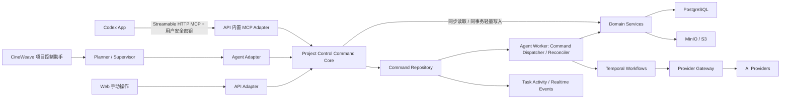

# CineWeave Codex 直接项目控制完整开发目标

## 1. 文档定位

本文定义 CineWeave 的 Codex 直接项目控制能力最终交付目标。它不是探索方案、MVP 清单或可独立上线的分阶段路线图。本文中的后端、MCP、权限、持久化、前端、测试、部署和运维要求必须全部完成并通过验收后，功能才能进入生产环境。

目标是在保留现有“项目控制助手”的同时，增加一个由 Codex App 直接操作 CineWeave 项目的入口：

- 现有项目控制助手继续提供站内对话、规划、审批模式、任务卡片和项目内交互。
- Codex App 作为并行入口，直接使用 CineWeave 提供的远程 MCP 工具读取项目、修改业务数据、启动生产工作流、等待长任务、重试失败单元并查看产物。
- 两个入口必须调用同一套项目控制命令内核，不允许复制业务规则或形成两套互相漂移的工具实现。
- 用户安全密钥代表对应 CineWeave 用户，执行时动态使用该用户当前组织、工作区、项目和权限绑定。
- API Server、Worker 和 Codex MCP 均不得绕过 Provider Gateway 直接调用上游供应商或解密供应商凭据。

## 2. 已确认产品决策

以下决策为本目标的固定约束：

1. 不移除、不降级现有项目控制助手。
2. Codex App 是新增的高自由度控制入口，不是嵌入 CineWeave 的另一个聊天模型。
3. Codex 负责理解自然语言、向用户追问、拆解步骤和决定调用哪些工具；CineWeave 负责权限、业务不变量、持久化、工作流和供应商边界。
4. 新用户创建成功时自动创建一枚 Codex 安全密钥，并只展示一次明文。
5. 安全密钥绑定用户身份，不绑定单个组织或项目；每次调用根据用户当前成员关系和 RBAC 重新授权。
6. 不增加 OAuth 登录、接管租约、IP 白名单、额外平台审批或第二套 Codex 专用 RBAC。
7. 不绕过现有权限。用户被禁用、密码重置导致凭据版本变化、成员关系移除或角色权限变更后，密钥必须立即按新状态生效。
8. Codex 发起的长任务必须进入现有“任务活动”，可跨页面、跨浏览器刷新和跨 Codex 会话继续查询。
9. 工作流启动成功只代表启动动作完成，不代表生产结果完成。
10. 所有写操作、计费操作和工作流操作必须具备幂等、并发冲突检测、可追溯身份和明确终态。
11. 本功能作为 Core 能力实现；生产使用 Commercial 组合装配时，必须以更新后的 Core 重新装配、验证和发布。
12. 官方 Codex 配置契约与当前本机 CLI 配置解析验证均表明 Codex App 具备本功能所需的智能客户端能力：远程 Streamable HTTP MCP、环境变量 Bearer token、工具发现与调用、结构化结果读取和多轮追问。本项目不引入 Codex App Server、Codex SDK 或第二套 Codex 对话运行时；CLI 配置验证不等于桌面 App 业务验收，真实生产 App 的连接、工具选择、写入、追问和断线恢复是上线硬门禁。MCP 对外工具名还必须满足 Codex 底层函数工具的命名限制，不能把含点号的领域动作名直接暴露给客户端。
13. Codex App 不是生产任务运行时。任何超过普通工具请求窗口的动作必须先返回持久 `commandId`，再通过最长 45 秒的短等待、cursor 和分页查询进度；客户端退出、断网或新建会话不得中断已提交任务。
14. MCP resources、Goal、专用选项按钮、子代理和客户端后台推送只作为体验增强。完整项目控制必须仅依赖显式工具、稳定 ID、revision、幂等键和 CineWeave 服务端持久状态完成。

## 3. 最终用户体验

### 3.1 新用户获得密钥

通过首次初始化、公开注册、邀请注册或系统管理员直接创建而产生的新用户，在用户事务中同时创建默认 Codex 安全密钥。

创建结果页面只展示一次：

- 密钥名称。
- 密钥前缀。
- 完整明文密钥。
- “复制密钥”按钮。
- Codex MCP 配置片段。
- 明确说明关闭窗口后无法再次查看原密钥，只能轮换。

如果系统管理员把一个已经存在的用户加入新组织，不创建第二枚密钥，也不向管理员展示该用户原有密钥。

### 3.2 既有用户启用 Codex

既有用户在个人设置中进入“Codex 项目控制”区域：

- 未创建密钥时显示“创建安全密钥”。
- 已创建时只显示名称、前缀、状态、创建时间、最近使用时间。
- 支持轮换密钥，旧密钥立即失效，新密钥只展示一次。
- 支持撤销密钥。
- 支持复制不含真实密钥的配置模板。

不对既有用户执行无法回收明文的伪自动回填。既有用户第一次进入设置时显式创建可用密钥。

### 3.3 Codex App 配置

生产默认使用以下配置：

```toml
[mcp_servers.cineweave]
url = "https://cineweave-mcp.einzieg.site/mcp"
bearer_token_env_var = "CINEWEAVE_USER_KEY"
required = false
tool_timeout_sec = 60
default_tools_approval_mode = "auto"
# 可选：只开放常用工具时填写 MCP wire name，而不是内部 action name。
# enabled_tools = ["identity_me", "project_list", "project_get"]
```

`tool_timeout_sec = 60` 只限定单次 MCP 工具调用窗口，不代表视频、分镜或批量生产必须在 60 秒内结束。异步动作在完成命令落库后立即返回 `commandId`；`control.command.wait` 单次服务端等待最长 45 秒并返回新的事件 cursor，Codex 可继续短等待或稍后在新会话中恢复。任何实现都不得把 5 分钟至 70 分钟的工作流绑定到一个持续占用的 MCP HTTP 请求。

用户把一次性显示的密钥写入自己运行 Codex 的环境变量 `CINEWEAVE_USER_KEY`。在 Windows 上修改用户级环境变量后需要重启 Codex 桌面 App，使新进程读取该变量；也可以在 **设置 > MCP servers** 中添加同一远程服务。密钥不得写入项目 `.env`、仓库文件、Codex 提示词、可复制日志、URL、localStorage、错误详情或分析事件。

默认使用 `required = false`，避免 CineWeave 暂时不可用时阻断用户启动或恢复其他 Codex 任务。用户希望把该服务设为当前主机的强依赖时可以显式改为 `true`；这只改变客户端启动行为，不改变 CineWeave 的服务端权限和命令语义。

`default_tools_approval_mode = "auto"` 表示由 Codex 结合工具 annotations、客户端策略和托管策略决定是否请求确认，不等于保证所有工具都无提示执行。用户仍可在自己的 Codex 配置中改为 `prompt`、`writes` 或 `approve`；组织托管配置也可能收紧该行为。无论客户端是否提示，CineWeave 都必须继续执行用户状态、成员关系、RBAC、revision、幂等、计费和领域校验，不能把客户端审批模式当作服务端授权。

该配置属于运行 Codex 的主机。同一主机上的 Codex 桌面 App、Codex CLI 和 IDE 扩展可使用同一 Codex 配置来源，但各客户端在配置或环境变量变更后仍需重启或重新加载。ChatGPT Web 不读取用户本地 `config.toml`，不属于本功能的默认接入面。生产验收以用户实际使用的 Codex 桌面 App 为主，CLI 和 IDE 扩展只作为兼容客户端补充验证。

### 3.4 Codex 直接操作项目

连接成功后，Codex 可以：

- 查看当前用户身份和可访问组织。
- 按组织查看工作区和项目。
- 读取项目类型、生产配置、当前进度、活动任务和可用工具。
- 对小说/短剧项目按精确分卷、分章、分集标识执行内容、剧本、资产、分镜、视频和成片操作。
- 对带货视频项目读取商品和广告脚本，创建、修改、裂变、归档脚本并直接生成视频。
- 启动工作流后持续读取动态输出，不把启动成功误报为任务完成。
- 对失败的独立单元重试，对活动任务取消，对部分成功任务只重试失败项。
- 当指令存在多个合法对象时，在 Codex 对话中向用户给出候选项，再携带明确 ID 继续执行。

### 3.5 现有助手保持可用

站内项目控制助手继续保留：

- 会话、消息和上下文管理。
- 需批准、自动审批、完全访问三种模式。
- 规划、监督、用户问题和选项。
- 任务步骤、子工作流、实时进度和输出。
- 现有抽屉式常驻交互。

其执行器必须改为项目控制命令内核的适配器。现有助手和 Codex 调用相同业务动作时，权限、校验、幂等、错误码和结果结构必须一致。

### 3.6 Codex App 能力评估与责任边界

结论：**Codex App 现有能力可以满足“由 Codex 直接控制 CineWeave 项目”的交互和规划需求，但不能单独满足生产任务的耐久执行需求。** 完整能力由“Codex App 智能控制客户端 + CineWeave 项目控制运行时”共同构成：Codex 负责理解意图、追问和编排工具，CineWeave 负责权限、事务、幂等、持久命令、Temporal 工作流、Provider 调用、计费和审计。缺少后者时，Codex App 只能完成短生命周期工具调用，不能被视为生产执行后端。

生产上线只把以下 Codex 客户端能力视为硬依赖：连接远程 Streamable HTTP MCP、通过环境变量发送 Bearer token、发现并调用工具且读取结构化结果、在普通多轮对话中向用户追问。Goal 持续运行、MCP resources 自动进入上下文、专用选项按钮、客户端后台推送、子代理并发和跨设备会话恢复都只能作为可选增强；任何一项缺失都不得破坏 CineWeave 命令的提交、执行、恢复或审计。

能力判定使用以下硬边界：

- **可以直接承担**：自由自然语言交互、工具选择、多步规划、消歧追问、读取结构化进度和继续下一步。
- **必须组合承担**：启动长任务、跨会话找回任务、持续读取动态、部分失败重试和取消。Codex 负责发起与展示，CineWeave 负责持久执行与恢复。
- **不得交给 Codex App 承担**：数据库事务、服务端 RBAC、revision/CAS、幂等去重、工作流调度、Provider credential、计费、审计和业务终态判定。
- **上线结论**：官方能力和 CLI 配置核验只证明方案可实施；只有真实 Codex App 通过生产域名连接、读、写、消歧、长任务恢复和权限变更验收后，才证明完整功能可上线。

| 需求 | Codex App 可直接承担 | CineWeave 必须承担 | 结论 |
| --- | --- | --- | --- |
| 理解自由自然语言、拆解步骤和选择工具 | Codex 在当前对话中规划、调用工具、根据结果调整下一步 | 提供稳定、语义明确且可机器发现的工具描述符 | 满足 |
| 遇到歧义时向用户追问 | Codex 在对话中展示候选、接受选项或自定义回答 | 返回带稳定 ID、ordinal、revision 和消歧原因的结构化候选 | 满足 |
| 连接远程项目控制服务 | Codex App 支持远程 Streamable HTTP MCP 和环境变量 Bearer token | 提供协议协商、认证、限流和反向代理 | 满足；不要求客户端只能使用某一个 MCP 协议版本 |
| 减少重复工具确认 | Codex 可为该 MCP server 使用 `auto` 审批模式 | 继续执行用户状态、RBAC、领域校验、幂等和计费门禁 | 满足，但不能把客户端自动审批当作服务端授权 |
| 执行 5 分钟到 70 分钟的生产任务 | 发起命令、短轮询、读取增量事件和结果 | 数据库命令状态、租约、Dispatcher、Reconciler、Temporal 和 Provider Gateway | 仅由两者组合满足 |
| Codex 关闭、断线或新建会话后恢复任务 | 重新连接 MCP，并根据用户意图继续查询 | 按用户和项目列出活动/最近命令，使用 `commandId` 和事件游标恢复 | 仅由两者组合满足 |
| 实时查看生产动态 | 反复调用短等待工具并向用户呈现新增事件 | 持久 command events、Realtime、游标和 fallback polling | 满足；不依赖单个无限流式 MCP 调用 |
| 读取或修改超长原文、剧本和提示词 | 分页读取并分块提交 | 内容 hash、staged write、CAS、私有对象存储和 TTL 清理 | 满足；不得把大正文塞入单次工具结果 |
| 从完整项目工具集中选择正确动作 | 根据工具名称、描述、schema 和 server instructions 选择工具 | 保持描述简洁无歧义，提供 capabilities/action catalog，并以真实 Codex App golden prompts 验证选择质量 | 有条件满足；工具目录规模不能未经评估持续膨胀 |
| 客户端无人在线时继续运行 | 不承担常驻在线保证 | Worker 和 Temporal 独立推进、对账和终结任务 | 必须由 CineWeave 承担 |
| 审计、并发一致性、成本和供应商边界 | 传递用户意图和幂等参数 | 项目控制内核、数据库事务、Provider Gateway、Billing 和事件溯源 | 必须由 CineWeave 承担 |

因此不需要在 CineWeave 内嵌 Codex App Server，也不需要复制一套 Codex 对话运行时。Codex App 是可替换的智能控制客户端；CineWeave 才是业务事实、任务状态和执行结果的唯一权威。即使 Codex 线程被删除、客户端升级或本地机器关机，已经提交的命令也必须继续运行，并可由同一用户在新会话中重新发现。

Codex App 的 Goal/长任务能力可以帮助用户持续推进复杂意图，但它不是 CineWeave 生产任务的提交日志、调度器或恢复点。Goal 是否仍在运行、客户端是否在线、对话是否保留，都不得改变已提交命令的执行和终态。Codex 恢复后必须从 CineWeave 重新读取活动命令和事件，而不是依据旧对话猜测状态。

Codex 可以在普通对话中列出候选并等待用户回复，但本文不依赖某个固定版本的“选项按钮”或其他专用选择控件。CineWeave 返回结构化候选；Codex 可以用编号、名称和差异说明追问；用户通过自然语言、编号或稳定 ID 回答。服务端只有在收到唯一稳定 ID 和所需 revision 后才允许写入。

#### 3.6.1 能力分级与上线判定

为避免把“官方配置项存在”误判为“生产链路已可用”，本功能对 Codex 能力采用四级证据：

| 等级 | 含义 | 可用于什么 | 不能证明什么 |
| --- | --- | --- | --- |
| 官方契约已确认 | OpenAI 官方文档明确定义相应的 MCP 连接或配置能力 | 判定方案不需要另建 Codex 对话客户端 | 生产域名、认证、协议协商和工具选择已经通过 |
| 本机 CLI 已确认 | 当前安装的 `codex-cli` 能解析所需配置 | 及时发现配置键、命令参数和版本偏差 | 桌面 App UI、会话恢复和真实业务操作已经通过 |
| 真实 App 验收已确认 | 实际生产版 Codex 桌面 App 已完成连接、读取、写入、消歧和断线恢复 | 作为生产上线门禁证据 | 未来客户端升级永久不会改变行为 |
| 不得依赖 | 客户端未做稳定保证或 CineWeave 可以在服务端替代的能力 | 只作为交互体验增强 | 不得成为命令耐久性、正确性或审计前提 |

当前 Codex 官方文档已明确以下能力，可作为本功能的客户端实现依据：

- [Codex MCP 手册](https://learn.chatgpt.com/docs/extend/mcp)明确说明桌面 App、Codex CLI 和 IDE 扩展共享同一主机上的 Codex 配置；各入口仍须在变更配置后按官方要求重启或重新加载。
- [Codex 配置参考](https://learn.chatgpt.com/docs/config-file/config-reference)明确支持远程 Streamable HTTP MCP 的 `url`、`bearer_token_env_var`、`required` 和 `tool_timeout_sec`。
- Codex 会读取 MCP 初始化结果中的 server instructions，并结合工具 schema 选择和调用工具。
- MCP server 配置支持 `tool_timeout_sec`、`enabled_tools`、`disabled_tools`、server 级默认审批模式和 tool 级审批覆盖。
- Codex 最终把 MCP 工具注册为模型可调用的函数工具；对外工具名必须只包含 ASCII 字母、数字、下划线或连字符，且长度不超过 64。领域动作中的点号不能直接进入 wire tool name。
- Goal 模式可以协助推进长步骤任务，但继续使用当前 sandbox 和 approval policy；它不会授予额外权限，也不是外部业务任务的耐久执行保证。

MCP server instructions 的前 512 个字符必须自包含最重要的跨工具规则，后续内容只能作为补充。CineWeave 不依赖客户端一定完整保留更长说明；稳定 ID、权限、revision、幂等和状态机仍由服务端强制。

因此，**Codex App 本身满足自由对话、规划、追问和 MCP 工具编排需求；CineWeave 的远程 MCP 与项目控制运行时完成后，用户可以选择 Codex 作为主要项目控制入口，同时站内助手继续完整保留。** 这里的“主要入口”只指用户交互方式，不表示把数据库事务、工作流调度、Provider 调用、计费或审计迁入 Codex 客户端，也不允许为了接入 Codex 而删除或降级站内助手。

官方 Codex 手册确认 Streamable HTTP MCP 能力，但不把某个 MCP wire protocol 版本承诺为所有已安装客户端永久固定值。服务端使用本文指定且由依赖 SDK 支持的协议基线，生产门禁必须再使用实际安装的 Codex App 完成连接、工具发现、读写调用、长任务恢复和协议协商记录。SDK 单测、MCP Inspector 或 CLI smoke 不能单独替代真实 App 验收。

#### 3.6.2 当前客户端核验基线

截至本文修订时，本机 `codex-cli 0.146.0` 已通过以下核验：

- `codex mcp add --help` 提供 `--url` 与 `--bearer-token-env-var`，能够配置远程 Streamable HTTP MCP 和环境变量 Bearer token。
- 使用禁用的测试 MCP 配置运行 `codex doctor`，能够读取包含 `url`、`bearer_token_env_var`、`required`、`tool_timeout_sec` 和 `default_tools_approval_mode` 的 MCP server 配置，且不会连接测试地址。
- 官方配置参考列出的 server 级审批值为 `auto | prompt | writes | approve`，并支持单工具审批覆盖。
- 真实 `codex exec` 已连接本地 CineWeave MCP。兼容测试依次发现并修复三个问题：点号名称不符合函数工具命名契约；双下划线名称与 Codex 的 `mcp__server__tool` 限定名分隔符冲突；Codex CLI 0.146 只导入首个 `tools/list` 页面，而早期服务端将 178 个工具按 50 个分页。当前实现使用单下划线 wire name，并由 catalog 上限保证首个响应包含完整目录。修复后真实客户端产生了 `mcp_tool_call`，调用 `identity_me` 并取得正确用户身份；这条证据同时证明 initialize、完整工具发现、Bearer 认证、函数注册、调用和结构化结果读取已经贯通。
- 本次真实客户端最终通过 legacy `initialize` 协商到 MCP `2025-06-18`。该结果不是服务端主协议降级，而是目标客户端版本的兼容路径；自动化必须同时保留 `2026-07-28` 主路径、`2025-11-25` 和 `2025-06-18` 回退。
- 同一客户端随后仅启用 `identity_me`、`project_list`、`project_get`、`project_update`，自行完成身份读取、项目选择和 CAS revision 读取，并用完全相同的参数与 idempotency key 执行两次无内容变化、无供应商费用的 `project_update`。两次结果返回同一 `commandId`，项目 revision 保持不变，证明多工具规划、MCP 写调用、持久命令、服务端授权和幂等回放已经贯通。

`default_tools_approval_mode` 只控制 Codex 客户端何时提示确认。它不是服务端授权声明，也不能关闭 CineWeave 的 RBAC、项目类型、revision、幂等、计费或领域校验。

该版本号只是一条修订时的环境证据，不是 CineWeave 的永久最低版本，也不能替代生产验收。最终发布必须以用户实际安装的 Codex 桌面 App 为准，并记录实际 App 版本、配置解析结果、连接状态、最终协商协议、工具目录和至少一次真实读写调用。

以下事项目前不能由上述静态文档、本地自动化或 CLI 验证单独证明，必须在正式生产候选发布时做端到端验收：

- 生产域名、TLS、反向代理和 Bearer token 认证是否可由真实 App 正常访问。
- 真实桌面 App 与生产服务端实际协商的 MCP 协议版本，以及生产反向代理下兼容回退是否生效；本地 CLI 0.146 的 `2025-06-18` 回退已验证。
- Codex 面对完整 CineWeave 工具目录时，是否能在 golden prompt 集中稳定选择正确工具并在歧义时先追问。
- App 退出、断网或新建会话后，已提交命令是否继续执行并可由 `control.command.list` 重新发现。
- 客户端审批设置变化后，写入与破坏性动作的交互是否符合工具 annotations，同时不改变 CineWeave 服务端 RBAC 和领域约束。

因此，能力结论应解释为：**Codex App 已具备合适的客户端能力，不存在要求另建 Codex 对话运行时的产品缺口；CineWeave MCP 和持久命令运行时已经完成本地开发与验证，但生产装配、生产迁移和真实桌面 App 验收完成前，仍不能把“本地实现完成”误报为“整套功能已上线”。**

#### 3.6.3 当前实现与验证基线（2026-08-07）

本节记录本文对应实现的当前开发证据，不替代第 27 节的生产发布证据，也不改变第 30 节的完整完成定义：

- Core 已实现控制密钥、Streamable HTTP MCP、统一项目控制动作描述符、持久命令、command item/attempt/event、内容暂存、用户追问、Dispatcher、Reconciler、取消、重试、租约与崩溃恢复，并在 `agent-worker` composition root 中真实启动运行循环。
- 站内项目控制助手的读写已经通过 Project Control 调用同一组领域服务；Core 运行时不存在可静默回退的第二套 Agent 业务实现。手动 Web/API 入口、Agent 和 MCP 共享权限、revision、幂等、工作流与 Provider 边界。
- Core 动作矩阵当前包含 `180` 个 action、`178` 个 MCP wire tool 和 `58` 个显式非项目控制排除项；Commercial 组合后包含 `185` 个 action、`183` 个 MCP wire tool，排除项保持 `58` 个。生成器会拒绝遗漏、重复领域实现、非法 wire name、wire name 冲突和超过首个 `tools/list` 响应上限的目录。
- MCP 服务端以 `2026-07-28` 为主协议基线，并覆盖 `2025-11-25`、`2025-06-18` legacy initialize 回退。当前全部工具位于首个 `tools/list` 响应中；项目、命令、正文和媒体等业务数据继续独立分页。
- 本机真实 `codex-cli 0.146.0` 已完成 Bearer 认证、完整工具发现、`identity_me` 读取以及一次无供应商费用的幂等 `project_update` 回放；重复请求返回同一 `commandId`，未改变项目 revision，也未启动 Provider 或工作流。
- 本地 Compose 浏览器验收已覆盖项目工作台、分页任务活动、清空已结束任务、助手关闭后会话保留、个人 Codex 密钥入口和系统 Project Control 诊断页。共享 workflow run 查询统一缓存分页 envelope，避免任务活动与顶部状态互相污染缓存。
- 当前自动化基线为：Core `pnpm run test` 全绿，包含全部 Go 测试、迁移/种子、Project Control 契约、`46` 个 Web 单测、类型检查、Lint、`449` 条 OpenAPI 路由和 Compose 校验；Core Commerce 浏览器回归 `9/9`；Commercial Go、契约与组合校验全绿，组合 OpenAPI 为 `463` 条路由，Commercial Web production build 与 Playwright `3/3` 全绿；独立 PostgreSQL 的 Project Control 与 Control Key Up/Down/Up 回归已通过。
- 当前开发工作区仍是未提交候选，且没有在本目标实施中执行生产数据库迁移、生产 Compose 重建、反向代理切换或真实付费供应商调用。正式上线仍须从 clean Core/Commercial SHA 生成不可变组合候选，执行迁移与发布门禁，并使用用户实际安装的 Codex 桌面 App 通过生产域名完成连接、读、写、消歧、长任务恢复和权限变化验收。

上述基线证明 Codex 直接项目控制已经具备可发布实现，而不是只完成文档、接口外壳或短任务演示；它不证明当前生产环境已经包含该实现。后续客户端升级、目录变更、协议变化或动作矩阵变化都必须重新生成契约并重跑相应客户端和生产验收。

### 3.7 Codex 客户端兼容基线

本功能对 Codex 客户端只依赖公开且可验收的能力：

- 连接远程 Streamable HTTP MCP server。
- 从环境变量读取 Bearer token。
- 读取 server instructions、工具 schema、annotations 和结构化工具结果。
- 读取的 MCP wire tool name 只包含 `[A-Za-z0-9_-]` 且不超过 64 字符；内部 canonical action name 不受此 wire 命名方式替代。
- 在对话中理解自由指令、选择工具、组合多步调用，并在歧义时向用户提问。
- 使用短等待、分页和 cursor 多次调用工具，而不是保持一个无限期请求。
- 通过 MCP server 级和 tool 级配置控制工具启用范围与客户端审批行为。
- 在修改 MCP 配置或环境变量后重启对应客户端，并能从 `/mcp` 或设置页确认服务已连接。

以下能力不得成为正确性前提：

- Codex App Server、Codex SDK、Computer Use、浏览器控制、本地 shell 或 CineWeave 仓库访问。
- Codex 会话永久存在、Goal 永不暂停、客户端持续联网或本地机器不休眠。
- Codex 在没有结构化候选的情况下仅凭名称稳定选中同名对象。
- 模型每次都以完全相同的顺序选择工具，或自动记住上一个会话中的 `commandId`。
- Codex 子代理、并行任务或多个对话线程一一对应并持续承载 CineWeave 的生产 item。
- MCP 客户端替 CineWeave 保存审计、revision、任务进度、供应商调用或计费事实。
- ChatGPT Web 自动继承用户本地 Codex MCP 配置。
- MCP resources 被当前 Codex 版本自动加入上下文。所有完成目标所需的数据必须也能通过显式只读工具分页获取；resources 只作为可选优化。
- 本地 Goal 在 Codex 桌面 App 关闭、主机休眠或断网后继续执行。云端长任务也不会自动继承本地主机的 MCP 配置。

Codex 的规划和工具选择具有模型决策性，因此 CineWeave 必须把任何可能影响正确性的选择转化为服务端可验证的显式参数。对象解析返回稳定 ID、ordinal、revision 和候选原因；写动作要求幂等键和预期 revision；存在多个合法对象时拒绝猜测并返回结构化消歧结果。MCP tool 描述、server instructions 和可选 CineWeave Skill 用于提高选择质量，但不能替代这些确定性约束。

Codex 可以自行使用多任务或子代理辅助理解复杂指令，但这只是客户端内部的推理协作。分集、资产、分镜和视频的生产并发必须由 CineWeave 创建稳定 command item，并由 Worker/Temporal 执行、重试和汇总；不得以“一个 Codex 子代理对应一个生产 item”作为执行模型。即使 Codex 同时发出多个工具调用，服务端仍须通过幂等键、并发上限和 revision CAS 保证不会重复生产或静默覆盖。

完整动作集合可以在服务端 action catalog 中保持一一可审计，但不要求把每一个内部 action 永久展开成一个高相似度的顶层 MCP tool。真实 App 验收发现工具选择混淆、上下文占用过大或同类 schema 重复时，应把同域动作收敛为带判别字段的类型化工具，或提供推荐的 `enabled_tools` 配置；不得通过删除能力、隐藏写操作副作用或改成通用任意 JSON 执行器来降低目录规模。

生产发布必须记录并验证实际 Codex App 版本、实际生效的 MCP 配置、工具目录 hash 和 server instructions hash。客户端升级后如果配置键、审批语义或 MCP 行为发生变化，必须重新运行连接、工具调用、断线恢复和长任务验收；不能仅以 SDK 单测代替真实 App 验收。

## 4. 最终架构



### 4.1 部署形态

MCP Adapter 集成到现有 API 进程，不新增第二套业务服务和数据库连接装配：

- MCP 路径：`/mcp`。
- 公网入口：`https://cineweave-mcp.einzieg.site/mcp`。
- 反向代理目标：API 主机端口 `127.0.0.1:19288`。
- 不新增 Provider Gateway 公网端口。
- 不新增 MCP 专用数据库。
- 不在 MCP 层复制 API、Worker、Provider 或 Commercial 业务逻辑。

持久命令运行循环集成到现有 `agent-worker` 进程，不新增公网服务或主机端口：

- API/MCP 进程负责认证、确定性解析、校验、同步读取，以及创建持久命令意图；它不是长任务所有者。
- `agent-worker` 负责领取异步命令、启动或恢复工作流、刷新租约、对账有效终态和补发命令事件。
- API、MCP 连接或 `agent-worker` 单实例重启后，未终结命令继续由数据库租约和确定性 Workflow ID 恢复。
- 同步轻量写操作可以在 API 请求内执行，但命令记录、领域写入、command event 和 outbox 必须在同一数据库事务中完成。
- 任何启动工作流、调用供应商、批量生产或预计超过普通请求窗口的动作必须进入异步命令运行时。

选择 API 内置适配器的原因：

- 复用同一认证、RBAC、数据库、事件、领域服务和 Edition 装配。
- 避免 MCP 服务与 API 对业务规则产生版本漂移。
- Commercial 组合装配可以继续替换 API composition root，而不需要维护第三个商业二进制。
- 可以在同一不可变 Release ID 下验证 Web、REST、MCP 和 Worker 契约。

## 5. 模块边界

### 5.1 `internal/projectcontrol`

新增与传输层、对话层无关的项目控制内核，至少包含：

- `Registry`：动作描述符注册表。
- `Descriptor`：名称、版本、作用域、输入/输出 schema、权限、风险、效果和项目类型约束。
- `ExecutionContext`：用户、组织、工作区、项目、控制来源、幂等键、请求身份和 Release ID。
- `Service`：执行读取动作、写动作和长任务动作。
- `CommandRepository`：命令、工作流关联、事件流、重试关系和终态持久化。
- `Dispatcher`：按数据库租约领取 queued 命令，使用确定性身份启动或恢复异步执行。
- `Reconciler`：结合事件通知和周期扫描推进命令、批次、item 与子工作流终态。
- `Authorizer`：把动作权限映射到现有 `internal/authz`。
- `Result` 与 `Error`：统一结构化结果和错误。
- `WorkflowTracker`：读取并汇总子工作流、节点、checkpoint 和 Provider task，不把 launch success 当成完成。
- `ContentReader`：对长文本、日志和产物提供分页或分块读取。
- `ContentWriter`：通过有界暂存、hash 和 revision CAS 提交长文本，不把整篇内容复制进命令 JSON。

该包不得依赖：

- HTTP 请求或 MCP 协议对象。
- React/前端结构。
- `agent_sessions`、`agent_tasks` 或 `agent_steps` 作为执行前提。
- 供应商 SDK或明文凭据。

### 5.2 `internal/controlmcp`

新增 MCP 传输适配器：

- 使用官方 Go MCP SDK `github.com/modelcontextprotocol/go-sdk`。
- 在实施时锁定已验证的稳定版本并提交 `go.sum`；本文基线为 2026-08-06 的 v1.7.0。
- 使用 Streamable HTTP。
- 使用无协议会话依赖的 stateless 模式。
- 明确设置 `StreamableHTTPOptions.Stateless = true`，使支持 MCP `2026-07-28` 的客户端使用无状态 HTTP 路径，同时由 SDK 保留已验证的 `2025-11-25` 与 `2025-06-18` 旧协议协商回退。
- 把项目控制描述符转换为 MCP tools。
- 提供少量只读 MCP resources，用于长内容和项目上下文。
- 将 MCP Bearer token 解析为 CineWeave 用户身份。
- 不持久化 Codex 对话内容。

### 5.3 现有 Agent Adapter

保留现有 `internal/agent` 的规划和监督能力，但修改执行路径：

- 开发期间允许使用短期 adapter 迁移现有 `AgentTool`，但生产发布前所有可复用工具必须引用项目控制描述符，不得保留第二套业务实现。
- `DryRun`、`Execute` 和 `Verify` 由适配器调用项目控制内核。
- 仅保留 Agent 特有的 `ask_user`、规划、监督和批准流程。
- `agent.ask_user` 不导出为 MCP 工具；Codex 使用自身对话能力向用户提问。
- 对写操作或长任务，`agent_steps` 保存对应 `project_control_command_id`。

### 5.4 领域服务

项目控制内核调用现有领域服务或从现有 handler/activity 中抽取领域服务。禁止从一个 HTTP handler 反向调用另一个 HTTP handler。

需要抽取时遵循：

- API handler 只负责解析、认证、错误映射和响应。
- 项目控制动作与 API handler 调用同一领域函数。
- Temporal 工作流继续承担耐久生产。
- Provider Gateway 继续承担所有真实供应商调用。
- 媒体访问继续使用 Artifact/MediaFile 和 signed URL。

Web/API 手动入口遵循相同边界：

- 纯读取 handler 可以直接调用同一只读领域服务，也可以通过项目控制内核统一返回结构。
- 任何写入、删除、归档、计费、工作流启动、取消或重试必须通过项目控制内核创建 `controller_type=manual` 的命令。
- API handler 不得为了保持旧调用方式而在命令内核之外重复实现 revision、影响分析、状态推进或事件写入。

### 5.5 持久命令运行时

项目控制命令采用“持久意图 + 租约执行 + 确定性外部身份 + 周期对账”模型：

1. 同步动作在一个事务中创建命令、执行领域写入、写终态和事件；事务失败则命令和领域写入一起回滚。
2. 异步动作在一个事务中保存规范化小型输入、不可变 item 集合和 queued 命令，然后立即返回 `commandId`。
3. `agent-worker` 使用 `FOR UPDATE SKIP LOCKED` 或等价租约机制领取命令，记录 `lease_owner`、`lease_expires_at` 和 worker Release ID。
4. 每个工作流使用由 `commandId + itemKey + actionVersion` 确定性派生的 Temporal Workflow ID。Worker 在 Temporal start 成功后、关联表提交前崩溃时，重试必须通过相同 Workflow ID 识别已启动执行并补齐关联，不能启动第二份工作流。
5. Reconciler 订阅可用事件并执行周期扫描；事件丢失、NATS 延迟或进程重启时，扫描仍可把 waiting 命令推进到真实终态。
6. 过期租约可被同 Release 或兼容新 Release 接管；终态命令不可再次领取，所有状态推进使用 revision CAS。
7. 该运行循环必须在 `agent-worker` composition root 显式装配和启动。当前 Edition 的 `EventConsumers`/`BackgroundTasks` 注册元数据不能被当作已经存在的后台执行器。

命令派发和对账不得直接调用上游供应商。需要 AI 的动作仍启动 Temporal Workflow，由 Worker 经 Provider Gateway 完成真实调用。

## 6. MCP 传输与协议契约

### 6.1 端点

在 API Router 上挂载 SDK 提供的 Streamable HTTP handler：

```text
https://cineweave-mcp.einzieg.site/mcp
```

不得手写一套不完整的 JSON-RPC 或 SSE 实现。服务端主协议基线为 MCP `2026-07-28`：每个请求携带协议版本和客户端能力 metadata，服务端实现 `server/discover`；支持该流程的客户端可以先发现服务能力。`server/discover` 不是业务动作的前置假设，实际 Codex App 版本可由 SDK 协商到双方共同支持的版本；对 `2025-11-25` 和本机 Codex CLI 0.146 实际使用的 `2025-06-18` 客户端继续使用 legacy `initialize` 回退。HTTP 方法、协议协商和 JSON-RPC 编解码全部由 SDK 处理。

生产验收记录真实 Codex App 最终协商的协议版本。协商到 `2026-07-28`，或已明确测试的 `2025-11-25`、`2025-06-18` 回退都可通过连接门禁；不得因为客户端尚未升级到最新协议而拒绝本来兼容的工具调用，也不得把旧协议 session 当作 CineWeave 命令恢复机制。

### 6.2 无状态要求

MCP 连接本身不是业务耐久性的来源：

- API 容器重启后，Codex 仍能通过 `commandId` 读取原命令。
- 不依赖 MCP session ID 恢复生产任务。
- 不依赖实验性 MCP Tasks 承载 5 分钟到 70 分钟的生产流程。
- 每个长操作立即返回 CineWeave `commandId` 和相关 `workflowRunIds`。
- Codex 使用游标继续读取事件，不要求保持单个 HTTP 连接。

### 6.3 服务器说明

MCP server instructions 必须在前 512 个字符内明确：

1. 先读取当前项目和真实 ID，再执行修改。
2. 分卷、章节、分集必须使用存储的 ID 和 ordinal，不得按标题猜测。
3. workflow start 成功不等于工作流完成。
4. 所有 AI 调用只能经过 Provider Gateway。
5. 对象存在歧义时返回候选并询问用户。

### 6.4 反向代理

`cineweave-mcp.einzieg.site` 的反向代理必须：

- 仅转发 `/mcp` 到 `127.0.0.1:19288/mcp`。
- 保留 `Authorization` 请求头。
- 使用 HTTP/1.1 或经验证兼容的 HTTP/2 上游配置。
- 关闭会破坏流式响应的代理缓冲。
- 配置大于单次工具等待窗口的读取超时。
- 不在 access log 中记录 Authorization。
- 保留 `X-Request-ID` 或生成等价关联 ID。

### 6.5 请求限制

- MCP 请求体设置明确上限，默认 1 MiB。
- 工具结构化响应设置明确上限，默认 512 KiB。
- 超限内容必须通过分页、内容分块或 signed URL 读取。
- 单次 `command.wait` 服务端等待不超过 45 秒，以适配 Codex 的 60 秒工具超时。
- 每用户密钥设置有界请求速率和活动命令并发上限；这是运行稳定性限制，不是第二套审批或 RBAC。
- 超限返回稳定的 `RATE_LIMITED` 或 `COMMAND_CONCURRENCY_LIMIT`，不得在限制层启动工作流或创建 Provider request。

### 6.6 Bearer 兼容认证

当前产品决策使用预签发用户安全密钥和 Codex `bearer_token_env_var`，不实现 OAuth 登录。该模式是 CineWeave 的 pre-shared Bearer 兼容认证，不声明自己实现 MCP OAuth 授权服务器：

- 缺失、格式错误、无效、已撤销或因 credential version 失效的 token，在进入 JSON-RPC/MCP handler 前返回 HTTP `401`。
- `401` 响应包含 `WWW-Authenticate: Bearer`，但不得回显 token、prefix 以外的密钥信息或内部 hash。
- 无效 `Origin`、请求体超限和不允许的方法分别使用明确 HTTP 状态，不包装成工具业务错误。
- token 已认证后，成员关系、项目作用域和动作权限不足由工具返回结构化 `PERMISSION_DENIED`，不得伪装成协议解析错误。
- 如果未来增加 OAuth，必须另行实现当前 MCP Authorization 规范要求的 protected resource metadata、audience、scope 和 discovery；不得把当前用户 key 冒充 OAuth access token。

## 7. 用户安全密钥

### 7.1 数据结构

新增 `user_control_keys`：

| 字段 | 说明 |
| --- | --- |
| `id` | UUID 主键 |
| `user_id` | 所属用户，外键 |
| `name` | 默认“Codex 项目控制” |
| `public_id` | 令牌中的公开定位 ID，唯一 |
| `prefix` | 前端可展示的短前缀 |
| `secret_hash` | 仅保存随机秘密的 SHA-256 摘要 |
| `credential_version` | 创建时用户凭据版本 |
| `status` | `active` / `revoked` |
| `created_at` | 创建时间 |
| `last_used_at` | 最近成功认证时间 |
| `rotated_at` | 最近轮换时间 |
| `revoked_at` | 撤销时间 |

同一用户只允许一枚 active 默认密钥。历史已撤销记录可保留用于审计。

### 7.2 令牌格式

```text
cwuk_v1_<public-id>_<32-byte-random-secret>
```

要求：

- 使用密码学安全随机数生成 256 位 secret。
- 数据库不保存明文。
- 服务端按 `public_id` 定位记录，再常量时间比较 hash。
- 日志、trace、错误、审计 payload 和事件中只允许记录 `keyId` 或 prefix。
- 一次性返回后不可再次查询原明文。

### 7.3 自动创建覆盖路径

以下真正创建新用户的路径必须在同一数据库事务中创建密钥：

- 首次 Setup 管理员。
- 公开注册。
- 邀请注册产生新用户。
- 系统管理员直接创建新成员账号。

以下路径不得创建或轮换密钥：

- 把既有用户加入另一个组织。
- 恢复既有成员关系。
- 修改用户资料。
- 修改组织角色。

### 7.4 认证和动态授权

密钥认证只确定 `userId`，不固化组织上下文：

- `identity.me` 和 `organization.list` 以用户身份读取有效成员关系。
- 组织级工具显式携带 `organizationId`。
- 工作区级工具显式携带 `workspaceId` 并解析组织。
- 项目级工具显式携带 `projectId` 并解析工作区和组织。
- 解析后构造现有 `auth.Principal`，再调用现有 Authorizer。

每次执行前检查：

- 用户仍为 active。
- 密钥仍为 active。
- 密钥 `credential_version` 等于用户当前版本。
- 当前成员关系有效。
- 当前角色、权限和资源作用域允许该动作。

因此：

- 禁用用户立即拒绝。
- 密码重置或全 session 撤销引起凭据版本变化后，旧密钥立即拒绝。
- 移除成员关系后，对应组织和项目立即不可访问。
- 修改角色或权限后，下一次工具调用立即使用新权限。

密钥管理接口和前端展示计算后的有效状态：

- 数据库 `status=active` 且 credential version 一致时为 `active`。
- 数据库仍为 active 但 credential version 已变化时为 `requires_rotation`，不得继续显示为可用。
- 已撤销记录为 `revoked`。
- `requires_rotation` 只能通过 rotate 产生新密钥，不允许恢复旧 secret。

### 7.5 REST 管理接口

新增并进入 OpenAPI：

```text
GET    /api/me/codex-control-key
POST   /api/me/codex-control-key
POST   /api/me/codex-control-key/rotate
DELETE /api/me/codex-control-key
```

语义：

- `GET` 只返回元数据，不返回 secret。
- `POST` 只用于当前用户尚无 active key 的情况。
- `rotate` 原子撤销旧 key 并创建新 key，只返回一次明文。
- `DELETE` 撤销当前 active key，幂等。
- 所有接口只允许操作本人密钥。

新用户创建响应增加可选的一次性 envelope：

```json
{
  "codexControlKey": {
    "id": "uuid",
    "prefix": "cwuk_v1_abcd...",
    "secret": "cwuk_v1_...",
    "createdAt": "RFC3339"
  }
}
```

该字段只在本次响应出现，后续任何 GET 不得返回 `secret`。

## 8. 项目控制动作描述符

每个动作必须由一个共享描述符定义：

```go
type Descriptor struct {
    Name             string
    Version          int
    Summary          string
    Scope            ScopeKind
    InputSchema      json.RawMessage
    OutputSchema     json.RawMessage
    Permissions      []string
    ProjectKinds     []string
    ReadOnly         bool
    Destructive      bool
    Idempotent       bool
    Costed           bool
    StartsWorkflow   bool
    SupportsDryRun   bool
    ActivityVisibility string
}
```

描述符同时驱动：

- MCP `tools/list`。
- 现有助手工具注册。
- 后端权限检查。
- MCP tool annotations。
- 前端技术信息中的动作标签。
- `packages/mcp/tool-catalog.v1.json`。
- 契约漂移检查。

MCP annotations 从描述符确定性生成：

- `readOnlyHint`。
- `destructiveHint`。
- `idempotentHint`。
- `openWorldHint`。

计费动作和上游调用动作不得伪装成纯读取动作。

### 8.1 Canonical action 与 MCP wire name

项目控制动作使用带命名空间的 canonical action name，例如 `project.get`、`commerce.script.revise`。该名称是数据库命令、审计、action matrix、Agent adapter 和领域运行时的稳定业务身份，不因客户端变化而重命名。

Codex 会把 MCP 工具转换为 Responses API 函数工具。函数工具名只允许 ASCII 字母、数字、下划线和连字符，长度为 1 至 64；因此 MCP 对外名称使用以下确定性映射：

```text
canonical action name             MCP wire tool name
identity.me                       identity_me
project.get                       project_get
commerce.script.revise            commerce_script_revise
```

映射规则为把每个 `.` 替换成单个 `_`。不能使用双下划线，因为 Codex 自身使用 `mcp__server__tool` 组成限定工具名，内部双下划线会产生歧义。构建 catalog 时必须：

- 同时保存 `name`（wire name）和 `actionName`（canonical name）。
- 校验 wire name 满足 `^[A-Za-z0-9_-]{1,64}$`。
- 检测映射碰撞；例如未来同时出现 `project.get` 与 `project_get` 时构建必须失败，不能静默覆盖。
- MCP handler 只按 wire name 接收调用，再映射到 descriptor 的 canonical action name 执行。
- 数据库、命令事件、日志、指标和权限仍记录 canonical action name；网络访问日志可附带 wire name，但不得混为同一字段。
- `enabled_tools`、`disabled_tools` 和 tool 级审批配置使用 wire name。

不得为了兼容 Codex 而把内部 action、历史命令或审计记录批量改名，也不得同时暴露点号旧名和兼容别名造成重复工具。

## 9. 工具目录

### 9.1 身份和导航

必须提供：

- `identity.me`
- `organization.list`
- `workspace.list`
- `project.list`
- `project.get`
- `project.context`
- `project.capabilities`
- `project.production_status`
- `project.task_activity`

本节及后续工具目录使用 canonical action name 描述业务能力。真实 `tools/list` 对外分别暴露 `identity_me`、`organization_list`、`project_get` 等 wire name，并在生成的 catalog 中通过 `actionName` 回指这里的 canonical name。

`project.capabilities` 返回当前项目类型、当前用户权限、可执行动作和不可执行原因。MCP 的 `tools/list` 保持确定性和稳定排序，不按当前项目动态改变；运行时以 capabilities 和服务端校验为准。

当前 Codex 兼容基线要求完整 MCP tool catalog 位于首个 `tools/list` 响应中，服务端目录页上限固定为 `1000`，并由生成器保证实际工具数不超过该上限。该规则只适用于工具元数据发现，不改变项目列表、命令活动、长文本和业务对象的游标分页。若未来工具数接近上限，必须先完成领域工具收敛或验证目标 Codex 版本已正确消费全部 cursor 页面，不能让新增工具静默落入客户端不可见页面。

### 9.2 原文、章节和剧本

完整导出现有可复用能力，包括：

- 原文列表、详情、分卷/分章/分集读取。
- 按精确章节或分集提取事件。
- 生成、查看、编辑、激活和归档剧本版本。
- 生成指定单集剧本。
- 批量生成多集剧本并逐集持久化。
- 取消、重试和查看剧本工作流。
- 读取改编计划和生成依据。

硬约束：

- “第一集”必须先解析到真实 `sourceChapterId`、volume/section/chapter ordinal。
- 只允许把用户指定的 ID 集合传给工作流。
- 不得按显示标题、数组下标或模糊名称推断顺序。
- 单集生成结果完成后立即写入，不等待整个批次才统一落库。

### 9.3 资产

必须提供：

- canonical asset 列表、筛选、详情和影响分析。
- 创建、编辑、归档资产。
- 编辑完整资产提示词。
- 批量生成/重生成提示词。
- 批量生成/重生成图片。
- 参考图查询、选择、锁定、解除锁定。
- 历史生图版本查询和激活。
- 失败项重试。
- 衍生资产需求和衍生图操作。

批量动作必须支持默认并发、部分完成、失败项重试和任务活动实时进度。

### 9.4 分镜和镜头媒体

必须提供：

- 按分集列出分镜。
- 创建、编辑、删除、重排镜头。
- 重新生成指定分集分镜。
- 读取镜头人物、场景、道具和引用关系。
- 编辑镜头图片提示词、参考图和生成参数。
- 批量生成镜头图片提示词和图片。
- 编辑视频提示词、台词、音效、参考图和 Render Plan。
- 批量生成并审核视频提示词。
- 批量生成镜头视频。
- 单镜头生成、取消、重试和媒体版本查看。
- 时间线、最终成片和导出操作。

必须保持：

- 中文台词原文不被翻译或放入音效字段。
- 背景音效不进入角色台词。
- 分镜图片提示词不包含应由视频音轨执行的台词。
- 视频提示词使用已确认剧本上下文和结构化 dialogue/audio 字段。
- 所有图片和视频生成仍经 Provider Gateway。

### 9.5 带货视频

必须完整复用现有 Commerce 工具：

- 商品读取、编辑和参考图管理。
- 广告脚本列表、详情、创建、编辑、改写和归档。
- 按 stable ordinal 读取第 N 条脚本。
- 脚本裂变预览。
- 单条或批量创建裂变脚本。
- 批次状态、取消和失败项重试。
- 视频模型时长选项读取。
- 直接视频任务创建、状态读取、取消和重试。
- 视频产物和版本读取。

必须通过以下典型验收：

> 用户要求“把第二条脚本的场景换成五个版本”。Codex 先读取按 `stableOrdinal` 排序的脚本列表和 `scriptUnitsRevision`，解析第二条真实 script unit ID，读取完整当前正文，生成五组差异明确的场景变体，然后用批量裂变动作创建五个独立脚本。任何并发修改都由 revision CAS 拒绝或要求重新读取，不允许修改错脚本。

### 9.6 工作流、审阅、媒体和项目管理

必须提供：

- 可启动工作流目录和输入契约。
- 工作流详情、节点、动态输出和结果。
- 工作流取消、失败项重试。
- 审阅任务、审阅项、修复建议、应用和忽略。
- Artifact/MediaFile 元数据、signed preview、下载链接。
- 项目基本信息修改。
- 项目生产配置影响分析和受控换代。
- 项目删除现有领域动作。

不提供通用 SQL、任意 shell、任意文件系统或直连对象存储写入工具。

### 9.7 动作覆盖矩阵

“完整导出”必须由机器可检查的动作覆盖矩阵证明，不能只依赖本节的类别描述。生成并提交：

```text
packages/project-control/action-matrix.v1.json
```

每一行至少包含：

- `actionName`、`actionVersion` 和中文摘要。
- 对应的现有 `AgentTool` 名称集合。
- 对应的 REST `operationId` 或明确标记为无 REST 入口。
- 唯一领域服务/工作流实现入口。
- scope、permission、project kinds、read/write/destructive/costed 属性。
- `sync`、`async_command` 或 `workflow` 执行模式。
- `primary`、`nested` 或 `audit_only` 活动可见性。
- 是否导出到 MCP、现有助手和 Web 手动入口。
- 迁移完成状态；不导出的能力必须给出固定 exclusion reason。

新增 checker 必须扫描现有 Agent Registry、公开写 API operationId、Commercial action registry 和项目控制 Registry：

- 任何现有 AgentTool 或项目写 API 未映射时失败。
- 同一业务动作映射到多个领域实现时失败。
- 标记“已迁移”但 Agent/MCP/Manual 未共同引用描述符时失败。
- Production release 中不得存在 `planned`、`temporary_adapter` 或空实现行。
- Core 与 Commercial 组合后重新生成并校验同一矩阵，避免私有工具遗漏。

## 10. 精确对象解析

自然语言中的序号、名称或范围必须由确定性解析器转成业务 ID：

### 10.1 小说和短剧

解析结果至少包含：

- `sourceId`
- `sourceChapterId`
- `volumeOrdinal`
- `sectionOrdinal`
- `chapterOrdinal`
- `globalOrdinal`
- `contentHash`

### 10.2 带货脚本

解析结果至少包含：

- `scriptUnitId`
- `stableOrdinal`
- `scriptUnitsRevision`
- `contentRevision`
- `contentHash`

### 10.3 歧义处理

当“第二个”“方源”“最新剧本”等表达匹配多个对象时，工具返回：

```json
{
  "status": "resolution_required",
  "resolution": {
    "kind": "script_unit",
    "prompt": "找到多个候选，请选择要操作的脚本",
    "candidates": [
      {"id": "...", "label": "第 2 条", "revision": 3}
    ]
  }
}
```

Codex 在自己的对话中向用户展示候选。用户选择后，Codex 使用明确 ID 和 revision 重新调用。CineWeave 不为 Codex 维护另一套对话状态。

确定性对象歧义必须优先在命令创建前解决：

- 解析失败时不创建写命令、不锁定实体、不启动工作流。
- 返回 `resolution_required`、候选快照、候选 revision 和短期 `resolutionToken`。
- Codex 取得用户选择后，携带明确 ID、revision、resolution token 和原始意图 hash 重新调用业务动作。
- 候选数据已变化时返回 `RESOLUTION_STALE`，要求重新读取，不能按旧数组下标继续。

只有命令已经开始执行后才发现必须由用户决定的业务分支时，才进入 `waiting_input`。该状态必须通过持久 prompt 和专用控制工具恢复：

```text
control.command.resolve
```

输入至少包含 `commandId`、`promptId`、选择项或自定义输入、`expectedCommandRevision` 和 `idempotencyKey`。解析成功后命令以 CAS 从 `waiting_input` 回到 `queued` 或 `running`；重复提交同一 idempotency key 返回已有结果，不重复执行后续步骤。

## 11. 命令持久化

### 11.1 `project_control_commands`

所有写操作、破坏性操作、计费操作和长任务操作必须创建命令记录：

| 字段 | 说明 |
| --- | --- |
| `id` | 命令 ID |
| `organization_id` / `workspace_id` / `project_id` | 资源作用域 |
| `actor_user_id` | 实际用户 |
| `controller_type` | `embedded_agent` / `codex_mcp` / `manual` |
| `control_key_id` | Codex 调用时记录密钥 ID，不记录 secret |
| `agent_task_id` / `agent_step_id` | 站内助手调用时的关联 |
| `action_name` / `action_version` | 动作契约 |
| `execution_mode` | `sync` / `async_command` / `workflow` |
| `activity_visibility` | `primary` / `nested` / `audit_only` |
| `input` / `input_hash` | 有界的规范化小型参数、资源引用及 hash |
| `idempotency_key` | 写操作幂等键 |
| `status` | 命令状态 |
| `output` | 小型结构化结果 |
| `error_code` / `error_message` | 归一化错误 |
| `parent_command_id` | 编排产生的父子命令关系 |
| `retry_of_command_id` | 用户显式重试的原命令；原命令终态不改变 |
| `lease_owner` / `lease_expires_at` | 异步命令执行租约 |
| `next_reconcile_at` | 下一次对账时间 |
| `worker_release_id` | 最近领取命令的 Worker Release ID |
| `created_at` / `started_at` / `completed_at` | 时间 |
| `revision` | 命令并发版本 |

`input` 和 `output` 分别设置明确大小上限，默认 64 KiB。原文、完整剧本、大提示词、日志、图片和视频不得复制到命令 JSON；命令只保存 canonical resource ID、revision、content hash、staging upload ID 或 Artifact/MediaFile ID。

### 11.2 命令 item

新增 `project_control_command_items`，固化批量操作的执行集合：

- `id`、`command_id`、`item_key` 和 `stable_ordinal`。
- `target_type`、`target_id`、`target_revision` 和 `input_hash`。
- `status`、`retryable`、小型 output、error code/message。
- `created_at`、`started_at`、`completed_at`。

同一命令内 `item_key` 唯一。命令创建后 item 集合、顺序和目标 revision 不可静默扩展；失败重试显式复制失败 item 到新命令，已成功 item 不进入重试集合。

### 11.3 执行 attempt

新增 `project_control_command_attempts` 记录调度器和对账器的技术尝试：

- `id`、`command_id`、可选 `command_item_id` 和单调 `attempt_number`。
- `attempt_kind`：`dispatch` / `reconcile` / `automatic_retry`。
- `status`、worker Release ID、lease identity、错误和时间。

自动瞬态重试在同一 command/item 下新增 attempt，不创建新的用户命令。用户点击或调用“重试”时创建新的 `project_control_commands`，写入 `retry_of_command_id`，原命令保持原终态。不得再使用含糊的“新 attempt 或子命令”语义。

### 11.4 工作流关联

新增 `project_control_command_workflows`：

- `command_id`
- 可选 `command_item_id`
- `workflow_run_id`
- `temporal_workflow_id`
- `relation_type`
- `created_at`

一个命令可以启动多个独立子工作流，例如五条脚本裂变、逐集剧本生成或批量资产图片。关联必须使用关系表，不把全部 ID 只塞进不可查询 JSON。

### 11.5 持久用户输入

新增 `project_control_command_prompts`，只用于命令执行中确实需要用户决定的分支：

- `id`、`command_id`、`prompt_kind`、中文 prompt 和有界 options 快照。
- `status`：`pending` / `answered` / `expired` / `cancelled`。
- `expected_command_revision`、候选资源 revision 和过期时间。
- `answer`、`answered_by_user_id`、`created_at`、`answered_at`。

同一 prompt 只能成功回答一次。`control.command.resolve` 必须在一个事务中锁定 prompt、校验当前用户和 command revision、保存回答、推进命令并写事件。

### 11.6 命令事件

新增 `project_control_command_events`，使用单调递增序列提供稳定游标：

- `sequence`
- `command_id`
- `event_type`
- `payload`
- `created_at`

事件只保存可展示和可追溯的数据，不保存密钥、凭据或大段原文。

命令状态、item、prompt 和事件必须通过统一的 `projectcontrol.AppendEventTx` 或等价事务 helper 更新：

- 在同一 PostgreSQL 事务中更新 command/item 状态、插入 command event，并调用现有 `events.AppendTx` 写 `event_outbox`。
- outbox payload 只包含 `commandId`、`sequence`、status、计数和必要资源 ID；完整可展示增量从 command events 按 cursor 读取。
- Realtime 和消费者按 `commandId + sequence` 去重。事务回滚时 command event 与 outbox 一起回滚。
- NATS 发布失败时由现有 outbox publisher 重试；即使 Realtime 事件丢失，`control.command.events` 和前端 fallback polling 仍以数据库 command events 为事实来源。
- 禁止项目控制代码直接 `INSERT event_outbox` 或分别提交 command event 与 outbox。

### 11.7 状态机

命令状态固定为：

```text
queued
running
waiting_workflow
waiting_input
succeeded
partial_succeeded
failed
cancelled
```

规则：

- 工具完成启动工作流后进入 `waiting_workflow`，不得直接进入 `succeeded`。
- `waiting_input` 只能由未终结的 pending prompt 支撑；回答后通过 revision CAS 回到 `queued` 或 `running`。
- 一个批次有成功项和失败项时进入 `partial_succeeded`。
- 用户失败重试创建新的 retry command；自动技术重试只新增 attempt。
- 取消命令必须传播到仍活动的子工作流和异步供应商任务。
- 已成功单元不得因重试失败项而被回滚或重复计费。
- `succeeded`、`partial_succeeded`、`failed` 和 `cancelled` 为不可变终态；重试不能把原命令重新改回 running。
- 每次状态转换都必须满足数据库状态约束并使用 command revision CAS。

## 12. 长任务与有效终态

### 12.1 派发和崩溃恢复

异步命令的启动协议固定为：

1. API 在事务中创建 queued command 和 immutable items，提交后返回 `commandId`。
2. Dispatcher 领取租约并写 running attempt。
3. 对每个 item 使用确定性 Temporal Workflow ID 调用 start。
4. start 返回 `AlreadyStarted` 时，按该确定性 ID 查询真实 execution，并补齐 `project_control_command_workflows`，不得当作失败或重新生成 ID。
5. 工作流关联和 `waiting_workflow` 事件在同一数据库事务中提交。
6. Dispatcher 在任何步骤崩溃后，由租约过期和 Reconciler 从数据库、Temporal 和现有 workflow run 事实恢复。

必须注入故障验证以下边界：命令提交后但 start 前、Temporal start 后但关联提交前、关联提交后但 waiting 事件提交前。三个边界均不得丢命令、重复启动或提前完成。

### 12.2 有效活动判定

只要满足任一条件，命令仍处于活动状态：

- `workflow_runs.status` 未终结。
- 存在 `workflow_node_runs` 为 `queued` 或 `running`。
- 存在 `provider_async_tasks` 为 `queued`、`running` 或 `cancelling`。
- 存在对应批次/checkpoint/item 未进入终态。

该规则与项目 `AGENTS.md` 保持一致。

### 12.3 对账所有权

`agent-worker` 中的 Reconciler 是命令终态的唯一主动推进者：

- 事件到达时立即安排对应 command 对账。
- 使用 `next_reconcile_at` 周期扫描所有非终态命令，覆盖事件丢失和旧 Worker 退出。
- 读取 workflow、node、batch、item、checkpoint 和 provider task 的真实状态后，在单个事务中更新 projection、command event 和 outbox。
- `control.command.get/events/wait` 可以执行只读即时汇总，但不得成为命令最终完成的唯一触发器。
- API 重启、Codex 断开或无人打开任务活动时，命令仍必须自动进入真实终态。

### 12.4 控制工具

必须提供：

- `control.command.list`
- `control.command.get`
- `control.command.events`
- `control.command.wait`
- `control.command.cancel`
- `control.command.retry`
- `control.command.resolve`

`control.command.list` 用于在 Codex 重启、上下文清空或新会话中重新发现任务，不得要求用户记住 UUID。它至少支持：

- 按 `projectId`、状态集合、`controllerType` 和创建时间过滤。
- 默认只返回当前用户可访问范围内的活动命令和最近终态命令。
- 游标分页，默认 `20` 条，单页最大 `50` 条。
- 返回 `commandId`、动作中文摘要、项目、来源、状态、进度、创建/更新时间和是否需要用户输入。
- 权限变化后立即按当前 RBAC 过滤，不能因为命令由该用户历史创建就泄露已经失去访问权的项目数据。

`control.command.wait` 输入：

- `commandId`
- `afterCursor`
- `timeoutSeconds`，最大 45 秒

输出：

- 当前命令状态。
- 本次新增事件。
- 下一游标。
- 子工作流和活动项摘要。
- 是否仍需继续等待。

Codex 可以关闭应用、重新连接或开启新会话后继续查询同一 `commandId`。

`cancel`、`retry` 和 `resolve` 都是写操作，必须携带各自的 `idempotencyKey` 和目标 `expectedCommandRevision`：

- `cancel` 对已终态命令幂等返回当前终态。
- `retry` 只接受终态失败或部分完成命令，创建一个新 command，并固定可重试的失败 item 集合。
- `resolve` 只接受当前 pending prompt；prompt 已回答时返回原回答结果，不能执行第二次。

### 12.5 实时事件

在事件目录注册并生成前后端类型：

```text
project.control.command.created
project.control.command.running
project.control.command.waiting_workflow
project.control.command.waiting_input
project.control.command.resumed
project.control.command.progress
project.control.command.reconciled
project.control.command.succeeded
project.control.command.partial_succeeded
project.control.command.failed
project.control.command.cancelled
project.control.command.retry_created
```

事件经现有 outbox、NATS、Realtime 和前端失效映射传播。大输出不得直接放入事件 payload，避免再次产生超出 NATS 最大载荷的事件。

## 13. 幂等与并发一致性

### 13.1 幂等键

所有写操作、计费操作和工作流操作要求 `idempotencyKey`：

- 唯一作用域为 `actor_user_id + controller_type + idempotency_key`。
- 保存规范化输入 hash。
- 相同 key 和相同 hash 返回已有命令及结果。
- 相同 key 和不同 hash 返回 `IDEMPOTENCY_CONFLICT`。
- Codex 连接中断后重试不会重复启动工作流或产生重复费用。
- 幂等记录必须在领域写入或异步命令创建的同一事务中落库，不能先执行业务再补写 key。
- 异步工作流再使用确定性 Temporal Workflow ID 作为第二道去重边界。

用户显式重试使用新的 idempotency key 创建新命令，并在规范化输入中包含 `retryOfCommandId`、原命令 revision 和排序后的失败 item IDs。重复调用同一次 retry key 返回同一 retry command；更换 key 但目标失败集合完全相同且已有活动 retry 时返回 `RETRY_ALREADY_ACTIVE`，避免并行重复计费。

### 13.2 Revision CAS

对可编辑实体使用现有或新增 `expectedRevision`：

- 脚本、资产、提示词、分镜、生产配置等均不得最后写入者静默覆盖。
- revision 冲突返回实体当前 revision、变更时间和建议重新读取动作。
- 站内助手和 Codex 同时操作同一对象时遵守完全相同的 CAS。

### 13.3 批量执行

- 批量命令先生成稳定 item 集合和顺序。
- 每个 item 是独立可重试单元。
- item 集合持久化到 `project_control_command_items`，不能在 Worker 重启后重新按当前列表动态计算。
- 并发度由领域服务和 Provider 限额决定，不由 Codex 自行无限并发。
- 单项失败不得把已经完成的项目标记为失败或丢失。
- 汇总结果必须区分 completed、failed、running、cancelled。
- retry command 只复制原命令中仍可重试的 failed item，保留原 target revision 和输入 hash；资源已变化时返回 revision conflict，而不是悄悄使用新内容。

## 14. 工具结果与错误

### 14.1 统一结果

```json
{
  "schemaVersion": "project-control.v1",
  "commandId": "uuid-or-null",
  "status": "succeeded",
  "summary": "已读取第 2 条广告脚本",
  "data": {},
  "workflowRunIds": [],
  "nextCursor": null,
  "retryable": false,
  "error": null,
  "nextActions": []
}
```

### 14.2 错误分层

只有以下情况使用 JSON-RPC/MCP 协议错误：

- 无效 JSON-RPC。
- `server/discover`、请求 metadata 或协议版本不受支持。
- 兼容旧协议时的 initialize 协商错误。
- 未知工具。

业务错误返回 MCP `isError: true` 和结构化结果：

```json
{
  "code": "REVISION_CONFLICT",
  "userMessage": "脚本已被其他操作修改，请重新读取后再提交",
  "retryable": false,
  "details": {"currentRevision": 4}
}
```

要求：

- `code` 稳定且可机器判断。
- `userMessage` 为中文，不暴露 Temporal activity 包装、SQLSTATE、堆栈或上游密钥。
- 可安全展示的上游真实原因保留在归一化 details 中。
- Temporal 嵌套错误必须剥离重复 `activity error` 包装。
- 未知错误保留 request ID，服务端日志记录完整关联链。

### 14.3 HTTP 传输错误

以下错误在进入 JSON-RPC handler 前由 HTTP middleware 返回：

- Bearer token 缺失、无效、已撤销或 `requires_rotation`：`401 Unauthorized`。
- Origin 不允许：`403 Forbidden`。
- 请求体超过上限：`413 Content Too Large`。
- 请求速率或活动命令并发超限：`429 Too Many Requests`，同时返回稳定错误 code 和 `Retry-After`。
- API 暂不可用或正在排空：`503 Service Unavailable`。

HTTP 错误响应保持小型 JSON envelope 和 request ID，不返回伪造的 JSON-RPC success，也不把认证失败包装成 MCP tool result。

## 15. 长内容和媒体读写

### 15.1 文本读取

新增通用分块读取动作或 resource：

- `content.describe`
- `content.read`

返回：

- 内容类型。
- 总字节数和字符数。
- UTF-8 `contentHash`。
- 分块游标。
- 当前分块文本。

要求：

- 禁止使用默认 `bufio.Scanner` 读取可能超过 token 上限的剧本或原文。
- 读取必须按 UTF-8 边界切块。
- 默认分块控制在可配置的安全大小。
- 内容更新后旧 cursor 和 hash 明确失效。

### 15.2 文本暂存写入

为可能超过单次 MCP 请求上限的原文、剧本和提示词提供：

- `content.write.begin`
- `content.write.chunk`
- `content.write.commit`
- `content.write.abort`

新增 `project_control_content_uploads` 保存 upload owner、组织/项目/目标资源、expectedRevision、预计/实际字节数、完整 hash、内部 storage key、status、过期时间和 committed command ID；新增 `project_control_content_upload_chunks` 保存 `upload_id + chunk_index`、chunk hash、大小和内部 storage part identity。正文保存在私有 MinIO staging prefix，不写入 event、command JSON 或普通日志。

协议要求：

- `begin` 校验目标资源、写权限、expectedRevision、预计总字节数和内容类型，返回 `uploadId`、建议 chunk size 和过期时间。
- `chunk` 使用 `uploadId + chunkIndex + chunkHash` 幂等写入，默认每块不超过 256 KiB，按 UTF-8 边界切分。
- 暂存内容保存到不可公开访问的控制暂存区；可以使用私有 MinIO staging object，但 Codex 不获得对象存储凭据或任意 key 写入能力。
- `commit` 校验块连续性、总字节数、UTF-8、完整 SHA-256、当前用户权限和 expectedRevision，然后调用目标领域服务原子写入 canonical entity。
- canonical 写入、项目控制命令终态、command event 和 outbox 在同一数据库事务中完成；命令 input 只保存 `uploadId`、最终 hash、target ID 和 revision。
- 数据库事务提交后再清理 staging object；清理失败由 TTL GC 幂等补偿，不回滚已经成功的 canonical 写入。
- `abort` 幂等；未提交 upload 按 TTL 清理。设置单用户暂存总量、单对象大小和并发 upload 上限。
- commit 成功或过期后暂存内容不可再提交；重复 commit 使用同一 idempotency key 返回原命令结果。

小于安全阈值的文本允许由普通业务动作直接提交，但仍不得把超过命令 input 上限的正文复制进 `project_control_commands.input`。

### 15.3 列表

组织、项目、章节、脚本、资产、镜头、任务和产物列表全部支持：

- `limit`
- `cursor`
- 确定性排序键
- `nextCursor`

不得在第一次连接时把用户所有组织的全部历史任务一次返回。

### 15.4 图片和视频

- 默认返回 Artifact/MediaFile 元数据和 signed URL。
- MCP 不默认返回大体积 base64。
- signed URL 有明确过期时间。
- 技术详情中保留 artifact ID、media file ID、provider call/task ID 和版本关系。

## 16. 任务活动整合

Codex 的长任务、工作流、计费生产和用户明确要求跟踪的命令进入现有任务活动，而不是创建独立不可见队列。同步轻量编辑仍创建可审计命令，但默认 `activity_visibility=audit_only`，避免每次保存都堆积任务卡；由批量父命令编排的子命令使用 `nested`，只在父卡片内展示。

### 16.1 列表呈现

任务卡片增加来源：

- `Codex`
- `项目助手`
- `手动操作`

命令卡片聚合子工作流，避免同一业务操作同时显示一张 command 卡和多张重复顶层 workflow 卡。展开后显示：

- 命令摘要。
- 每个独立 item。
- 当前步骤。
- 实时动态和输出。
- 成功、失败、部分完成数量。
- 取消和失败项重试。

### 16.2 加载策略

沿用并扩展现有分页：

- 活动任务独立查询，设置合理上限。
- 已终结任务首页只加载小批量。
- 继续使用 cursor 加载更多。
- “清空已结束任务”继续使用用户级 watermark，不物理删除审计数据。
- 初次进入他人项目不得加载全部历史命令、工作流和事件。

### 16.3 状态一致性

- 命令、工作流、批次、item、checkpoint 和 provider task 的汇总必须一致。
- item 仍运行时，父命令不得显示已完成。
- `partial_succeeded` 计入终结任务，不继续占用顶部活动数字。
- Realtime 丢失时使用有界 fallback polling，不在有活动任务时无条件整页高频刷新。

## 17. 前端改动

### 17.1 个人设置

在 `apps/web/src/features/settings` 增加“Codex 项目控制”区域：

- 密钥状态和 prefix。
- 创建、轮换、撤销。
- 一次性 secret modal。
- 复制环境变量名和 MCP 配置。
- 最近使用时间。
- 有效状态显示 `可用`、`需要轮换` 或 `已撤销`；credential version 已变化时不得仍显示“可用”。

弹窗必须支持小屏滚动，不能被长密钥或配置撑出屏幕。

### 17.2 用户创建流程

以下成功界面处理一次性 key envelope：

- Setup。
- 注册。
- 邀请注册。
- 系统管理员创建新成员。

如果目标是既有用户，只显示“已加入组织”，不得声称创建或展示密钥。

### 17.3 项目设置

项目设置可增加只读连接信息：

- 项目 ID。
- MCP endpoint。
- 最近一次 Codex 操作。

不添加“开发中”“未来用于”等可见说明文字。

### 17.4 现有助手

保持现有抽屉、会话和交互，不把 Codex 配置塞入助手消息区，不让 Codex 会话替代站内会话。

## 18. 审计、溯源和计费

每次 Codex 写操作必须形成完整关联链：

```text
controlKeyId
actorUserId
controllerType=codex_mcp
controlCommandId
controlCommandItemId / controlCommandAttemptId
workflowRunId / workflowNodeRunId
providerRequestId / providerCallId / providerAsyncTaskId
artifactId / mediaFileId
billingContext / projectBillingBinding
releaseId
```

要求：

- 审计记录显示用户和来源，不显示密钥 secret。
- Provider request/call/task 的 provenance 可追溯到 command。
- Codex 不选择或解密 Provider credential。
- 计费动作使用项目当前 billing binding 和业务模型路由。
- 组织账户、个人赞助和 Commercial 权限继续由现有 Billing/Edition 模块判定。
- MCP Adapter 不直连 New API 计费数据库或管理 API。

## 19. Edition 与 Commercial 装配

项目控制内核、用户密钥和 MCP Adapter 属于 Core：

- Community/Core 构建中可用。
- Commercial 通过现有 Edition 模块增加商业工具和计费授权，不复制 Core MCP server。
- `project.capabilities` 汇总 Core 与已装配 Commercial 动作。
- Commercial 私有工具描述符通过已有模块注册机制加入同一 Registry。
- Core 不 import Commercial 包。

任何 Core MCP 契约变更都必须：

- 重新生成 Commercial `core.lock` 和 overlay hash。
- 重新运行组合 OpenAPI、事件和 MCP tool catalog 检查。
- 从 clean Core SHA 与 clean Commercial SHA 重新装配生产候选。

## 20. 契约与生成物

### 20.1 OpenAPI

以下进入 `packages/openapi/openapi.yaml`：

- 密钥管理 REST API。
- 新用户创建响应的一次性 key envelope。
- 任务活动中新增的 command/origin 字段。
- 如新增公开 REST command 查询接口，其完整契约。

`/mcp` 是 MCP JSON-RPC 传输，不伪装为普通 REST path；它由独立 MCP 契约检查覆盖。现有 route-source checker 必须显式识别该传输入口，既不能要求它进入 OpenAPI，也不能把它静默加入无验证 allowlist。

### 20.2 MCP tool catalog

生成并提交：

```text
packages/mcp/tool-catalog.v1.json
```

每项包含：

- MCP wire name、canonical action name 和版本。
- 中文摘要。
- 输入/输出 schema hash。
- 权限。
- 项目类型。
- read-only/destructive/idempotent/costed/workflow annotations。

新增 checker 保证：

- Registry 与 catalog 完全一致。
- MCP 导出与现有 Agent 可复用工具不存在实现漂移。
- 工具顺序确定性。
- schema 可解析。
- wire 工具名符合 `^[A-Za-z0-9_-]{1,64}$`、唯一且与 canonical action 一一映射。
- canonical-to-wire 映射无碰撞，点号 action 不会直接暴露给 Codex。
- Commercial 组合 catalog 与装配模块一致。
- action matrix 中导出到 MCP 的动作集合与 tool catalog 完全一致。

### 20.3 协议与动作矩阵

同时生成和校验：

- `packages/project-control/action-matrix.v1.json`。
- MCP `2026-07-28` discover、tools/list、tools/call 和错误响应 fixtures。
- MCP `2025-11-25` 与 `2025-06-18` 兼容回退 fixtures。
- HTTP 401/403/413/429 与 MCP `isError` 分层 fixtures。
- Core 与 Commercial 组合后的 action matrix、tool catalog 和 schema hash。
- protocol fixtures 中的 `Mcp-Name` 和 `tools/call.params.name` 必须使用 wire name，同时验证执行结果仍记录对应 canonical action name。

任何新增、删除或重命名 AgentTool、项目写 API、Commercial action 或项目控制 Descriptor 都必须在同一变更中更新生成物；CI 不允许手工编辑 hash 伪造一致。

### 20.4 前端类型

更新：

- `apps/web/src/lib/types.ts`
- `apps/web/src/lib/api-client.ts`
- React Query keys。
- Realtime generated events 和 invalidation map。
- 中文 labels 和错误本地化。

## 21. 数据库迁移

使用实施时下一个可用 migration 编号，提供 Up/Down，并同步：

- `db/migrations/embed.go`
- migration runner tests。
- consolidated baseline 和 manifest。

迁移内容至少包括：

- `user_control_keys`。
- `project_control_commands`。
- `project_control_command_items`。
- `project_control_command_attempts`。
- `project_control_command_workflows`。
- `project_control_command_prompts`。
- `project_control_command_events`。
- `project_control_content_uploads` 和 `project_control_content_upload_chunks` 的 metadata、TTL 和清理索引；暂存正文不进入普通审计或事件表。
- `agent_steps.project_control_command_id` 或等价关联。
- 必要租约、对账、状态、幂等、retry lineage、item 唯一约束和外键。

项目仍在开发阶段，不为旧 demo 或旧 Agent 实现增加兼容分支。既有真实用户按“首次显式创建密钥”处理，不生成无法展示的无效密钥。

## 22. 可观测性

### 22.1 指标

至少提供：

- MCP discover、兼容 initialize、工具调用次数、耗时和结果码。
- 密钥认证成功/失败次数。
- 按 action 的命令 queued/running/waiting/terminal 数量。
- Dispatcher 领取、租约过期、接管和 dispatch attempt 数量。
- Reconciler 扫描延迟、待对账数量、状态修正和 orphan workflow 关联修复数量。
- `command.wait` 次数、等待时长和超时返回次数。
- 长任务从启动到有效终态的耗时。
- 幂等重放和幂等冲突次数。
- revision 冲突次数。
- Codex 与站内助手调用量分布。

指标标签禁止包含 user ID、项目名称、密钥或高基数原文。

### 22.2 日志

结构化日志至少包含：

- request ID。
- control command ID。
- action name。
- actor user ID。
- organization/project ID。
- controller type。
- workflow/provider IDs。
- release ID。

Authorization 和 key secret 必须被统一日志中间件清理。

### 22.3 运行诊断

提供系统管理员只读诊断：

- MCP 是否启用。
- 当前 tool catalog hash。
- 当前 action matrix hash。
- 当前 Release ID。
- 活动/等待命令计数。
- 过期租约、超过对账 SLA 的命令和未关联确定性 workflow 数量。
- 最近认证错误聚合。

不展示用户密钥明文。

## 23. 代码落点

预期主要变更范围：

```text
internal/projectcontrol/**
internal/controlmcp/**
internal/auth/**
internal/authz/**
internal/agent/**
internal/api/**
internal/workflows/**
internal/edition/**
cmd/agent-worker/**
db/migrations/**
packages/project-control/**
packages/mcp/**
packages/openapi/openapi.yaml
packages/events/catalog.yaml
apps/web/src/features/settings/**
apps/web/src/features/activity/**
apps/web/src/features/assistant/**
apps/web/src/features/system/**
apps/web/src/lib/**
cmd/project-control-contracts/**
scripts/check-project-control-contracts.py
compose.yml
docs/**
```

具体文件以实施时最新代码为准，但不得通过在 MCP Adapter 中直接复制 handler SQL 来缩小改动范围。

## 24. 实施依赖顺序

以下只是开发依赖顺序，不是可独立上线阶段。任一步未完成时都不得发布该功能。

1. 从现有 Agent Registry、项目写 API 和 Commercial action 生成完整动作覆盖矩阵，固定共享描述符、结果、错误、权限和项目类型契约。
2. 抽取唯一领域服务，把现有助手和 Web 手动写入口迁入项目控制内核，并保持两类入口回归全绿。
3. 增加 command、item、attempt、workflow、prompt、event、staging metadata 和用户密钥迁移。
4. 在 `agent-worker` 实现 Dispatcher、Reconciler、租约、确定性 Workflow ID 和三个崩溃边界的恢复测试。
5. 接通所有新用户创建路径、有效密钥状态和本人密钥管理 REST API。
6. 实现以 MCP `2026-07-28` 为服务端基线的 stateless Adapter、Bearer 兼容认证、`2025-11-25`/`2025-06-18` 协商回退、工具导出和可选 resources。
7. 补齐 narrative、Commerce、资产、分镜、视频、审阅、媒体和项目管理工具，完成 action matrix 零遗漏。
8. 完成长内容分块读取和 staged write/commit，确保命令、事件和 NATS 不承载大正文。
9. 接通命令活动聚合、Realtime 事件、分页、清空 watermark、前端来源展示、个人设置和一次性密钥弹窗。
10. 完成 tool catalog、action matrix、OpenAPI、事件、前端类型、Commercial 组合、全部自动化、真实 Codex App、本地 Compose 和生产发布验收。

## 25. 测试要求

### 25.1 数据库

- 全新数据库 Up。
- Up/Down/Up。
- consolidated baseline 等价。
- key secret 不在数据库明文出现。
- 每用户仅一枚 active key。
- 幂等唯一约束。
- command/item/attempt/workflow/prompt/event 外键、唯一约束和删除行为。
- 终态不可逆、waiting_input 必须有 pending prompt、failed item retry lineage 等状态约束。
- 租约领取、过期接管和 revision CAS。
- command event 与 event_outbox 同事务提交或回滚。
- Agent step 与 command 关联。

### 25.2 用户和认证

- Setup 新用户自动得到一次性 key。
- 注册新用户自动得到一次性 key。
- 邀请注册新用户自动得到一次性 key。
- 系统管理员创建新用户自动得到一次性 key。
- 既有用户加入组织不创建第二枚 key。
- GET 不返回 secret。
- rotate 后旧 key 立即 401，新 key 可用。
- revoke 后立即 401。
- 禁用用户或失效 credential version 立即 401。
- 密码重置或 credential version 变化使旧 key 失效。
- credential version 变化后 GET 显示 `requires_rotation`，而不是仍显示 active。
- 角色和成员关系变化无需重新签发 key 即生效。
- token 已认证但动作权限不足时返回 MCP tool `PERMISSION_DENIED`，不返回 JSON-RPC 解析错误。

### 25.3 MCP 协议

- MCP `2026-07-28` `server/discover`、per-request metadata、tools/list/call 和 stateless HTTP。
- 对 `2025-11-25` 与 `2025-06-18` 客户端的 legacy initialize 回退，并记录真实 Codex App 的最终协商版本。
- 无 token、错误 token、已撤销 token 和 requires_rotation token 均在 JSON-RPC 前返回 HTTP 401。
- Origin 校验。
- 401/403/413/429/503 与 MCP `isError` 分层正确。
- 请求体、响应体、每 key 请求速率和活动命令并发上限。
- 工具排序确定性。
- schema、tool catalog 与 action matrix 一致。
- 使用真实 Codex App golden prompt 集验证跨 narrative、Commerce、资产、分镜、视频和管理域的工具选择；不得发生错误写入，存在歧义时必须先追问。
- API 重启后用 command ID 继续等待。
- Codex 新建会话后可通过 `control.command.list` 找回活动命令和最近命令，不依赖旧对话上下文。
- 45 秒 wait 返回 cursor，不持有 70 分钟请求。
- 使用官方 MCP inspector/conformance 或等价客户端验证。

### 25.4 共享动作内核

- Agent Adapter、MCP Adapter 和 Web/API manual adapter 调用同一写动作得到一致结果、命令和事件。
- 项目类型过滤正确。
- 权限不足拒绝且不写库、不启动工作流、不产生 Provider request。
- 幂等重放不重复写入或计费。
- 相同幂等键不同输入被拒绝。
- expectedRevision 冲突不覆盖。
- 批量部分成功和失败项重试正确。
- 取消传播到工作流和异步任务。
- action matrix 覆盖全部 AgentTool、项目写 API 和 Commercial action，不存在临时 adapter 或双领域实现。
- pre-command 歧义不创建命令；命令内 prompt 只能由 `control.command.resolve` 回答一次。
- 自动 attempt 与用户 retry command 的身份、幂等和 lineage 不混用。

### 25.5 长任务

- workflow launch 后命令为 waiting_workflow。
- 子 workflow 未终结时父命令不成功。
- queued/running node 仍存在时父命令不成功。
- provider task cancelling 时父命令不成功。
- 子项成功立即可查询。
- 部分完成不占活动 badge。
- Codex 断开并重连后继续读取同一事件游标。
- API 重启、Agent Worker 重启和无客户端轮询时，命令仍自动推进终态。
- 命令提交后、Temporal start 前崩溃可恢复。
- Temporal start 后、workflow 关联提交前崩溃通过确定性 Workflow ID 恢复且不重复启动。
- workflow 关联提交后、waiting 事件提交前崩溃可由 Reconciler 修正。
- NATS/Realtime 事件丢失时，数据库 command event cursor 和 fallback polling 可恢复完整动态。
- 过期租约被兼容 Worker 接管，终态命令不会重新领取。

### 25.6 业务回归

- 精确生成小说第一集，不扩展到全部章节。
- 每集剧本独立写库并实时可见。
- 批量资产提示词/图片并发、部分完成和失败重试。
- 按单集生成分镜和镜头图片。
- 已审核视频提示词直接生成视频，不重复运行提示词 Agent。
- 带货视频读取第二条广告脚本并裂变五个场景版本。
- 商品默认参考图与用户自定义参考图选择正确。
- 站内助手原有会话、审批模式、工具和任务卡片全部通过。
- 超过单次请求限制的原文/剧本可通过 begin/chunk/commit 写入，hash、UTF-8、CAS 和 TTL 正确。
- 长内容正文不出现在 command input、outbox、Realtime payload 或日志中。

### 25.7 前端

- 一次性密钥只展示一次。
- 长密钥和配置不撑破弹窗。
- 失效 credential version 显示“需要轮换”。
- activity 首屏分页，不加载全部历史。
- Realtime 推进命令状态，无需刷新页面。
- Codex/项目助手/手动来源中文显示。
- 清空已结束任务不影响审计和活动任务。
- 项目导航和助手面板无回归。

### 25.8 全仓命令

至少运行：

```powershell
pnpm run test
pnpm --filter @cineweave/web build
python scripts/check-openapi-routes.py
go run ./cmd/project-control-contracts -check
python scripts/check-project-control-contracts.py --production
docker compose -f compose.yml config --quiet
```

另需运行：

- MCP 官方或 SDK 客户端集成测试。
- 当前 Codex CLI/App 兼容测试：至少调用一个读取 wire tool 和一个无费用写入 wire tool，必须观察到真实 `mcpToolCall`/工具调用事件，不能仅以 initialize 或 tools/list 成功作为通过。
- 独立 PostgreSQL migration/seed 验证。
- Commercial 组合装配测试。
- Playwright 个人设置、任务活动和现有助手回归。
- 真实 Codex App 连接测试。

## 26. 必须通过的端到端验收

### 场景 A：连接和权限

1. 创建新用户并只显示一次密钥。
2. Codex 配置远程 MCP。
3. Codex 调用 wire tool `identity_me`，其 canonical action `identity.me` 返回正确用户。
4. 列出用户可访问项目。
5. 对无权限项目返回明确拒绝。
6. 管理员移除权限后，下一次调用立即拒绝。

### 场景 B：小说第一集

1. 用户在 Codex 中要求“提取第一集剧本”。
2. Codex 列出 source/chapter 并解析精确 ID。
3. 只启动一个章节/分集的工作流。
4. 命令动态展示节点和文本输出。
5. 第一集完成后立即写库并可读取。
6. 不出现 1/199 全量执行。

### 场景 C：资产批量生产

1. Codex 筛选未生成角色资产。
2. 批量生成完整提示词。
3. 批量并发生成图片。
4. 一个 item 失败时父命令为部分完成。
5. 只重试失败 item。
6. 任务活动与数据库终态一致。

### 场景 D：分镜和视频长任务

1. 按单集生成分镜。
2. 生成镜头图片和视频提示词。
3. 启动批量视频任务。
4. Codex 关闭后重新连接并新建一个没有旧上下文的会话。
5. 使用 `control.command.list` 找回任务，再使用 command ID 和 cursor 恢复动态。
6. 只有 workflow、node、provider task 和 checkpoint 全终结后命令才成功。

### 场景 E：带货脚本裂变

1. 项目有多条广告脚本。
2. 用户要求把第二条脚本的场景换五个版本。
3. Codex 精确读取第二条当前内容和 revision。
4. 生成五个差异明确的场景方案。
5. 创建五个独立新脚本。
6. 原脚本保持不变。
7. 并发修改时 CAS 正确阻断并要求重新读取。

### 场景 F：双控制入口并发

1. 站内助手和 Codex 同时读取同一资产。
2. 一方先修改成功。
3. 另一方使用旧 revision 修改时收到冲突。
4. 不发生静默覆盖。
5. 两个入口的任务活动、审计和来源标记正确。

### 场景 G：Provider 边界

1. Codex 启动文本、图片和视频动作。
2. API/Worker 无任何上游供应商直连。
3. Provider Gateway 负责凭据、路由、调用、日志、成本和异步任务。
4. command、workflow、provider request/call/task 和产物可完整串联。

### 场景 H：现有助手无回归

1. 新建站内助手会话。
2. 使用三种权限模式。
3. 触发读取、写入和长工作流。
4. 需要追问时正常显示选项和自定义输入。
5. 关闭再打开抽屉不销毁会话。
6. 任务动态不越界，结果和错误实时刷新。

### 场景 I：命令派发崩溃恢复

1. 分别在 command commit 后、Temporal start 后和 workflow association 后注入进程退出。
2. 重启 Agent Worker，不启动第二个相同 Temporal Workflow。
3. Dispatcher 使用确定性 Workflow ID 补齐关联，Reconciler 推进真实状态。
4. Codex、Web 任务活动和数据库看到同一 command/item 终态。
5. 无客户端轮询时命令仍自动完成。

### 场景 J：手动入口与 Codex 一致

1. Web 手动修改一个资产，产生 `controller_type=manual` 命令。
2. Codex 使用旧 revision 修改同一资产，收到 revision conflict。
3. Codex 重新读取后修改成功，产生 `controller_type=codex_mcp` 命令。
4. 两次操作调用同一领域函数、使用同一事件 schema，并在任务活动显示不同来源。

### 场景 K：长文本写入

1. Codex 读取一个超过单次请求限制的剧本并获得 content hash。
2. 使用 begin/chunk/commit 提交修改，重复发送单个 chunk 不产生重复数据。
3. commit 前发生并发修改时 CAS 拒绝，canonical 正文不被覆盖。
4. 成功提交后命令和事件仅保存 target、revision 和 hash，不保存完整正文。
5. 过期或 abort 的 staging upload 无法提交并按 TTL 清理。

### 场景 L：Codex App 客户端边界

1. 在真实 Codex App 中通过环境变量 Bearer token 连接远程 MCP，重启客户端后核对连接状态、最终协商协议、server instructions 和工具目录。
2. 使用自由自然语言完成一次读取、一次有歧义的对象选择、一次写入和一次长任务启动，不依赖预置斜杠命令。
3. 对同名或多候选对象，Codex 必须向用户展示候选；CineWeave 在未收到稳定 ID 和 revision 前拒绝写入。
4. 启动长任务后关闭 Codex App，确认 Worker/Temporal 继续推进且任务活动保持更新。
5. 在没有旧对话上下文的新会话中，通过 `control.command.list` 找回命令，再按 cursor 读取增量事件和最终产物。
6. 将客户端工具审批模式切换为更严格设置后，客户端可增加确认；被标注为 destructive 的工具仍可触发客户端确认，但 CineWeave 服务端授权和命令语义保持不变。
7. 使用 CLI 或 IDE 扩展读取同一主机的 MCP 配置并完成只读兼容 smoke；ChatGPT Web 未安装对应插件时不作为通过条件。
8. 记录 Codex App 版本、配置摘要、tool catalog hash、server instructions hash、command ID 和验收时间。

## 27. 生产发布要求

功能完成后按根 `AGENTS.md` 的不可变发布流程执行：

- Core 和 Commercial 工作区 clean。
- 固定 Core SHA、Commercial SHA 和组合 Release ID。
- 更新 Commercial core lock、overlay allowlist 和组合契约。
- 构建受影响的 API、Web、Realtime、Event Publisher、Agent Worker、Script Worker、数据库工具及 Commercial 组合镜像。
- 备份生产 PostgreSQL。
- 执行 Provider 与 Billing DrainCheck/Snapshot/Verify。
- 执行 migration/seed apply 和 verify。
- 对四个 Temporal Deployment 执行 check、ramp、promote、drain。
- 发布排空检查加入 queued/running/waiting 项目控制命令、有效 command lease、pending prompt 和 staging commit；旧 Agent Worker 在其已领取命令安全接管或终结前不得下线。
- 配置 `cineweave-mcp.einzieg.site` 到 API `/mcp` 的反向代理。
- 验证 MCP `2026-07-28` endpoint、真实 Codex App 的协议协商、legacy 回退、HTTP 认证状态、REST key API、Web 设置、任务活动和站内助手。
- 使用真实 Codex App 完成场景 A、B、E、I 和至少一个长任务场景。
- 未获得明确付费授权时，只执行零费用或 preflight 验收。
- 发布证据记录 tool catalog hash、action matrix hash、MCP SDK/协议版本、Codex 配置、command/item/attempt ID、workflow ID、Agent Worker Release ID 和是否产生供应商费用。

## 28. 回滚要求

- 保留上一 Core/Commercial release、镜像 digest、数据库备份和 Worker Build ID。
- MCP 路由可以在不删除命令数据的情况下从反向代理摘除。
- 应用回滚后，新命令表可以保留；旧版本不得写入未知 schema。
- 回滚到上一 Agent Worker 前确认其能够识别当前 command schema；不能识别时保留新 Reconciler 只负责排空，不得由旧 Worker 接管租约。
- 如果迁移不向后兼容，必须先停止全部写入并按已审查 down migration 或备份恢复。
- 已启动工作流继续由兼容 Worker 排空，不删除 Temporal 数据。
- 密钥泄露时只需撤销或轮换对应用户 key，不修改 Provider credential。

## 29. 明确非目标

本文不包含：

- 移除或替换现有项目控制助手。
- 在 CineWeave 内嵌 Codex App Server 或复制 Codex 对话 UI。
- 要求 Codex App Server、Codex SDK、Computer Use、浏览器或本地 shell 才能完成项目控制。
- 为 Codex 增加 OAuth 登录。
- 为 Codex 增加第二套审批系统或接管租约。
- 把 Codex 会话全文持久化到 CineWeave。
- 暴露通用 SQL、shell、文件系统或任意网络请求工具。
- 允许 Codex、API 或 Worker 直接调用供应商。
- 用 MCP protocol session 或实验性 task 代替 CineWeave 的持久命令和 Temporal。
- 自动向生产供应商发起付费验收。

## 30. 完成定义

只有同时满足以下条件，才能声明“Codex 可直接控制 CineWeave 项目”开发完成：

- 现有助手、Codex 和 Web 手动写入口共用同一项目控制内核。
- 用户可把 Codex 作为主要项目控制入口，站内助手仍可独立完成原有操作，两个入口不会生成语义不同的任务或业务结果。
- 新用户密钥自动创建，既有用户可创建、轮换和撤销。
- 远程 MCP 服务端以 `2026-07-28` 为基线并在 Codex App 中稳定连接；真实客户端协商到最新版或已验证回退版本，Bearer 兼容认证使用正确 HTTP 状态。
- MCP wire tool name 全部满足函数工具命名限制并与 canonical action 一一映射；真实 Codex 客户端能够调用工具，而不只是读取工具目录。
- Codex App 被验证为智能控制入口而非业务运行时；关闭客户端、新建会话和丢失本地上下文后，命令仍运行且可重新发现。
- 真实 Codex App 仅凭公开 MCP 能力完成读取、消歧、写入和长任务恢复，不依赖 App Server、SDK、Computer Use、浏览器、本地 shell 或仓库访问。
- Codex App、CLI 和 IDE 扩展的共享 MCP 配置兼容性通过 smoke；ChatGPT Web 的本地配置隔离边界已明确且未被误列为默认入口。
- 当前主要项目类型的所有生产工具完整导出。
- action matrix 证明现有 AgentTool、项目写 API 和 Commercial action 零遗漏、零双实现。
- 读取、写入、批量、长任务、取消和重试语义一致。
- 精确分集和 stable ordinal 解析通过。
- Dispatcher、Reconciler、租约和确定性 Workflow ID 通过崩溃恢复；长任务可跨连接恢复且状态不会提前完成。
- 命令事件和 outbox 原子一致，大文本使用 staged write，不进入命令或事件 payload。
- 任务活动实时显示来源、进度、部分完成和失败重试。
- RBAC、并发 CAS、幂等和 Provider Gateway 边界通过测试。
- OpenAPI、事件、MCP catalog、前端类型和 Commercial 组合无漂移。
- 全仓、数据库、Compose、Playwright、MCP 客户端和真实 Codex App 验收全绿。
- 按不可变发布门禁完成生产部署并留存完整证据。

任何仅能列项目、仅能启动工作流、只覆盖带货视频、只支持短任务、只接入 MCP 但仍复制 Agent 业务逻辑的实现，都不满足本文完成定义。

## 31. 参考资料

- [Codex MCP 配置与使用](https://learn.chatgpt.com/docs/extend/mcp)
- [Codex 配置参考](https://learn.chatgpt.com/docs/config-file/config-reference)
- [Codex 长时间运行工作](https://learn.chatgpt.com/docs/long-running-work)
- [Codex Agent 审批与安全](https://learn.chatgpt.com/docs/agent-approvals-security)
- [Model Context Protocol Go SDK](https://github.com/modelcontextprotocol/go-sdk)
- [MCP 2026-07-28 发布说明](https://blog.modelcontextprotocol.io/posts/2026-07-28/)
- [MCP 2026-07-28 Streamable HTTP 传输规范](https://modelcontextprotocol.io/specification/2026-07-28/basic/transports)
- [MCP 2026-07-28 Authorization 规范](https://modelcontextprotocol.io/specification/2026-07-28/basic/authorization)
- [MCP 2025-11-25 兼容传输规范](https://modelcontextprotocol.io/specification/2025-11-25/basic/transports)
- `AGENTS.md`
- `docs/provider-gateway.md`
- `docs/runtime-foundation-hardening-runbook.md`
- `docs/commerce-agent-script-fission-development-target.md`
- `docs/agent-development-acceptance-checklist.md`
