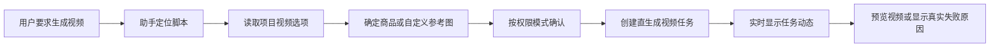
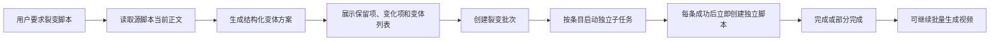

# CineWeave 带货项目 AI 助手与脚本裂变开发目标

- 状态：P0-P5 全部完成；真实 Provider 直生成视频、五场景脚本裂变 E2E 与生产发布均已通过
- 更新时间：2026-07-28
- 适用仓库：`D:\Code\CineWeave`
- 实施基线：`a7ec5d5f0394332861bc7c4d2f331701fd3b1fd4`
- 当前迁移头：`000069_commerce_script_derivation_prompt_hash.sql`
- 关联文档：
  - `docs/commerce-video-development-plan.md`
  - `docs/agent-development-acceptance-checklist.md`
  - `docs/provider-gateway.md`
  - `packages/openapi/openapi.yaml`
  - `packages/events/catalog.yaml`

本文档定义带货视频项目的项目控制助手、广告脚本裂变和直生成视频协同目标。它是后续实现和验收的专项入口，不替代 `docs/commerce-video-development-plan.md` 对带货视频直生成领域的定义。

本文档中的“裂变”是指：从一条明确的源广告脚本出发，围绕场景、开场钩子、目标受众、表达语气、语言、行动号召或自定义维度，创建多条可独立编辑、独立生成视频、独立归档的新脚本。

## 1. 当前结论

1. 带货项目已经采用“商品参考图 + 用户广告脚本 -> 直接生成视频”的主流程。
2. 带货项目不再以本地化审核、分镜、镜头参考图、视频提示词、时间线或成片合成为用户必经步骤。
3. 项目助手已通过 `ProjectKindPolicy` 隔离叙事项目与带货项目工具，旧带货分镜工具已从活动注册表移除。
4. 前端斜杠命令已按项目类型加载；带货项目只显示商品、脚本、裂变和直生成视频相关命令。
5. 直生成视频 API、Workflow、实时事件和 Agent 工具已形成统一行动－观察－再规划闭环。
6. 脚本裂变批次、条目、尝试、Provider 调用关联、部分成功、取消和失败重试模型已由迁移 `000067` 落地。
7. 不允许把五条场景变体保存为同一脚本的五次覆盖或编辑记录，裂变结果必须是五个独立脚本单元。
8. 原始脚本必须保持不变。裂变任务只能创建新脚本，不能覆盖源脚本。
9. 所有文本和视频供应商调用仍必须经过 Provider Gateway。
10. 本项目仍处于开发阶段，不为旧 Agent 计划或旧演示数据增加兼容执行分支。
11. `pnpm run test`、迁移包校验、OpenAPI 425 条路由检查和本地 Compose 重建已通过，本地数据库迁移头为 `000069`。
12. 本地浏览器已确认带货项目助手只显示商品、脚本、裂变和直生成视频工具；旧分镜、图片提示词、视频提示词与时间线工具没有混入。
13. 真实 Provider 失败链路已覆盖资源池不可用、渠道熔断、非法时长和上游输出画幅不一致；每次均保留 Provider Request/Call/Async Task provenance，并在 Agent、任务活动和视频列表显示真实终态。
14. 真实成功链路已通过：Agent 任务 `39b2d5e3-d1ff-4f3f-8a3b-ca67bbcb14a6` 为第 1 条脚本创建直生成作业 `74d109fa-faa7-4948-8e33-6b0c049c6972`，经 `einzieg / grok-imagine-video-1.5-preview` 生成 20 秒、720p、9:16 视频并完成媒体转存。
15. 成功媒体的 Artifact 为 `d8869875-d243-45fa-97c4-1b943611350b`，MediaFile 为 `20a16b40-5a74-4244-a8dc-0c45b30940cd`；探测结果为 720x1280、20.041667 秒、H.264、AAC、24 FPS、有音频，签名 URL 返回 HTTP 206 和 `video/mp4`，浏览器已实际播放并可正常关闭预览。
16. 五场景裂变真实任务已完成：源脚本 `3572f743-dd71-413c-bca8-b7f5b29f0078` 保持原正文哈希不变，root batch `6fa6eb4b-0197-45b7-bf66-9fbdf3417ce8` 经重试 batch `1a955c65-978d-4b41-97f0-d3c4df5ebd62` 生成五条独立脚本。
17. 裂变重试谱系已纳入原 Agent Task `f6872952-61e5-4ce6-a163-cabb9a2033a8`：任务最终显示“已完成”，摘要为“1 个工作流，共完成 5 项”，活动任务计数为 0。

## 2. 产品目标

### 2.1 项目助手目标

带货项目助手必须能够：

- 查看商品信息和当前有效商品参考图。
- 查看、创建、编辑、复制和归档广告脚本。
- 根据明确源脚本创建一个或多个独立变体。
- 查看当前项目视频模型支持的时长、分辨率和参考图输入约束。
- 默认使用商品配置中的有效图片，也允许选择脚本自定义参考图。
- 为一条或多条脚本启动直生成视频任务。
- 实时显示脚本裂变和视频任务的排队、运行、部分完成、成功、失败与取消状态。
- 取消运行中的任务。
- 只重试失败的裂变条目。
- 在信息不足时向用户提出问题，提供选项并允许自定义回答。
- 在裂变完成后继续询问是否为新脚本批量生成视频。

### 2.2 脚本裂变目标

非典型用户指令：

> 把第二条脚本的场景换五个版本。

目标执行结果：

1. 助手按稳定排序读取第二条活动脚本，而不是按标题猜测。
2. 助手直接读取源脚本当前正文、当前商品事实和项目视频选项。
3. 助手识别裂变维度为 `scene`，数量为 `5`。
4. 用户未指定五个场景时，助手提出五个差异明确的场景方案。
5. 助手展示将保持不变和允许变化的内容。
6. “需批准”模式直接对最终 `derive.batch` 完整参数进行审批；其他模式按 Supervisor 策略继续。
7. 五个变体作为五个独立条目生成，每个条目只生成一条脚本。
8. 每完成一个条目，立即创建一个新的 `commerce_script_unit` 及其当前正文。
9. 一个条目失败不回滚其他成功条目，批次进入“部分完成”。
10. 用户可以只重试失败条目。
11. 五条新脚本都可以独立编辑、归档和生成多个视频任务。

### 2.3 非目标

- 不恢复旧带货分镜生产链路。
- 不由助手直接调用供应商。
- 不把多个变体合并到同一个脚本正文。
- 不用一次模型输出生成包含多条完整脚本的大型数组。
- 不自动覆盖源脚本当前正文。
- 不因为目标时长估算偏差阻断脚本裂变；目标时长只用于生成建议。
- 不自动翻译脚本。只有用户选择语言裂变时才改变语言。
- 不要求用户确认模型推断语言。
- 不向用户暴露脚本版本选择，不因草稿、激活版本或历史版本状态增加交互门禁。
- 不执行能力审批；实际执行只校验视频模型可用时长、分辨率和适配器输入契约。
- 不在本批工作中物理删除旧 Commerce 数据表；旧工具先从活动 Agent 注册表移除，底层清理另行实施。

## 3. 用户体验

### 3.1 普通直生成



### 3.2 脚本裂变



### 3.3 助手提问规则

以下情况必须提问：

- “第二条脚本”无法按当前活动列表稳定定位。
- 用户要求重新生成，但存在多个可重试视频任务。
- 用户指定的参考图不存在或超过当前路由输入上限。
- 用户要求裂变但没有说明数量，且上下文中也无法确定。
- 用户同时要求改变多个冲突维度，例如“保持中文不变并全部改为马来语”。

以下情况不应增加无意义确认：

- 用户已经明确脚本、裂变维度和数量。
- 用户没有指定具体场景，但已经要求“生成五种不同场景”；助手可以直接提出五个候选。
- 用户没有指定视频时长；使用项目当前视频选项的默认时长，即可执行时长中的最大值。
- 用户没有指定参考图；使用商品配置中的默认有效参考图集合。
- 用户脚本已经包含目标语言；按原文传递，不再进行语言确认。

## 4. 项目类型隔离

### 4.1 工具注册表

Agent 工具必须拆成三组：

```text
commonTools
narrativeTools
commerceVideoTools
```

工具注册、工具查询、Planner、Supervisor 和 Executor 都必须以服务端加载的 `projectKind` 为准。

带货项目不得获得以下叙事或旧 Commerce 工具：

- 小说事件提取。
- 改编计划。
- 剧本转分镜。
- 镜头图片和镜头视频。
- 旧 Commerce 本地化确认。
- 旧 Commerce 分镜方案。
- 商品分镜参考图。
- 独立视频提示词生成和审核。
- 时间线与成片合成。

执行器必须再次进行项目类型校验。即使历史计划或异常 Planner 输出包含跨类型工具，也要在任何写入和供应商调用前返回：

```text
PROJECT_KIND_MISMATCH
```

### 4.2 Planner 上下文

带货 Planner 上下文至少包含：

- `projectId`
- `projectKind`
- 当前用户权限
- 商品是否已配置
- 活动商品参考图数量和主图
- 活动脚本数量及稳定排序摘要
- 当前视频选项摘要
- 最近和活动中的直生成视频任务
- 最近和活动中的脚本裂变批次
- Agent 权限模式

默认上下文只携带摘要，不把所有完整脚本一次性放入 Prompt。需要正文时必须先调用脚本读取工具。

### 4.3 通用自适应 Agent Runtime

自适应执行不是带货项目的专用分支。所有项目类型复用同一个持久化 Agent Runtime：

```text
AgentRuntime
├── 单步规划
├── 工具执行
├── 结构化观察
├── 子 Workflow 等待
├── 用户提问
├── 审批
└── 重规划与循环限制

ProjectKindPolicy
├── narrative
└── commerce_video
```

`AgentRuntime` 不包含叙事或带货业务判断。`ProjectKindPolicy` 只负责：

- 返回当前项目类型允许的工具集合。
- 构建受限的项目上下文摘要。
- 提供当前项目类型的 Planner 规则。
- 提供前端快捷命令和结果链接映射。

通用 Runtime 采用持久化的“行动－观察－再规划”循环：

```text
读取当前目标
-> 规划一个有边界的下一步
-> 校验工具和参数
-> 执行并持久化输出
-> 将结构化观察交回 Planner
-> 继续、提问、等待审批或结束
```

不允许一次性静态计划虚构后续步骤需要的 UUID。结构化观察、用户答案和子 Workflow 输出必须由通用 Runtime 持久化，下一轮 Planner 只能引用服务端提供的实体身份。

限制：

- 单个 Agent Task 最大行动数：`24`。
- 连续 Planner 无效输出最大次数：`3`。
- 同一工具、同一参数、同一观察状态不得连续执行超过 `2` 次。
- 子 Workflow 尚未到达有效终态时，不得执行依赖其输出的后续步骤。
- 达到限制后任务进入失败或等待用户状态，不允许无限循环。

## 5. 带货项目 Agent 工具

### 5.1 只读工具

| 工具 | 权限 | 作用 |
| --- | --- | --- |
| `commerce.project.read_summary` | project.read | 读取带货项目、商品、脚本和视频任务摘要 |
| `commerce.product.get` | asset.read | 读取商品事实和当前版本 |
| `commerce.product.references.list` | asset.read | 读取活动商品参考图 |
| `commerce.script.list` | script.read | 按稳定顺序列出脚本 |
| `commerce.script.get` | script.read | 读取指定脚本当前正文 |
| `commerce.script.derivation.get` | script.read | 读取裂变批次和条目 |
| `commerce.video.options` | workflow.run | 读取权威视频时长、分辨率和参考图契约 |
| `commerce.video.list` | workflow.read | 列出直生成视频任务 |
| `commerce.video.get` | workflow.read | 读取视频任务及输出 |

### 5.2 写操作工具

| 工具 | 权限 | 作用 |
| --- | --- | --- |
| `commerce.product.update` | asset.write | 修改商品事实 |
| `commerce.script.create` | script.write | 创建独立脚本 |
| `commerce.script.update` | script.write | 编辑脚本当前正文 |
| `commerce.script.archive` | script.write | 归档脚本 |

### 5.3 裂变和长任务工具

| 工具 | 基础风险 | Effects | 作用 |
| --- | --- | --- | --- |
| `commerce.script.derive.preview` | `costed` | `maySpendProvider` | 生成结构化裂变方案，不创建脚本 |
| `commerce.script.derive.batch` | `workflow` | `startsWorkflow,writesProject,maySpendProvider` | 创建裂变批次并生成独立脚本 |
| `commerce.script.derive.retry_failed` | `workflow` | `startsWorkflow,writesProject,maySpendProvider` | 创建只包含失败条目的重试子批次 |
| `commerce.script.derive.cancel` | `workflow` | `writesProject` | 取消尚未开始或正在运行的条目 |
| `commerce.video.generate` | `workflow` | `startsWorkflow,writesProject,maySpendProvider` | 为一条脚本创建直生成视频任务 |
| `commerce.video.cancel` | `workflow` | `writesProject` | 取消直生成视频任务 |

### 5.4 通用工具 Effects

现有单值 `AgentTool.Risk` 不能同时表达 Workflow、项目写入和 Provider 费用。通用 Agent Tool Descriptor 增加：

```json
{
  "permission": "script.write",
  "permissions": ["script.write", "workflow.run"],
  "risk": "workflow",
  "effects": {
    "maySpendProvider": true,
    "startsWorkflow": true,
    "writesProject": true,
    "destructive": false
  }
}
```

要求：

- Supervisor 依据结构化 Effects、权限模式和工具权限决定是否批准。
- `permission` 保留主权限供旧调用方展示，`permissions` 是必须全部满足的完整权限集合；工具列表、Planner、Supervisor 和 Executor 必须使用完整集合进行 fail-closed 校验。
- Planner 只使用 Effects 解释影响，不自行推断费用或写入范围。
- Executor 不再通过工具名称前缀判断 `maySpendProvider` 或 `startsWorkflow`。
- OpenAPI、前端工具类型、影响标签和测试同步更新。

### 5.5 裂变工具输入契约

`commerce.script.derive.preview`：

```json
{
  "sourceScriptUnitId": "uuid",
  "count": 5,
  "dimension": "scene",
  "instruction": "只替换使用场景，保持商品卖点、语言和行动号召不变",
  "candidateValues": [],
  "preserve": [
    "product_facts",
    "selling_points",
    "prohibited_claims",
    "language",
    "cta",
    "approximate_duration"
  ]
}
```

输出必须为结构化方案：

```json
{
  "sourceScriptUnitId": "uuid",
  "sourceContentHash": "sha256",
  "dimension": "scene",
  "requestedCount": 5,
  "preserve": ["product_facts", "selling_points", "language", "cta"],
  "variations": [
    {"ordinal": 1, "key": "night_market", "label": "夜市场景", "brief": "真实夜市摊位体验"},
    {"ordinal": 2, "key": "shopping_mall", "label": "商场场景", "brief": "商场试用和近景展示"},
    {"ordinal": 3, "key": "home_living_room", "label": "家庭客厅", "brief": "居家日常使用体验"},
    {"ordinal": 4, "key": "office_commute", "label": "通勤办公", "brief": "上班通勤和办公室使用场景"},
    {"ordinal": 5, "key": "outdoor_camping", "label": "户外露营", "brief": "户外出行和露营体验"}
  ]
}
```

`commerce.script.derive.preview` 是非绑定提案，不创建领域审批记录。`commerce.script.derive.batch` 必须显式携带最终的源脚本、变化维度、保持项和全部变体；“需批准”模式直接批准该工具的完整参数。服务端不得依赖自然语言重新推断已经提交的批次内容。

`commerce.script.derive.batch`：

```json
{
  "sourceScriptUnitId": "uuid",
  "dimension": "scene",
  "instruction": "只替换使用场景，保持商品卖点、语言和行动号召不变",
  "preserve": ["product_facts", "selling_points", "language", "cta"],
  "variations": [
    {"ordinal": 1, "key": "night_market", "label": "夜市场景", "brief": "真实夜市摊位体验"},
    {"ordinal": 2, "key": "shopping_mall", "label": "商场场景", "brief": "商场试用和近景展示"},
    {"ordinal": 3, "key": "home_living_room", "label": "家庭客厅", "brief": "居家日常使用体验"},
    {"ordinal": 4, "key": "office_commute", "label": "通勤办公", "brief": "上班通勤和办公室使用场景"},
    {"ordinal": 5, "key": "outdoor_camping", "label": "户外露营", "brief": "户外出行和露营体验"}
  ]
}
```

创建批次事务重新读取源脚本当前正文，并将正文和哈希冻结到批次。任务启动后用户继续编辑脚本，不影响运行中批次；之后创建的新批次读取新的当前正文。

约束：

- `count` 初始支持 `1..20`。
- 创建批次时 `requested_count` 由最终 `variations` 长度确定，不信任客户端单独传入的计数。
- preview 输出中的 `variations` 数量必须等于请求的 `count`。
- `key` 在批次内唯一。
- 变体标签和说明不能为空。
- 每个条目只生成一条脚本。
- 所有完整脚本输出必须通过结构化 Schema 单独解析。

### 5.6 视频生成工具契约

`commerce.video.generate` 接受：

```json
{
  "scriptUnitId": "uuid",
  "durationSeconds": 16,
  "resolution": "1080p",
  "generateAudio": true,
  "references": [
    {"sourceType": "product", "sourceId": "uuid"}
  ]
}
```

以下字段可省略并由执行器从权威 `commerce.video.options` 补齐：

- `durationSeconds`
- `resolution`
- `generateAudio`
- `references`

Agent 不得传入：

- Provider credential
- Provider Account ID
- 任意上游 URL
- 未经当前视频选项返回的模型时长和分辨率
- 原始能力 JSON

## 6. 裂变保持契约

### 6.1 裂变维度

初始支持：

| 值 | 中文 | 默认变化范围 |
| --- | --- | --- |
| `scene` | 场景 | 地点、环境、道具摆放和人物活动 |
| `hook` | 开场钩子 | 前几秒吸引注意力的方式 |
| `audience` | 目标受众 | 受众身份、痛点和表达侧重点 |
| `tone` | 表达语气 | 专业、亲切、幽默、紧迫等 |
| `language` | 语言 | 明确目标语言下的独立脚本 |
| `cta` | 行动号召 | 结尾转化表达 |
| `custom` | 自定义 | 用户明确描述的变化范围 |

### 6.2 默认保持项

除非用户明确要求改变，以下内容必须保持：

- 商品名称、品牌和产品类别。
- 商品事实和可验证卖点。
- 禁止改变的包装和外观特征。
- 禁用声明和禁止宣传词。
- 原脚本语言。
- 核心行动号召。
- 大致时长目标。
- 商品在脚本中的主要用途。

### 6.3 场景裂变规则

`dimension=scene` 时：

- 可以改变地点、环境、人物所处情境、辅助道具和镜头感描述。
- 不得改变商品身份、功能、卖点和禁止声明。
- 不得擅自增加源商品没有提供的功效。
- 不得把五个场景写进同一条脚本。
- 五个候选场景必须具有可感知差异，不能只是同一场景的同义改写。
- 用户未指定场景时，助手应优先提出适合目标平台且实际可拍摄的场景。

### 6.4 语言和时长

- 非语言裂变保持源脚本原语言。
- 语言裂变必须使用明确 BCP 47 目标语言。
- 不要求用户确认自动识别语言。
- 目标时长是写作指导，不作为严格字数审核。
- 最终脚本必须满足当前视频路由的脚本 Prompt 长度限制。
- 超过模型 Prompt 限制时允许最多三轮压缩修正，仍不通过则该条目失败。

### 6.5 当前正文语义

产品和 Agent 只存在一个“当前脚本正文”概念：

- Commerce 领域服务提供统一的 `ResolveCurrentScriptContent`。
- 裂变、直生成视频、脚本列表、脚本详情和字符限制校验必须调用同一解析规则。
- 当前数据库中的 `draft_content` 和内部正文记录不得由不同业务路径分别解释。
- 编辑脚本事务更新用户可见当前正文，并同步写入内部不可变正文记录；内部记录仅用于审计、哈希和历史任务快照。
- 新 API 返回 `currentContent/currentContentHash`，不要求客户端传递或选择正文版本 ID。
- 当前正文为空时返回 `COMMERCE_SCRIPT_DERIVATION_SOURCE_EMPTY`，不得让模型自行补写一个不存在的源脚本。

## 7. 数据模型

### 7.1 复用现有字段

每条成功输出的新脚本：

```text
commerce_script_units.derived_from_script_unit_id = 源脚本 ID
commerce_script_units.derivation_kind = scene_variant / hook_variant / audience_variant / tone_variant / language_variant / cta_variant / custom_variant
```

现有 `commerce_ad_script_versions` 继续作为内部不可变正文记录保存生成内容和哈希，但产品、Agent 和新增 API 都只暴露脚本当前正文，不要求用户选择或管理版本。

### 7.2 commerce_script_derivation_batches

建议新增：

```text
id
organization_id
project_id
product_id
source_script_unit_id
source_content_snapshot
source_content_hash
product_version_id
product_snapshot_hash
production_generation_id
video_production_binding_id
video_production_binding_revision
production_configuration_hash
script_model_profile_key
model_profile_binding_id
model_profile_binding_revision
routing_snapshot_hash
prompt_contract_snapshot
dimension
instruction
preserve_contract
variation_plan
requested_count
idempotency_key
request_hash
root_batch_id
retry_of_batch_id
retry_depth
workflow_run_id
status
queued_count
running_count
succeeded_count
failed_retryable_count
failed_terminal_count
cancelled_count
revision
created_by
created_at
started_at
completed_at
cancelled_at
updated_at
```

批次状态：

```text
queued
running
partial_succeeded
succeeded
failed
cancelling
cancelled
```

### 7.3 commerce_script_derivation_items

```text
id
batch_id
organization_id
project_id
product_id
input_ordinal
root_item_id
retry_of_item_id
variation_key
variation_label
variation_brief
input_snapshot
input_hash
reserved_unit_no
reserved_sort_order
status
current_attempt_id
output_script_unit_id
output_script_version_id
error_code
error_message
revision
created_at
started_at
completed_at
updated_at
```

条目状态：

```text
queued
running
reviewing
succeeded
failed_retryable
failed_terminal
cancelled
```

### 7.4 commerce_script_derivation_attempts

```text
id
batch_id
item_id
organization_id
project_id
product_id
attempt_no
root_attempt_id
retry_of_attempt_id
status
final_output_content_hash
review_round
review_result
review_feedback
error_code
error_message
started_at
completed_at
created_at
updated_at
```

尝试状态：

```text
queued
generating
reviewing
revising
succeeded
failed
cancelled
```

### 7.5 commerce_script_derivation_attempt_calls

一个条目尝试最多包含多轮生成、审核和修正，因此不能在 attempt 上只保存一个 Provider Call。每次 Gateway 调用单独记录：

```text
id
batch_id
item_id
attempt_id
organization_id
project_id
product_id
round_no
phase
provider_request_id
provider_call_id
model_profile_key
model_profile_binding_id
provider_model_id
prompt_template_key
prompt_version_id
prompt_hash
output_content_hash
status
error_code
error_message
started_at
completed_at
created_at
```

`phase`：

```text
generate
review
revise
```

候选方案预览发生在批次创建前，其 Provider provenance 由 Agent Step 和 Provider Call Log 记录，不写入批次 attempt calls。

### 7.6 不变量

- 批次和条目身份创建后不可变。
- 批次创建事务直接读取并冻结源脚本当前正文；`source_content_snapshot`、正文哈希、商品版本、模型路由、Prompt 契约、变化方案和保持契约创建后不可变。
- 同一批次的 `input_ordinal` 和 `variation_key` 唯一。
- 批次创建事务锁定商品，按 `input_ordinal` 一次性预留 `reserved_unit_no` 和 `reserved_sort_order`；一次性推进 `next_script_unit_no` 和新的 `next_script_sort_order`，但只有脚本真正物化时才推进可见集合 revision。
- 条目完成顺序不得改变预留的脚本编号和展示顺序；失败或取消条目允许留下编号空洞。
- 普通新增、复制、裂变预留和脚本重排必须共用同一个脚本位置分配器；重排后将 `next_script_sort_order` 推进到新最大排序值之后，禁止各路径自行计算 `max(sort_order)+10`。
- 成功条目必须同时有 `output_script_unit_id` 和 `output_script_version_id`。
- 失败条目必须有规范化错误码和错误信息。
- 原批次、原条目和原尝试到达终态后不可变。
- 每次 Provider Gateway 调用必须对应一条 attempt call；一条 call 只能属于一个 batch/item/attempt/round/phase。
- `retry_failed` 创建带 `root_batch_id/retry_of_batch_id` 的新子批次、新条目和新尝试，只复制可重试失败项的不可变输入。
- 重试条目的 `root_item_id/retry_of_item_id` 必须指向同一批次谱系中的可重试失败条目，并保持相同 `variation_key`、源正文哈希和商品快照哈希。重试会重新冻结当前路由，因此包含路由哈希的 `input_hash` 允许变化，并必须在谱系详情中可见。
- 根批次详情提供谱系聚合投影，按原 `variation_key` 展示最新成功结果和全部尝试历史；不得把子批次结果回写成原条目的新状态。
- 批次计数必须从条目终态收敛，不允许前端自行推断。
- 项目删除时批次、条目和尝试随项目删除；Provider 调用历史按现有历史保留规则处理。

## 8. Workflow 设计

### 8.1 ScriptDerivationBatchWorkflow

职责：

1. 锁定并校验批次快照。
2. 在同一事务中创建所有条目，通过共享脚本位置分配器按变体顺序预留脚本编号和排序位置。
3. 冻结 Script Model Profile 路由和 Prompt Registry 契约。
4. 按组织和 Provider 并发限制启动条目子 Workflow。
5. 收集条目结果。
6. 允许部分成功。
7. 收敛批次终态和计数。
8. 发送实时事件。

### 8.2 ScriptDerivationItemWorkflow

每个条目独立执行：

1. 加载不可变源脚本正文、商品、模型路由、Prompt 契约和变体快照。
2. 渲染结构化生成请求。
3. 通过 Provider Gateway 调用文本模型。
4. 解析一条脚本结果。
5. 执行确定性校验。
6. 执行轻量 Reviewer。
7. Reviewer 拒绝时把反馈提交给生成器修正。
8. 最多三轮。
9. 成功后按条目预留的编号和排序位置，在同一数据库事务中创建独立脚本及内部首个正文记录；物化路径不得再次分配编号或推进位置计数器。
10. 写入来源、事件和 Provider provenance。

一个条目失败不得删除或回滚其他条目已经创建的脚本。

### 8.3 Prompt Registry 与模型路由

不得在 Workflow、Activity 或 Agent Tool 中硬编码裂变 Prompt。初始 Prompt Registry keys：

```text
commerce_script_derivation_candidate_planner
commerce_script_derivation_generator
commerce_script_derivation_reviewer
commerce_script_derivation_reviser
```

每个模板必须有：

- 明确的 `task_type=text.generate`。
- 版本化内容和内容哈希。
- 输入变量 Schema。
- 结构化输出 JSON Schema。
- 活动 Prompt Version。
- seed apply/verify 覆盖。

模型规则：

- 候选方案、脚本生成、审核和修正均使用项目当前生产配置中的 `scriptModelProfileKey`。
- 批次创建时冻结 Model Profile Binding ID、revision、路由快照哈希和 Prompt Version IDs。
- 重试子批次沿用原批次冻结的源正文、商品和变体输入，但重新冻结当前可用的模型路由；新旧路由差异必须在谱系投影中可见。
- 没有可用脚本文本模型路由时，在任何条目启动前返回 `COMMERCE_SCRIPT_DERIVATION_MODEL_UNAVAILABLE`。
- Provider Gateway 返回的 Provider Request/Call、实际模型和错误信息写入 attempt provenance。

### 8.4 审核范围

Reviewer 只审核：

- 商品事实是否被篡改。
- 是否完成指定裂变维度。
- 是否保留明确要求保持的内容。
- 是否包含禁止声明或虚构功效。
- 输出是否是一条完整脚本。
- 是否超过当前模型 Prompt 长度限制。

Reviewer 不审核：

- 风格是否符合单一审美偏好。
- 旁白估算是否严格等于视频秒数。
- 是否需要本地化确认。
- 是否符合旧分镜结构。

### 8.5 并发和重试

- 基础并发由组织 Provider 租约和 Worker 配置共同决定。
- 不在 Agent Prompt 中硬编码并发数。
- Provider 临时错误进入 `failed_retryable`。
- Schema、商品事实或禁用声明连续三轮不通过进入 `failed_terminal`。
- `retry_failed` 创建新的重试子批次，只复制失败条目的不可变输入，不重复成功条目。
- 使用批次和条目幂等键防止 Agent 重连后重复创建脚本。

## 9. Public API

新增：

```text
POST /api/projects/{projectId}/commerce/script-units/{scriptUnitId}/derivations
GET  /api/projects/{projectId}/commerce/script-derivations
GET  /api/projects/{projectId}/commerce/script-derivations/{batchId}
POST /api/projects/{projectId}/commerce/script-derivations/{batchId}/retry-failed
POST /api/projects/{projectId}/commerce/script-derivations/{batchId}/cancel
POST /api/projects/{projectId}/commerce/direct-videos/{jobId}/cancel
GET  /api/projects/{projectId}/agent/sessions
POST /api/projects/{projectId}/agent/sessions
GET  /api/projects/{projectId}/agent/sessions/{sessionId}/messages
POST /api/projects/{projectId}/agent/image-attachments/upload-url
POST /api/projects/{projectId}/agent/image-attachments/{attachmentId}/complete
POST /api/projects/{projectId}/agent/image-attachments/{attachmentId}/assign
```

创建裂变请求：

```json
{
  "dimension": "scene",
  "instruction": "只替换场景",
  "preserve": ["product_facts", "selling_points", "language", "cta"],
  "variations": [
    {"key": "night_market", "label": "夜市场景", "brief": "真实夜市体验"}
  ]
}
```

创建返回 `202 Accepted`，包含批次、条目和 Workflow 身份。

### 9.1 幂等协议

以下写接口必须要求 `Idempotency-Key`：

- 创建裂变批次。
- 重试失败项。
- 取消裂变批次。
- 取消直生成视频任务。

规则：

- 创建批次的请求哈希覆盖项目、源脚本 ID、创建事务读取到的当前正文哈希、变化维度、instruction、preserve 和完整 variations。
- 重试请求哈希覆盖源批次、可重试条目集合及冻结输入哈希。
- 取消请求哈希覆盖目标身份和调用者请求。
- 同一 scope 下同 key、同请求哈希返回原 HTTP 状态和响应快照。
- 同一 scope 下同 key、不同请求哈希返回 `409 IDEMPOTENCY_KEY_CONFLICT`。
- Idempotency claim、领域写入、Workflow 入队和响应快照必须位于同一数据库事务。
- Agent Step ID 可以参与生成稳定 key，但不能替代服务端请求哈希。

### 9.2 查询和响应

- 批次列表支持 `filter[status]`、`filter[sourceScriptUnitId]`、cursor 和 limit。
- 批次详情默认返回当前批次条目，并包含 root/retry 谱系摘要。
- `include=lineage` 返回根批次、所有重试子批次及按 `variation_key` 聚合的最新结果。
- 取消已终态对象幂等返回当前终态，不伪造新的取消事件。

所有公共接口必须同步更新：

- `packages/openapi/openapi.yaml`
- `apps/web/src/lib/api-client.ts`
- `apps/web/src/lib/types.ts`
- `apps/web/src/lib/query/keys.ts`
- 路由一致性检查

## 10. 实时事件

新增事件：

```text
commerce.script_derivation.batch.created
commerce.script_derivation.batch.started
commerce.script_derivation.batch.progressed
commerce.script_derivation.batch.partial_succeeded
commerce.script_derivation.batch.succeeded
commerce.script_derivation.batch.failed
commerce.script_derivation.batch.cancelling
commerce.script_derivation.batch.cancelled
commerce.script_derivation.item.started
commerce.script_derivation.item.reviewing
commerce.script_derivation.item.succeeded
commerce.script_derivation.item.failed
commerce.script_derivation.item.cancelled
```

事件契约：

- 所有 batch 事件至少包含 `batchId`、`sourceScriptUnitId`、`workflowRunId`、`status` 和各状态计数。
- 重试子批次事件同时包含 `rootBatchId` 和 `retryOfBatchId`。
- 所有 item 事件至少包含 `batchId`、`itemId`、`variationKey`、`inputOrdinal`、`workflowRunId` 和 `status`。
- item succeeded 增加 `outputScriptUnitId`；item failed 增加 `errorCode` 和 `errorMessage`。
- `batch.partial_succeeded/succeeded/failed/cancelled` 和 `item.succeeded/failed/cancelled` 标记为 terminal。
- 重放事件必须使用同一 event ID 或领域幂等身份，前端不得重复累计计数。

事件必须登记在 `packages/events/catalog.yaml` 并生成前后端事件目录。

助手和视频页收到事件后失效：

- Agent Task 详情。
- 裂变批次详情。
- 活动脚本列表。
- 对应脚本详情。
- 直生成视频列表。
- 项目活动任务计数。

## 11. 权限、审批和费用

### 11.1 权限

- 查看商品和脚本：对应 read 权限。
- 修改商品和脚本：对应 write 权限。
- 裂变预览：script.read；发生文本模型调用时标记为 costed。
- 创建或重试裂变：script.write + workflow.run。
- 视频生成：workflow.run。
- 裂变和视频任务取消：workflow.cancel。
- 所有操作继续执行组织、项目和 Workspace RBAC。

### 11.2 Agent 权限模式

`require_approval`：

- `derive.preview` 只形成非绑定建议；最终审批对象是 `derive.batch` 的完整规范化参数。
- 裂变审批展示源脚本当前正文摘要、维度、数量、全部变体和保持项。
- 视频生成前展示脚本、时长、分辨率和参考图数量。

`auto_approve`：

- 在现有 Supervisor 策略允许范围内自动继续。
- 删除、归档和大批量付费操作仍可由策略要求批准。

`full_access`：

- 减少批准步骤，但不能绕过 RBAC、幂等、项目类型、Provider 限额和输入契约。

### 11.3 费用边界

- 文本裂变和视频生成都属于真实供应商调用。
- Agent 预览必须明确标识可能产生文本生成费用。
- 不编造本地费用数字；当前计费以 New API 和 Provider Gateway 记录为准。
- Provider Gateway 继续负责 `provider_call_logs`、`cost_records` 和异步任务。

## 12. 前端改造

### 12.1 项目类型感知

项目布局将 `projectKind` 传给 `AgentDrawer`。

带货项目只显示以下斜杠命令：

```text
/查看商品
/列出脚本
/新增脚本
/修改脚本
/裂变脚本
/生成视频
/批量生成视频
/查看视频任务
/取消视频任务
```

叙事项目继续显示叙事命令，不得混用。

### 12.2 裂变确认

助手消息内显示：

- 源脚本名称和当前正文摘要。
- 裂变维度。
- 计划生成数量。
- 保持项。
- 每个变体的名称和说明。
- 可能产生供应商费用的标识。
- 批准、调整方案和取消操作。

### 12.3 任务动态

裂变任务显示一个批次卡片和多个条目：

```text
脚本 2 场景裂变  已完成 4/5
1 夜市场景      已创建脚本
2 商场场景      已创建脚本
3 办公室场景    生成中
4 户外场景      已创建脚本
5 家庭场景      失败，可重试
```

要求：

- 运行中显示动态图标。
- 成功条目立即出现“查看脚本”和“生成视频”操作。
- 一条失败时批次显示“部分完成”，不能显示整体失败。
- “重试失败项”只处理失败条目。
- 切换页面或关闭助手后，重新打开仍从服务端恢复真实进度。
- 成功后脚本列表自动更新，不要求用户刷新页面。

### 12.4 脚本列表

新脚本卡片显示简洁来源标签：

```text
源自：脚本 2
裂变：场景 · 夜市
```

支持按裂变批次折叠查看，但每条脚本仍是独立生产单元。

### 12.5 图片附件

后续同批支持在助手输入框附加图片：

- 图片先通过现有 Artifact/Media 上传链路。
- Agent 上下文只引用媒体 ID、用途和预览元数据，不传 Base64。
- 助手询问图片应作为商品公共参考图还是指定脚本自定义参考图。
- 上传和绑定仍经过现有权限与对象存储规则。

## 13. 错误码

公开 API 使用稳定的领域错误码；字段级校验原因保留在安全的中文 `message/details` 中，避免把每个校验分支固化成无法演进的错误码：

```text
COMMERCE_SCRIPT_DERIVATION_SOURCE_EMPTY
COMMERCE_SCRIPT_DERIVATION_INVALID
COMMERCE_SCRIPT_DERIVATION_NOT_FOUND
COMMERCE_SCRIPT_DERIVATION_STATE_CONFLICT
COMMERCE_SCRIPT_DERIVATION_MODEL_UNAVAILABLE
COMMERCE_DIRECT_VIDEO_STATE_CONFLICT
AGENT_IMAGE_ATTACHMENTS_INVALID
AGENT_IMAGE_ATTACHMENTS_LIMIT_EXCEEDED
AGENT_IMAGE_ATTACHMENT_NOT_FOUND
AGENT_IMAGE_ATTACHMENT_NOT_READY
AGENT_IMAGE_ATTACHMENT_EXPIRED
PROJECT_KIND_MISMATCH
```

条目和尝试记录仍保存 Provider、Prompt 契约、商品事实审核等更具体的 `errorCode/errorMessage`，用于失败重试和技术详情；这些执行错误不替代公开 API 的稳定领域码。

前端必须使用中文映射，同时保留服务端安全的具体错误信息。不得向用户直接显示 Temporal `activity error` 包装、SQL 错误或内部英文枚举。

## 14. 数据库迁移

- `000067_commerce_script_derivation.sql` 新增 batches、items、attempts、attempt_calls 四张表及必要索引、约束和触发器。
- `000068_agent_image_attachments.sql` 新增耐久化助手图片附件、任务附件快照和 Artifact/MediaFile 关联。
- `000069_commerce_script_derivation_prompt_hash.sql` 将裂变 attempt call 的 Prompt hash 约束与 Prompt Registry 的 `sha256:<64hex>` 契约对齐；Output hash 仍保持裸 64 位十六进制。
- 为 `commerce_products` 增加单调递增的 `next_script_sort_order`，并让普通新增、复制、重排和裂变共用位置分配器。
- 扩展 `commerce_script_units.derivation_kind` 约束以支持本文档定义的变体类型。
- 将新表加入项目删除级联检查。
- 更新 migration embed、runner 测试和 consolidated baseline。
- 不迁移旧 Agent Task 为新工具。
- 不为旧 Commerce 分镜记录创建裂变批次。
- 不在迁移中写 Provider 配置表。
- 后续迁移从 `000070` 开始，不改写已经验证的 `000065` 至 `000069`。

## 15. 实施顺序

### P0：项目类型隔离

- [x] 拆分 Agent 工具注册表。
- [x] Planner 上下文加入 `projectKind`。
- [x] 抽象 `ProjectKindPolicy`，由策略提供工具、上下文、Planner 规则和快捷命令。
- [x] 增加带货专属 ProjectKindPolicy。
- [x] Executor 增加服务端项目类型校验。
- [x] 将工具费用、Workflow、写入和破坏性影响改为结构化 Effects。
- [x] 前端斜杠命令按项目类型过滤。
- [x] 增加跨类型工具拒绝测试。

### P1：通用自适应 Agent Runtime

- [x] 将通用 Agent Task 改成持久化行动－观察－再规划。
- [x] 增加结构化实体引用和观察结果。
- [x] 增加步骤、重复和无效规划上限。
- [x] 统一支持 `agent.ask_user` 处理各项目类型的实体歧义。
- [x] 保证子 Workflow 真正终态后才继续。
- [x] 让叙事和带货项目共用同一个 Runtime 测试矩阵。

### P2：直生成视频 Agent 闭环

- [x] 在自适应 Runtime 上增加视频 options/list/get/generate/cancel 工具。
- [x] 新增直生成任务取消 API。
- [x] 补齐权限、结构化 Effects、Provider 费用和子 Workflow 等待规则。
- [x] 将 `commerce.direct_video.*` 接入 Agent 任务动态。
- [x] 完成自然语言定位脚本和询问歧义测试。
- [x] 完成单脚本真实 Provider 直生成端到端测试。

### P3：裂变数据模型和 Workflow

- [x] 新增迁移和 Repository。
- [x] 实现脚本编号和排序位置批量预留。
- [x] 新增批次、条目、尝试、Provider 调用关联及谱系聚合领域服务。
- [x] 增加 Prompt Registry 模板、Schema、seed 和脚本模型路由冻结。
- [x] 实现 Batch Workflow 和 Item Workflow。
- [x] 实现单条生成、轻量审核和最多三轮修正。
- [x] 实现部分完成、取消和失败子批次。
- [x] 补齐事件和 reconciliation。

### P4：裂变 Agent 工具和前端

- [x] 实现 preview/batch/get/retry/cancel 工具。
- [x] 实现裂变确认消息。
- [x] 实现批次和条目动态。
- [x] 新脚本成功后自动刷新列表。
- [x] 增加来源标签和批次分组。
- [x] 增加“一键为成功脚本批量生成视频”。
- [x] Agent Task 自动追踪 root batch 的全部重试子批次，以最新谱系结果决定等待、失败和成功。
- [x] 前端裂变卡片按 `lineageResults.latestResult` 展示有效状态，并从仍失败的最新子批次重试。
- [x] 重试提交后自动恢复原 Agent Task；纯脚本裂变目标 5/5 完成时不再调用 Planner 确认已知终态。

### P5：附件、清理和发布

- [x] 增加助手图片附件。
- [x] 移除活动 Agent 注册表中的旧 Commerce 工具。
- [x] 清理旧工具前端标签和风险判断。
- [x] 更新 OpenAPI、事件目录和开发文档。
- [x] 运行全仓验证、Compose 验证和无付费浏览器验收。
- [x] 完成包含真实 Provider 调用的浏览器端到端验收。
- [x] 按 `AGENTS.md` 生产发布清单部署。

生产发布记录（2026-07-28）：

1. 发布提交 `a7ec5d5f0394332861bc7c4d2f331701fd3b1fd4` 已推送到 `origin/main`；生产使用 `/soft/CineWeave/releases/a7ec5d5f0394332861bc7c4d2f331701fd3b1fd4/source` 的干净不可变源码，未覆盖服务器原 dirty checkout。
2. 精确 Git archive 为 `/soft/CineWeave/releases/a7ec5d5f0394332861bc7c4d2f331701fd3b1fd4/source-git.tar.gz`，SHA256 为 `368b1db07c57c8346e73d8593d37d9ee5c76fcf9c5d4de2ee5f7fbe84ee086a2`。
3. `release-check.ps1 -RequireClean -SkipImageBuild` 全绿，覆盖 secret scan、`go vet`、`govulncheck`、依赖审计、`pnpm run test`、Web production build、Commerce 6/6 E2E 和隔离迁移 Up/Down/Up；`google.golang.org/grpc` 已升级至无已知可达漏洞的 `v1.82.1`。
4. 生产数据库已从迁移头 `66` 升级至 `69`，`cineweave-migrate verify`、seed apply/verify 均通过。升级前 custom-format 备份为 `/soft/CineWeave/backups/cineweave-pre-a7ec5d5f0394332861bc7c4d2f331701fd3b1fd4-20260728T085248Z.dump`，大小 `38235494` 字节，SHA256 为 `601336b5d9afbacd1eac8543026aea8c9bf01235d10e1c79e6df4d6bb76e3f21`，`pg_restore -l` 可读取 `2518` 条目录项。
5. Provider 配置在停写窗口内完成 12 张配置表和 8 张历史表保护快照及复核。快照为 `/soft/CineWeave/backups/provider-protection-a7ec5d5f0394332861bc7c4d2f331701fd3b1fd4-before.json`，SHA256 为 `459a392e835a3b4b703369999ddb187fa849ff0e09e0d7bdc6f5369739b1d304`；复核通过后已解除写冻结。
6. API、Realtime、Provider Gateway、Event Publisher、Web、Script Worker、Agent Worker、Media Worker、Audio Worker 均运行 `a7ec5d5f0394332861bc7c4d2f331701fd3b1fd4` 不可变镜像并处于 healthy。完整镜像清单和远端 digest 保存在发布目录的 `IMAGE_DIGESTS.txt`。
7. `cineweave-script-worker`、`cineweave-agent-worker`、`cineweave-media-worker`、`cineweave-audio-worker` 的 Temporal current Build ID 均为本次发布 SHA，ramping 已清空。旧 Script Build `bc4326a0aa81-storyboard-57b15e4b46a4` 和旧 Agent/Media/Audio Build `bc4326a0aa810a31e7962f03339489cb9e592c40` 均连续三次确认 drained，可安全作为回滚版本保留。
8. API `/healthz`、`/readyz`、Realtime、Web、公开站点和 MinIO 公共健康端点均返回 HTTP 200；新增脚本裂变 API 的未认证请求返回 401 而不是 404；Provider Gateway 在 Docker 网络内可解析并访问 `new-api:3000`。
9. 生产浏览器以已登录账号验证项目列表和新建项目页，页面已显示“带货视频 / 商品图片与多脚本独立成片”。本次发布 smoke 未创建项目、未启动工作流、未调用真实付费 Provider。
10. 发布前后活动 Workflow、Workflow Node、Provider Request/Call/Async Task/Lease/Test Run 均为 `0`，近 15 分钟核心服务与新 Worker 日志无 panic、fatal、迁移失败或 Temporal nondeterminism。
11. 服务器 `/soft/CineWeave/current`、`.compose.release.yml` 和 `.env` 的 Release ID 已切换到本次发布；旧 release 目录、旧镜像、旧 Worker 容器、Provider 快照和数据库备份均保留。数据库回滚只允许在明确授权后使用上述备份或审阅后的 down migration。

真实 Provider 验收记录：

1. `zhou API` 两次成功创建外部任务，但上游返回 `pool: no available account`；业务状态、错误展示和活动任务计数正确收敛。
2. `快跑API` 成功创建任务后返回 `fail_to_fetch_task / channel_circuit_open`；Gateway 保留上游 503 详情并终结业务任务。
3. `einzieg` 首次按错误冻结能力请求 15 秒，上游明确返回可执行时长集合 `[6,10,12,16,20]`；通过正式模型配置将能力修正为该集合，新项目冻结后的默认时长为 20 秒。
4. Agent 省略 `durationSeconds` 时，Runtime 曾在应用默认值前错误拒绝请求。`validateDirectVideoJobInput` 已改为仅拒绝负数，并增加省略时长回归测试；由于 Agent 工具在 `agent-worker` 内执行，API 和 Agent Worker 均已用新代码重建。
5. 首次 `einzieg` 任务完整生成到 100%，但横版参考图导致实际视频为 1104x816，系统按 9:16 契约返回 `UPSTREAM_OUTPUT_MISMATCH`，未错误入库。
6. 将商品主图更新为 720x1280 后，新 Agent 任务创建 Provider Request `82b4c8a0-a6bd-43bd-aa2d-5433f7571b70`、Provider Call `cb8f018e-b817-4539-a6eb-fd045200cfcd`、Async Task `19c1c7ab-d9b9-471d-a32b-8ce21c12f086` 和外部任务 `task_J7YbduR3X9Q6u4s8MLXHW3dAVavh7P0c`。
7. 最终视频成功转存到 CineWeave 对象存储；API 返回签名预览，浏览器视频卡片显示“已完成”，助手显示 4/4 步骤完成和预览入口，任务活动计数为 0。

真实脚本裂变验收记录：

1. 首次批次 `6fa6eb4b-0197-45b7-bf66-9fbdf3417ce8` 暴露 attempt call Prompt hash 约束不接受 Prompt Registry `sha256:` 前缀；通过前向迁移 `000069` 修复并完成独立 PostgreSQL Up/Down/Up 回归。
2. 首个重试批次 `bc329f7c-6738-49e1-9293-9b72d8fea58b` 暴露业务 `attempt_no=2` 被错误用作 Workflow execution generation；Workflow 改为从 `workflow_runs.attempt_generation` 冻结写入代，业务尝试号只保留在裂变谱系。
3. 成功重试批次 `1a955c65-978d-4b41-97f0-d3c4df5ebd62`、Workflow Run `d30665fe-4b49-4aea-a402-8de2878e34dc` 在约 8 秒内完成 5/5；每条均经过 generate 和 review，审核一轮通过。
4. 五条结果分别写入脚本单元 `08ba537f-9e7d-4de1-bcd1-08f698cf16ed`、`219c8837-32e1-40bf-8ad1-2d0bf4ce5f8d`、`2584b645-265d-4a1e-9393-45d92eee757f`、`203a7fcf-a6dd-4a7a-ba8e-d4ff70365fd3`、`5146c2c0-2f1f-487a-bb46-999c8317ff97`，编号 2 至 6、排序 20 至 60、`derivation_kind=scene_variant`。
5. 源脚本正文哈希始终为 `68eb5b0f238745f61a9c2f97d6cdce730756060dbc808d890f1066f92391dae6`；五条结果均保留 `derived_from_script_unit_id`，未覆盖源脚本。
6. Agent 查询改为读取正式 `workflow_runs.workflow_type` 并递归纳入重试子批次；旧失败代被后继批次取代后不再污染任务终态。浏览器最终显示裂变任务“已完成”、5/5 脚本均可查看或生成视频、无恢复按钮，任务活动计数为 0；在“商品配置”和“视频生成”之间切换后任务、会话和完成摘要仍可恢复。

## 16. 测试计划

### 16.1 工具隔离

- 带货项目工具列表只包含 common 和 commerce video 工具。
- 叙事项目不包含 Commerce 工具。
- 历史计划向带货项目提交叙事工具时返回 `PROJECT_KIND_MISMATCH`。
- 跨类型拒绝发生在数据库写入和 Provider 调用前。
- 叙事和带货项目使用同一 Agent Runtime，不存在复制的执行循环。
- Supervisor 依据 Effects 而不是工具名识别 Provider 费用、项目写入和子 Workflow。

### 16.2 裂变

- “第二条脚本换五个场景”稳定选择第二条活动脚本。
- 源脚本保持不变。
- 裂变和直生成视频通过同一个 `ResolveCurrentScriptContent` 读取完全一致的正文和哈希。
- 批次直接读取并冻结任务启动时的当前脚本正文。
- 批次启动后编辑源脚本，不改变运行中条目的输入；新批次读取修改后的正文。
- 成功创建五个独立脚本单元及各自当前正文。
- 每条新脚本的来源、裂变类型、批次和条目可追溯。
- 五个子任务乱序完成时，脚本编号和列表顺序仍与 variation ordinal 一致。
- 裂变运行期间并发手工新增、复制或重排脚本时，不会占用已预留位置或触发唯一约束冲突。
- 五个场景具有唯一 key，重复候选被拒绝。
- 非语言裂变保持源语言。
- 商品事实和禁用声明被篡改时进入修正。
- 修正不超过三轮。
- 四项成功一项失败时批次为 `partial_succeeded`。
- 重试失败项创建子批次，不会改变原批次终态，也不会重新生成四个成功项。
- root lineage 投影能按 variation key 合并原批次成功项和重试子批次结果。
- 重复幂等请求不会创建十条脚本。
- 同一 Idempotency-Key 使用不同请求参数时返回 `409 IDEMPOTENCY_KEY_CONFLICT`。
- 取消后尚未开始条目进入 `cancelled`，已成功脚本保留。

### 16.3 Agent

- 脚本不明确时生成交互问题，不启动 Provider 调用。
- 用户明确脚本、维度和数量时不增加多余确认。
- 助手只接受 JPEG、PNG 和 WebP 图片，一次最多八张；超限、错误 MIME 和过期上传凭据返回中文错误。
- 同一上传幂等键在待上传阶段返回同一附件身份，终态或过期后不得重新获得写地址。
- 跨组织或跨项目不能读取、完成或绑定附件。
- Agent Task 只冻结已完成附件的 Artifact/MediaFile 身份，不把 Base64 或临时签名 URL写入上下文。
- `commerce.attachment.assign` 只能使用当前任务冻结的附件，并将最终用途写回任务快照。
- 同一附件绑定为商品公共图和脚本自定义图时复用 Artifact/MediaFile，不复制对象存储文件。
- `require_approval` 在裂变和视频生成前等待批准。
- `auto_approve` 和 `full_access` 仍遵守 RBAC 与 Provider 限额。
- Agent Task 在子 Workflow 活动时保持运行。
- 页面切换后任务进度可恢复。
- 裂变成功后助手能继续为结果脚本生成视频。

### 16.4 Provider 和 Workflow

- API Server 和 Worker 没有上游供应商网络调用。
- 文本和视频调用都经过 Provider Gateway。
- 裂变 Prompt 来自活动 Prompt Registry Version，不允许 Workflow 硬编码。
- 批次冻结 Script Model Profile Binding、revision、路由哈希和 Prompt 契约。
- 每轮 generate/review/revise Gateway 调用都有独立 attempt call provenance，不会被后一轮覆盖。
- Provider Call、Cost 和 Async Task provenance 完整。
- Workflow 重试不重复创建脚本。
- Worker 重启后批次继续执行或正确收敛。
- 取消、失败和成功时业务状态、Workflow 状态与活动任务计数一致。

### 16.5 前端

- 带货项目不显示生成分镜、缺失镜头图和时间线命令。
- 裂变批次逐项实时更新。
- 成功脚本无需刷新即可出现。
- 部分完成显示成功数、失败数和重试按钮。
- 视频生成成功后助手内出现预览入口。
- 所有新增标签和错误为中文。

## 17. 验收命令

```powershell
go test ./internal/agent ./internal/api ./internal/commerce ./internal/provider ./internal/workflows
pnpm --filter @cineweave/web test
pnpm --filter @cineweave/web typecheck
pnpm --filter @cineweave/web lint
python -c "import pathlib, yaml; yaml.safe_load(pathlib.Path('packages/openapi/openapi.yaml').read_text(encoding='utf-8'))"
python scripts/check-openapi-routes.py
go run ./cmd/events-gen -check
go run ./cmd/cineweave-migration-bundle verify
docker compose -f compose.yml config --quiet
pnpm run test
```

运行时验收：

```powershell
docker compose -f compose.yml --profile app up -d --build
docker compose -f compose.yml --profile app ps
```

浏览器验收至少覆盖：

1. 创建带货项目并配置商品图片。
2. 创建三条不同广告脚本。
3. 用助手读取第二条脚本。
4. 要求助手创建五个场景变体。
5. 观察五个条目逐项完成。
6. 人工制造一个可重试失败，验证部分完成和只重试失败项。
7. 选择成功变体批量生成视频。
8. 关闭并重新打开助手，验证会话、任务和进度仍存在。
9. 取消一个运行中的视频任务。
10. 验证真实失败原因、视频预览和活动任务计数。

## 18. 完成定义

只有同时满足以下条件，才能将本目标标记为完成：

- 带货项目 Agent 工具与叙事项目完全隔离。
- 带货助手能够可靠查看和修改商品、脚本及直生成视频任务。
- “第二条脚本换五个场景”可端到端创建五条独立脚本。
- 裂变有不可变输入、来源追踪、幂等、部分成功、取消和失败重试。
- Agent 不虚构实体 ID，不跳过子 Workflow 终态。
- 视频生成继续遵守 Provider Gateway 边界。
- 前端斜杠命令、任务动态、脚本列表和视频列表实时同步。
- OpenAPI、事件目录、客户端类型和数据库迁移一致。
- `pnpm run test` 全绿。
- Compose 和浏览器验收通过。
- 生产部署按 `AGENTS.md` 记录发布 ID、迁移、Worker Build ID、服务健康和实际付费调用情况。

## 19. 维护规则

- 本文档只维护带货项目助手和脚本裂变的目标、契约、实施顺序和完成定义。
- 带货直生成视频领域规则继续维护在 `docs/commerce-video-development-plan.md`。
- 通用 Agent 能力验收继续维护在 `docs/agent-development-acceptance-checklist.md`。
- 每完成一个阶段，更新本文档顶部状态和对应实施进度。
- 如果实现决策改变数据模型、API、事件或权限，必须先修订本文档再实施。
