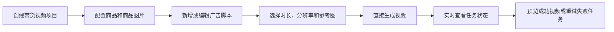
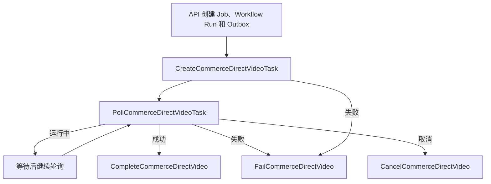

# CineWeave 带货视频直生成开发目标

- 状态：代码实施完成，发布验证中
- 更新时间：2026-07-26
- 适用仓库：`D:\Code\CineWeave`
- 当前源码迁移头：`000066_commerce_direct_video_runtime.sql`
- 当前运行契约：`commerce-direct-video/v1`
- 当前用户路径：商品配置、视频生成、项目设置

本文档是带货视频当前产品和运行时的权威说明。早期的本地化确认、分镜切分、分镜参考图、视频提示词审核、时间线和成片流程不再是带货视频的用户必经步骤，也不得重新出现在主导航或生成入口中。

底层仍遵守以下全局边界：

- API Server 和 Worker 不得调用上游供应商或解密凭据。
- Provider Gateway 负责凭据、模型路由、上游调用、错误归一化、异步任务、媒体转存、调用日志和成本记录。
- Temporal Workflow 负责长任务、重试、取消和终态收敛。
- `packages/openapi/openapi.yaml` 是公开 API 的唯一契约。
- `packages/events/catalog.yaml` 是实时事件的唯一契约。

## 1. 当前决策

1. `projectKind=commerce_video` 是独立业务类型，不复用小说、事件、改编计划、叙事剧本、资产提取或叙事分镜流程。
2. 一个项目只维护一个主商品，可以维护多个有序广告脚本；每个脚本是独立生产单元，对应一个或多个独立视频生成任务。
3. 用户只需要准备商品参考图和广告脚本，然后直接选择时长、分辨率和参考图发起视频生成。
4. 商品配置中的活动图片默认作为每个脚本的视频参考图，主图优先。
5. 用户可以为某个脚本上传自定义图片；自定义图片只属于该脚本，不污染商品公共图片。
6. 用户脚本是视频请求的权威文本，运行时直接以不可变脚本快照作为 `promptSource=user_script`，不经过分镜 Agent、视频提示词 Agent 或审核 Agent 改写。
7. 不要求用户确认语言，不冻结语言策略，不以旁白估算、语言识别或本地化审核阻断生成。
8. 不要求用户选择分镜切分策略，不创建用户可见的分镜、镜头参考图或视频提示词步骤。
9. 可选时长来自项目绑定视频模型的可执行整数时长集合；可选分辨率来自同一路由。只有时长与分辨率是硬路由条件。
10. 任务类型、参考模式、画幅、Prompt 语言、原生音频能力和能力批准状态不得作为带货视频直生成的额外人工审批门禁。
11. 参考图数量和角色仍必须满足实际适配器输入契约，避免提交供应商无法解析的请求。
12. 视频生成是持久化长任务。页面刷新、切换脚本或重新登录后必须恢复真实状态。
13. 取消、失败、成功必须同时收敛业务任务、Workflow Run、Node Run 和 Provider Async Task，不允许页面与后台终态冲突。
14. API Server 创建不可变任务快照，Provider Gateway 在真实调用前校验任务、项目、脚本、生产代、绑定、模型、时长、分辨率和参考图身份。
15. 不创建第二套供应商调用实现，不允许 Commerce Worker 直连 New API、OpenAI 或其他供应商。
16. 当前代码保留部分旧 Commerce API 和事件用于已有历史运行记录与后续清理，但新页面和新任务不得调用旧生产链路。
17. 不重写已存在的迁移；本轮新增前向迁移 `000066`，并保留 `000065_project_deletion_deferred_constraints.sql` 及其回归。

## 2. 产品目标与非目标

### 2.1 产品目标

- 首次使用者无需理解分镜、Prompt、Localization、Render Plan 或模型能力审批。
- 用户在商品配置页上传和管理商品事实及图片。
- 用户在视频生成页创建、编辑、复制、排序和归档多个广告脚本。
- 每个脚本可以独立选择模型支持的时长、分辨率、是否生成音频和参考图。
- 每次生成保存精确脚本、商品、生产配置、模型路由和参考图快照。
- 同一脚本可以保留多次生成历史，成功结果可以预览。
- 自定义参考图有独立上传、预览和归档闭环。
- 生成任务支持幂等提交、长时间轮询、取消、失败重试和刷新恢复。
- 上游真实错误经过 Provider Gateway 归一化后以中文可操作信息展示。

### 2.2 非目标

- 不自动拆分用户脚本。
- 不生成或编辑带货分镜。
- 不先生成商品分镜参考图。
- 不生成和审核独立的视频提示词。
- 不把旁白预计时长作为生成准入条件。
- 不要求用户确认 Agent 判断的语言。
- 不在带货项目中提供时间线编辑和成片合成页面。
- 不支持一个项目同时维护多个主商品。
- 不把不同广告创意伪装成同一脚本的历史版本。
- 不在前端暴露 Provider credential、原始能力 JSON 或内部快照。
- 不为迁移旧演示数据增加兼容分支。

## 3. 用户操作流程



### 3.1 创建项目

创建页只收集：

- 项目名称。
- 项目画幅等基础生产配置。
- 已发布且可用的视频业务模型绑定。

项目创建事务同步建立当前 Production Binding、Commerce Binding 和活动 Production Generation。创建完成后进入商品配置页，不启动语言、本地化、分镜或图片生成工作流。

### 3.2 商品配置

用户维护：

- 商品名称、品牌、核心卖点、禁止改变的外观特征、禁用声明和备注。
- 多张商品参考图。
- 一张主图。

商品图上传完成后写入 Artifact、MediaFile 和 ProductReference。默认视频参考图按照以下顺序选择：

1. 活动主图。
2. 其他活动商品图，按稳定顺序补齐。
3. 不超过当前所选视频路由的图片输入槽位上限。

### 3.3 视频生成

视频生成页采用脚本列表，不展示分镜列表。

用户可以：

- 新增脚本。
- 编辑脚本并创建新版本。
- 复制、排序和归档脚本。
- 为单个脚本上传自定义参考图。
- 查看某个脚本的历史视频任务。
- 按模型支持集合选择时长与分辨率。
- 选择是否请求模型原生音频。
- 选择商品公共图片和脚本自定义图片。
- 直接发起视频生成。
- 取消运行中任务、查看失败原因、重新提交。
- 点击成功结果查看视频。

脚本正文直接进入供应商视频请求。UI 不提供“生成分镜”“生成参考图”“生成视频提示词”“审核提示词”按钮。

### 3.4 项目设置

只保留影响当前直生成链路的设置和项目删除入口。共享生产配置变更仍按 Production Generation 管理，不原地篡改已经创建的历史任务快照。

## 4. 前端信息架构

### 4.1 导航

带货视频项目只显示：

| 导航 | 路由职责 |
| --- | --- |
| 商品配置 | 商品事实、公共商品参考图、主图 |
| 视频生成 | 多脚本管理、自定义参考图、直接视频任务 |
| 项目设置 | 基本信息、生产配置、项目删除 |

旧分镜和成片路由应重定向到视频生成页，不再渲染旧页面。

### 4.2 视频生成页布局

页面使用工作台式列表：

- 顶部：脚本选择、新增脚本和当前可用生成配置。
- 主区：当前脚本内容、参考图选择、时长、分辨率、音频开关和生成按钮。
- 下方：当前脚本的视频任务历史。

每条任务显示：

- 创建时间。
- 时长与分辨率。
- 参考图数量。
- 排队、运行、成功、失败或已取消状态。
- 运行进度。
- 真实可操作错误信息。
- 成功视频预览。

运行中按钮使用转圈图标；不同脚本和任务的按钮状态相互隔离。Realtime 事件到达后只失效相关脚本、任务和活动列表查询。

### 4.3 参考图选择

- 默认选中商品主图和路由允许范围内的其他商品图。
- 用户可取消默认选择。
- 用户可上传脚本专属自定义图。
- 自定义图上传成功后，仅在路由仍有空余槽位时自动选中。
- 超过路由图片槽位上限时立即给出中文提示，不静默截断用户显式选择。
- 时长变化后，分辨率选项只显示同时支持该时长的路由集合。
- 当前组合不存在可执行路由时禁用提交并显示具体原因。

## 5. 领域模型

### 5.1 复用聚合

- `commerce_products`
- `commerce_product_versions`
- `commerce_product_references`
- `commerce_script_units`
- `commerce_ad_script_versions`
- `project_video_production_generations`
- `video_production_bindings`
- `commerce_workflow_bindings`
- `workflow_runs`
- `workflow_node_runs`
- `provider_requests`
- `provider_async_tasks`
- `artifacts`
- `media_files`

### 5.2 脚本自定义参考图

`commerce_script_reference_images` 保存：

- organization、project、product 和 script unit 身份。
- Artifact、MediaFile 和 storage key。
- 文件名、MIME、尺寸、字节数和内容 hash。
- status、revision、创建者与归档时间。

`commerce_script_reference_uploads` 保存幂等上传声明、对象存储 key、过期时间和完成结果。上传完成前不得出现在可选参考图中。

### 5.3 直接视频任务

`commerce_direct_video_jobs` 是一次直接生成的不可变执行根，至少冻结：

- organization、project、product、ProductVersion。
- ScriptUnit、ScriptUnit revision、完整脚本文本和 script hash。
- Production Generation。
- Video Production Binding ID/revision、Profile version/hash。
- Model Profile、Provider Account、Provider Model 和 route key。
- capability snapshot hash 和 variant key。
- 时长、分辨率、画幅、原生音频选项。
- 商品事实快照和 hash。
- execution contract、reference set 和 prompt hash。
- Workflow Run、Node Run、Provider Request/Call/Async Task。
- 输出 Artifact、MediaFile 和 storage key。
- status、attempt generation、错误和终态时间。

`commerce_direct_video_job_references` 保存任务实际使用的有序参考图快照。后续修改、归档或删除商品图和脚本自定义图不得改变历史任务输入。

## 6. 强制领域不变量

1. 一个任务只能属于一个 organization、project、product 和 ScriptUnit。
2. 创建任务时 ScriptUnit 必须为活动状态，并且存在活动脚本版本。
3. 脚本文本必须非空；`script_hash` 与快照内容一致。
4. 任务必须绑定当前活动 Production Generation 和精确 Binding revision。
5. 时长和分辨率必须由同一个可执行视频路由共同支持。
6. 显式参考图必须属于当前项目和当前商品；脚本自定义图还必须属于当前 ScriptUnit。
7. 至少选择一张有效商品或脚本参考图。
8. 参考图数量和角色必须满足适配器输入槽位，超限请求必须在任务创建前拒绝。
9. 同一幂等请求只能创建一个逻辑任务、一个 Workflow Run 和一个 Provider 请求。
10. Worker 不得根据项目当前字段重建任务输入，只能读取任务不可变快照。
11. Provider Gateway 在上游调用前重新校验任务身份和请求 hash。
12. 成功任务必须同时拥有输出 Artifact、MediaFile 和 storage key。
13. 失败任务必须保存规范化错误码与可展示错误信息。
14. 取消和失败终结器必须幂等；重复执行不得重复写终态事件。
15. 已成功任务不得被迟到的失败或取消回调覆盖。
16. 已取消任务不得被迟到的轮询结果恢复为运行中。

## 7. 路由与供应商请求

### 7.1 可用选项

`commerce-direct-video/v1` 从项目冻结的 Provider 路由快照建立候选：

- 收集每个候选的可执行整数时长。
- 收集每个候选的分辨率。
- 保留候选优先级与权重。
- 解析实际 Adapter 输入契约。
- 能力缺少声明时可采用运行时可执行默认输入契约，但不得跳过真实适配器校验。

选择路由时只把以下字段作为硬条件：

- `durationSeconds`
- `resolution`

画幅、原生音频和参考语义用于请求构造及结果提示，不增加人工能力审批。

### 7.2 请求构造

Provider Gateway 请求必须包含：

- `CommerceDirectVideoJobID`
- Production Generation 与 Binding 身份。
- Profile version/hash。
- Provider Model 身份。
- `prompt=scriptSnapshot`
- `promptSource=user_script`
- `duration`
- `resolution`
- `aspectRatio`
- `generateAudio`
- 有序图片 References。
- 幂等键 `commerce-direct-video:{jobId}:create`

Gateway 只在身份、时长、分辨率和实际 Adapter 请求可执行时调用上游。模型能力快照的非关键字段发生变化不得让已经冻结且可执行的任务失效。

## 8. Workflow 与状态机

### 8.1 Temporal 流程



### 8.2 终态规则

- Create/Poll Activity 每次都校验 Job 与 Workflow 身份。
- Poll 必须沿用任务创建时的 Provider credential，不得切换到其他 Key。
- Complete 在提交 Workflow 成功前重新读取 Job，并验证输出已入库。
- Fail 若发现 Job 已成功，必须把 Workflow 收敛为成功而不是覆盖为失败。
- Fail 若发现 Job 已取消，必须把 Workflow 收敛为取消。
- Cancel 在一个数据库事务中更新 Job、Workflow Run 和 Node Run。
- 重复取消不得重复发出 `commerce.direct_video.cancelled`。
- Provider Task 成功但媒体未入库时不得把 Job 标记为成功。
- 页面状态来自持久化 Job 和执行节点，不以一次 HTTP 响应或顶层 Workflow 状态推断。

## 9. Public API

### 9.1 商品

```text
GET    /api/projects/{projectId}/commerce/product
POST   /api/projects/{projectId}/commerce/product
PATCH  /api/projects/{projectId}/commerce/product
GET    /api/projects/{projectId}/commerce/product/versions
GET    /api/projects/{projectId}/commerce/product/references
POST   /api/projects/{projectId}/commerce/product/references/upload-url
POST   /api/projects/{projectId}/commerce/product/references
PATCH  /api/projects/{projectId}/commerce/product/references/{referenceId}
DELETE /api/projects/{projectId}/commerce/product/references/{referenceId}
```

### 9.2 脚本

```text
GET    /api/projects/{projectId}/commerce/script-units
POST   /api/projects/{projectId}/commerce/script-units
GET    /api/projects/{projectId}/commerce/script-units/{scriptUnitId}
PATCH  /api/projects/{projectId}/commerce/script-units/{scriptUnitId}
DELETE /api/projects/{projectId}/commerce/script-units/{scriptUnitId}
GET    /api/projects/{projectId}/commerce/script-units/{scriptUnitId}/versions
POST   /api/projects/{projectId}/commerce/script-units/{scriptUnitId}/versions
POST   /api/projects/{projectId}/commerce/script-units/{scriptUnitId}/versions/{versionId}/activate
```

### 9.3 脚本自定义参考图

```text
GET    /api/projects/{projectId}/commerce/script-units/{scriptUnitId}/references
POST   /api/projects/{projectId}/commerce/script-units/{scriptUnitId}/references/upload-url
POST   /api/projects/{projectId}/commerce/script-units/{scriptUnitId}/references/complete
DELETE /api/projects/{projectId}/commerce/script-units/{scriptUnitId}/references/{referenceId}
```

### 9.4 直接视频

```text
GET  /api/projects/{projectId}/commerce/video-options
GET  /api/projects/{projectId}/commerce/direct-videos
POST /api/projects/{projectId}/commerce/script-units/{scriptUnitId}/direct-videos
GET  /api/projects/{projectId}/commerce/direct-videos/{jobId}
```

创建任务请求：

```json
{
  "durationSeconds": 10,
  "resolution": "1080p",
  "aspectRatio": "9:16",
  "generateAudio": true,
  "references": [
    {"sourceType": "product", "sourceId": "reference-id"},
    {"sourceType": "custom", "sourceId": "custom-reference-id"}
  ]
}
```

服务端忽略客户端提供的模型、供应商、Prompt、Storage Key 或快照 hash，全部根据当前项目绑定和受控资源解析。

## 10. 权限、安全与错误

- 查看选项和任务需要 Workflow read。
- 创建视频任务需要 `workflow.run`。
- 取消视频任务需要 `workflow.cancel`。
- 查看参考图需要 Asset read。
- 上传或归档自定义参考图需要 Asset write。
- 商品和脚本写操作继续使用对应项目权限。
- 所有路径同时校验 organization 与 project，不接受只凭资源 UUID 的跨租户访问。
- Presigned upload 只允许 JPEG、PNG 和 WebP，限制大小、MIME、过期时间和项目 storage key 前缀。
- 前端显示中文错误，不显示 Temporal `activity error` 包装、SQLSTATE、容器 identity 或内部堆栈。
- 上游拒绝原因应保留经过安全处理的具体原因，不统一退化为“供应商拒绝请求”。

## 11. 状态与实时事件

### 11.1 查询失效

新直生成事件应失效：

- 当前项目的 direct video 列表。
- 对应 Job 详情。
- 对应 ScriptUnit 的视频历史。
- 全局任务活动数量与详情。
- 成功时对应 Artifact/Media 预览查询。

事件处理不得让整个页面在活动任务期间持续全量刷新，也不得重置滚动位置、弹窗或当前脚本选择。

### 11.2 事件目录

以下目录必须与 `packages/events/catalog.yaml` 中全部 `commerce.*` 事件完全一致。`commerce.direct_video.*`、`commerce.script_derivation.*` 和 `commerce.script_reference.*` 是当前直生成及脚本裂变路径；其余事件为仍受类型系统约束的历史或内部 Commerce 运行事件，不代表当前用户页面必须暴露旧流程。

```text
commerce.final_video.activated
commerce.final_video.completed
commerce.language.confirmation_required
commerce.language.resolved
commerce.direct_video.cancelled
commerce.direct_video.failed
commerce.direct_video.progressed
commerce.direct_video.started
commerce.direct_video.succeeded
commerce.product.reference.added
commerce.product.reference.archived
commerce.product.reference.updated
commerce.product.updated
commerce.product.version.activated
commerce.product.version.created
commerce.production.final_compose.completed
commerce.production.run.completed
commerce.production.run.cancelled
commerce.production.run.failed
commerce.production.run.partially_succeeded
commerce.project.defaults.updated
commerce.project_generation.activated
commerce.reference_pack.created
commerce.script.localization.activated
commerce.script.localization.approved
commerce.script.localization.created
commerce.script.version.activated
commerce.script.version.created
commerce.script_derivation.batch.cancelled
commerce.script_derivation.batch.cancelling
commerce.script_derivation.batch.created
commerce.script_derivation.batch.failed
commerce.script_derivation.batch.partial_succeeded
commerce.script_derivation.batch.progressed
commerce.script_derivation.batch.started
commerce.script_derivation.batch.succeeded
commerce.script_derivation.item.cancelled
commerce.script_derivation.item.failed
commerce.script_derivation.item.reviewing
commerce.script_derivation.item.started
commerce.script_derivation.item.succeeded
commerce.script_reference.added
commerce.script_reference.archived
commerce.script_unit.archived
commerce.script_unit.created
commerce.script_unit.generation.archived
commerce.script_unit.generation.created
commerce.script_unit.reordered
commerce.script_unit.updated
commerce.setup.completed
commerce.shot.updated
commerce.timeline.updated
commerce.production.video.completed
commerce.production.video_prompt.completed
commerce.shot.image_prompt.failed
commerce.shot.image_prompt.succeeded
commerce.shot.reference_image.failed
commerce.shot.reference_image.succeeded
commerce.shot.video.failed
commerce.shot.video.succeeded
commerce.shot.video_prompt.approved
commerce.shot.video_prompt.failed
commerce.storyboard.plan.activated
commerce.storyboard.plan.cancelled
commerce.storyboard.plan.completed
commerce.storyboard.plan.failed
commerce.storyboard.plan.started
commerce.storyboard.strategy.selected
commerce.storyboard.segmentation.previewed
commerce.storyboard.segmentation.completed
commerce.storyboard.creative.generated
commerce.storyboard.plan.committed
commerce.workflow_binding.created
```

## 12. 数据库迁移与发布

`000066_commerce_direct_video_runtime.sql`：

- 创建脚本自定义参考图表。
- 创建脚本自定义参考图上传表。
- 创建直接视频任务表。
- 创建直接视频任务参考图快照表。
- 放宽脚本单元目标时长为任意正整数；真正可执行时长由 `/commerce/video-options` 返回。
- 提供对应 Down migration。

`000067_commerce_script_derivation.sql`：

- 创建脚本裂变批次、条目、尝试和 Provider 调用溯源表。
- 为脚本位置分配、来源谱系、部分成功、失败重试和取消提供数据库约束。
- 扩展 Commerce Prompt Registry seed，提供结构化裂变生成、审核和修正契约。

`000068_agent_image_attachments.sql`：

- 创建助手图片上传生命周期表和任务附件关联表。
- 图片完成上传后复用现有 Artifact/MediaFile，不在 Agent Task 中保存 Base64。
- 任务冻结附件身份、顺序和最终用途，支持绑定为商品公共参考图或脚本自定义参考图。

迁移必须同步：

- `db/migrations/embed.go`
- `internal/dbmigrate/runner_test.go`
- `db/baselines/current/consolidated-up.sql`
- `db/baselines/current/manifest.json`

不得改写 `000068` 或更早迁移；后续结构调整使用新的前向迁移。部署前必须按 `AGENTS.md` 的生产发布清单检查活动 Workflow、Provider Task、数据库备份、迁移头、Seed、镜像和 Temporal Build ID。

## 13. 测试与验收

### 13.1 后端

- 无商品主图时不能创建任务。
- 无活动脚本版本时不能创建任务。
- 时长与分辨率必须由同一路由支持。
- 路由缺少非关键能力声明时不要求批准。
- 显式选择参考图超过槽位时返回中文可操作错误，不静默截断。
- 默认参考图主图优先并稳定排序。
- 脚本、商品、绑定、模型和参考图快照可从 Job 完整追溯。
- Provider Gateway 在上游 HTTP 前拒绝身份或 hash 不匹配。
- Poll 使用创建任务时的 credential。
- 成功媒体入库后才提交 Job/Workflow 成功。
- 失败和取消终结器幂等。
- 成功 Job 不被迟到失败覆盖。
- 重复取消只写一个取消事件。
- 项目硬删除回归继续通过，不破坏 `000065`。

### 13.2 前端

- 带货导航只显示商品配置、视频生成、项目设置。
- 旧分镜/成片路由跳转到视频生成。
- 多脚本可独立编辑和生成。
- 商品图默认选中，自定义图按脚本隔离。
- 时长切换后只显示匹配分辨率。
- 参考图超限不能提交且不会静默丢失选择。
- 每个 Job 独立显示运行态，不锁死其他脚本或任务。
- Realtime 更新任务状态，无需手工刷新。
- 成功视频可预览，弹窗关闭不重置页面滚动位置。

### 13.3 自动化命令

```powershell
go test ./internal/commerce ./internal/provider ./internal/workflows ./internal/api -count=1
pwsh -NoProfile -File scripts/test-runtime-hardening.ps1 -CommerceOnly
pwsh -NoProfile -File scripts/test-runtime-hardening.ps1 -ProjectDeletionOnly
python scripts/check-commerce-development-contract.py
go run ./cmd/cineweave-migration-bundle verify
pnpm run test
pnpm --filter @cineweave/web build
git diff --check
```

## 14. 后续清理

当前直生成链路稳定发布并确认没有旧 Commerce Workflow 在运行后，再单独执行旧链路清理：

1. 清点仍在运行或需要审计展示的旧 Setup、Localization、Storyboard、Prompt、Timeline 和 Final Video 数据。
2. 移除未再被前端、Agent、Workflow 或外部 API 使用的旧 Commerce 路由。
3. 从事件目录移除事件前，先删除所有静态 emit、前端 invalidation 和历史解析依赖。
4. 使用新的前向迁移删除确认无用的表、约束和索引，不改写历史迁移。
5. 更新 OpenAPI、事件生成物、基线、测试和发布文档。

旧链路清理不是本轮直生成上线的前置条件，但任何新功能不得继续依赖旧分镜生产路径。
