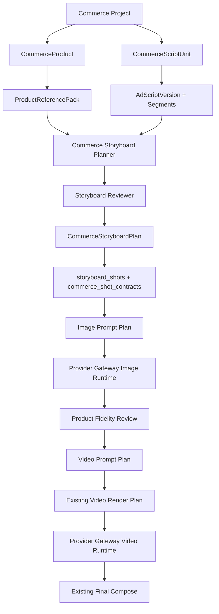

# CineWeave 带货视频项目开发目标文档

- 状态：代码实施完成，发布验证中
- 更新时间：2026-07-23
- 适用仓库：`D:\Code\CineWeave`
- 当前代码迁移头：`000057_commerce_script_contracts_and_unit_rebuilds.sql`
- 当前主环境已部署迁移：`000001-000044`；`000045-000057` 仅在隔离 PostgreSQL 完成验证，尚未应用到主环境
- 适用范围：项目创建、商品素材、广告脚本、多语言本地化、分镜参考图、视频提示词、镜头视频、成片、任务活动和项目助手

本文档定义 CineWeave 新项目类型“带货视频”的产品流程、领域模型、前端界面、API、工作流、Prompt Contract、状态机、实施顺序和验收标准。

带货视频不是“广告”字符串加一套默认 Prompt，也不是现有小说/剧本生产链路的特殊分支。它必须作为独立的项目业务类型实现，同时复用 CineWeave 已有的 Provider Gateway、媒体存储、工作流执行、镜头视频 Render Plan、任务活动和成片能力。

相关文档：

- `docs/video-production-workflow-continuity-refactor-target.md`：继续负责底层视频生产 Profile、镜头锚点、参考包、Render Plan 和 Generation Fence。
- `docs/provider-gateway.md`：继续负责凭据、模型选择、上游调用、错误归一化、调用日志和成本记录。
- `docs/workflow-engine.md`：继续负责 Temporal、checkpoint、取消、重试和恢复。
- `docs/release-readiness.md`：继续负责依赖、迁移、镜像和发布门禁。
- `docs/commerce-video-implementation-audit.md`：记录 A1-E6 的实现证据、自动化结果和仍需授权的发布验收。
- `packages/openapi/openapi.yaml`：所有新增公开 API 的唯一契约入口。

当其他文档与本文档在“带货视频用户流程、商品领域模型、广告脚本、带货分镜”方面冲突时，以本文档为准。底层视频执行和供应商边界仍以上述现有架构文档为准。

## 1. 结论先行

1. 新增不可变项目业务类型 `projectKind=commerce_video`，现有项目统一归类为 `narrative`。
2. `projectKind` 是业务路由的权威字段。创建 commerce 项目时服务端固定派生稳定机器值 `projectType=commerce_video`、`contentType=NULL`，客户端不得提交相互独立的类型组合；中文名称只在展示层映射。
3. 带货视频不复用小说、事件、改编计划、叙事 `script_episode`、角色/场景/道具资产提取链路；它使用独立 `CommerceScriptUnit` 实现与短剧分集一致的多脚本管理体验。
4. 带货视频采用“一项目一主产品、多有序脚本单元”；多产品组合不在 MVP 内，但同一产品可以像短剧分集一样维护和生产多个完全不同的广告脚本。
5. 每个 `CommerceScriptUnit` 对应一个独立可交付视频，拥有自己的脚本版本、唯一目标语言、时长、Localization、分镜、任务、镜头视频和成片，不得把不同脚本伪装成同一脚本的历史版本；同一创意需要其他语言时，通过“创建语言版本”生成具有关联 provenance 的新脚本单元。
6. 用户创建项目时只需上传产品图片、填写第一个广告脚本并选择时长、语言与画幅，系统隐藏导演手册、视觉手册和底层视频生产 Profile。
7. 创建页主按钮为“创建并生成分镜方案”，整个创建过程由持久化 `CommerceSetupSession` 和客户端幂等键承载，支持刷新、断点续传和安全重试。
8. 用户可见流程固定为：商品与脚本、分镜方案、视频制作、成片；后三个页面都以脚本单元为一级筛选维度，一次只展示一个单元的生产数据。
9. 商品图片建立版本化 `ProductReferencePack`，所有分镜参考图和视频执行均保存精确引用包及 hash；商品原图可跨脚本单元共享，冻结 Pack 不共享可变状态。
10. 广告脚本是权威业务内容；Agent 只负责结构化和镜头规划，不得擅自增加产品功效、价格、承诺或不存在的卖点。
11. 视频语言采用 `explicit/auto` 两种模式并使用 BCP 47 locale。语言、目标时长和目标平台属于脚本单元配置；用户明确选择绝对优先，`auto` 低置信度必须先让用户确认。
12. 原始脚本与目标语言脚本分版本保存。跨语言本地化必须逐段追溯到原文，Localization Reviewer 必须阻止新增、弱化或误译产品声明。
13. 项目继续只有一个活动 `project_video_production_generation`，保存共享画幅、模型/Profile 和音频策略；Commerce Workflow Binding 必须强引用该 Generation 使用的现有 Video Production Binding，二者由同一事务激活，不能成为两套可独立漂移的配置事实源。
14. 每个脚本单元在活动项目代下拥有独立 `CommerceScriptUnitGeneration`，单元重建不得归档其他单元；项目级换代必须先完成所有活动单元预检，再以全有或全无方式切换。
15. 分镜参考图、视频提示词和视频任务按镜头独立持久化、独立重试，任一镜头失败不得使已成功镜头或其他脚本单元回滚。
16. 旁白、屏幕文字、音效、音乐提示和视觉 Prompt 必须分字段保存，禁止把音效或屏幕文字混入角色台词。
17. 屏幕文字、价格、优惠和 CTA 默认由后期合成，不要求图片或视频模型生成准确文字。
18. 带货镜头继续落到通用 `storyboard_shots`，使用独立 `commerce_storyboard_plans` 和一对一 `commerce_shot_contracts` 保存带货语义。
19. 每条 commerce 时间线和成片必须直接绑定 ScriptUnit 与 UnitGeneration，不能依赖项目级 `active_final_video_version_id`，也不能只用松散映射表补身份。
20. 底层视频执行继续使用 `video_render_plans`、`video_render_segments` 和 Provider Gateway，不复制第二套视频运行时。
21. MVP 使用已可用的 `single_frame_i2v` Profile：商品参考图先生成权威分镜首帧，再以首帧生成视频。
22. commerce 项目必须绑定不可变的业务工作流模板版本；模板保存默认配置、Prompt 版本、支持语言、语言时长策略、全部 Agent/图片/视频模型绑定快照、能力要求和底层 Profile 版本，运行时不得读取漂移的“当前默认值”。
23. 创建页先做绑定与请求可执行性预检，Setup commit 和付费批次再次校验。图片生成仍校验参考图数量和请求格式；视频模型只把目标时长与分辨率作为路由硬条件。任务类型、参考模式、画幅、Prompt 语言和原生音频能力只参与候选排序、请求构造与结果提示，不因未知、推断或未批准而阻断，也不设置人工能力审批步骤。
24. 当多模态 Profile 可用后，可以通过新的业务模板版本把原始商品参考图加入视频 Reference Pack，不改变用户页面和领域模型。
25. 所有 Agent 生成和审核最多允许 3 轮，审核拒绝必须把结构化意见返回生成 Agent，不得无限重试。
26. 项目助手需要增加带货视频工具，但仍受 RBAC、批准模式、Generation Fence 和工作流等待规则约束。
27. API Server 和 Worker 不得直接调用供应商或解密凭据，所有 AI 调用继续经过 Provider Gateway。
28. 不修改或重写已部署的 `000001-000044`；新实现从 `000045` 开始，并同步更新 consolidated baseline。

## 2. 产品目标与非目标

### 2.1 产品目标

- 让普通用户在一个页面内完成商品图片和广告脚本准备。
- 用户不理解模型、Prompt、参考图契约或 Workflow 也能完成视频制作。
- 用户始终知道下一步要做什么，主要页面只出现一个主要操作。
- 商品包装、颜色、外形和品牌元素在分镜参考图中可追溯到用户上传图片。
- 广告脚本中的旁白、卖点、屏幕文字和 CTA 能完整映射到镜头。
- 用户可以明确指定视频语言，或让 Agent 判断语言；最终语言在生产前可见、可确认并进入不可变快照。
- 跨语言视频保留原始卖点、数字、品牌名和 CTA 语义，同时使用目标语言的旁白时长与字幕排版规则。
- 生成任务支持并发、部分完成、失败重试、取消和页面刷新恢复。
- 用户修改商品图或脚本后，下游过期状态必须真实、可解释、可重建。
- 用户可以在同一项目内创建、复制、排序、归档和独立生产多个脚本单元，并批量查看各单元进度。
- 复用现有视频生产基础设施，避免维护两套 Provider 和媒体链路。

### 2.2 非目标

- MVP 不支持一个项目同时主推多个商品。
- MVP 不把多个脚本单元自动拼成一个长视频；每个单元默认生成独立成片，跨单元合辑属于后续能力。
- MVP 不提供复杂电商商品库、SKU、库存、订单或店铺管理。
- MVP 不自动抓取第三方商品详情页。
- MVP 不保证生成模型能够在画面内准确生成品牌文字、价格和优惠数字。
- MVP 不实现完整广告法审核服务；
- MVP 不要求用户选择导演手册、视觉手册或底层视频输入 Profile。
- MVP 不把产品拆成角色、场景或道具 canonical asset。
- MVP 不通过伪造 `script_episode` 或空剧本来兼容叙事工作流。
- MVP 不在浏览器内存中承载批量任务状态。
- MVP 不允许前端任意构造 ProductReferencePack；Pack 只能由领域服务根据已确认输入冻结。
- MVP 不为了满足目标时长而静默压缩、删除或改写用户广告脚本。
- MVP 不宣称支持模板、字体、Timing Policy 或目标模型尚未验证的任意语言；前端只展示当前已发布模板实际可执行的 locale。

## 3. 核心术语

| 术语 | 定义 |
| --- | --- |
| `ProjectKind` | 项目业务流程类型，首批为 `narrative` 和 `commerce_video` |
| `CommerceWorkflowTemplateVersion` | 不可变业务流程模板版本，保存默认配置、Prompt 绑定和模型能力契约 |
| `CommerceWorkflowBinding` | 项目对模板版本和 Production Profile revision 的不可变绑定快照 |
| `CommerceSetupSession` | 一键创建流程的持久化、可恢复、幂等状态机 |
| `CommerceProduct` | 带货项目的主产品事实记录 |
| `CommerceProductVersion` | 商品名称、品牌、卖点、外形约束和禁止声明的不可变版本 |
| `ProductReference` | 用户上传的某张商品参考图片及其语义角色 |
| `ProductReferencePack` | 一次生产使用的不可变商品图片快照及 hash |
| `CommerceScriptUnit` | 类似短剧分集的有序广告脚本生产单元，一单元对应一个独立成片 |
| `CommerceAdScriptVersion` | 不可变广告脚本版本及结构化解析结果 |
| `CommerceLanguageResolution` | 用户指定或 Agent 判断得到的源语言、目标语言、置信度和依据 |
| `CommerceAdScriptLocalization` | 某个原始脚本版本面向目标 locale 的不可变本地化版本 |
| `CommerceScriptUnitGeneration` | 某脚本单元在项目 Production Generation 下的独立生产代 |
| `CommerceStoryboardPlan` | 某个脚本版本和参考包生成的带货分镜方案 |
| `CommerceShotContract` | 一个镜头的销售目的、画面、旁白、屏幕文字和商品引用契约 |
| `CommerceProductionRun` | 一次分镜、参考图、提示词、视频或成片生产批次 |
| `CommerceProductionSubject` | 批次项操作的稳定主体，可为计划阶段、候选镜头、正式镜头或成片 |
| `ProductFidelityReview` | 对商品外观、包装、颜色和引用一致性的审核结果 |
| `SalesBeat` | 开场钩子、需求痛点、核心卖点、使用演示、效果证明或购买引导 |

## 4. 用户操作流程


### 4.1 最短成功路径

1. 用户进入新建项目页面并选择“带货视频”。
2. 用户输入项目名称和产品名称。
3. 用户拖入 3–8 张商品图片并指定主图。
4. 用户粘贴或编写广告脚本。
5. 用户选择目标语言，或保留“自动判断”；明确选择时 Agent 不得覆盖，自动判断置信度不足时先暂停并确认。
6. 页面按目标 locale 对应的 Timing Policy 显示预计旁白时长；超出目标时长时要求用户延长时长、手工修改或确认使用 Agent 建议，不静默截断。
7. 用户保留默认 30 秒、9:16，点击“创建并生成分镜方案”。
8. 系统创建第 1 个 `CommerceScriptUnit`，以同一个 `clientRequestId` 创建或恢复 Setup Session 并启动唯一 Setup Workflow；Workflow 自动完成语言判断、本地化和审核，必要时向用户提问，随后冻结模板、产品、图片和脚本输入并启动该单元的分镜子任务。
9. 分镜完成后，用户检查镜头列表，点击“生成全部参考图”。
10. 参考图完成后，系统生成并审核视频提示词。
11. 用户点击“生成视频”，系统并发执行各镜头。
12. 全部或部分镜头完成后，用户可预览、重试失败项并合成成片。

### 4.2 修改后的状态传导

| 用户修改 | 必须过期的数据 | 保留的数据 |
| --- | --- | --- |
| 确认激活新的商品事实版本 | 受影响单元旧 ProductReferencePack/UnitGeneration 下的分镜、参考图、Prompt、视频、时间线和成片 | 旧 ProductVersion、旧 Pack、原始上传图片、脚本及历史产物 |
| 增加尚未被新 Pack 采用的产品图 | 无；仅影响后续显式重建 | 当前 ProductVersion、既有 Pack 和全部历史产物 |
| 归档或更换活动 Pack 使用的产品图 | 影响分析列出的单元从新 ReferencePack/UnitGeneration 开始重建 | 旧 Pack、媒体对象、商品和脚本版本历史 |
| 修改某脚本单元的广告脚本 | 仅该单元的 Localization、Unit Generation、分镜方案及全部下游产物 | 产品、图片、其他脚本单元及其产物 |
| 修改某脚本单元的目标语言、时长或自动判断结果 | 仅该单元的 Localization、Timing Analysis、Unit Generation、分镜方案及全部下游产物 | 原始脚本、产品、图片和其他脚本单元 |
| 新增、复制或排序脚本单元 | 新单元尚未生产；排序只改变项目展示顺序 | 已有单元及全部产物 |
| 归档脚本单元 | 该单元不再出现在默认列表或新批次中 | 该单元历史版本和媒体、其他单元 |
| 修改某个镜头画面 | 该镜头参考图、视频 Prompt、Render Plan、视频、成片 | 其他镜头及其成功产物 |
| 修改旁白，且使用模型原生音频 | 该镜头视频 Prompt、Render Plan、视频、成片 | 已审核分镜参考图，除非画面也变化 |
| 修改旁白，且使用未来 TTS/独立音轨 | 旁白音轨、时间线、成片 | 参考图、视频 Prompt 和无声视频 |
| 修改屏幕文字、价格或 CTA | 字幕/叠加层、时间线、成片 | 参考图、视频 Prompt 和镜头视频 |
| 修改项目画幅、模型/Profile 或音频策略 | 新项目 Production Generation 下所有活动脚本单元需要各自重建分镜及下游 | 产品、图片、所有脚本版本和 Localization 历史 |

### 4.3 后续脚本单元流程

项目创建完成后，用户可以持续添加脚本单元：

1. 点击“新增脚本”，选择空白创建、复制现有脚本或让 Agent 基于产品事实提出新创意。
2. 填写单元标题、脚本、目标语言、目标时长和目标平台；画幅、模型/Profile 与音频策略默认继承项目当前对齐的 Commerce/Video Bindings。
3. 保存后只启动该单元的 `CommerceScriptUnitPreparationWorkflow`，不会重跑其他单元。
4. 单元完成后立即出现在分镜、视频和成片页面的一级筛选器中。
5. 用户可选择多个脚本单元批量推进到下一阶段；每个单元仍拥有独立 Run、失败重试、取消和成片。

每个 ScriptUnit 只对应一个目标 locale。用户需要把同一创意输出为其他语言时，使用“创建语言版本”：系统创建新的 `CommerceScriptUnit` 和首个源脚本版本，写入 `derived_from_script_unit_id`、`derivation_kind=language_variant` 和目标 locale。普通复制使用 `derivation_kind=copy`，Agent 新创意使用 `derivation_kind=agent_idea`。这些单元只共享来源 provenance，不共享可变脚本、Localization、分镜、UnitGeneration 或生产状态。

## 5. 前端信息架构

### 5.1 视觉与交互原则

视觉主张：商品图片是页面最强视觉信号，界面保持中性、紧凑和工作台化，不使用营销落地页式 Hero 或装饰性卡片堆叠。

交互主张：通过单一主要操作、渐进式披露和实时任务状态降低用户决策成本；高级模型和 Prompt 信息只在详情抽屉中出现。

所有带货项目页面必须满足：

- 顶部导航和主侧边栏固定，只有工作区内容滚动。
- 每个页面最多一个高强调主要按钮。
- 运行中按钮显示转圈图标并保持当前镜头级状态可见。
- 批量任务进入“任务活动”，页面切换或刷新后仍能恢复进度。
- Setup 任务按“判断语言、本地化、审核、时长检查、能力检查、生成分镜”逐步实时显示；等待语言确认时直接展示 Agent 候选项和自定义语言选择。
- 部分失败显示“部分完成”和“重试失败项”，不得把整个批次误报为失败。
- 状态、错误、销售节奏和引用角色均通过集中中文映射显示。
- 普通界面不显示 raw JSON、Prompt hash、Provider Call ID 或内部枚举。

### 5.2 新建项目页面

现有自由下拉框改为项目类型卡片：

- 短片
- 漫剧
- 品牌广告
- 角色 IP
- 带货视频
- 其他

现有“广告”统一重命名为“品牌广告”，继续属于 `projectKind=narrative`；“带货视频”是独立的 `projectKind=commerce_video`，两者不得共享类型值或路由判断。

语言选择器显示模板已发布的 locale，并使用中文名称展示、BCP 47 tag 入库。原生音频能力作为可用性提示而不是创建门禁；Setup Workflow 仍需重新校验冻结模型绑定以及视频时长、分辨率，防止用户选择后管理员修改模型绑定。

选择“带货视频”后，表单切换为专用模式：

| 区域 | 字段与行为 |
| --- | --- |
| 基本信息 | 项目名称、产品名称；项目名可由产品名自动带出 |
| 产品图片 | 拖拽多图上传、缩略图排序、指定主图、删除；建议 3–8 张 |
| 广告脚本 | 大文本编辑器，支持粘贴、字数和按目标语言计算的预计旁白时长 |
| 快速设置 | 视频时长 15/30/60 秒；画幅默认 9:16；视频语言默认自动判断，可选择模板支持的 locale |
| 高级设置 | 目标平台、图片质量、音频策略和模型绑定，只在展开后显示 |
| 主操作 | `创建并生成分镜方案` |

带货模式不显示：

- 内容类型
- 小说改编或分镜先行
- 导演手册
- 视觉手册
- 四种底层视频生产方式

前端提交采用可恢复的多步骤事务体验：

1. 页面首次进入时生成稳定 `clientRequestId`，刷新后从本地草稿恢复，服务端以组织和该 ID 唯一识别 Setup Session。
2. 创建或恢复 draft commerce project 和 `CommerceSetupSession`；相同幂等键只能返回同一项目。
3. 创建产品记录；每次保存携带 `expectedRevision`。
4. 逐张上传图片；每张图片使用独立 idempotency key、内容 hash 和上传完成确认。
5. 创建广告脚本及首个版本，保存 `languageMode`；显式模式保存用户目标 locale，自动模式保持待解析。
6. 调用幂等 `setup complete`，通过事务 outbox 启动唯一 Setup Workflow。
7. Setup Workflow 创建 Language Resolution 和 Localization；自动判断置信度不足时进入 `waiting_user_confirmation`，前端展示 Agent 问题和候选项，用户确认后通过 Signal 继续。
8. 本地化审核、目标 locale 时长分析、模型绑定完整性和视频时长/分辨率校验通过后，Workflow 在事务内创建 Workflow Binding/Production Generation、冻结 Localization 与 ProductReferencePack，并启动唯一分镜子 Workflow。
9. 任一步失败时 Session 记录失败步骤和已创建资源，用户可继续、重试或放弃草稿，不静默创建重复项目和 Workflow。

脚本超过目标时长时，主按钮不得直接启动生产。页面必须提供三种明确处理：

- 增加目标时长。
- 用户手工精简脚本。
- 让 Agent 生成精简建议；只有用户确认后才创建新脚本版本。

低保真结构：

```text
┌ 新建项目 ──────────────────────────────────────────────────────┐
│ 项目类型  [短片] [漫剧] [品牌广告] [角色 IP]                 │
│           [带货视频 ✓] [其他]                                │
│                                                               │
│ 项目名称 [夏季防晒喷雾带货视频]   产品名称 [防晒喷雾]         │
│                                                               │
│ 产品图片                                                      │
│ [主图] [包装正面] [细节] [使用场景] [+ 添加图片]              │
│                                                               │
│ 广告脚本                                                      │
│ ┌───────────────────────────────────────────────────────────┐ │
│ │ 用户直接输入或粘贴完整广告脚本                            │ │
│ └───────────────────────────────────────────────────────────┘ │
│                                                               │
│ 语言 [自动判断 ✓] [简体中文] [English] [更多]               │
│ 时长 [15秒] [30秒 ✓] [60秒]    比例 [9:16 ✓] [16:9] [1:1]   │
│ [高级设置 ▾]                              [创建并生成分镜方案] │
└───────────────────────────────────────────────────────────────┘
```

### 5.3 项目导航

项目布局必须先读取 `projectKind`，再选择导航配置。

叙事项目保持当前导航；带货视频导航为：

```text
项目概览 | 商品与脚本 | 分镜方案 | 视频制作 | 成片 | 项目设置
```

建议路由：

```text
/projects/{projectId}
/projects/{projectId}/commerce/materials
/projects/{projectId}/commerce/storyboard
/projects/{projectId}/commerce/video
/projects/{projectId}/final
/projects/{projectId}/settings
```

带货项目访问 `/content`、`/scripts`、`/assets` 等叙事路由时，前端重定向到带货概览，后端相关写接口返回 `PROJECT_KIND_MISMATCH`。

### 5.4 带货项目概览

顶部项目摘要：

- 产品主图
- 产品名称
- 画幅
- 活动脚本单元数量
- 当前整体状态

中部使用 cursor 分页和虚拟化显示有序脚本单元卡片，每个单元独立展示：unit_no、标题、语言、目标时长、当前阶段、失败数量和成片状态。用户选中一个单元后，下方按需查询该单元完整状态并显示纵向流程轨道：

```text
商品素材 → 广告脚本 → 分镜方案 → 镜头视频 → 成片
```

每个阶段只显示当前单元的状态、数量和失败数量。页面中心始终只有一个针对当前单元的下一步按钮；项目级主要操作是“新增脚本”：

- `补充产品图片`
- `完善广告脚本`
- `生成分镜方案`
- `生成缺失参考图`
- `生成视频提示词`
- `生成镜头视频`
- `重试 2 个失败镜头`
- `合成成片`

不得在概览页复制完整编辑器、Prompt 或任务日志。

低保真结构：

```text
┌ 产品主图 ┐  防晒喷雾夏季推广         9:16 · 3 个脚本 · 制作中
└──────────┘

脚本单元
[01 痛点切入 · 英语 · 30秒 · 视频 4/8]  ← 当前
[02 使用演示 · 中文 · 15秒 · 分镜完成]
[03 限时促销 · 日语 · 30秒 · 待生成]                 [新增脚本]

● 商品素材完成
│  5 张图片，主图已设置
● 广告脚本完成
│  脚本 01，英语（用户指定），版本 3，预计旁白 28 秒
● 分镜方案完成
│  8 个镜头，1 个镜头待确认
◌ 镜头视频进行中
│  已完成 4 / 8，失败 1
○ 成片待生成

                         [重试 1 个失败镜头]
```

### 5.5 商品与脚本页面

页面上半部分为商品区：

- 左侧显示产品主图大预览和图片缩略图条。
- 右侧显示产品名称、品牌、核心卖点、禁止改变的包装特征和备注。
- 图片可标记为：主图、包装正面、包装背面、细节、使用场景、品牌标识、其他。
- 支持上传、删除、排序、设为主图和查看大图。
- 系统显示图片质量检查结果，但不在图片上传时自动裁切原图。

页面下半部分为脚本单元区，交互参考叙事项目分集但使用独立 commerce API：

- 顶部显示“新增脚本”、批量选择、复制、归档、排序和针对所选单元的批量生产操作。
- 默认按 `sort_order` 显示紧凑脚本卡片，支持拖拽排序；排序只影响展示，不改变不可变 `unit_no`、Workflow 身份或已生成视频时间线。
- 卡片显示不可变单元编号、标题、脚本摘要、目标语言、目标时长、当前版本、当前生产阶段、失败数和成片状态。
- 点击卡片打开脚本详情 Dialog，不在列表旁常驻第二/第三栏。
- Dialog 内提供全宽原文编辑器、版本历史、本地化对照、语言/时长/平台设置和影响确认。
- 自动保存草稿，显式按钮创建新版本；`智能整理`只修正段落、标点和结构，不擅自增加或删除卖点。
- 显示预计旁白时长与目标时长差异、语言来源和 Agent 置信度。
- 目标语言不同于原文时，提供原文与本地化版本对照；用户修改本地化文本时创建新版本，不覆盖原文。
- `auto` 低置信度、混合语言或不受支持 locale 必须显示选择器并阻止当前单元生产，不阻断其他单元。
- 保存后如影响下游，只展示当前单元影响范围并要求确认，不直接覆盖活动分镜。
- 新建支持“空白脚本”“复制当前脚本”“创建语言版本”“Agent 提出新创意”四种方式；Agent 建议必须由用户确认后才创建脚本单元。

### 5.6 分镜方案页面

分镜页顶部使用脚本单元选择器，交互类似叙事分集筛选，但查询和状态完全按 `commerceScriptUnitId` 隔离。页面最多显示一个脚本单元的活动方案和镜头列表，不把多个单元镜头拼在同一滚动区。

顶部工具栏：

- 不可变脚本单元编号、标题、语言和目标时长
- 方案版本
- 预计总时长
- 镜头数量
- 批量选择
- `生成缺失参考图`
- `重试失败项`

每个镜头使用紧凑横向卡片：

| 区域 | 内容 |
| --- | --- |
| 左侧 | 分镜参考图、镜头号、时长、图片状态 |
| 中部 | 销售节奏、画面动作、商品展示方式、旁白、屏幕文字 |
| 右侧 | 审核状态、编辑、生成/重生成参考图、更多菜单 |

销售节奏固定中文标签：

- 开场钩子 `hook`
- 需求痛点 `problem`
- 核心卖点 `benefit`
- 使用演示 `demonstration`
- 效果证明 `proof`
- 购买引导 `cta`

点击镜头打开详情弹窗：

- 修改画面动作、旁白、屏幕文字、时长和商品图片引用。
- 查看当前参考图、历史版本和生成错误。
- 普通模式显示“视觉描述”；高级区才显示图片 Prompt、Prompt 版本和 Provider provenance。
- 大图预览是独立顶层 Dialog，关闭大图不能连带关闭镜头详情。

### 5.7 视频制作页面

顶部使用与分镜页一致的脚本单元选择器，显示当前单元方案和视频完成进度；镜头按单元内顺序展示，页面最多加载一个单元。

每个镜头显示：

- 分镜参考图
- 当前视频预览
- 旁白摘要
- 视频提示词审核状态
- Render Plan 状态
- 视频任务状态
- 单镜头生成、重试、取消和详情入口

批量行为：

- `生成缺失视频提示词`
- `生成全部可执行视频`
- `重试失败视频`
- `取消运行中任务`

批量生成视频不得重新运行已有、已审核且未 stale 的提示词 Agent。视频执行阶段只消费冻结的 Prompt Plan 和 Reference Pack。

### 5.8 成片页面

成片页先显示脚本单元成片列表，每个单元独立拥有当前成片、历史版本、预览和下载。选择一个单元后复用现有最终成片能力并提供简化时间线：

- 镜头顺序
- 镜头启用/禁用
- 屏幕文字覆盖层
- CTA 尾卡
- 背景音乐和旁白轨道状态
- 成片版本、预览和下载

屏幕文字、价格、折扣、二维码和 CTA 尾卡采用确定性后期合成，不写入图片或视频生成 Prompt。

后期文字渲染使用目标 locale 对应的字体栈、文本方向、分词换行和数字格式。模板未配置字体或 RTL 排版能力的 locale 不得出现在可选列表；字体文件和许可证必须随部署产物固定版本，避免不同 Worker 渲染结果漂移。

MVP 不提供“把所有脚本单元合并为一条长视频”的按钮。单元归档后默认成片列表隐藏，但历史成片、成本和 provenance 保留。

### 5.9 项目设置

带货项目设置分为：

- 基本信息：项目名、简介。
- 项目输出设置：画幅、帧率、图片质量，所有脚本单元共享。
- 新脚本默认值：默认目标时长、默认目标平台、`自动判断` 或明确目标 locale；只影响之后创建的脚本单元。
- 音频设置：原生音频、静音视频、未来 TTS 后配音。
- 模型设置：图片和视频业务模型，默认折叠。
- 危险操作：归档项目。

修改画幅、帧率、图片质量、模型/Profile 或音频策略必须先展示受影响脚本单元、预计需重建的分镜和当前可保留产物，再由用户确认项目级换代。系统创建新 Production Generation，并为所有活动脚本单元分别创建新 Unit Generation；任一预检失败或用户取消时，旧 Video/Commerce Bindings、项目代和全部单元代继续保持 active。切换成功后只把各单元置为“需要重建分镜”，不自动生成图片或视频。修改“新脚本默认值”不影响已有单元；已有单元的语言、时长和平台在脚本详情中修改，只重建该单元。视觉 hash 完全一致的参考图可由重建器显式复用，不能按脚本序号或镜头号猜测复用。

## 6. 领域模型

### 6.1 项目类型

在 `projects` 增加：

| 字段 | 类型 | 规则 |
| --- | --- | --- |
| `project_kind` | text | `narrative` 或 `commerce_video`，NOT NULL |

强制规则：

- 创建后不可修改。
- 现有项目在迁移中一次性写为 `narrative`，不保留运行时兼容判断。
- `project_type` 继续作为稳定机器细分类，由服务端根据 typed request 派生，不能与 `project_kind` 独立提交；数据库和 API 不保存中文展示文案。
- `narrative` 可使用 `short_film/comic_drama/brand_ad/character_ip/other` 等机器值，并由 `labels.ts` 映射为短片、漫剧、品牌广告、角色 IP、其他；`content_type` 同样使用既有稳定机器枚举。
- `commerce_video` 必须满足 `project_type='commerce_video' AND content_type IS NULL`。
- `000045` 一次性规范化当前开发库中的中文 project type 值；项目仍处于开发阶段，不保留双值兼容分支。
- 数据库通过 CHECK constraint 和不可变 trigger 同时约束上述矩阵；API 只接受 `projectKind`，不接受客户端覆盖派生字段。
- 服务端按 `project_kind` 选择领域服务、路由能力和 ProductionStatus 计算器。

### 6.2 业务模板、项目绑定与 Setup Session

业务工作流不能只存在于 Workflow 常量或前端默认值中。新增：

- `commerce_workflow_templates`
- `commerce_workflow_template_versions`
- `project_commerce_workflow_bindings`
- `commerce_setup_sessions`

`commerce_workflow_templates` 保存稳定 `template_key`、名称和 `draft/published/retired` 生命周期。模板版本一经发布不可修改，至少包含：

| 字段 | 说明 |
| --- | --- |
| `template_id/version` | 稳定模板及单调版本号 |
| `configuration_snapshot` | 共享画幅、帧率、音频、并发、审核轮数，以及新脚本默认时长/语言/平台和自动重试预算 |
| `prompt_bindings` | 每个 commerce Agent 的精确 Prompt version ID 和 hash |
| `agent_model_contracts` | 每个 Agent 角色使用的业务模型 Profile key、模态和语言/多模态能力要求 |
| `language_contract` | 支持的 BCP 47 locale、默认模式、各 locale Timing Policy、字体和文本方向 |
| `image_capability_contract` | 参考图数量、编辑/多图请求方式、画幅、质量、分辨率和 Prompt 上限 |
| `video_capability_contract` | 输入模式、时长、参考图、Prompt 语言、原生音频语言、画幅和异步任务要求 |
| `video_production_profile_version_id` | 精确底层视频 Profile 版本 |
| `content_hash/status` | 内容 hash 与 `draft/published/retired` 状态 |

`project_commerce_workflow_bindings` 保存项目的不可变生产配置快照：

- `project_id/template_version_id/binding_revision`
- `video_production_binding_id/video_profile_snapshot_hash`
- `configuration_snapshot/configuration_hash`
- 共享画幅、帧率、图片质量、音频策略及新脚本默认值
- 每个文本 Agent、图片生成、图片审核、视频生成使用的 Profile key、model profile binding ID/revision 和候选路由快照
- 每个模型路由对应的 capability snapshot ID/hash、来源和置信度；运行时不要求人工批准
- 创建人和创建时间

现有 `project_video_production_bindings` 是底层视频 Profile 的唯一执行事实源；Commerce Binding 不复制或重新解释该 Profile，而是通过必填 `video_production_binding_id` 引用精确版本，并把该 binding 的 `profile_snapshot_hash` 纳入自己的 `configuration_hash`。`project_video_production_generations` 增加可空 `commerce_workflow_binding_id`：narrative 项目必须为空，commerce 项目必须非空，且它引用的 Commerce Binding、现有 `binding_id` 引用的 Video Production Binding、project 和 revision 必须一致。

`commerce_script_unit_generations` 的业务绑定字段固定为 `commerce_workflow_binding_id`，不引入含义重叠的泛化别名。所有 Render Plan、Prompt Plan、Run 和结果提交都携带 Commerce Binding ID/hash 及 Video Production Binding ID/profile hash；任何一侧不匹配都返回 generation mismatch，不能回退读取 `projects` 当前字段。

项目 draft 创建时只在 Setup Session 中固定当时已发布的模板版本，不提前创建 Production Binding/Generation。Setup Workflow 的 `CommitCommerceSetup` 在首个脚本单元语言解析完成、全部业务模型绑定可用、图片请求契约可执行且视频时长/分辨率可覆盖后，原子创建 Video Production Binding、Commerce Workflow Binding、首个项目 Production Generation 和第一个 Unit Generation。模板后续升级不影响已开始的 Setup 和已有项目；用户修改共享画幅、帧率、图片质量、音频策略或模型后，必须经过影响确认创建新 binding revision 和项目 Production Generation，不能原地改写旧绑定。

现有 `projects.active_video_production_generation_id` 和“每项目一个 active generation”约束保持不变。commerce 多脚本并发通过单元级 generation 实现，不得放宽该项目级 fence，也不得为同一项目同时创建多个 active `project_video_production_generations`。

项目级换代采用两阶段准备和原子切换：

1. 在旧项目 Generation 保持 active 的情况下，创建 `preparing` Video Binding、Commerce Binding、目标项目 Generation 和每个活动 ScriptUnit 的目标 UnitGeneration。
2. 对所有活动单元执行确定性配置、语言、模型绑定、图片请求契约、视频时长/分辨率和引用完整性预检，并把结果写入 rebuild items；此阶段不生成分镜、图片或视频。
3. 任一单元存在 blocker 时，整个目标项目 Generation 保持 `preparing/failed`，旧 binding/generation/unit generations 完整保持 active，允许修正后重试。
4. 全部预检通过后，在一个数据库事务中 supersede 旧 Video/Commerce Bindings 与项目 Generation，激活新 Binding/Generation 及全部目标 UnitGeneration，并更新 `projects.active_video_production_generation_id`。
5. 切换完成后，各单元进入 `storyboard_required`，用户可以逐个或批量重建分镜；不得在换代事务中自动产生图片或视频费用。

`commerce_setup_sessions` 是创建流程的服务端事实源，至少保存：

| 字段 | 说明 |
| --- | --- |
| `organization_id/idempotency_scope/client_request_id` | 使用现有幂等服务的作用域唯一键 |
| `scope_type` | `project` 或 `script_unit` |
| `project_id/product_id/script_unit_id/script_version_id/localization_id` | 已创建资源 |
| `state` | `draft/uploading/resolving_language/waiting_user_confirmation/localizing/validating/needs_user_review/ready/starting/started/completed/failed/abandoned` |
| `step/revision/input_hash/setup_attempt` | 当前步骤、乐观并发版本、冻结输入和执行轮次 |
| `setup_workflow_run_id/production_workflow_run_id` | Setup/Unit Preparation Workflow 及其启动的唯一单元生产 Workflow |
| `last_error_code/last_error_message` | 可恢复错误，不保存内部堆栈 |
| `expires_at/completed_at` | 草稿清理和完成时间 |

相同组织、`idempotency_scope` 和 `client_request_id` 的请求必须返回同一个 Session 和业务资源；相同 key 可在不同 endpoint scope 合法使用。`setup complete` 通过数据库唯一约束和事务 outbox 保证最多启动一个逻辑 Setup Workflow；API 超时后重试只能查询或返回既有结果。语言确认 API 必须向该 Setup Workflow 发送幂等 Signal，不能另起本地化或生产 Workflow。

初始创建使用 `scope_type=project` 并创建第一个脚本单元；后续新增、复制或创建语言版本使用 `scope_type=script_unit`，复用当前项目对齐的 Commerce/Video Bindings 与 Generation，只创建目标 UnitGeneration。用户在 Setup 运行或等待确认期间修改产品、图片、原始脚本、语言或输出配置时，Session revision/input hash 必须变化，当前 attempt 标记 stale 并被取消或终止。用户确认后在同一 Session 下启动新 attempt；旧 Activity、Signal 和回调因 input hash/revision 不匹配不得 commit。

项目列表必须显式处理未完成 Setup：存在非终态 project-scope Session 且尚无 active Production Generation 的项目显示为“待完成”，主操作为“继续创建”；`failed` 显示可重试步骤；`abandoned` 且无活动代的草稿默认隐藏，并由清理任务归档临时媒体和撤销未完成 outbox。直接详情和审计仍可查询 abandoned Session。不得让半成品项目伪装成可生产项目，也不得仅依赖浏览器本地草稿决定可恢复性。

### 6.3 CommerceProduct 与不可变商品版本

新增表：

- `commerce_products`
- `commerce_product_versions`

`commerce_products` 是聚合根，只保存身份和当前指针：

| 字段 | 说明 |
| --- | --- |
| `id/organization_id/project_id` | 标准身份与租户边界 |
| `current_version_id` | 当前已确认的不可变商品版本 |
| `status` | `draft/ready/archived` |
| `revision` | 商品当前版本与引用集合的乐观并发修订号 |
| `script_units_revision` | 脚本单元集合的新增、归档和排序 CAS 版本 |
| `metadata` | 非核心扩展字段 |

`commerce_product_versions` 不可修改，至少保存：

| 字段 | 说明 |
| --- | --- |
| `product_id/version` | 商品及单调版本号 |
| `name/brand` | 产品名称和品牌 |
| `selling_points` | 结构化卖点数组 |
| `immutable_features` | 包装、颜色、外形等不得改变的特征 |
| `prohibited_claims` | 用户或组织配置的禁止表述 |
| `facts_snapshot/facts_hash` | 规范化完整商品事实及 SHA-256 hash |
| `source_version_id` | 修改来源版本，可空 |
| `created_by/created_at` | 审计字段 |

MVP 对 `project_id` 建立活动记录唯一约束，保证一个项目只有一个活动主产品。已进入生产的商品事实不得原地 PATCH；编辑先创建候选 ProductVersion，通过影响分析确认后，才能与受影响 ScriptUnit 的新 ReferencePack/UnitGeneration 一起原子激活。旧 UnitGeneration 永远引用旧 ProductVersion，历史 Prompt 和审核不得读取 `commerce_products.current_version_id` 代替冻结版本。

### 6.4 ProductReference

新增表：`commerce_product_references`

| 字段 | 说明 |
| --- | --- |
| `product_id` | 所属产品 |
| `artifact_id/media_file_id` | 原图媒体引用 |
| `reference_role` | `primary/front/back/detail/usage/logo/other` |
| `ordinal` | 用户排序 |
| `is_primary` | 是否主图；活动产品只能有一张主图 |
| `status` | `active/archived` |
| `width/height/mime_type` | 媒体事实 |
| `quality_review` | 清晰度、背景和重复检查结果 |
| `created_by/created_at` | 审计字段 |

删除采用软归档，不物理删除 Artifact 或 MediaFile。

上传入口必须执行：真实 MIME sniff、图片解码、文件大小/像素上限、文件数量配额、内容 hash 去重、EXIF 方向规范化和租户存储配额检查。不得信任扩展名，不得覆盖原图；需要规范方向或缩略图时创建派生媒体。上传完成前的临时对象通过 Setup Session 和过期清理任务管理。

### 6.5 ProductReferencePack

新增表：

- `commerce_product_reference_packs`
- `commerce_product_reference_pack_items`

Pack 在分镜生成开始时冻结，保存：

- `product_id/product_version_id` 和 `product_facts_hash`
- 有序 reference IDs
- 每张图片角色、artifact/media、内容 hash
- 包含商品事实 hash 与图片内容 hash 的 Pack hash
- 创建该 Pack 的 workflow run 和用户
- 状态 `active/stale/archived`

Workflow、Prompt Plan、图片调用和视频 Render Plan 必须引用精确 ProductVersion、Pack ID/hash，不在执行中重新读取“当前商品事实”或“当前图片列表”。

Pack 只能由 `FreezeCommerceInputs` 或领域服务根据已确认的活动引用创建。普通用户 API 只允许查看 Pack 和影响范围，不接受任意 reference ID 数组创建 Pack。

### 6.6 脚本单元、版本、本地化与单元生产代

新增表：

- `commerce_script_units`
- `commerce_ad_script_versions`
- `commerce_ad_script_segments`
- `commerce_language_resolutions`
- `commerce_ad_script_localizations`
- `commerce_localization_segments`
- `commerce_script_unit_generations`
- `commerce_sales_script_contracts`
- `commerce_script_unit_rebuilds`

`commerce_script_units` 是类似分集的聚合根，字段至少包含：

| 字段 | 说明 |
| --- | --- |
| `id/organization_id/project_id/product_id` | 租户、项目和共享主产品 |
| `unit_no/title` | 不可变、单调递增且不复用的单元编号和脚本标题 |
| `sort_order` | 可变列表顺序，不参与任何生产身份或 hash |
| `status` | `draft/ready/archived`；producing/completed 从活动 UnitGeneration checkpoint 派生 |
| `current_source_version_id/current_localization_id` | 当前原文及目标语言版本 |
| `language_mode/explicit_target_language` | 单元级语言配置 |
| `target_duration_seconds/target_platform` | 单元级目标时长和平台 |
| `active_unit_generation_id/unit_generation_no` | 当前单元生产代和单调编号 |
| `derived_from_script_unit_id/derivation_kind` | 来源单元及 `copy/language_variant/agent_idea`，可空 |
| `revision/metadata/created_by/created_at` | 并发、扩展和审计 |

所有单元按 `(project_id, unit_no)` 唯一，`unit_no` 通过项目级计数器分配，归档和排序都不能改变或复用。活动单元的 `sort_order` 在项目内唯一并使用可延迟唯一约束或事务内两阶段重排；reorder 只更新 `sort_order` 和集合 revision。项目不保存“唯一活动脚本”，多个非归档单元可以同时处于 ready，生产状态由各自 UnitGeneration 聚合。

一个 ScriptUnit 只允许一个目标 locale 和一个当前 Localization。“创建语言版本”生成新的 ScriptUnit，并保存 `derivation_kind=language_variant`；这保证每个分镜、视频和成片仍只有一个明确语言身份，同时保留同创意多语言版本之间的关联。

`commerce_ad_script_versions` 通过 `script_unit_id` 归属某个单元，版本不可变，包含：

| 字段 | 说明 |
| --- | --- |
| `content` | 用户广告脚本原文 |
| `content_hash` | 原文 hash |
| `source_language_hint` | 用户可选的原文语言提示 |
| `detected_source_language` | 解析得到的 BCP 47 locale，可空直到 Resolution 完成 |
| `manual_override` | 是否由用户编辑 |
| `created_by/created_at` | 审计字段 |

`commerce_ad_script_segments` 是源脚本版本的规范化段落，保存 `script_version_id/segment_no/segment_kind/source_text/content_hash`。Segment ID 由数据库生成并保持不可变，Agent 不得自行发明不能回查的 `sourceSegmentId`。

`commerce_language_resolutions` 保存：

- `script_unit_id/source_script_version_id`
- `language_mode=explicit|auto`
- `source_language/target_language`
- `confidence/reasoning/needs_user_confirmation`
- 用户确认人、确认时间
- Language Resolver Prompt version、Provider Call ID 和输入 hash

规则：

- `explicit` 模式下 `target_language` 必填，Agent 只能识别原文语言，不能覆盖用户目标语言。
- `auto` 模式下 Language Resolver 根据脚本文本判断生成语言，默认优先使用脚本主语言；结果必须属于当前 Workflow Template 支持列表。
- 低置信度、无法区分主语言、混合语言或模板不支持时进入 `needs_user_confirmation`，在用户选择前不得启动本地化和分镜供应商调用。
- Locale 使用规范化 BCP 47 tag，例如 `zh-CN`、`en-US`、`ja-JP`，不得只保存“中文”“英文”等展示文本。

`commerce_ad_script_localizations` 是面向目标 locale 的不可变生产版本，包含：

| 字段 | 说明 |
| --- | --- |
| `script_unit_id/source_script_version_id/language_resolution_id` | 单元、原文和语言决策来源 |
| `source_language/target_language` | 规范化 BCP 47 locale |
| `localized_content/localized_content_hash` | 目标语言完整脚本及 hash；同语言时也创建 identity localization |
| `structured_contract` | 目标语言销售段落、逐字旁白、屏幕文字及原文映射 |
| `estimated_voiceover_seconds/timing_analysis` | 目标 locale 的时长结果和 policy version |
| `review_status/reviewer_output` | 忠实度、声明、数字、品牌名和语言审核 |
| `prompt_version_id/provider_call_id` | Agent provenance；identity localization 可空 |
| `status/revision/created_by/created_at` | 状态、并发和审计字段 |

`commerce_localization_segments` 必须逐行引用 `commerce_ad_script_segments`，保存 `localization_id/source_segment_id/segment_no/sales_beat/localized_text/voiceover_text/onscreen_text/product_claims/required_product_features/content_hash`。完整 `structured_contract` 只作为不可变快照和 Provider 输入，不替代规范化段落关系；数据库约束保证一个 Localization 不会关联其他 ScriptUnit 或 ScriptVersion 的 Segment。

结构化本地化脚本 Contract 至少包含：

```json
{
  "sourceLanguage": "zh-CN",
  "targetLanguage": "en-US",
  "segments": [
    {
      "ordinal": 1,
      "sourceSegmentId": "database-segment-uuid",
      "salesBeat": "hook",
      "sourceText": "用户原始中文脚本文本",
      "localizedText": "Faithful localized segment",
      "voiceoverText": "Verbatim target-language voiceover",
      "onscreenText": "Localized post-production text",
      "productClaims": ["来自用户脚本的卖点"],
      "requiredProductFeatures": ["必须展示的商品特征"]
    }
  ]
}
```

本地化必须保持品牌名、型号、数字、价格、优惠条件、否定词和合规限定语，不得把语言润色变成卖点扩写。Localization Reviewer 的结构化问题最多回传 Localizer 3 轮，仍不通过则进入人工确认。

时长必须使用目标 locale 对应的版本化 Timing Policy 确定性计算，不允许由 Agent 自报：

- `zh-*` 普通旁白按 3.5 个汉字/秒，慢速按 3 个汉字/秒，快节奏按 4 个汉字/秒。
- 其他 locale 必须在已发布 Workflow Template 中提供经过测试的单位、速率、标点停顿和版本；不得回退使用中文字符速率。
- 标点停顿、最短镜头时长和段间留白使用版本化 timing policy 计算。
- 未来 TTS 的实际音频时长可在生成后修正时间线，但本阶段不得借此绕过脚本时长校验。

若本地化后的预计旁白超过目标时长允许误差，Setup Workflow 进入 `needs_user_review`，Session、任务活动和 ProductionStatus 暴露 `COMMERCE_SCRIPT_DURATION_EXCEEDED`、locale、预计时长、目标时长和可选处理方式。系统不得静默提速、删词或让 Agent 未经确认改写用户脚本。

`commerce_script_unit_generations` 是脚本单元级 Generation Fence，字段至少包含：

| 字段 | 说明 |
| --- | --- |
| `script_unit_id/project_production_generation_id` | 单元及所属活动项目代 |
| `unit_generation_no/status` | 单调编号及 `preparing/active/archived/failed` |
| `commerce_workflow_binding_id/binding_revision` | 共享 Commerce Binding 身份 |
| `product_version_id/source_script_version_id/localization_id/reference_pack_id` | 本单元冻结商品、脚本、本地化和引用输入 |
| `unit_configuration_snapshot/unit_configuration_hash` | 语言、目标时长、平台、Timing Policy 和单元 override |
| `source_unit_generation_id` | 重建来源，可空 |
| `created_by/created_at/archived_at` | 审计与生命周期 |

每个 `(script_unit_id, project_production_generation_id)` 最多一个 active Unit Generation。修改某单元脚本、语言、时长或平台时，只归档该单元当前 Unit Generation 并创建下一代；其他单元不变。项目级换代遵守前述两阶段预检和原子切换，不得先归档旧代再逐个创建新代。

`commerce_sales_script_contracts` 为每个 UnitGeneration 保存唯一、不可变且可复用的销售脚本组织结果。它冻结 ProductVersion、源脚本版本、Localization、ReferencePack、Commerce Binding revision、输入 hash、Prompt version、Provider Call、最多 3 轮审核结果及最终 contract hash。只有 `ready` 合约可以被分镜规划消费；Activity 重放或 Temporal 丢失返回时必须先按 UnitGeneration 和 input hash 查找既有合约，禁止重复产生付费 Organizer 调用。

`commerce_script_unit_rebuilds` 保存单元级换代的来源代、目标脚本/语言/时长/平台快照、影响快照、15 分钟确认令牌、期望 revision、幂等键、Workflow Run 和目标代。影响分析和确认不会修改当前脚本版本或活动 UnitGeneration；准备 Workflow 成功提交时才在一个事务中归档旧代、标记旧分镜 stale、激活新 Localization/UnitGeneration 并更新 ScriptUnit。取消、失败或等待确认期间旧代始终保持 active，且不会自动生成参考图或视频。

### 6.7 带货分镜方案与镜头

新增 `commerce_storyboard_plans`，字段包含：

- 项目、产品、CommerceScriptUnit、原始广告脚本版本、目标语言 Localization、ProductReferencePack。
- 项目 Production Generation、CommerceScriptUnitGeneration、Workflow Run。
- target locale、Localization content/contract hash 和 Timing Policy version。
- 已就绪 Sales Script Contract ID/hash；分镜计划通过复合外键绑定同一 ScriptUnit/UnitGeneration 和精确 contract hash。
- 目标时长、画幅、时间基准和帧率。
- 镜头时长使用正整数秒，并且必须来自目标视频模型能力声明的可执行时长集合；Timing Analyzer 的小数结果只用于规划，不直接发送给视频模型。
- revision、status、active、stale_state。
- 预计镜头数、实际镜头数、Prompt provenance 和审核输出。

每个 active Unit Generation 最多一个 active CommerceStoryboardPlan。镜头号在脚本单元内从 1 开始，展示编号使用“不可变 unit_no-镜头序号”，例如 `03-05`；数据库身份始终使用 UUID，不从展示编号反推关联。

继续使用通用 `storyboard_shots` 作为镜头和视频执行身份，并增加：

- `commerce_storyboard_plan_id`，可空 FK。
- narrative 镜头使用 `storyboard_plan_id`；commerce 镜头使用 `commerce_storyboard_plan_id`。
- 数据库约束保证每个投产镜头的 `storyboard_plan_id` 与 `commerce_storyboard_plan_id` 恰好一个非空；禁止两者同时为空或同时有值。
- commerce 镜头 `storyboard_source='commerce_script'`。
- commerce 镜头不伪造 `script_id/script_version_id/script_episode_id/script_scene_id`。

新增一对一 `commerce_shot_contracts`：

| 字段 | 说明 |
| --- | --- |
| `storyboard_shot_id` | 通用镜头 ID |
| `sales_beat` | 销售节奏 |
| `visual_action` | 画面和商品动作 |
| `product_presentation` | 商品展示方式和必须保持的特征 |
| `voiceover_text` | 可被朗读的逐字旁白 |
| `onscreen_text` | 后期合成文字 |
| `target_language` | 旁白与屏幕文字使用的 BCP 47 locale |
| `sound_effects` | 音效数组，不得进入 dialogue |
| `music_cue` | 音乐提示 |
| `compliance_flags` | 声明、价格和功效风险 |
| `contract_hash` | 镜头业务契约 hash |
| `review_status/reviewer_output` | 审核结果 |

镜头与脚本段落使用规范化关联表 `commerce_shot_segment_links`：

| 字段 | 说明 |
| --- | --- |
| `storyboard_shot_id/localization_segment_id` | 镜头及已审核本地化段落 |
| `usage` | `visual/voiceover/onscreen/cta/context` |
| `ordinal` | 同一镜头内的稳定顺序 |
| `verbatim_start/verbatim_end` | 可空的逐字旁白字符范围；不得越界或跨段落 |

数据库约束和 Commit Validator 必须保证 link、shot、Localization Segment、ScriptUnit 与 UnitGeneration 身份一致。覆盖检查以规范化 Segment ID 为准：每个 required Segment 至少由一个活动镜头覆盖，`voiceover_text` 必须能由关联段落的逐字范围确定性重建；不得只信任 Agent 返回的自由文本或 JSON 内字符串 ID。

镜头与商品图使用规范化关联表 `commerce_shot_product_references`，不在 JSON 或 UUID 数组中保存关系：

| 字段 | 说明 |
| --- | --- |
| `storyboard_shot_id/product_reference_id` | 受 FK 约束的镜头和商品图 |
| `role` | `primary/detail/logo/usage/context` |
| `ordinal` | 发送给模型的稳定顺序 |
| `required` | 缺失时是否阻止生成 |
| `source_pack_item_id` | 精确追溯到冻结 Pack item |

数据库和服务层必须校验 shot、reference、pack item 属于同一 organization、project、product 和活动 plan，避免批量生产时串用其他商品图。

Video Prompt Plan 和 Render Plan provenance 必须保存 `commerceScriptUnitId`、`scriptUnitGenerationId`、`productVersionId`、`localizationId`、localized contract hash、`targetLanguage`、逐字 voiceover hash、Timing Policy version 和语言能力 snapshot hash。轮询或重试只能复用该快照，不能重新读取当前商品事实、当前单元语言或重新翻译台词。

### 6.8 脚本单元时间线与成片身份

不新增松散的 `commerce_script_unit_final_versions` 状态映射表，直接扩展现有时间线和成片事实表：

- `project_timelines` 增加可空 `commerce_script_unit_id` 和 `commerce_script_unit_generation_id`。
- `final_video_versions` 增加同样的两个字段，并通过复合 FK 保证与所属 timeline 的 ScriptUnit/UnitGeneration 完全一致。
- narrative 时间线和成片的两个 commerce 字段必须同时为空；commerce 时间线和成片必须同时非空，并属于当前 project generation。
- 每个 active UnitGeneration 最多一个 active timeline；每个 ScriptUnit 最多一个 active final video，但旧 UnitGeneration 的历史成片继续保留。
- commerce 成片版本号在 ScriptUnit 内单调递增并唯一；narrative 项目继续沿用项目级版本号。迁移需要把现有 `(project_id, version)` 唯一约束拆成 narrative partial unique 与 commerce `(commerce_script_unit_id, version)` partial unique。
- `projects.active_final_video_version_id` 继续服务 narrative 项目；commerce 查询、激活、下载、审阅和导出一律按 ScriptUnit 读取，不写该项目级指针。

`CommerceFinalComposeWorkflow` 必须显式接收 `projectGenerationId + scriptUnitId + unitGenerationId + timelineId`，只查询该 UnitGeneration 的活动镜头和已成功视频。任何缺失或不匹配都在 FFmpeg/媒体读取前失败，禁止按 project generation 扫描并拼接其他脚本单元镜头。

### 6.9 生产批次与 checkpoint

新增：

- `commerce_production_runs`
- `commerce_production_run_items`
- `commerce_production_run_item_attempts`
- `commerce_product_rebuilds`
- `commerce_product_rebuild_items`

Run 类型：

- `storyboard_plan`
- `reference_images`
- `video_prompts`
- `shot_videos`
- `final_compose`

每个 Run 必须保存 `commerce_script_unit_id` 和 `script_unit_generation_id`；单元内 Run 不得包含其他单元的 Item。跨单元批量操作只创建一个轻量父调度记录，再为每个脚本单元创建独立 Run，父任务按子 Run 聚合为 succeeded/partially_succeeded/failed。

Run Item 使用 typed subject，而不是强制所有阶段都引用尚未存在的镜头：

| Run 类型 | `subject_type` | 最小重试单元 |
| --- | --- | --- |
| `storyboard_plan` | `plan_phase` 或 `candidate_shot` | 分析/规划阶段或稳定候选镜头 key |
| `reference_images` | `storyboard_shot` | 正式镜头 |
| `video_prompts` | `storyboard_shot` | 正式镜头 |
| `shot_videos` | `storyboard_shot` | 正式镜头 |
| `final_compose` | `final_compose` | 一个成片版本 |

Run Item 是逻辑工作单元，保存 `subject_type`、稳定 `subject_key`、可空 `storyboard_shot_id`、输入 hash、聚合状态、最终输出 IDs 和完成时间；`run_id + subject_type + subject_key` 唯一。

Item Attempt 是不可变执行历史，保存 `item_id/attempt_number`、workflow/node/provider IDs、使用的输入 hash、状态、规范化错误、输出 IDs 和时间戳；`item_id + attempt_number` 唯一。重试失败项只新增 Attempt 并更新 Item 聚合状态，不覆盖旧 Attempt，不为同一 Run 创建第二个逻辑 Item。Run 自身通过 `organization_id + idempotency_key` 和 payload hash 防止重复批次。

商品换版不是普通生产 Run。`commerce_product_rebuilds` 保存 source/target ProductVersion、当前项目 Generation、影响快照、影响令牌、候选引用集合 hash、状态、幂等键和期望商品 revision；`commerce_product_rebuild_items` 为每个受影响 ScriptUnit 保存 source/target UnitGeneration、source/target Pack、blocker 和切换结果。相同影响令牌和幂等键只能得到同一个逻辑 Rebuild；全部 Item 预检通过前不得切换商品当前版本或任何单元代。项目级配置换代继续复用现有 `project_video_production_rebuilds` 根记录，并以新增 `commerce_project_rebuild_items` 承载 commerce 单元，不把 commerce 单元伪装成 `script_episode`。

业务状态保存在数据库，不以 Temporal history 或前端内存作为唯一事实源。Run 聚合状态支持：

- `queued`
- `running`
- `partially_succeeded`
- `succeeded`
- `failed`
- `cancelling`
- `cancelled`

## 7. 强制领域不变量

1. `projectKind` 创建后不可变，且 `commerce_video` 必须与派生的稳定机器值 `projectType=commerce_video`、`contentType=NULL` 同时满足数据库约束；中文“带货视频”只由前端标签映射产生。
2. commerce 项目不得调用小说、事件、改编计划、叙事剧本和 canonical asset 生产入口。
3. narrative 项目不得写 commerce 表。
4. 一个 commerce 项目在 MVP 内只能有一个活动产品，但可以有任意多个非归档 CommerceScriptUnit。
5. 一个项目仍只能有一个 active `project_video_production_generation`；commerce 项目代必须同时引用不可变 Commerce Workflow Binding 与该 Binding 强引用的 Video Production Binding。
6. Commerce Binding、Video Binding、项目 Generation 和全部目标 UnitGeneration 的项目级换代必须先全量预检，再以单事务全有或全无切换；失败时旧代保持完整 active。
7. 每个非归档脚本单元在活动项目代下最多一个 active CommerceScriptUnitGeneration，不同单元可以并发生产。
8. 一个 ScriptUnit 只允许一个目标 locale；同一创意的其他语言必须创建 `derivation_kind=language_variant` 的关联新单元。
9. 不同广告创意必须创建不同 CommerceScriptUnit；历史版本只表达同一单元的修订，禁止用版本激活模拟多个脚本。
10. 修改一个脚本单元只能 stale/换代该单元；商品事实或引用变更在当前项目代内原子换代受影响单元；只有画幅、帧率、图片质量、业务模板、模型/Profile 或音频策略等共享生产配置变更才创建新项目 Generation 并重建所有活动单元。
11. 相同幂等 scope 和 `clientRequestId` 的 Setup、单元准备和批量启动只能创建一个逻辑资源；网络超时重试不得重复启动 Workflow。
12. `explicit` 目标语言只能由用户修改；Agent 不得覆盖。`auto` 语言结果必须保存置信度，低置信度未经用户确认不得继续当前单元生产。
13. 每个生产用脚本单元都必须有不可变 Localization；即使源语言和目标语言相同，也创建 identity localization，禁止下游直接混读原始脚本。
14. 每个 UnitGeneration 必须冻结 ProductVersion、ScriptVersion、Localization、ReferencePack、Commerce Binding 和 Unit configuration hash，不得回读聚合根当前指针替代历史输入。
15. 分镜生成必须绑定 ScriptUnit、UnitGeneration、不可变原始脚本版本、目标语言 Localization 和由服务端冻结的 ProductReferencePack。
16. Localization 和分镜镜头必须通过规范化 Segment 与 ShotSegmentLink 逐段回溯到用户脚本原文，不允许只依赖 Agent JSON 字符串 ID。
17. `voiceoverText`、`onscreenText`、`soundEffects` 和 `musicCue` 不得互相复用字段。
18. 图片 Prompt 不得要求生成可读价格、优惠文字、二维码或长文案。
19. 屏幕文字和 CTA 默认由后期渲染，不作为商品包装纹理生成。
20. 商品事实或图片修改不得原地改写 ProductVersion 或 ReferencePack；旧 ProductVersion 永久保留为历史事实，旧 Pack 和受影响单元的旧 UnitGeneration 转为 stale/superseded，并分别创建新 Pack/UnitGeneration。
21. 每个镜头通过 `commerce_shot_product_references` 使用自己的商品引用，不能因为跨单元批量任务而共享错误引用列表。
22. 每个成功 Item 立即提交；单项失败不回滚其他镜头或其他脚本单元。
23. 单元 Run 的终态由 Item 聚合，跨单元父任务由子 Run 聚合；仍有活动子项时不得标记 succeeded。
24. 图片生成、Prompt 生成和视频生成必须是不同阶段；视频执行不得隐式重跑 Prompt Agent。
25. 所有 Reviewer 拒绝最多回传对应生成 Agent 3 次，超过后进入当前单元人工处理状态。
26. 付费图片生成后的 Fidelity Review 失败默认不自动再次调用供应商；只有模板显式配置自动重试预算且权限模式允许时才执行，并逐次记录成本。
27. 所有生成结果必须携带 project、project generation、Commerce/Video bindings、script unit、unit generation、product version、source script version、localization、target locale、reference pack 和 subject identity。
28. 旧 project/unit generation 的延迟 Activity、Signal、回调和轮询结果不得写入当前单元。
29. 所有文本 Agent、图片和视频模型的 routing/capability snapshot 必须在上游调用前与 Commerce Binding 一致。视频候选只因无法覆盖目标时长或分辨率而被硬拒绝；任务类型、参考模式、画幅、语言和原生音频能力仅用于排序、适配与结果状态，不设置能力审批门禁。
30. 所有可变聚合更新必须携带 `expectedRevision`；冲突返回 409，不以最后写入者静默覆盖。
31. 所有发送给视频模型的镜头时长必须为正整数，并属于冻结 capability snapshot 的支持集合；不得把小数秒传给上游。
32. 所有供应商调用必须经过 Provider Gateway，并记录 provider call log 和 cost record。
33. commerce timeline/final video 必须直接绑定 ScriptUnit 与 UnitGeneration；Compose 不得按项目代扫描其他单元镜头。
34. 屏幕文字后期渲染失败不得把镜头视频误标为生成失败，应作为独立合成步骤处理。
35. ProductReference 原图不得被本地裁切后覆盖；派生图必须创建新的 Artifact/MediaFile。
36. 脚本单元删除采用软归档；历史脚本、分镜、媒体、成本和审计不得物理删除。
37. `unit_no` 不可变且不复用，`sort_order` 只用于排序；二者都不参与 Workflow、Provider 或媒体身份判断。

## 8. Prompt 与 Agent 设计

### 8.1 Agent 划分

| Agent | 输入 | 输出 |
| --- | --- | --- |
| `commerce_language_resolver` | 用户语言模式、原始脚本、模板 locale、目标平台 | 源语言、目标语言、置信度和确认要求 |
| `commerce_script_localizer` | 原始脚本、目标 locale、产品事实和不可变术语 | 逐段可追溯的本地化脚本 |
| `commerce_localization_reviewer` | 原文、本地化文本、产品事实和数字术语 | 语言、忠实度、声明和术语审核 |
| `commerce_script_analyzer` | 已审核 Localization、产品事实、时长 | 结构化广告脚本 Contract |
| `commerce_storyboard_planner` | 完整本地化 Contract、商品参考包、输出配置 | 镜头列表和 CommerceShotContract |
| `commerce_storyboard_reviewer` | 原文、Localization、产品事实、镜头列表 | 忠实度、语言、时长、卖点和合规审核 |
| `commerce_image_prompt_agent` | 单镜头 Contract、商品引用、图片模型能力 | 结构化图片 Prompt Plan |
| `commerce_image_reviewer` | Prompt、参考图和生成结果 | 商品一致性和画面审核 |
| `commerce_video_prompt_agent` | 完整脚本、单镜头 Contract、参考图、视频能力 | 结构化视频 Prompt Plan |
| `commerce_video_prompt_reviewer` | Prompt Plan、脚本和模型能力 | 可执行性与忠实度审核 |

除“Agent 提出新创意”外，Agent 调用必须绑定一个不可变生产身份，但准备阶段与生产阶段使用不同身份：

- Language Resolver、Localizer 和 Localization Reviewer 绑定 `CommerceScriptUnitPreparationIdentity`。该身份包含当前项目 Generation、Commerce/Video Binding revision 与 hash、ScriptUnit revision、ProductVersion、SourceScriptVersion、ProductReferencePack 及其内容 hash；它不包含尚未创建的 `scriptUnitGenerationId`。
- Script Analyzer、Storyboard、图片 Prompt、视频 Prompt、图片和视频审核绑定完整 `CommerceScriptUnitGenerationIdentity`，其中必须包含 `commerceScriptUnitId + scriptUnitGenerationId + productVersionId + commerceWorkflowBindingId`。

两类身份都只能读取对应冻结脚本、商品事实和引用包，不得读取聚合根当前商品字段、当前指针或其他单元正文。准备阶段审核通过后，服务端在一个事务中创建 Localization 和 UnitGeneration，并把完整 UnitGenerationIdentity 作为后续生产工作流的唯一输入。禁止预建空 Localization、使用空 UUID，或用尚未落库的 UnitGeneration ID 冒充准备身份。创意建议只输出候选标题和 brief，用户确认创建新单元后才允许生成完整脚本。

### 8.2 Prompt Contract

图片 Prompt Plan 至少包含：

```json
{
  "commerceScriptUnitId": "uuid",
  "scriptUnitGenerationId": "uuid",
  "commerceWorkflowBindingId": "uuid",
  "productVersionId": "uuid",
  "visualPrompt": "只描述画面和商品动作",
  "instructionLanguage": "en",
  "targetLanguage": "en-US",
  "negativePrompt": "禁止改变包装、颜色和结构",
  "referenceIds": ["product-reference-id"],
  "mustPreserve": ["包装颜色", "瓶体轮廓"],
  "mustNotRenderText": ["价格", "优惠", "二维码", "长中文文案"],
  "aspectRatio": "9:16"
}
```

视频 Prompt Plan 至少包含：

```json
{
  "commerceScriptUnitId": "uuid",
  "scriptUnitGenerationId": "uuid",
  "commerceWorkflowBindingId": "uuid",
  "productVersionId": "uuid",
  "sourceSegmentIds": ["uuid"],
  "instructionLanguage": "en",
  "spokenLanguage": "ja-JP",
  "visualPrompt": "Provider-optimized visual and motion instruction",
  "voiceoverText": "逐字目标语言旁白，禁止翻译或意译",
  "onscreenText": "目标语言后期合成文字",
  "soundEffects": ["包装开启声"],
  "musicCue": "轻快节奏",
  "nativeAudioRequested": true,
  "referencePackId": "uuid",
  "referenceIds": ["uuid"],
  "durationSeconds": 5
}
```

`instructionLanguage` 是针对目标模型优化的指令语言，可以与用户视频语言不同；`spokenLanguage` 和 `voiceoverText` 才是必须逐字执行的目标旁白语言。Agent 可以翻译视觉说明以适配模型，但不得翻译、罗马化或改写冻结的 `voiceoverText`。

`onscreenText` 在该 Contract 中只作为后期合成元数据，不得进入发送给视频供应商的 `visualPrompt`、原生音频台词或 provider input hash；它使用独立 overlay contract hash。仅修改屏幕文字时沿用既有镜头视频，只重新生成叠加层、时间线和成片。`voiceoverText` 只有在 `nativeAudioRequested=true` 时进入视频供应商的音频契约，否则进入独立旁白轨道计划。

### 8.3 审核规则

确定性校验优先于 Agent 审核：

- 所有商品引用存在且属于当前 ProductReferencePack。
- 目标 locale 属于 Workflow Template 支持列表，并与冻结 Language Resolution 和 Localization 一致。
- Localization 保留原文中的品牌、型号、数字、价格、限定词和否定语义，没有新增声明。
- Timing Analyzer 使用绑定模板中的版本化语速策略，镜头总时长等于目标时长或处于允许误差内。
- 所有 required Localization Segment 至少通过 `commerce_shot_segment_links` 被一个活动镜头覆盖。
- 所有旁白均能按 ShotSegmentLink 的段落和字符范围从用户脚本或用户确认版本确定性重建。
- 每个镜头 `durationSeconds` 为模型支持的正整数，旁白按 Timing Analyzer 计算后能在该时长内完整表达。
- 屏幕文字没有进入图片 Prompt。
- 音效没有进入 voiceover/dialogue。
- Prompt 长度和参考图数量满足目标模型能力。
- 目标视频模型的输入契约与项目 Profile 匹配。

Reviewer 输出必须结构化：

```json
{
  "decision": "approve | revise | reject",
  "issues": [
    {
      "code": "PRODUCT_CLAIM_NOT_IN_SCRIPT",
      "field": "voiceoverText",
      "message": "旁白包含用户脚本中不存在的功效声明",
      "suggestion": "删除该声明并使用原始卖点"
    }
  ]
}
```

`revise` 将 issues 原样传回生成 Agent；同一镜头最多 3 轮。`reject` 或超过轮数后进入 `needs_user_review`。

生成结果的 Product Fidelity Review 与 Prompt 审核分开计数。Prompt 审核最多 3 轮且不产生图片费用；图片已经生成后，默认只记录审核失败并等待用户重试。模板可以配置 `maxAutomaticImageRegenerations`，MVP 默认 `0`，不得把 Reviewer 循环变成无上限付费重生成。

## 9. 工作流架构

### 9.1 总体架构



### 9.2 项目 Setup、脚本单元准备与生产 Workflow

`CommerceProjectSetupWorkflow` 只负责初始项目和第一个脚本单元：

1. 固定模板、候选 ProductVersion、原图和第一个 ScriptUnit 输入。
2. 复用下述语言解析、本地化、审核和 Timing Activities 准备首个单元。
3. 解析并校验 Language Resolver、Localizer/Reviewer、Script Analyzer、Storyboard Planner/Reviewer、Image Prompt/Reviewer、Video Prompt/Reviewer 以及图片生成、视频生成的全部业务模型绑定、冻结候选路由和已批准能力快照；同时校验首个单元目标语言、画幅、时长、参考图和原生音频要求。
4. compare-and-swap 原子提交 Video Production Binding、Commerce Workflow Binding、唯一活动项目 Production Generation 和首个 UnitGeneration。
5. 以确定性 workflow ID 启动首个 `CommerceScriptUnitProductionWorkflow`。

后续每个脚本使用独立 `CommerceScriptUnitPreparationWorkflow`：

1. `LoadActiveCommerceProjectGeneration`：锁定当前 Commerce/Video Bindings、项目 Generation 和模板版本，并验证两类 Binding 关系一致。
2. `FreezeCommerceScriptUnitInputs`：在启动事务中冻结目标 ScriptUnit revision、ProductVersion、原始脚本版本和 ProductReferencePack，生成 `CommerceScriptUnitPreparationIdentity` 与 input hash；此时不得要求 Localization 或 UnitGeneration 已存在。
3. `ValidateCommerceTextAgentBindings`：在文本供应商调用前校验 Language Resolver、Localizer 和 Reviewer Profile。
4. `ResolveCommerceLanguage`：显式模式采用单元 locale；自动模式通过 Provider Gateway 运行 Resolver。
5. `WaitForLanguageConfirmation`：低置信度时更新该单元 Session 并等待幂等 Signal；不阻断其他单元。
6. `LocalizeCommerceScript`：目标语言相同则创建 identity localization，否则调用 Localizer。
7. `ReviewCommerceLocalization`：最多 3 轮，失败后当前单元进入 `needs_user_review`。
8. `AnalyzeCommerceTiming`：使用单元目标 locale 和目标时长；超长时等待用户处理。
9. `ValidateCommerceModelCapabilities`：按冻结 Commerce Binding 校验全部文本 Agent 与图片模型绑定、图片请求契约、视频候选的目标时长/分辨率以及 routing snapshot；语言、参考模式和原生音频能力仅输出排序信号与可见提示。
10. `CommitCommerceScriptUnitGeneration`：compare-and-swap 重新校验 PreparationIdentity、Workflow Run/outbox hash、语言结果和 Agent provenance，在同一事务中创建 approved Localization、规范化 Localization Segments、ProductReferencePack 引用和新 UnitGeneration，并一次性切换 ScriptUnit 当前 Localization/活动生产代；提交失败不得留下可见的半成品生产代。
11. `StartCommerceScriptUnitProductionWorkflow`：只使用提交返回的完整 UnitGenerationIdentity，以 `projectGenerationId + scriptUnitId + unitGenerationNo` 组成确定性 workflow ID。首个下游阶段必须等准备提交成功后才可启动。

`CommerceScriptUnitPreparationWorkflow` 不得接收 `CommerceScriptUnitGenerationIdentity` 作为输入。这样可以避免“创建 UnitGeneration 需要 Localization、生成 Localization 又要求已有 UnitGeneration”的循环依赖。初始 Setup 与后续新增脚本虽然入口不同，但提交后必须收敛到同一 UnitGenerationIdentity 和同一单元生产 Workflow。

`CommerceScriptOrganizationWorkflow` 只消费一个已提交 Unit Generation，并负责生成可复用的销售脚本合约：

1. 在数据库中 claim 该 UnitGeneration 的唯一合约；已有相同 input hash 的 `ready` 合约直接返回，不调用 Provider。
2. 通过 Provider Gateway 运行 Script Organizer 和 Reviewer，审核意见最多回传 3 轮。
3. compare-and-swap 提交 Prompt/Provider provenance、结构化销售段落和 contract hash；Activity 重放复用已提交结果。

`CommerceScriptUnitProductionWorkflow` 只消费一个已提交 UnitGeneration 和其 `ready` Sales Script Contract：

1. `LoadCommerceSalesScriptContract`：校验项目代、Binding revision、脚本、本地化、商品引用和 contract hash。
2. `PlanCommerceStoryboard`
3. `ReviewCommerceStoryboard`
4. `CommitCommerceStoryboardPlan`：同时写入 Sales Script Contract ID/hash，数据库复合外键拒绝错代或错 hash。
5. 根据用户选择结束，或启动该单元后续独立批次。

分镜参考图、视频 Prompt 和视频生成使用独立 Workflow：

- `CommerceReferenceImageBatchWorkflow`
- `CommerceVideoPromptBatchWorkflow`
- `CommerceShotVideoBatchWorkflow`
- `CommerceFinalComposeWorkflow`

每个批次按固定并发窗口运行，Item 在开始上游调用前写入数据库；长任务通过 checkpoint 和 Continue-As-New 控制 Temporal history。

跨脚本批量推进使用 `CommerceScriptUnitBatchCoordinatorWorkflow`。协调器只保存所选 `scriptUnitId + unitGenerationId` 清单和子 Run 状态，按组织限额启动单元子 Workflow；它不创建跨单元镜头 Item。一个单元失败时父任务为 `partially_succeeded`，已成功单元不回滚，重试只重新调度失败单元。

### 9.3 MVP 业务模板与模型能力契约

MVP 内部绑定：

```text
projectKind = commerce_video
businessWorkflow = commerce_video_v1
businessWorkflowTemplateVersion = immutable published version
videoProductionProfile = single_frame_i2v
runtimeHardRequirements = duration + resolution
```

`commerce_video_v1` 至少声明：

- 图片模型必须支持参考图输入；模板声明最小/最大参考图数量、请求方式、画幅、质量和分辨率。
- 模板必须列出已验证 locale，并为每个 locale 绑定 Timing Policy、字幕字体栈、文本方向和换行规则。
- 视频模型只有目标时长和分辨率是运行时硬条件；`single_frame_i2v`、任务类型、参考模式、画幅、异步方式、Prompt 语言和音频策略作为候选排序与适配信号。Provider adapter 仍必须能构造合法请求，结果仍要按实际媒体探测和音频审核记录。
- 文本模型能力增加 `supportedInputLanguages`、`supportedOutputLanguages`；图片/视频模型增加 `supportedPromptLanguages`，视频模型另有 `supportedNativeAudioLanguages`。这些字段保存来源和置信度，用于路由排序、UI 提示和质量审核，不需要管理员批准才能运行。
- 模板为 Language Resolver、Localizer/Reviewer、Script Analyzer、Storyboard Planner/Reviewer、Image Prompt/Reviewer、Video Prompt/Reviewer 分别声明业务模型 Profile key 和能力要求，不允许隐式共用一个漂移的“默认文本模型”。
- 项目创建时解析全部 Agent、图片和视频业务模型绑定，冻结 model profile binding ID/revision、候选路由顺序和 capability snapshot hash；运行时允许在冻结候选集合内按既有 Gateway 策略 fallback，不得切到集合外模型。
- 能力来源或置信度不得触发人工审批步骤。快照 hash 仍是不可变执行身份的一部分，用于发现配置漂移，而不是授权门禁。

商品原图先用于生成准确的权威分镜参考图，视频模型接收该镜头参考图。不得向用户暴露四个 Profile 选择，不得在不兼容时静默切换模型，也不得在能力校验失败后创建 provider task、call log 或 cost record。

后续 `multimodal_reference` 可用时，通过新的业务模板版本把商品原图作为语义参考加入视频请求，但用户页面和 commerce 数据模型不变。

## 10. Public API 设计

### 10.1 项目创建

新建页面先读取不会泄露供应商凭据的能力选项：

```text
GET /api/workspaces/{workspaceId}/commerce/project-options
```

响应返回当前已发布模板、时长/画幅选项、`languageMode`、可选 locale 的中文标签与 BCP 47 tag，以及各 locale 的原生音频能力提示。该接口不调用上游供应商，也不按能力批准状态裁剪 locale；Setup Workflow 在提交前重新校验绑定身份和视频时长/分辨率。

扩展 `POST /api/projects`：

请求必须携带 `Idempotency-Key`，服务端将其保存为 Setup Session 的 `client_request_id`，并通过现有 idempotency service 使用 `scope=commerce_project_create` 隔离。相同组织、scope 和 key 提交相同 payload 返回同一项目；相同 scope/key 但 payload 不同返回 409。脚本创建、语言版本、批量生产等操作使用各自独立 scope，不能把 key 在整个组织内做无类型全局唯一。

```json
{
  "workspaceId": "uuid",
  "name": "夏季防晒喷雾带货视频",
  "projectKind": "commerce_video",
  "videoRatio": "9:16",
  "defaultTargetDurationSeconds": 30,
  "defaultTargetPlatform": "douyin",
  "defaultLanguageMode": "auto",
  "defaultTargetLanguage": null,
  "imageQuality": "standard",
  "audioStrategy": "native_av",
  "audioRequirement": "preferred"
}
```

commerce 请求不得包含 `projectType` 或 `contentType`；服务端固定派生稳定机器值 `project_type='commerce_video'`、`content_type=NULL`，前端通过 `labels.ts` 显示“带货视频”。没有已发布的 business workflow template version 时不得创建 commerce draft。`project-options` 必须提前返回全部 Agent、图片和视频业务模型绑定的可用状态及具体 blocker；用户仍可保存已有 draft 输入，但 `setup/complete` 在任一必需绑定或已批准能力快照缺失时必须保持 Session 可恢复并返回明确错误。draft 创建只固定模板版本，不创建半成品 Production Binding；目标语言解析后，Setup Workflow 才执行完整 Agent/图片/视频能力校验并原子创建绑定。

`defaultLanguageMode` 只允许 `explicit/auto`，只是新建脚本单元的默认值。`explicit` 必须提供模板支持的 BCP 47 `defaultTargetLanguage`；`auto` 必须传 `null`。每个 ScriptUnit 保存自己的最终语言配置，用户选择始终覆盖 Agent 建议。

响应返回：

```json
{
  "projectId": "uuid",
  "setupSessionId": "uuid",
  "setupState": "draft",
  "workflowTemplateVersionId": "uuid",
  "setupConfigurationHash": "sha256",
  "scriptUnitDefaults": {
    "targetDurationSeconds": 30,
    "targetPlatform": "douyin",
    "languageMode": "auto",
    "targetLanguage": null
  }
}
```

项目设置通过 `PATCH /api/projects/{projectId}/commerce/script-unit-defaults` 修改这些默认值。该操作只影响之后创建的 ScriptUnit，不触发项目换代，也不改写已有单元。

初始项目、产品和第一个 ScriptUnit 创建完成后，`setup/complete` 的同步响应返回 `setupWorkflowRunId` 和当前 Session，不等待 Agent。Setup Workflow 完成后，Setup Session、ProductionStatus 和完成事件返回 `commerceWorkflowBindingId/revision`、`videoProductionBindingId/revision`、项目/单元 Generation IDs、最终 configuration hashes、Language Resolution、Localization ID 和唯一单元生产 `workflowRunId`。

### 10.2 商品与图片

```text
GET    /api/projects/{projectId}/commerce/product
POST   /api/projects/{projectId}/commerce/product
PATCH  /api/projects/{projectId}/commerce/product
GET    /api/projects/{projectId}/commerce/product/versions
GET    /api/projects/{projectId}/commerce/product/versions/{versionId}
POST   /api/projects/{projectId}/commerce/product/versions
GET    /api/projects/{projectId}/commerce/product/references
POST   /api/projects/{projectId}/commerce/product/references
PATCH  /api/projects/{projectId}/commerce/product/references/{referenceId}
DELETE /api/projects/{projectId}/commerce/product/references/{referenceId}
GET    /api/projects/{projectId}/commerce/product/reference-packs
GET    /api/projects/{projectId}/commerce/product/reference-packs/{packId}
POST   /api/projects/{projectId}/commerce/product/rebuild-impact
POST   /api/projects/{projectId}/commerce/product/rebuilds
```

图片上传使用 multipart 或现有直接上传机制；服务端创建 Artifact/MediaFile 和 ProductReference，不接受前端伪造 storage key。创建引用使用 `Idempotency-Key`，商品和引用 PATCH/归档/排序请求携带 `expectedRevision`。Reference Pack 只能由 `FreezeCommerceInputs` 创建，公开 API 只读。

项目 Setup 未完成时，PATCH 可修改 draft 聚合并创建新的不可变 ProductVersion。项目已有活动 UnitGeneration 后，生产相关商品事实或引用集合变更必须先调用 `product/rebuild-impact`，请求体携带候选 ProductVersion、目标 reference IDs 和 `expectedRevision`；确认后调用 `product/rebuilds`。后端创建持久化 Product Rebuild，冻结候选 ProductVersion/Pack，并在当前活动项目 Production Generation 及其既有 Commerce/Video Bindings 下为所有受影响单元准备新 UnitGeneration；它复用项目级换代的 blocker 检查和原子提交模式，但不创建新的项目 Generation 或 Binding revision。任一受影响单元存在 blocker 时，商品当前版本、旧 Pack 和全部旧 UnitGeneration 均保持 active；全部通过后才在一个事务中切换 `commerce_products.current_version_id`、新 Pack 和全部目标 UnitGeneration。只增加未被任何新 Pack 采用的参考图可以不让既有单元 stale；归档被活动 Pack 引用的图片不会删除历史对象，但必须在影响结果中列出对应单元。

`product/rebuild-impact` 返回绑定 `projectId + activeProjectGenerationId + productRevision + candidateProductVersionId + targetReferenceSetHash` 的短期 `impactToken`，以及受影响单元、待创建 Pack/UnitGeneration、可复用产物和 blocker。`product/rebuilds` 必须携带该 token、`expectedRevision` 和 `Idempotency-Key`；任一绑定事实变化后旧 token 失效并返回 `COMMERCE_PRODUCT_VERSION_STALE`，不得按客户端重新提交的自由 JSON 执行旧影响结果。

### 10.3 脚本单元、版本与本地化

```text
GET    /api/projects/{projectId}/commerce/script-units?filter[status]=active|archived|all&cursor={cursor}&limit={limit}&include=productionSummary
POST   /api/projects/{projectId}/commerce/script-units
POST   /api/projects/{projectId}/commerce/script-units/reorder
GET    /api/projects/{projectId}/commerce/script-units/{scriptUnitId}
PATCH  /api/projects/{projectId}/commerce/script-units/{scriptUnitId}
DELETE /api/projects/{projectId}/commerce/script-units/{scriptUnitId}
POST   /api/projects/{projectId}/commerce/script-units/{scriptUnitId}/duplicate
POST   /api/projects/{projectId}/commerce/script-units/{scriptUnitId}/language-variants
POST   /api/projects/{projectId}/commerce/script-units/{scriptUnitId}/prepare
GET    /api/projects/{projectId}/commerce/script-units/{scriptUnitId}/versions
GET    /api/projects/{projectId}/commerce/script-units/{scriptUnitId}/versions/{versionId}
POST   /api/projects/{projectId}/commerce/script-units/{scriptUnitId}/versions
POST   /api/projects/{projectId}/commerce/script-units/{scriptUnitId}/versions/{versionId}/activate
POST   /api/projects/{projectId}/commerce/script-units/{scriptUnitId}/organize
POST   /api/projects/{projectId}/commerce/script-units/{scriptUnitId}/rebuild-impact
POST   /api/projects/{projectId}/commerce/script-units/{scriptUnitId}/rebuilds
POST   /api/projects/{projectId}/commerce/script-units/{scriptUnitId}/language-resolution
GET    /api/projects/{projectId}/commerce/script-units/{scriptUnitId}/language-resolution
POST   /api/projects/{projectId}/commerce/script-units/{scriptUnitId}/language-confirmation
GET    /api/projects/{projectId}/commerce/script-units/{scriptUnitId}/localizations
GET    /api/projects/{projectId}/commerce/script-units/{scriptUnitId}/localizations/{localizationId}
POST   /api/projects/{projectId}/commerce/script-units/{scriptUnitId}/localizations
POST   /api/projects/{projectId}/commerce/script-units/{scriptUnitId}/localizations/{localizationId}/activate
```

列表使用稳定 cursor 分页，响应返回 `items/nextCursor/hasMore/scriptUnitsRevision`；`include=productionSummary` 只附带卡片所需紧凑状态。新增、复制、创建语言版本、归档和 reorder 必须 compare-and-swap 更新产品的脚本集合 revision。DELETE 只软归档单元。创建脚本版本、organize、rebuild、localization 和 prepare 请求使用独立 idempotency scope；激活版本携带 ScriptUnit `expectedRevision`。用户可手工编辑目标语言文本，但必须创建新的 Localization，不得覆盖原始脚本或已投产 Localization。

`organize` 必须携带 `Idempotency-Key` 和精确 `expectedUnitGenerationId`。若该代已有相同输入的 ready Sales Script Contract，接口仍返回既有 Workflow/合约语义，不得再次调用供应商。已有活动 UnitGeneration 时，新脚本版本只能成为候选版本；前端必须先展示 `rebuild-impact`，再用影响令牌和 `expectedRevision` 调用 `rebuilds`。确认提交后旧代继续服务，直到 Preparation Workflow 原子切换成功。

reorder 请求提交完整选中范围的 `scriptUnitId + sortOrder`，不能修改 `unitNo`。`language-variants` 必须显式提交目标 locale，并创建 `derivation_kind=language_variant` 的新单元；它不直接复用原单元的 Localization、UnitGeneration、分镜或视频。

### 10.4 Setup 与生产状态

```text
GET  /api/projects/{projectId}/commerce/setup-sessions/{setupSessionId}
POST /api/projects/{projectId}/commerce/setup-sessions/{setupSessionId}/complete
POST /api/projects/{projectId}/commerce/setup-sessions/{setupSessionId}/language-confirmation
POST /api/projects/{projectId}/commerce/setup-sessions/{setupSessionId}/abandon
GET  /api/projects/{projectId}/commerce/production-status
GET  /api/projects/{projectId}/commerce/script-units/{scriptUnitId}/production-status
GET  /api/projects/{projectId}/commerce/production-runs?filter[scriptUnitId]={scriptUnitId}
GET  /api/projects/{projectId}/commerce/production-runs/{runId}
POST /api/projects/{projectId}/commerce/production-runs/{runId}/retry-failed
POST /api/projects/{projectId}/commerce/production-runs/{runId}/cancel
POST /api/projects/{projectId}/commerce/script-unit-batches
```

`setup/complete` 请求必须携带 `Idempotency-Key`、`setupSessionId` 和 `expectedRevision`。响应总是返回已创建或既有的 `setupWorkflowRunId`；API 超时重试不得启动第二个 Setup Workflow。

若自动语言判断需要确认，Setup Session 和任务活动进入“等待确认”，并携带候选 locale、置信度和 Agent 依据。`language-confirmation` 使用 `expectedRevision` 写入确认并向既有 Setup/Unit Preparation Workflow 发送幂等 Signal；不得要求用户重新点击创建，也不得启动新的 Workflow。

`script-unit-batches` 请求必须携带目标阶段和显式单元身份：

```json
{
  "targetStage": "storyboard | reference_images | video_prompts | shot_videos | final_compose",
  "scriptUnits": [
    {"scriptUnitId": "uuid", "unitGenerationId": "uuid"}
  ]
}
```

空数组不解释为“全部”。协调器开始后不得把 `unitGenerationId` 替换为该单元的新活动代；身份已过期的子项返回 `COMMERCE_SCRIPT_UNIT_GENERATION_MISMATCH`，其他单元继续执行。

### 10.5 分镜

```text
GET    /api/projects/{projectId}/commerce/script-units/{scriptUnitId}/storyboard-plans
POST   /api/projects/{projectId}/commerce/script-units/{scriptUnitId}/storyboard-plans
GET    /api/projects/{projectId}/commerce/script-units/{scriptUnitId}/storyboard-plans/{planId}
POST   /api/projects/{projectId}/commerce/script-units/{scriptUnitId}/storyboard-plans/{planId}/activate
GET    /api/projects/{projectId}/commerce/script-units/{scriptUnitId}/storyboard-plans/{planId}/shots
PATCH  /api/projects/{projectId}/commerce/script-units/{scriptUnitId}/shots/{shotId}
DELETE /api/projects/{projectId}/commerce/script-units/{scriptUnitId}/shots/{shotId}
POST   /api/projects/{projectId}/commerce/script-units/{scriptUnitId}/shots/reorder
POST   /api/projects/{projectId}/commerce/script-units/{scriptUnitId}/reference-images/generate-batch
POST   /api/projects/{projectId}/commerce/script-units/{scriptUnitId}/video-prompts/generate-batch
POST   /api/projects/{projectId}/commerce/script-units/{scriptUnitId}/shot-videos/generate-batch
```

GET 响应同时返回 `revision` 和 ETag。PATCH、激活和排序请求携带 `expectedRevision`；DELETE 使用 `If-Match`；排序请求同时携带 plan revision 和完整有序 shot ID 列表。冲突返回明确 409，不执行部分覆盖。

所有计划创建和批量接口使用 `Idempotency-Key`，请求使用明确 `shotIds`；空数组不解释为“全部”，全选由前端显式提交当前查询结果 ID。相同 key 和输入 hash 返回既有 Run，相同 key 配不同输入返回 `IDEMPOTENCY_KEY_REUSED`。

修改单元脚本、时长、语言或平台使用单元级影响分析和换代：

```text
POST /api/projects/{projectId}/commerce/script-units/{scriptUnitId}/rebuild-impact
POST /api/projects/{projectId}/commerce/script-units/{scriptUnitId}/rebuilds
```

修改项目画幅、帧率、图片质量、音频策略、图片/视频模型或业务模板使用现有项目级接口：

```text
POST /api/projects/{projectId}/video-production/rebuild-impact
POST /api/projects/{projectId}/video-production/rebuilds
```

单元 rebuild 只归档目标单元的 UnitGeneration 和下游；商品 rebuild 在当前项目 Generation 下只切换受影响单元的 ProductVersion/Pack/UnitGeneration；项目 rebuild 保留 ProductVersion、原图和所有脚本历史，按“两阶段预检 + 单事务切换”创建对齐的 Video/Commerce Binding revisions、Production Generation 及全部目标 UnitGenerations。任一 blocker 都不得切换；三类 rebuild 都不自动产生图片或视频费用。

### 10.6 时间线与成片

```text
GET    /api/projects/{projectId}/commerce/script-units/{scriptUnitId}/timelines
POST   /api/projects/{projectId}/commerce/script-units/{scriptUnitId}/timelines/prepare
GET    /api/projects/{projectId}/commerce/script-units/{scriptUnitId}/timelines/{timelineId}
PATCH  /api/projects/{projectId}/commerce/script-units/{scriptUnitId}/timelines/{timelineId}
POST   /api/projects/{projectId}/commerce/script-units/{scriptUnitId}/final-videos/compose
GET    /api/projects/{projectId}/commerce/script-units/{scriptUnitId}/final-videos
GET    /api/projects/{projectId}/commerce/script-units/{scriptUnitId}/final-videos/{finalVideoVersionId}
POST   /api/projects/{projectId}/commerce/script-units/{scriptUnitId}/final-videos/{finalVideoVersionId}/activate
```

所有请求和响应都返回 `unitGenerationId`。Compose 请求必须携带当前 `unitGenerationId`、`timelineId`、`expectedTimelineRevision` 和 `Idempotency-Key`；服务端在启动 Workflow 前校验 timeline、全部 clips、shots 和视频 artifacts 均属于同一 UnitGeneration。激活成片只影响该 ScriptUnit，不修改 `projects.active_final_video_version_id`。

### 10.7 错误码

新增并进入前端中文映射：

- `PROJECT_KIND_MISMATCH`
- `PROJECT_KIND_CONFIGURATION_INVALID`
- `COMMERCE_SETUP_INCOMPLETE`
- `COMMERCE_SETUP_REVISION_CONFLICT`
- `COMMERCE_SETUP_ALREADY_ABANDONED`
- `COMMERCE_PRODUCT_REQUIRED`
- `COMMERCE_PRODUCT_VERSION_STALE`
- `COMMERCE_PRODUCT_RECONFIGURATION_REQUIRED`
- `COMMERCE_PRODUCT_PRIMARY_IMAGE_REQUIRED`
- `COMMERCE_SCRIPT_UNIT_REQUIRED`
- `COMMERCE_SCRIPT_UNIT_ARCHIVED`
- `COMMERCE_SCRIPT_UNIT_REVISION_CONFLICT`
- `COMMERCE_SCRIPT_UNIT_GENERATION_MISMATCH`
- `COMMERCE_SCRIPT_UNIT_BATCH_MIXED_GENERATION`
- `COMMERCE_TIMELINE_GENERATION_MISMATCH`
- `COMMERCE_FINAL_VIDEO_GENERATION_MISMATCH`
- `COMMERCE_SCRIPT_REQUIRED`
- `COMMERCE_LANGUAGE_REQUIRED`
- `COMMERCE_LANGUAGE_UNSUPPORTED`
- `COMMERCE_LANGUAGE_CONFIRMATION_REQUIRED`
- `COMMERCE_LOCALIZATION_REVIEW_EXHAUSTED`
- `COMMERCE_NATIVE_AUDIO_LANGUAGE_UNSUPPORTED`
- `COMMERCE_SCRIPT_DURATION_EXCEEDED`
- `COMMERCE_SCRIPT_VERSION_STALE`
- `PRODUCT_REFERENCE_PACK_STALE`
- `COMMERCE_STORYBOARD_REPLAN_REQUIRED`
- `COMMERCE_SHOT_REVIEW_REQUIRED`
- `PRODUCT_FIDELITY_REVIEW_FAILED`
- `COMMERCE_PROMPT_REVIEW_EXHAUSTED`
- `COMMERCE_IMAGE_CAPABILITY_UNSATISFIED`
- `COMMERCE_VIDEO_CAPABILITY_UNSATISFIED`
- `COMMERCE_MODEL_CAPABILITY_APPROVAL_REQUIRED`
- `COMMERCE_REVISION_CONFLICT`
- `IDEMPOTENCY_KEY_REUSED`
- `COMMERCE_GENERATION_MISMATCH`

所有 API、OpenAPI、前端类型、错误本地化和任务活动标签必须同步更新。

## 11. ProductionStatus 与实时事件

### 11.1 CommerceProductionStatus

项目级 `GET /commerce/production-status` 只返回固定大小的聚合结果：

```json
{
  "overall": {
    "status": "running",
    "projectGenerationId": "uuid",
    "commerceWorkflowBindingRevision": 1,
    "videoProductionBindingRevision": 3,
    "scriptUnitCount": 3,
    "completedScriptUnitCount": 1,
    "runningScriptUnitCount": 1,
    "failedScriptUnitCount": 0,
    "needsReviewScriptUnitCount": 1
  },
  "product": {"status": "ready", "productVersionId": "uuid", "referenceCount": 5},
  "scriptUnitsRevision": 7
}
```

脚本卡片摘要通过分页 `GET /commerce/script-units?...&include=productionSummary` 获取。单元级 `GET /commerce/script-units/{scriptUnitId}/production-status` 返回完整状态：

```json
{
  "scriptUnitId": "uuid",
  "unitNo": 1,
  "sortOrder": 20,
  "title": "痛点切入版",
  "unitGenerationId": "uuid",
  "unitGenerationNo": 2,
  "targetLanguage": "en-US",
  "targetDurationSeconds": 30,
  "status": "running",
  "progress": 62,
  "nextAction": "generate_shot_videos",
  "stages": {
    "setup": {"status": "completed", "revision": 6},
    "language": {"status": "confirmed", "mode": "explicit", "sourceLanguage": "zh-CN", "targetLanguage": "en-US", "confidence": 1.0},
    "script": {"status": "ready", "sourceVersion": 3, "localizationVersion": 2},
    "storyboard": {"status": "ready", "shotCount": 8},
    "referenceImages": {"succeeded": 8, "failed": 0, "running": 0},
    "videoPrompts": {"approved": 8, "failed": 0, "running": 0},
    "shotVideos": {"succeeded": 4, "failed": 1, "running": 3},
    "finalVideo": {"status": "pending"}
  }
}
```

所有状态从单元级数据库 checkpoint 聚合，不能只读取 Workflow Run 的顶层状态。项目整体状态通过数据库聚合查询计算，不加载每个单元完整 stages，也不得因为一个单元成功就把仍在运行的其他单元标为完成。

### 11.2 事件目录

已实现并注册的 v1 事件：

```text
commerce.product.updated
commerce.product.version.created
commerce.product.version.activated
commerce.product.reference.added
commerce.product.reference.archived
commerce.product.reference.updated
commerce.reference_pack.created
commerce.project.defaults.updated
commerce.project_generation.activated
commerce.setup.completed
commerce.workflow_binding.created
commerce.script_unit.created
commerce.script_unit.updated
commerce.script_unit.reordered
commerce.script_unit.archived
commerce.script_unit.generation.created
commerce.script_unit.generation.archived
commerce.language.resolved
commerce.language.confirmation_required
commerce.script.version.created
commerce.script.version.activated
commerce.script.localization.created
commerce.script.localization.approved
commerce.script.localization.activated
commerce.storyboard.plan.started
commerce.storyboard.plan.completed
commerce.storyboard.plan.failed
commerce.storyboard.plan.cancelled
commerce.storyboard.plan.activated
commerce.shot.updated
commerce.shot.image_prompt.succeeded
commerce.shot.image_prompt.failed
commerce.shot.reference_image.succeeded
commerce.shot.reference_image.failed
commerce.shot.video_prompt.approved
commerce.shot.video_prompt.failed
commerce.shot.video.succeeded
commerce.shot.video.failed
commerce.production.run.partially_succeeded
commerce.production.run.completed
commerce.production.run.failed
commerce.production.run.cancelled
commerce.production.video_prompt.completed
commerce.production.video.completed
commerce.production.final_compose.completed
commerce.timeline.updated
commerce.final_video.activated
commerce.final_video.completed
```

事件以 `packages/events/catalog.yaml` 为权威契约，并通过 `cmd/events-gen` 生成 Go/TypeScript 事件类型。事务性业务写入和对应事件必须在同一数据库事务提交；Activity 重放发现业务结果已存在时不得重复发出同一生命周期事件。

事件身份遵循以下规则：

- 商品、商品引用、ProductVersion、项目 Generation、Binding 和 Setup 事件携带各自聚合 ID；不存在 ScriptUnit 的项目级事件不伪造单元身份。
- ScriptUnit 创建、脚本版本、语言解析和 Localization 等“生成代建立前”事件必须携带 `commerceScriptUnitId`，仅在活动 UnitGeneration 已存在时附带 `scriptUnitGenerationId`。
- `commerce.script_unit.reordered` 携带完整 `commerceScriptUnitIds` 和集合级 `scriptUnitsRevision`，不以任意一个单元冒充排序聚合。
- 分镜、镜头、参考图、视频提示词、镜头视频、时间线、成片和单元生产 Run 等 generation-bound 事件必须同时携带 `commerceScriptUnitId` 与 `scriptUnitGenerationId`，并按契约附带 plan、shot、run、artifact 或 final version 身份。
- 前端收到镜头或生产事件后只失效对应单元的 production status、plan、run、timeline/final、artifact 和 activity queries；项目聚合仅在需要更新跨单元计数时失效，不刷新无关脚本分页。

## 12. 项目助手能力

新增工具：

- `commerce.product.get/version.list/version.create/rebuild_impact/rebuild`
- `commerce.product.reference.list/add/archive/set_primary`
- `commerce.script_unit.list/get/create/duplicate/create_language_variant/reorder/archive`
- `commerce.script_unit.version.list/create/activate`
- `commerce.script_unit.language.get/set/confirm`
- `commerce.script_unit.localization.list/create/activate`
- `commerce.script_unit.storyboard.generate/list/update_shot/reorder`
- `commerce.script_unit.reference_images.generate/retry_failed`
- `commerce.script_unit.video_prompts.generate/retry_failed`
- `commerce.script_unit.shot_videos.generate/retry_failed/cancel`
- `commerce.script_unit.timeline.get/update`
- `commerce.script_unit.final.list/compose/activate`
- `commerce.script_unit.batch.advance/retry_failed/cancel`

助手可处理：

- “把开头改成先展示产品使用效果。”
- “第 3 个镜头只保留产品特写。”
- “重新生成失败的参考图。”
- “把 CTA 改成用户提供的新文案并重新生成受影响镜头。”
- “为这个产品新增 3 个不同角度的带货脚本。”
- “复制脚本 02，改成英语 15 秒版本。”
- “批量生成脚本 01、03、05 的分镜。”

删除、覆盖、激活新版本、重新生成和供应商调用继续服从 `require_approval/auto_approve/full_access`。助手启动 Workflow 后必须等待真实终态，不能把 launch succeeded 当作生产完成。

助手调用修改、激活、排序和归档工具时必须先读取当前 revision，并把 `expectedRevision` 原样提交。遇到冲突时重新读取并向用户说明差异，不得自动覆盖。所有会启动付费生成的工具都使用稳定幂等键，并遵守模板中的自动重试预算。

当用户说“这个脚本”“第 3 个镜头”但当前会话无法唯一确定 ScriptUnit 时，助手必须展示脚本单元候选项并等待选择，不能默认使用第一个或最近创建的单元。创建多个完整脚本属于多次写入和潜在供应商调用，Agent 先给出标题/brief 清单，用户确认后再按单元独立创建。

## 13. 数据库迁移计划

已部署迁移 `000001-000044` 保持不可变。新增迁移固定按以下顺序实施：

### `000045_commerce_project_identity`

- `projects.project_kind`
- project type 机器值规范化、project kind/type/content type 组合 CHECK 和不可变 trigger
- `commerce_workflow_templates/versions`
- `project_commerce_workflow_bindings`，包含必填 `video_production_binding_id`、全部 Agent/图片/视频 routing/capability snapshots
- `project_video_production_generations.commerce_workflow_binding_id` 及 commerce/narrative identity constraint trigger
- `commerce_setup_sessions`
- setup idempotency scope、事务 outbox 和租户索引

### `000046_commerce_product_and_script`

- `commerce_products`
- `commerce_product_versions`
- `commerce_product_references`
- `commerce_product_reference_packs/items`
- `commerce_products.script_units_revision`
- `commerce_script_units`
- `commerce_ad_script_versions`
- `commerce_ad_script_segments`
- `commerce_language_resolutions`
- `commerce_ad_script_localizations`
- `commerce_localization_segments`
- `commerce_script_unit_generations`
- 为 `commerce_setup_sessions` 增加 product/script_unit/script_version/localization FK
- 不可变 `unit_no`、可变 `sort_order`、language variant provenance、每单元活动代、product/reference/pack/script revision、hash 和租户约束

### `000047_commerce_storyboard_contracts`

- `commerce_storyboard_plans`
- plan 的 script unit/unit generation identity FK
- `storyboard_shots.commerce_storyboard_plan_id`
- narrative/commerce plan identity check constraint
- `commerce_shot_contracts`
- `commerce_shot_segment_links`
- `commerce_shot_product_references`
- `video_render_plans.commerce_script_unit_generation_id/product_version_id/commerce_workflow_binding_id` 和一致性约束
- stale 和 active plan 约束

### `000048_commerce_production_checkpoints`

- `commerce_production_runs/items/item_attempts`
- `commerce_script_unit_batch_coordinators/items`
- `commerce_product_rebuilds/items`，保存候选 ProductVersion、目标引用集合 hash、影响令牌和每个受影响单元的 source/target Pack 与 UnitGeneration
- `commerce_project_rebuild_items`，保存每个活动单元的预检、目标 UnitGeneration 和 blocker
- run/item 的 script unit/unit generation identity FK
- `project_timelines` 和 `final_video_versions` 的 commerce script unit/unit generation identity、复合 FK、partial unique 与版本约束
- video prompt/render plan/result commit 的 unit generation guard
- typed subject、稳定 subject key 和 idempotency constraints
- 状态、attempt、error 和 completion constraints
- generation identity 和 result commit guards

### `000049_commerce_prompt_registry`

- commerce Script Analyzer、Storyboard Planner/Reviewer
- commerce Language Resolver、Script Localizer/Reviewer
- commerce Image Prompt Agent/Reviewer
- commerce Video Prompt Agent/Reviewer
- active Prompt versions 和内容 hash

### `000050_commerce_workflow_v1_seed`

- 发布 `commerce_video_v1` 模板首版
- 绑定精确 Prompt version IDs/hash
- 写入支持 locale、各语言 timing/font/direction policy、每个文本 Agent 的模型 Profile contract、图片/视频语言能力契约、Profile version 和自动重试预算
- seed 必须确定性、可重复校验，不读取运行时供应商配置

### `000051_commerce_setup_runs`

- 建立独立 `commerce_setup_runs`，不再把尚无 Production Generation 的 Setup 冒充普通 `workflow_runs`
- `commerce_setup_sessions.setup_workflow_run_id` 强引用 Setup Run
- `workflow_start_outbox` 支持且仅支持 workflow、agent、commerce setup 三类互斥目标
- Setup Outbox 允许 `production_generation_id=NULL`，其他生产任务仍必须携带 Generation Fence

### `000052_commerce_setup_retry_attempts`

- 为同一 Setup Session 保存单调递增的 `attempt_no`
- 只允许上一轮 Setup Run 已进入 `failed/cancelled` 后创建下一轮尝试
- Session 始终指向最新一次尝试，历史尝试、错误和输出继续保留
- 相同 Session/attempt 序号使用数据库唯一约束防止并发重复启动

### `000053_commerce_storyboard_edit_revisions`

- 为 Commerce Storyboard Plan 和镜头编辑提供独立、单调递增的 revision
- 镜头更新、重排和版本激活使用 compare-and-swap，冲突时返回明确 revision 错误
- 编辑后只让受影响的参考图、视频 Prompt、Render Plan、镜头视频、时间线和成片进入 stale

### `000054_commerce_reference_image_runtime`

- 保存不可变图片 Prompt Plan、商品引用快照、Fidelity Review 和逐镜头执行身份
- 支持参考图 Prompt 与图片生成分阶段执行、并发、部分完成、取消和失败项独立重试
- 结果提交同时校验 Project Generation、ScriptUnit、UnitGeneration、Storyboard Plan revision 和商品引用 hash

### `000055_commerce_video_runtime`

- 保存不可变 Commerce Video Prompt Plan、Reviewer 结果、Render Plan 关联和视频批次 checkpoint
- 视频 Prompt Agent/Reviewer 最多 3 轮，审核意见结构化回传生成 Agent
- 视频执行只消费已审核且未 stale 的 Prompt Plan，不在生成视频时隐式重跑 Prompt Agent
- 支持单元内并发、跨单元父协调、部分完成、取消、恢复和稳定失败终态

### `000056_commerce_timeline_runtime`

- 为 Commerce timeline 增加 revision，并建立规范化 `commerce_timeline_overlays`
- 屏幕文字与 CTA 尾卡独立于视频 Prompt 和 Provider input hash
- timeline、overlay、clip 和 final video 通过复合 FK 绑定同一 ScriptUnit/UnitGeneration
- 支持只重合成叠加层与成片，不重新生成参考图或镜头视频

### `000057_commerce_script_contracts_and_unit_rebuilds`

- 建立每个 UnitGeneration 唯一的 `commerce_sales_script_contracts`，冻结 Organizer 输入、结构化输出、Prompt/Provider provenance 和 contract hash
- `commerce_storyboard_plans` 通过包含 contract hash 的复合外键绑定 ready Sales Script Contract，禁止错代、错脚本或错 hash 分镜提交
- 建立 `commerce_script_unit_rebuilds`，保存目标脚本/语言/时长/平台快照、影响令牌、幂等键、Workflow 归属和原子切换结果
- 单元换代失败、取消或等待确认时保持旧 UnitGeneration active；成功提交后只 stale 该单元旧分镜和下游
- Organizer Activity 重放先复用已提交合约，Reviewer 最多 3 轮，避免重复付费调用和无限修正

每个迁移必须：

- 同时提供 Up/Down。
- 不修改 Provider 配置表。
- 不删除现有 narrative 项目数据。
- 不修改、删除或重建用户已配置的供应商账号、凭据、模型和业务模型绑定。
- 通过独立 PostgreSQL Up/Down/Up。
- 更新 `db/migrations/embed.go`。
- 重新生成并验证 `db/baselines/current`。

## 14. RBAC 与审计

沿用项目权限：

| 操作 | 权限 |
| --- | --- |
| 查看商品、脚本、分镜和视频 | `project.read` |
| 修改商品、脚本和镜头 | `project.write` |
| 上传/归档商品图片 | `asset.write` |
| 启动图片、Prompt、视频和合成 Workflow | `workflow.start` |
| 取消任务 | `workflow.cancel` |
| 查看 Provider 技术信息 | `provider.read` 或现有管理员权限 |

审计事件至少记录：

- 商品事实和图片变更。
- 脚本版本创建与激活。
- 分镜方案激活。
- 镜头手工修改。
- 批量生成、重试和取消。
- 用户接受商品一致性或广告表述风险。

## 15. 实施顺序

### Phase A：领域边界和数据库

- [x] A1. 引入 `ProjectKind` typed enum、项目类型组合 CHECK 和服务端派生规则。
- [x] A2. 实现 `000045-000048` 的领域、Setup、双 Binding 强关联、ProductVersion、ScriptUnit/UnitGeneration、Segment links、分镜、单元时间线/成片和 checkpoint schema。
- [x] A3. 建立 workflow template/binding、Setup Session 和 commerce repository/service，不在 API handler 内直接拼复杂 SQL。
- [x] A4. 建立 ProjectKind 路由 guard、Commerce/Video Binding 对齐 guard、项目级原子换代、UnitGeneration Fence、revision guard 和 stale propagation。
- [x] A5. 定义 typed production subject 和 Run/Item 聚合状态机。
- [x] A6. 扩展模型能力契约、Gateway 校验和可视化模型编辑器，支持 `supportedInputLanguages`、`supportedOutputLanguages`、`supportedPromptLanguages`、`supportedNativeAudioLanguages`、来源和置信度；运行时不设置能力审批门禁。
- [x] A7. 补齐 OpenAPI 基础 schema、幂等契约和数据库集成测试。

完成标准：非法项目类型组合无法入库；项目保持一个活动 Production Generation；Commerce/Video Bindings 不可分叉；项目换代失败不影响旧代；多个 ScriptUnit 各自拥有独立活动 UnitGeneration；ProductVersion、Segment、Setup、Localization、timeline/final identity 和 checkpoint 可以可靠 CRUD；叙事 API 无法写入 commerce 项目。

### Phase B：新建项目和商品脚本闭环

- [x] B1. 新建项目类型卡片和 commerce 专用表单，并把原“广告”明确重命名为叙事类“品牌广告”。
- [x] B2. 实现基于 `clientRequestId` 的可恢复 draft setup、重复提交去重和 abandon 清理流程。
- [x] B3. 实现不可变 ProductVersion、持久化 Product Rebuild、影响令牌和受影响单元原子切换，以及图片安全上传、排序、主图、归档、内容 hash 去重和临时对象清理。
- [x] B4. 实现脚本单元卡片分页列表、不可变 unit_no、可变 sort_order、新增、复制、创建语言版本、软归档、编辑、自动保存、版本和恢复。
- [x] B5. 实现显式/自动语言选择、Language Resolution、低置信度确认、不可变 Localization 和多语言对照编辑。
- [x] B6. 按目标 locale 执行确定性时长分析；在 Setup 完成前解析业务模板、全部 Agent/图片/视频绑定和图片请求契约，并只对视频时长/分辨率不可覆盖执行费用前阻断。
- [x] B7. 项目导航按 ProjectKind 分流。
- [x] B8. 建立持久化 Sales Script Organizer 合约、单 UnitGeneration 唯一 claim、最多 3 轮审核和 Activity 重放去重。
- [x] B9. 实现脚本版本候选态、单元换代影响令牌、幂等审批、Preparation Workflow 和成功提交时的原子切换。
- [x] B10. 将低置信度语言确认改为携带 revision/hash 的 Workflow Signal 握手，确认前不产生后续供应商调用。

完成标准：用户只经过一个创建页面即可进入含首个脚本单元的有效 commerce 项目；随后可持续添加不同脚本，失败后不会丢失内容、覆盖其他单元或创建重复项目。

### Phase C：分镜规划与参考图

- [x] C1. 实现 `000049-000050`，发布包含 Language Resolver、Localizer/Reviewer 的 Prompt versions 和不可变 `commerce_video_v1` Workflow Template version。
- [x] C2. 实现多语言结构化 Agent Contract、CommerceProjectSetupWorkflow、CommerceScriptUnitPreparationWorkflow 和单元分镜生产阶段。
- [x] C3. 把 CommerceShotContract 投影到 `storyboard_shots`，把脚本段落和商品引用分别写入规范化关联表，并执行确定性段落覆盖校验。
- [x] C4. 实现按 ScriptUnit 筛选、带 revision 的分镜列表、镜头编辑、排序和版本激活；页面最多加载一个单元。
- [x] C5. 实现商品引用解析、图片 Prompt、并发参考图生成和 Fidelity Review，付费自动重试默认关闭。

完成标准：每个脚本单元正文可独立追溯到自己的镜头；商品参考图不会跨单元串用；单项和单元失败可独立重试。

### Phase D：视频提示词与镜头视频

- [x] D1. 实现 commerce 视频 Prompt Agent/Reviewer，最多 3 轮。
- [x] D2. 生成 approved immutable VideoPromptPlan。
- [x] D3. 将 commerce 镜头编译到现有 Render Plan。
- [x] D4. 实现单元内批量视频并发、跨单元父协调器、checkpoint、部分完成、取消和恢复。
- [x] D5. 实现带 ScriptUnit 选择器的视频页和镜头详情弹窗。

完成标准：已有 approved Prompt 的镜头生成视频时不重新运行 Agent；所有上游调用经过 Gateway；任务刷新后状态一致。

### Phase E：成片、助手和发布收口

- [x] E1. 接入直接绑定 ScriptUnit/UnitGeneration 的独立时间线、屏幕文字、CTA 尾卡、单元内 final video 版本和激活逻辑。
- [x] E2. 扩展项目助手 commerce 工具和权限模式。
- [x] E3. 补齐事件目录、实时失效和任务活动展示。
- [x] E4. 完成浏览器 E2E、Provider mock contract test 和真实供应商 smoke。
  - [x] Playwright 9 个场景覆盖带货项目表单、Commerce 专用导航、ScriptUnit 切换与分页隔离、低置信度语言确认、脚本默认值、专用设置、Render Plan/部分失败重试和单镜头并发提交状态。
  - [x] Provider Gateway mock contract 覆盖商品引用、模型/Profile、语言、幂等键、画幅、质量和输出。
  - [x] 主环境迁移至 `000057` 后，使用真实图片/视频供应商完成显式付费 smoke；参考图 3/3、镜头视频 3/3 成功，证据保存于 `tmp/commerce-real-provider-smoke-20260723-103918.json` 和 `tmp/commerce-real-provider-smoke-final-20260723-204053.json`。
- [x] E5. 更新执行总计划、部署文档、CI 浏览器门禁和 release baseline。
- [x] E6. 将 migration 57 的 Up/Down/Up、baseline 等价、Organizer 重放、单元换代影响/幂等和真实 PostgreSQL 仓储测试纳入 Commerce 专项门禁。

完成标准：从共享商品图和多个不同脚本到每单元独立可下载成片形成完整闭环。

## 16. 测试计划

### 16.1 后端

- 创建 `commerce_video` 项目时 `project_kind` 正确且不可修改。
- `project_type` 入库为稳定机器值，中文标签只在前端映射；旧中文值在 `000045` 后不存在。
- 客户端提交 `projectType/contentType` 覆盖或数据库写入非法 kind/type/content 组合均被拒绝。
- 相同 scope/key 重复提交返回同一业务资源；同 scope/key 不同 payload 返回 409；不同 scope 可以合法复用相同 key。
- `setup complete` 超时后重复调用只返回同一个 Setup Workflow Run，不会重复冻结 Pack 或启动生产 Workflow。
- Setup 等待语言确认时修改脚本或目标语言会使旧 attempt stale；旧 Signal、Activity 和回调无法提交，重试在同一 Session 创建新 attempt。
- 已发布 Workflow Template version、Commerce Binding 和 Video Binding snapshot 不可变，三者关系受 FK/trigger 约束，模板升级不影响既有项目。
- 全部文本 Agent、图片和视频 routing/capability snapshots 均被冻结；同一 UnitGeneration 重试不会因管理员调整全局模型绑定而切到冻结候选集合外。
- `explicit` 模式下 Agent 无法覆盖用户目标 locale；`auto` 低置信度时 Workflow 进入等待确认且不会启动本地化或分镜。
- Language Resolution 只产生模板支持的规范 BCP 47 locale，混合语言和不支持语言返回明确状态。
- commerce project-options 返回模板发布的 locale 和模型能力提示，不泄露凭据、不调用上游，也不因能力未批准而隐藏语言。
- 源语言等于目标语言时创建 identity localization；跨语言时原文、Localization、逐段映射和 provenance 完整保留。
- Localization Reviewer 能阻止品牌、型号、数字、价格、否定词、限定语和产品声明被新增、删除或误译，最多修正 3 轮。
- commerce 项目调用 narrative 写接口返回 `PROJECT_KIND_MISMATCH`。
- 产品只有一个活动主图，一个项目只有一个活动产品；ProductVersion 不可修改，旧 UnitGeneration 可恢复精确商品事实和 facts hash。
- 一个项目可创建多个非归档 ScriptUnit；不同脚本不是同一单元的版本，复制后 ID、版本和状态完全独立。
- 同一创意的其他语言通过 language variant 新单元表达，来源关系保留但 Localization、UnitGeneration 和下游不共享。
- 项目始终只有一个 active project Production Generation；每个单元在该项目代下最多一个 active Unit Generation。
- 修改脚本 A 的正文、语言或时长只归档 A 的 Unit Generation，脚本 B 的分镜、视频和成片保持 active。
- 活动单元创建候选脚本版本后，影响分析和审批不会提前切换当前版本或活动 UnitGeneration；相同令牌/幂等键只绑定一个 Workflow Run，失败终结后旧代保持 active。
- 同一 UnitGeneration 和 input hash 的 Sales Script Organizer 重放不会重复调用供应商；ready 合约冻结 Prompt version、Provider Call、最多 3 轮审核结果和 contract hash。
- 修改项目画幅、模型或音频策略先创建 preparing target；任一单元预检失败时旧 Generation/Bindings/UnitGenerations 保持 active，全部通过后才单事务切换。
- ScriptUnit reorder 使用集合 revision 且只改变 `sort_order`；`unit_no` 在排序和归档后保持不变且不复用。
- 图片归档后新 Pack 不包含该图片，历史 Pack 保持不可变。
- 广告脚本新版本不会原地改写旧版本。
- `zh-*` Timing Analyzer 按普通 3.5、慢速 3、快速 4 个汉字/秒计算；其他发布 locale 使用自身版本化 policy，不回退中文速率。
- 本地化脚本超长时在分镜 Workflow 前被阻断，并返回目标 locale 和时长差异。
- 修改商品后生成候选 ProductVersion；影响令牌绑定当前商品 revision、项目代和目标引用集合，重复确认只产生一个 Product Rebuild；全部受影响单元预检通过后才原子切换新 ProductVersion/Pack/UnitGeneration，旧版本和旧 Pack 保持可追溯。
- 商品换版不创建项目 Production Generation 或 Commerce/Video Binding revision；修改某脚本后也只有该单元下游 stale。
- 仅修改屏幕文字、价格或 CTA 时只让叠加层、时间线和成片 stale，不重新生成参考图或镜头视频。
- 分镜生成同时匹配当前 project generation、Commerce/Video Bindings 和目标 unit generation；任一身份过期都拒绝写入。
- 分镜计划必须引用同一 UnitGeneration 的 ready Sales Script Contract ID/hash；数据库复合外键和 Commit Validator 均拒绝错代、错单元或错 hash。
- 每个 required Localization Segment 都有规范化 ShotSegmentLink；逐字旁白可按 Segment 和字符范围重建，跨单元 Segment link 被数据库拒绝。
- 旁白、屏幕文字和音效字段不能混写。
- 用户脚本中不存在的声明被 Reviewer 拒绝并回传 Planner。
- Reviewer 最多运行 3 轮。
- 批量 Item 部分失败时 Run 为 `partially_succeeded`。
- 跨单元父批次中一个单元失败时父任务为 `partially_succeeded`，成功单元不重跑，重试只创建失败单元的新子 Run。
- Run 在仍有 queued/running Item 时不能标记 succeeded。
- 重试失败 Item 时新增不可变 Attempt，旧错误和 Provider provenance 保留且不会重复创建逻辑 Item。
- `storyboard_plan` 可以用 `plan_phase/candidate_shot` Item 持久化，不依赖尚未创建的 storyboard shot ID。
- shot/reference/pack 关联的组织、项目、ProductVersion 和引用 ordinal 约束能够阻止跨项目串图。
- 已审核 Prompt 的视频执行不调用 Prompt Agent。
- 图片请求契约不可执行，或没有视频候选覆盖目标时长/分辨率时，不得产生上游 HTTP、provider task、call log 或 cost record。
- 原生音频能力未知或不支持目标 locale 时仍可按冻结候选执行，但结果必须标记 `audio_unverified` 或准确的缺失状态，不得谎报旁白已生成。
- Fidelity Review 失败默认不自动产生第二次付费图片调用，显式预算也不得被突破。
- 旧 revision 的商品、脚本、镜头、排序和激活请求返回 409，不覆盖新数据。
- Render Plan 身份包含 project、project generation、Commerce/Video bindings、script unit、unit generation、ProductVersion、commerce plan、shot、pack、localization、target locale 和 binding revisions。
- commerce timeline 和 final video 的 ScriptUnit/UnitGeneration 复合身份不可混用；Compose 无法读取其他单元镜头，每个单元独立激活和递增成片版本。
- 项目 ProductionStatus 查询保持固定大小，脚本单元摘要通过 cursor 分页，单元详情只返回目标单元完整 stages。
- Provider call log、cost record 和 async task 使用正确 credential identity。
- 取消和重试不会覆盖已成功镜头或其他脚本单元。
- Event Catalog 合约测试为每个 `commerce.*` 事件构造完整 payload，校验 required fields、scope 和 aggregate identity；API 事件 helper 逐项验证 catalog 合规。
- ScriptUnit 换代期间旧 UnitGeneration 的付费写入被 Generation Fence 拒绝，取消换代后旧代恢复可写；该行为使用真实 PostgreSQL 仓储测试覆盖。
- ScriptUnit 换代原子提交使用真实 PostgreSQL 验证：stale revision 时所有写入回滚，合法提交时源版本、目标版本、Localization、UnitGeneration、旧分镜 stale 和 rebuild 终态一次性切换。

### 16.2 前端

- 选择带货视频后不显示内容类型、手册和 Profile。
- “品牌广告”与“带货视频”显示为不同业务入口，类型和路由不会混用。
- 创建中刷新页面可恢复 draft setup。
- 未完成项目在项目列表显示“待完成/继续创建”，abandoned 草稿默认隐藏且不伪装为可生产项目。
- 创建请求超时后重试不会出现重复项目或重复任务；用户可继续或放弃草稿。
- 脚本超长时显示预计/目标时长和三个明确处理选项，不自动改写。
- 用户可选择模板支持语言或“自动判断”；自动结果显示来源和置信度，低置信度必须确认。
- 新建页面语言选项与 project-options 一致，不展示当前模型链路无法执行的 locale。
- 跨语言脚本提供原文/本地化对照；修改当前单元语言只创建该单元新 UnitGeneration，“创建语言版本”则生成关联但独立的新单元。
- RTL 和不同字体脚本按模板排版，页面与成片字幕不出现方框、反向顺序或错误断行。
- 上传图片可排序、设主图、删除和查看大图。
- 脚本单元支持分页、新增、复制、创建语言版本、排序、归档和独立状态；排序不改变 unit_no，脚本保存成功后只刷新该单元版本和 stale 状态。
- commerce 项目只显示专用导航。
- 概览按 cursor 分页显示当前窗口的脚本单元摘要，并为当前选中单元显示正确的唯一下一步操作。
- 分镜、视频和成片页面必须选择 ScriptUnit，一次最多展示一个单元数据，切换后不残留上一单元镜头。
- 分镜批量生成后通过事件实时更新，不依赖手动刷新。
- 只有当前点击镜头按钮进入 busy，其他可执行镜头不被全局锁死。
- 大图关闭不关闭父级镜头详情。
- 批量部分完成正确显示失败数量和重试按钮。
- 跨单元批量任务按单元显示子任务；一个单元失败不会让其他单元按钮或结果失效。
- revision 冲突显示具体中文提示并刷新最新数据，不泛化成“保存失败”。
- 没有视频模型覆盖目标时长/分辨率时显示具体中文原因和模型配置入口；其他能力差异只显示建议或结果状态，不出现审批入口。
- 所有平台错误和状态中文显示。

### 16.3 迁移和全仓

```powershell
go test ./...
pnpm --filter @cineweave/web test
pnpm --filter @cineweave/web typecheck
pnpm --filter @cineweave/web lint
pnpm run test:commerce:e2e
python -c "import pathlib, yaml; yaml.safe_load(pathlib.Path('packages/openapi/openapi.yaml').read_text(encoding='utf-8'))"
python scripts/check-openapi-routes.py
go run ./cmd/cineweave-migration-bundle verify
pwsh -NoProfile -File scripts/test-migrations.ps1
pwsh -NoProfile -File scripts/test-runtime-hardening.ps1 -CommerceOnly
docker compose -f compose.yml config --quiet
pnpm run release:check
```

真实供应商 smoke 不进入普通 CI，也不会在缺少显式费用确认时运行。部署窗口内配置短期访问令牌和目标 Commerce 项目后执行：

```powershell
$env:CINEWEAVE_SMOKE_ACCESS_TOKEN = '<short-lived-access-token>'
$env:CINEWEAVE_SMOKE_ORGANIZATION_ID = '<organization-uuid>'
$env:CINEWEAVE_SMOKE_PROJECT_ID = '<commerce-project-uuid>'
$env:CINEWEAVE_SMOKE_SCRIPT_UNIT_ID = '<script-unit-uuid>'
pwsh -NoProfile -File scripts/smoke-commerce-real-provider.ps1 -PreflightOnly -ShotCount 3
pwsh -NoProfile -File scripts/smoke-commerce-real-provider.ps1 -Stage full -ShotCount 3 -RetryFailedOnce -ConfirmProviderSpend
```

`-PreflightOnly` 只读取项目、模板/模型能力、活动 ScriptUnit、分镜和目标语言，不产生 Provider 调用。付费脚本只通过 API/Workflow/Provider Gateway 发起调用，默认验证 3 个镜头，并将不含凭据的运行 ID、Provider Request/Call/Async Task、Prompt Plan、Render Plan、Artifact 和 MediaFile 证据写入 `tmp/`。

### 16.4 浏览器 Smoke

1. 创建 30 秒、9:16 带货项目，并在浏览器请求重放后确认只有一个项目、首个 ScriptUnit 和 Setup Session。
2. 在 Setup 中途刷新，确认项目列表显示“待完成”并可继续；另建草稿后 abandon，确认默认列表隐藏且临时上传得到清理。
3. 上传至少 3 张商品图并设置主图，确认首个不可变 ProductVersion 和 ReferencePack hash。
4. 为脚本 01 输入包含钩子、卖点和 CTA 的中文原文，显式选择英语并生成已审核 Localization/Segments。
5. 新建完全不同的脚本 02、复制脚本 01 为脚本 03，再为脚本 01 创建日语语言版本；确认四个单元 ID、derivation、Localization、UnitGeneration 和状态独立。
6. 排序脚本单元并刷新，确认 `sort_order` 改变而 `unit_no`、镜头展示前缀和历史 Workflow 身份保持不变。
7. 分别生成脚本 01、02 的分镜，页面切换时最多显示一个单元，镜头、Segment links 和内容不串用。
8. 编辑脚本 01 的一个镜头，确认只有该镜头下游 stale，脚本 02/03 和语言版本保持可用。
9. 对脚本 01/02 并发生成参考图，人工核对共享商品原图、各自冻结 ProductVersion 和 Pack。
10. 跨单元批量生成视频提示词，制造脚本 02 失败，确认父任务部分完成且只重试脚本 02。
11. 生成镜头视频，制造一个镜头失败并只重试失败项。
12. 刷新或切换页面，所有单元任务状态和输出不丢失，项目级状态响应不随单元数量线性膨胀。
13. 分别合成脚本 01、02 成片，确认 timeline/final video 直接绑定各自 UnitGeneration、单元内版本号独立且激活互不覆盖。
14. 只修改脚本 01 CTA，确认其镜头视频保持可用、成片待重新合成，脚本 02 成片不变。
15. 归档脚本 03，确认默认列表隐藏但直接历史查询、媒体、成本和审计保留，unit_no 不复用。
16. 修改项目画幅并故意让一个单元能力预检失败，确认旧项目代完整 active；修正后再次确认，验证 Video/Commerce Bindings、项目 Generation 和全部 UnitGenerations 单事务切换。
17. 新建自动语言脚本单元，验证高置信度自动继续、低置信度暂停确认，以及确认后从原 Session 恢复。
18. 将脚本 02 目标语言切换为另一个已支持 locale，确认只创建脚本 02 新 Localization、Timing Analysis 和 UnitGeneration。
19. 修改商品卖点和主图，检查影响列表后重复提交确认请求，验证只创建一个 Product Rebuild；新 ProductVersion/Pack 和全部受影响 UnitGeneration 原子激活，项目 Production Generation/Bindings 不变化，旧单元历史仍可按原 facts hash 回放。
20. 创建超过一页的 ScriptUnits，验证 cursor 分页、虚拟列表、实时单元事件和批量选择不会遗漏或重复单元。
21. 对同一活动单元重复提交“整理销售脚本”，确认只有一个 ready Sales Script Contract 和一次已接受 Provider Call，随后生成的分镜记录精确 contract ID/hash。
22. 为脚本 01 创建候选版本并查看影响，确认前旧版本/旧代继续可用；确认后在 Workflow 完成前刷新页面仍显示旧代，成功后只切换脚本 01，脚本 02 及其媒体保持不变。

## 17. 发布门槛

以下条件全部满足后，`commerce_video_v1` 才能标记 available：

- 数据库迁移和 baseline 等价验证通过。
- ProjectKind 路由隔离测试通过。
- 项目类型组合、Setup 幂等、Binding 快照和 revision 并发测试通过。
- Commerce Binding 与 Video Binding 的强关联、全部 Agent routing snapshot 和项目级全有或全无换代测试通过。
- 商品换版的影响令牌、幂等重放、受影响单元全有或全无切换及项目 Generation 不变测试通过。
- 至少 3 个不同脚本单元同时存在并完成独立分镜/视频/成片；单元编辑、失败、归档和重试互不污染。
- ProductVersion、Localization Segment、ShotSegmentLink 和 ProductReferencePack 的不可变 provenance 可完整回放。
- Sales Script Organizer 对同一 UnitGeneration/input hash 只产生一次已接受合约；Temporal/Activity 重放复用既有 Provider provenance，审核最多 3 轮。
- 脚本版本、语言、时长或平台变化必须先生成影响令牌；审批前和 Workflow 失败时旧 UnitGeneration 保持 active，成功时单事务切换且只让目标单元下游 stale。
- 项目级单活动 Generation 与单元级多活动 Unit Generation fence、换代和延迟结果拒绝测试通过。
- `zh-CN` 和 `en-US` 的显式选择、自动判断、Localization、Timing Policy、字幕字体和原生音频状态链路通过。
- 新建项目到成片的完整浏览器 Smoke 通过。
- 真实图片模型按模板声明的最小和最大参考图数量各完成一次商品图生成。
- 真实视频模型至少完成一次 3 镜头批量生成和失败重试。
- 真实视频模型至少完成一次非中文目标语言生成，旁白契约保持冻结文本；原生音频存在时校验语言，不存在或不可确认时准确标记状态。
- 图片请求契约不满足，以及视频时长/分辨率无可执行候选时的前置阻断验证通过，且没有调用日志或成本记录。
- 商品引用、ScriptUnit、Unit Generation、脚本版本、Prompt、Provider Call、成片和媒体 provenance 可追溯。
- timeline/final video 直接绑定 ScriptUnit/UnitGeneration，两个单元并行合成与激活互不覆盖。
- ScriptUnit cursor 分页、固定大小项目状态聚合及精确事件失效通过压力测试。
- 页面刷新、Worker 重启和 Temporal Continue-As-New 后任务可恢复。
- Provider 配置和历史数据在部署前后快照一致。
- Web 无 raw enum、raw JSON、“开发中”或内部异常堆栈。
- `pnpm run release:check` 全部通过。

## 18. 当前默认决策

- MVP 一个项目对应一个主产品和多个有序脚本单元，每个单元默认对应一个独立成片。
- 每个脚本单元只对应一个目标 locale；同一创意的其他语言通过“创建语言版本”产生关联但独立的新单元。
- `unit_no` 不可变且不复用，`sort_order` 可调整；镜头展示编号使用 unit_no。
- 新脚本默认目标时长 30 秒，每个单元可独立修改。
- 默认画幅 9:16。
- 默认帧率 24 FPS，timeline timebase 90,000。
- 新脚本默认语言模式为 `auto`；每个单元独立解析，用户明确选择的目标 locale 始终优先。
- 首个 available 模板至少验证并发布 `zh-CN` 与 `en-US`；其他 locale 在 Timing Policy、字幕字体/方向通过验收后即可显示，模型语言能力作为提示而不是可见性门禁。
- 默认图片质量 standard。
- 默认音频策略 `native_av + preferred`；模型能力未知或结果未验证时明确标记 `audio_unverified`，不伪造已生成旁白。
- 默认底层 Profile 为 `single_frame_i2v`，由系统绑定，普通用户不选择。
- 默认图片能力要求为支持参考图输入；实际最小/最大图片数、请求方式、画幅、质量和分辨率由已发布模板版本声明。
- 商品图建议 3–8 张，至少 1 张且必须指定主图。
- 图片/视频批量并发沿用组织 Provider 限额，前端不自行固定并发数。
- 脚本单元列表使用分页/虚拟化；不设置数据库硬编码数量上限，跨单元单次批量上限由版本化模板和组织配额决定。
- Agent 审核与修正最多 3 轮。
- 付费图片 Fidelity Review 失败后的自动重生成次数默认 0。
- `zh-*` 旁白时长按普通 3.5 字/秒、慢速 3 字/秒、快节奏 4 字/秒计算；其他 locale 使用各自模板策略。
- 所有屏幕文字、价格、优惠、二维码和 CTA 默认后期合成。
- 项目级 Production Generation 保持唯一活动；脚本、语言、时长和平台变化使用 Unit Generation，画幅、模型/Profile 和音频策略变化才创建新项目 Generation。
- 项目级换代采用全量预检和单事务切换，任何 blocker 都保持旧项目代 active。
- Commerce Binding 必须强引用同次激活的 Video Production Binding，并冻结全部文本 Agent、图片和视频路由/能力快照。
- 商品事实使用不可变 ProductVersion；timeline/final video 直接携带 ScriptUnit/UnitGeneration 身份。
- MVP 不自动合并多个脚本单元成一条长视频。

以上默认值、支持 locale、语言解析策略、Prompt version、timing/font/direction policy、能力契约、自动重试预算和 Profile version 必须通过版本化 commerce business workflow template 保存，不散落在前端条件判断或 Workflow 常量中。后续业务模板升级产生新版本，已创建项目继续引用原版本；只有用户查看影响、确认重建后，才能创建新的 Binding revision 和 Production Generation。
