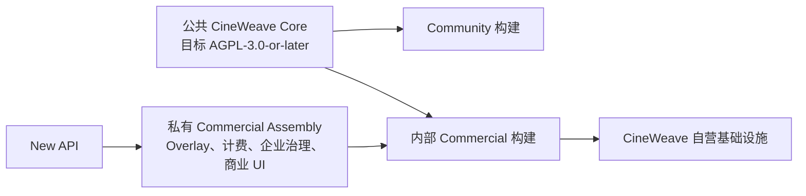
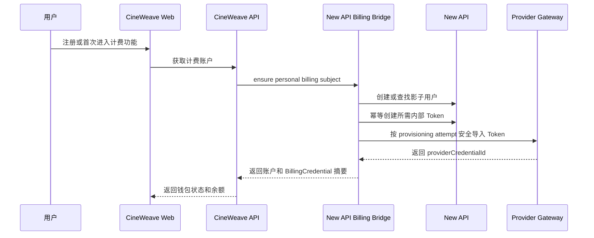
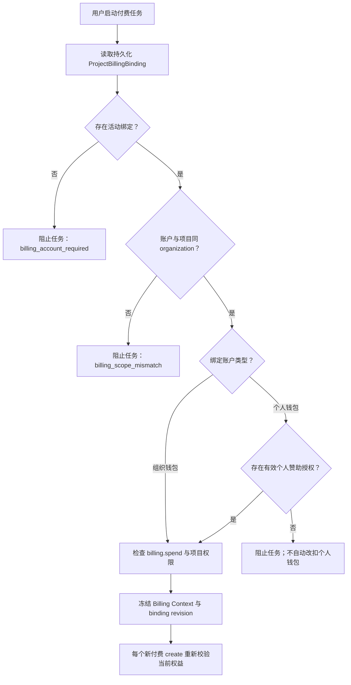
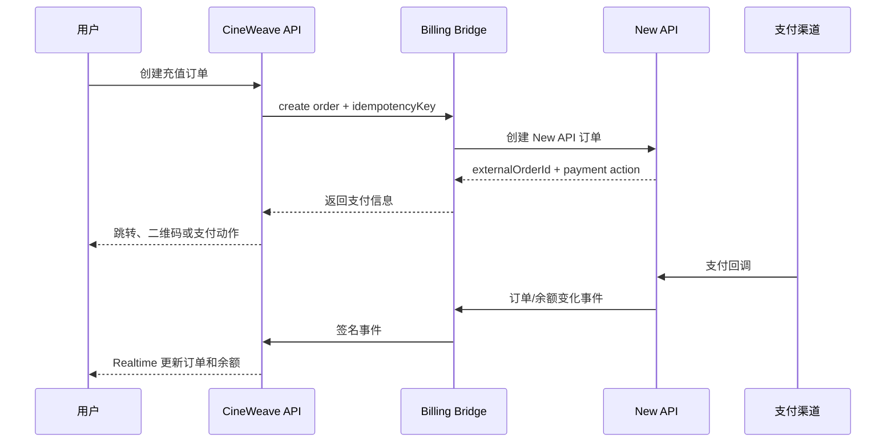
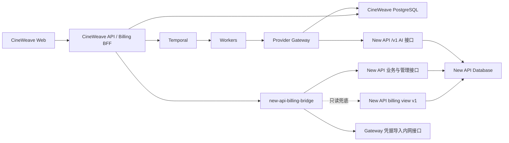

# CineWeave 与 New API 商业化计费深度适配开发目标

- 状态：P1-P5 工程实现、P6 本地零费用工程验收已完成；商业形态已收敛为同一主体内部自营、不对外分发或授权，客户 License/EE 交付链路已移除；P0 仍等待开源/第三方合规结论和具备安全资金写契约的 New API 版本
- 更新时间：2026-07-30
- 适用仓库：`D:\Code\CineWeave`
- 本轮开发父基线：Core `736dbb061571c7727ffb2eca25caa772bbbf73b7`、Commercial `9a12d71ea1eaaf4265ddefa0596731aa05fad042`；最终候选 SHA 只记录在签名 Release Manifest/发布证据中，避免文档对自身 commit 形成循环引用
- 当前 Core migration head：`000076_provider_billing_context_trigger_table_guard.sql`
- 当前 Commercial migration head：`000010_internal_commercial_release_identity.sql`
- 关联文档：
  - `docs/provider-gateway.md`
  - `docs/runtime-foundation-hardening-target.md`
  - `docs/runtime-foundation-hardening-runbook.md`
  - `docs/commerce-storyboard-segmentation-project-deletion-plan.md`
  - `packages/openapi/openapi.yaml`
  - `packages/events/catalog.yaml`

本文档定义 CineWeave 内部自营商业服务放弃自建用户计费、将 New API 作为隐藏计费中台后的目标状态、版本边界、系统边界、数据模型、接口、实施顺序和验收标准。商业源码和组合镜像只供 CineWeave 权利主体自己的基础设施运行，不向客户、合作方、经销商或独立承包方分发、授权或交付。后续开发必须以本文档为专项入口；发现实现条件与本文档冲突时，应先修订文档并完成评审，再修改生产代码。

本文档中的“放弃平台自身计费”是指：

- CineWeave 不维护可扣减的用户余额。
- CineWeave 不把本地模型价格或 `cost_records` 作为结算依据。
- CineWeave 不自行完成余额加减、充值入账、退款入账或订阅额度发放。
- New API 是余额、额度、扣费、充值、订阅、用户分组和消费日志的唯一权威来源。

这不意味着 CineWeave 可以删除商业审计、Provider 幂等、任务归属或外部订单映射。商业系统仍必须能够证明“谁授权了什么任务、使用哪个计费账户、调用了什么模型、New API 记录了哪笔消费、充值订单处于什么状态”。

本次评审修订形成以下实施口径：

- 开源版是完整公共 Core，商业服务是私有 Commercial Assembly；构建期决定商业实现是否存在，运行期只由租户 Entitlement、RBAC 和业务状态决定已编译能力是否可用，不签发或校验客户软件 License。
- 只保留少量稳定扩展契约，不在业务代码中散布 Edition 判断、Build Tag 或通用“钩子”。
- 商业计费账户支持多个 Billing Credential，以适配不同 API Key 的分组、模型范围、限额和轮换状态。
- 项目必须显式绑定计费账户；任何组织项目都不得在运行时静默回退到成员个人钱包。
- 任务只冻结计费身份、Core/Commercial 不可变 Release ID 和审计快照；每次尚未发起的付费 Provider create 都重新校验当前 New API 权益、Token 状态和 Billing Context。
- Core 表只由 Core migration 修改；Commercial migration 只能管理商业自有表或 schema。
- New API 的部署形态、上游版本和许可证依据是发布门禁，不能以“仅通过 HTTP 调用”为由跳过法律评审。
- `billing.spend` 始终来自现有 RBAC；个人钱包 sponsorship 只是钱包所有者对指定项目的附加同意证据，不能创建或替代权限。
- Token provisioning 区分“Gateway 已导入”“当前进程仍持有 secret”和“secret 已永久丢失”三种恢复路径；secret 丢失后不得假装重试同一导入。
- 充值、订阅与退款采用请求摘要、持久化 webhook inbox、投影更新和 outbox 同事务的 exactly-once 业务契约。
- 财务、授权与 Provider 归因证据不得因 Core 用户、组织或项目硬删除而级联消失；商业表必须定义快照、脱敏、保留和外键动作。
- 所有面向用户的钱包查询及订单写入都显式指定 `billingAccountId`，不依赖“当前钱包”或隐式默认钱包。

## 1. 强制产品决策

1. CineWeave 内部自营商业服务是用户直接使用的商业产品，New API 是隐藏的计费、定价和额度执行引擎；商业软件本身不作为可授权产品对外交付。
2. 商业服务的普通用户不得感知 New API 账号、API Key、渠道、倍率或原始 quota 数值。
3. 商业服务的普通用户不得手工绑定平台 New API Token。用户注册或组织开通付费能力时，由系统自动创建或绑定 New API 影子账户；Community Edition 管理员仍可把自有 New API 作为普通 OpenAI-compatible Provider 配置。
4. 每个商业计费主体必须拥有独立 New API 用户；一个计费主体可以拥有多个内部 Billing Credential，以表达不同 Token 分组、模型范围、用途、限额和轮换状态。任何 Credential 或外部 Token 都不得同时归属多个计费主体。
5. 商业计费主体分为个人钱包和组织钱包，但两者都必须落在一个明确的 CineWeave `organization_id` 安全域内。个人钱包属于“用户 + 当前组织”，不得作为跨组织全局钱包复用。
6. 每个付费项目必须在首个付费动作前持久化一个显式 ProjectBillingBinding。默认钱包只可作为创建绑定时的建议值，Provider 运行时不得临时推导或静默回退。
7. 项目、工作流和 Provider Request 必须冻结不可变 Billing Context、计费账户、Billing Authority 和绑定 revision；该快照证明身份与审计归属，不是长期有效的消费授权。
8. 每个尚未发送给上游、可能产生新扣费的 Provider create 必须重新校验当前租户权益、`billing.spend`、Billing Context、New API 账户/分组和候选 Credential 状态。套餐变化可以阻止在途 Workflow 尚未提交的付费步骤，但不得更换其计费身份。
9. New API 余额不足、账户停用或 Token 无权访问模型时，系统不得回退到其他用户、其他组织、其他 Billing Authority 或平台共享 Token。
10. New API 的用户分组负责商业套餐权限、模型可用性和价格倍率；CineWeave 的模型能力继续负责输入契约、时长、参考图、流式协议等执行约束。
11. New API 写操作必须通过受控业务接口完成。任何组件都不得直接修改 New API 的用户余额、充值、订单、订阅、Token 或消费日志原始表。
12. 当 New API 现有查询接口不足时，可以读取版本化只读数据库视图，但不得直接依赖原始表名和原始列。
13. CineWeave API Server 和 Worker 仍不得直接调用上游 AI 或解密 Provider 凭据；实际 AI 调用继续只经过 Provider Gateway。
14. Provider Gateway 的幂等、调用日志、异步任务、租约、速率限制和熔断继续保留。它们是运行安全能力，不是用户计费账本。
15. `provider_call_logs` 继续作为 Provider 调用审计。`cost_records` 在迁移期只作为非权威技术估算或对账辅助，不得参与用户余额展示或实际扣费。
16. 商业默认模式采用“订阅额度 + 按量充值”的混合模式；免费额度、专业版、团队版和企业版通过 New API 分组及订阅能力实现。
17. 内部商业部署默认只有一个活动 Billing Authority；未来如需多个 New API 实例，必须显式分区并让每个 BillingAccount 永久绑定其中一个，不允许跨实例 fallback 或合并余额。
18. 本文档不授权修改生产环境、执行真实充值/退款或发起真实付费 Provider 调用。每次发布、充值、退款和 Provider 付费 smoke 仍需分别单独获得用户授权。
19. Community Edition 必须是可以独立部署和完成核心内容生产的真实开源产品，不得被实现成依赖商业服务才能运行的试用壳。
20. New API 作为通用 OpenAI-compatible Provider 的连接能力属于开源核心；影子账户、平台钱包、充值、订阅、商业对账和平台托管 Token 属于商业能力。
21. 部署版本、租户套餐和用户角色是三个独立维度，不得用套餐名称切换二进制版本，也不得用角色绕过租户权益或计费授权。
22. 商业能力必须由后端统一校验授权；前端隐藏入口只用于用户体验，不能作为安全边界。
23. Community Edition 不得强制联网回传授权或遥测；内部商业服务也不建设客户 License Server。
24. 构建期组合决定商业实现是否进入产物；运行期 Entitlement 只能控制已经编译的能力。环境变量、数据库枚举或前端开关均不得把 CE 产物解锁成商业版。
25. 公共 Core 表的 DDL 只能由公共 Core migration 修改。Commercial migration 不得 `ALTER`、`DROP` 或重定义 Core 所有的表、列、索引、约束和 migration ledger。
26. New API 的镜像/源码版本、许可文本、README 许可声明、修改状态和内部运行方式必须被固定并经合规复核；未通过该门禁不得部署内部商业服务。

## 2. Community 与内部 Commercial 版本边界

本节是后续代码拆分、许可证选择、构建产物、数据库迁移和商业功能验收的强制边界。若后续产品需求与本节冲突，必须先更新本节并完成法律、产品和架构评审，不能仅增加一个环境变量或前端开关绕过。

### 2.1 发行名称与许可证目标

| 发行形态 | 获得方式 | 法律/运行边界 | 主要用途 |
| --- | --- | --- | --- |
| CineWeave Community Edition，简称 CE | 公共源码仓库和公共镜像 | `AGPL-3.0-or-later` | 社区、自托管、二次开发和完整核心生产 |
| CineWeave Internal Commercial | 仅由 CineWeave 权利主体在自有/受控基础设施装配和运行 | 私有源码、内部使用；终端用户只接受服务条款，不获得商业软件副本或 License | 官方托管服务、平台钱包、充值订阅、治理和运营 |

许可证目标要求：

1. 当前仓库基线没有 `LICENSE` 文件，因此在完成许可证文件、版权归属和第三方依赖审计前，不得对外宣称当前仓库已经是开源发行版。
2. CE 采用真正的 OSI 开源许可证，不增加“禁止商用”“仅限个人”“不得提供托管服务”等附加限制。开源软件允许商业使用，相关边界以 [Open Source Definition](https://opensource.org/osd) 为准。
3. AGPL 适用于网络交互程序；网络用户获得对应源码的要求以 [GNU AGPL](https://www.gnu.org/licenses/agpl-3.0.html) 正文和最终法律评审为准。
4. 内部 Commercial 不对外提供商业软件许可。若公共 Core 同时进入私有组合构建，仍必须确认 CineWeave 对相关自有代码拥有内部专有使用权，且第三方/外部贡献条款允许预期组合与网络运行；不能把“内部使用”当作自动取得版权的依据。
5. 接受外部贡献前必须建立 `CONTRIBUTING.md` 和明确的贡献授权流程，确保公共发行、内部组合使用和后续维护所需权利清晰。
6. 公共发行前必须增加 `LICENSE`、`NOTICE`、`COPYRIGHT`、`TRADEMARKS.md` 和第三方许可证清单，并由专业律师完成最终复核。
7. CineWeave 名称、Logo、官方域名和“官方发行版”标识由商标政策控制。许可证不能强制修改版持续展示品牌，也不能允许分叉项目冒充官方服务。
8. 本文档描述工程目标，不替代针对具体司法辖区、贡献历史和依赖许可证的法律意见。
9. CE 的“关于/版本”页面和发行说明必须提供与当前运行版本对应的源码获取方式。若内部服务运行了 AGPL 覆盖程序的修改版本并允许用户通过网络交互，还必须按 AGPL 第 13 条向这些用户提供对应源码获取机会；该要求不等于必须向全网公开，但内部边界也不能自动豁免。

#### 2.1.1 New API 上游许可证与交付边界

截至 2026-07-28，New API 官方仓库的 [README 许可说明](https://github.com/QuantumNous/new-api/blob/main/README.md#-license) 将项目描述为 AGPLv3，并声明适用额外的署名与原项目链接要求；仓库同时提供 [LICENSE](https://github.com/QuantumNous/new-api/blob/main/LICENSE)。这些上游内容可能变化，因此商业发布不能只记录镜像标签或引用可移动的 `main`。

每个内部 Commercial Release Manifest 必须记录：

- New API 镜像完整 digest、源码 commit/tag 和来源 Registry。
- `LICENSE`、README 许可段、NOTICE/版权声明的 SHA-256。
- 是否修改 New API、修改补丁 hash，以及确认不向外部主体分发、仅作为独立内部服务运行。
- 本次采用的内部运行许可/权利依据和 AGPL 网络交互合规方案；不再以商业/OEM 许可作为默认路线。
- 对应源码提供、署名、原项目链接和第三方 Notice 的内部服务入口或受控证据位置。
- 法务复核人、复核日期和下次升级重新复核条件。

内部部署必须明确落入以下一种，不得模糊处理：

1. **独立、未修改的 New API 服务**：作为独立容器和进程运行，固定源码与镜像 digest，保留并履行适用的上游许可、Notice、署名和网络源码提供义务。
2. **内部修改的 New API 服务**：保存完整补丁和可重建源码，向有权通过网络交互的用户提供 AGPL 要求的对应源码机会，并重新完成依赖、Notice 和安全评审。
3. **任何外部分发或客户私有化请求**：视为产品范围变更，必须先修订本文档、另行确定许可证/合同和交付合规；当前代码、Release Manifest 和流水线必须直接拒绝这种构建。

本文档不预判独立 HTTP 服务之间的最终著作权边界，也不声称 HTTP 集成会自动要求 CineWeave 私有代码开源；该结论必须基于实际部署、修改、网络交互和权利链完成专业复核。在结论形成前，发布门禁按更严格路径阻断。

### 2.2 三个不得混淆的授权维度

| 维度 | 示例值 | 决定内容 | 权威来源 |
| --- | --- | --- | --- |
| `deploymentEdition` | `community`、`cloud` | 当前构建实际包含哪些模块；`cloud` 仅表示 CineWeave 内部自营 Commercial | 不可变发行清单、Core/Commercial SHA 和镜像 digest |
| `tenantPlan` | `free`、`pro`、`team`、`enterprise` | 当前个人或组织可使用的商业额度与权益 | New API 分组、订阅及受控套餐映射 |
| `userRole` | 成员、组织管理员、组织所有者、系统管理员 | 用户能否在已有权益内执行某项操作 | CineWeave RBAC |

强制规则：

- `deploymentEdition` 是部署级事实，不随用户登录、组织切换或充值变化。
- `tenantPlan` 是计费主体级事实，不得决定二进制是否包含某个模块。
- `userRole` 只表达授权范围，不发放套餐权益，也不能把 CE 变成商业版。
- 最终允许条件必须同时满足“当前发行包含能力、当前计费主体拥有权益、当前用户拥有权限、当前业务状态允许”。
- 系统管理员不能通过修改数据库枚举、浏览器状态或环境变量把 CE 产物伪造成内部 Commercial；私有实现必须在构建树中真实存在并绑定不可变发行身份。
- 任务启动时只固化计费身份、绑定 revision、当时权益观察值和审计 hash；权益观察值不是授权租约。套餐变化不改变在途任务的 BillingAccount/BillingAuthority，但会影响该任务尚未提交的下一次付费 Provider create。

### 2.3 能力矩阵

| 能力 | Community Edition | Internal Commercial |
| --- | --- | --- |
| 漫剧、带货视频、资产、工作流和成片核心链路 | 完整提供 | 完整提供 |
| Provider Gateway、模型能力、多 API Key 和模型发现 | 提供 | 提供 |
| 管理员配置自有 Provider/New API 凭据 | 提供 | 平台策略决定 |
| New API 作为普通 OpenAI-compatible Provider | 提供 | 提供 |
| 本地 MinIO/S3、Temporal 和 Compose 自托管 | 提供 | CineWeave 运维 |
| 基础用户、组织、项目权限和运行审计 | 提供 | 提供 |
| New API 影子账户和平台托管 Token | 不提供 | 提供 |
| 实时余额、充值、套餐、订阅、退款和商业对账 | 不提供 | 提供 |
| 个人钱包、组织钱包和商业消费归属 | 不提供 | 提供 |
| 成本中心、商业报表、发票和高级额度治理 | 不提供 | 按套餐提供 |
| SSO、SCIM、长期审计导出和合规策略 | 不提供 | 按内部产品计划提供 |
| 多副本高可用、灾备工具和受支持升级 | 社区自行运维 | CineWeave 负责 |
| 官方 SLA、工单支持和事故响应 | 不提供 | 按服务条款提供 |

能力矩阵原则：

- CE 不是限时试用版，不设置人为的项目数、水印、模型质量或工作流长度限制。
- CE 用户自行承担 Provider 费用、部署、备份、升级、安全和运行维护。
- 商业版的价值主要来自平台托管计费、组织治理、企业集成、可观测性、升级保障和服务承诺，而不是故意降低开源版生成质量。
- 内部 Commercial 只能连接 CineWeave 自营或受控的 New API 实例，并必须通过同一 Billing Bridge 契约，不能直接改 New API 原始表。
- 具体套餐额度和价格不写入能力矩阵，由 New API 权威状态及商业套餐映射决定。

### 2.4 公共核心与私有商业增强的代码边界



公共仓库包含：

- 内容生产、Provider Gateway、Workflow、Agent、媒体、对象存储和基础组织权限。
- New API 作为普通 OpenAI-compatible Provider 的通用接入。
- 稳定的 Edition、Entitlement、Billing Context 和商业扩展契约。
- CE 的无商业能力实现、公共 OpenAPI、事件契约、Compose 和测试。
- 商业扩展槽位以及不依赖私有仓库即可完成的 CE 构建。

私有商业仓库或私有发行层包含：

- `new-api-billing-bridge` 的生产实现。
- New API 影子账户、Token 托管、余额、充值、订阅、退款和对账。
- 商业套餐映射、组织钱包、成本中心、发票及商业运营后台。
- 商业 Web 页面、商业 OpenAPI 扩展和商业事件扩展。
- 企业 SSO/SCIM、长期审计导出、高可用和灾备增强。
- 内部组合发行清单、镜像签名、部署身份校验和运营保护。

#### 2.4.1 物理仓库与装配方式

首期采用“公共 Core 仓库 + 私有 Commercial Assembly 仓库”的多仓库模式，不维护 `community`/`commercial` 长期业务分支。私有仓库使用逻辑结构：

```text
CineWeave-Commercial/
  core.lock
  overlay/
    internal/edition/commercial/
    apps/web-commercial/
    services/new-api-billing-bridge/
    db/commercial/
    packages/openapi-commercial/
    packages/events-commercial/
  scripts/assemble-release.ps1
  tests/
```

`core.lock` 固定公共 Core full commit SHA、允许的契约版本和预期 hash。商业 CI：

1. 在临时、干净构建目录检出 `core.lock` 指定的公共 Core。
2. 校验 Core commit、契约、迁移头和禁止修改清单。
3. 只把私有 Overlay 写入 allowlist 路径；覆盖未声明 Core 文件立即失败。
4. 生成组合源码清单、最终契约、SBOM、Edition Manifest 和 Release Manifest。
5. 在临时目录完成测试与镜像构建，不把私有文件写回公共 checkout。

不把“私有仓库通过 Go Module 直接依赖公共仓库”作为首期主方案，因为 CineWeave 现有大量 Go `internal/` 包受导入边界限制。若未来将稳定契约提取为独立公共 module，可逐步改用包依赖；在此之前由可审计 Assembly 组合成同一 Go module build tree。

#### 2.4.2 仅允许的扩展契约

Core 不预留大量通用 Hook、Interceptor 或任意代码加载点。首期只定义以下窄接口：

| 契约 | Core 责任 | Commercial 实现责任 |
| --- | --- | --- |
| `EditionProvider` | 返回已编译 Edition Manifest | 提供内部 Commercial 发行身份和组合契约 hash |
| `EntitlementService` | 定义统一授权输入、结果和错误 | 合并 New API 套餐、租户 allowlist 与商业 feature |
| `BillingRoutingAuthorizer` | 在 Gateway 路由前调用并消费脱敏候选约束 | 校验 Billing Context 并返回同组织、同账户、同 Authority 的可用 Credential 集合 |
| `CommercialModuleRegistry` | 在单一 composition root 注册路由、事件消费者和后台任务 | 注册商业 API/BFF、Bridge client、对账和运营模块 |
| Web `EditionEntry` | 定义导航、路由、query client 和 entitlement guard 插槽 | 提供商业页面与商业 API client |

约束：

- 接口位于小型、稳定、无商业秘密的 Core contract package；不得让私有模块复制 Core repository、Authorizer 或 Provider Service。
- 每个请求最多在明确的边界调用这些接口，不在 Handler、Workflow 和 React 页面中散落 `if enterprise`。
- `CommercialModuleRegistry` 只能注册声明在最终 Edition Manifest 和最终 OpenAPI/Event Catalog 中的模块。
- Billing Bridge 保持独立进程，通过版本化 HTTP/gRPC 契约集成，不使用 Go 动态 `.so` plugin。

#### 2.4.3 Go 与 Web 构建边界

Go Build Tag 只允许出现在少量 composition root 文件：

```go
//go:build !commercial
// 公共仓库中的 CE no-op composition
```

```go
//go:build commercial
// 仅存在于私有 Assembly 中的商业 composition
```

禁止在 Provider、Workflow、API Handler 或领域模型中散布 `//go:build commercial`。CE 构建树中不存在第二段私有源码；商业 CI 使用 `-tags commercial` 只是选择已物理装配的私有 composition，并不能凭空下载或解锁代码。

Web 使用编译期包别名 `@cineweave/edition-entry`：

- CE alias 指向公共 no-op `EditionEntry`。
- 内部 Commercial alias 指向私有 `apps/web-commercial`。
- 商业路由必须静态导入到商业 entry；不得在 CE 中留下可通过 URL、远程模块或环境变量加载的商业 chunk。
- 两类构建都扫描最终 route manifest、chunk、source map 和字符串指纹。商业生产默认不发布 source map；内部错误映射产物单独受控保存。

代码混淆和压缩不是安全或许可证边界。可以为前端体积或逆向成本使用常规 minify，但商业机密主要依靠私有仓库、私有 Registry、最小交付面、签名镜像、Secret 管理和合同保护；不得用混淆替代代码隔离、权限校验或法律合规。

#### 2.4.4 仓库治理要求

1. 不维护长期分叉的 `community` 与 `enterprise` 业务分支。公共核心修复先进入公共主线，商业发行按固定 Core SHA 组合。
2. 私有模块优先通过上述窄接口或受版本控制的内部 HTTP/gRPC/OpenAPI 契约与 Core 交互，避免复制 `internal/` 代码形成影子实现。
3. 必须内嵌商业 UI 时，公共 Web 提供稳定扩展槽；商业构建在编译期注入私有包，CE 构建解析为显式 no-op。
4. 公共 Core 不得导入私有仓库。内部 Commercial 只有在 Core 版权归属、外部贡献和第三方依赖权利清晰时才能组合公共 Core 与私有模块；内部使用不替代权利链证明。
5. 商业修复若属于 Core 缺陷，必须回流公共 Core；只涉及商业账务、授权或企业治理的实现保留在私有层。
6. 私有模块不得绕过 Provider Gateway 直接调用 AI Provider，也不得让 API/Worker 解密 Provider Token。
7. 公共契约中可以存在中性的 `billingContextId`、Edition 或 Entitlement 字段，但不能包含商业密钥、价格机密或私有实现。
8. 私有 Assembly 只允许在临时构建树覆盖显式 composition seam；任何对普通 Core 业务文件的覆盖都必须先以公共 Core 变更合并并重新锁定 SHA。

### 2.5 Edition Manifest 与 Entitlement

每个构建必须包含不可变 Edition Manifest，至少记录：

```json
{
  "deploymentEdition": "community",
  "distributionId": "cineweave-ce",
  "coreReleaseId": "<full-core-commit>",
  "commercialReleaseId": null,
  "contractVersion": "edition.v2",
  "compiledFeatures": [
    "core.workflow",
    "core.provider_gateway",
    "core.self_hosting"
  ]
}
```

内部 Commercial 构建额外包含私有模块摘要、Core/Commercial full SHA、组合源码归档 hash、最终契约 hash 和镜像 digest。要求：

- `CINEWEAVE_EDITION` 只能用于断言镜像与部署配置一致，不能把 CE 镜像动态解锁为商业镜像。
- CE 二进制中不存在商业实现；把环境变量改成 `cloud` 或 `enterprise` 必须启动失败或仍保持 `community`，不能启用私有路由。
- 私有 composition 只接受 `deploymentEdition=cloud`，其语义固定为“由 CineWeave 自营的内部 Commercial”；`enterprise` 不得进入私有构建、Compose、试点脚本或生产证据。
- 内部 Commercial 不读取 `CINEWEAVE_LICENSE_FILE`，不维护客户、到期时间、许可证序列号、吊销代次、签名宽限期或 License Server。
- 发行身份不完整、Core/Commercial SHA 漂移、契约 hash 漂移或镜像 digest 不匹配时直接阻断启动/发布，不能进入一个可被环境变量解除的授权宽限状态。
- 商业功能的允许条件只由“已编译模块 + 当前租户 Entitlement + RBAC + 当前 Billing/New API/业务状态”构成。
- CE 与内部 Commercial 均不得依赖联网 License 服务；可选遥测必须默认关闭并取得管理员明确同意。
- `CINEWEAVE_COMMERCIAL_WRITES_FROZEN` 是受审计的内部运维开关：仅允许严格布尔值；开启时阻止新的商业写入、付费 Provider create 和未证明零追加扣费的幂等恢复，但不阻断读取、导出、poll/cancel 与 finalization。它不能替代发布前 drain。

运行安全操作矩阵：

| 操作 | 允许条件 | 失败行为 |
| --- | --- | --- |
| 登录、读取、审计查询、导出、备份 | Core 身份与 RBAC 有效 | 返回真实权限/运行错误，不以 License 到期隐藏数据 |
| 新建钱包、充值、订阅、修改项目计费绑定 | 私有模块已编译，Entitlement、RBAC、step-up 和 New API 契约均有效 | fail-closed |
| 启动商业 Workflow 或提交新的付费 Provider create | Entitlement、`billing.spend`、Billing Context、余额、账户、分组、模型和 Credential 当前有效 | fail-closed，不换钱包/Authority/Credential 范围 |
| 已被上游接受的异步任务 poll/cancel | 使用原 Credential 和冻结 Billing Context | 允许安全收尾 |
| 已完成上游调用的结果下载、对象存储转存、本地 finalization | 不会产生第二次上游扣费 | 允许安全收尾 |
| 同一 Provider Request 的幂等恢复 | Gateway 能证明不会产生第二次扣费 | 否则暂停并进入人工/自动 reconcile |
| 运维冻结或发行身份漂移 | 只允许只读、备份、对账和已接受任务收尾 | 禁止新的财务写入和付费 create |

Commercial migration `000010_internal_commercial_release_identity.sql` 对新的 Billing Context 写入 `authorization_model=internal_release`、`core_release_id` 和 `commercial_release_id`，不再写客户 License 序列号/状态；旧候选产生的历史字段只作为不可变 legacy 证据保留，旧可信状态表也被前向重命名为只读 `legacy_deployment_license_trusted_state`。

公共 Core 提供：

```text
GET /api/system/edition
GET /api/me/entitlements
```

`/api/system/edition` 只返回安全的发行信息、已编译能力和运行状态，不返回私有模块细节、内部商业配置或 Secret。`/api/me/entitlements` 返回当前用户在当前组织和计费主体下可用的运行权益。Edition v2 使用 `deploymentEnabled` 表示能力已包含在不可变装配中，并以 `internal_release_mismatch`、`commercial_writes_frozen` 表示内部发行或运维限制；公共契约不再包含客户 License 状态、到期、吊销或可信时间字段。

后端授权链：

```text
Compiled Feature
  AND Tenant Plan Entitlement
  AND User RBAC Permission
  AND Billing/New API/Resource/Workflow State
  => Allowed
```

任一条件不满足时必须返回稳定错误码，例如：

- `feature_not_compiled`
- `plan_entitlement_required`
- `billing_account_suspended`
- `permission_denied`

前端只根据服务端返回的 Edition 和 Entitlement 调整导航、页面和升级引导，不自行推导授权结果。

### 2.6 Feature Registry 与契约治理

所有可授权能力必须进入集中 Feature Registry。每个条目至少包含：

- 稳定 feature key。
- 最低发行版本。
- 是否还需要租户套餐权益。
- 所需 RBAC 权限。
- 后端 enforcement point。
- 前端入口。
- 无权益时的错误码和降级行为。
- 是否影响在途 Workflow。
- 审计事件和指标。

首批商业 feature key 建议：

```text
billing.shadow_account
billing.balance
billing.top_up
billing.subscription
billing.organization_wallet
billing.reconciliation
billing.invoice
governance.sso
governance.scim
governance.audit_export
operations.supported_ha_tooling
operations.managed_disaster_recovery
```

这些 operations key 代表官方提供、测试并承担支持责任的自动化工具和服务承诺，不得用于禁止 CE 管理员自行进行多副本部署、备份或灾备建设。

禁止：

- 在各页面和 Handler 中散落 `if cloud` 或 `if commercial`。
- 仅凭前端环境变量、Cookie 或浏览器 Local Storage 开启商业能力。
- 用系统管理员角色代替套餐 Entitlement、Billing Context 或 `billing.spend`。
- 用 New API group key 直接控制 UI；必须先映射为稳定的 CineWeave Entitlement。
- 在同一 feature key 上同时表达“模块是否编译”和“租户是否购买”而不区分拒绝原因。

CE 公共 OpenAPI 只描述 Core 路由。商业发行在 Assembly 阶段将受版本控制的私有 OpenAPI/Event Catalog 扩展合并成 `.release/contracts/openapi.yaml` 和 `.release/contracts/events.yaml`，并生成对应 Web client。要求：

- Core 路由只修改公共 `packages/openapi/openapi.yaml`；商业路由只修改私有扩展，不把商业 schema 或 operation 写回公共文件。
- 合并器按 `method + path`、`operationId`、schema 名和 event key 检测冲突；相同键只有内容 hash 完全相同才允许重复。
- `scripts/check-openapi-routes.py` 必须改为接受显式 contract path 和 route-source manifest。CE 流水线检查公共文件与 Core route sources，商业流水线检查最终合并文件与组合 route sources。
- 运行时 `/api/system/edition` 公布最终契约 hash；API/Web/Realtime/Worker 启动时断言该 hash 与 Edition Manifest 一致。
- 商业专属路由在 CE 中不注册且不进入 CE OpenAPI，直接访问返回 `404`；共享 Core 路由收到非空商业 Billing Context 时返回 `feature_not_compiled`。商业路由已编译但当前租户无权益时返回 `403 plan_entitlement_required`。

### 2.7 构建、镜像与发行身份

发行产物建议：

```text
public registry:
  cineweave-ce:<full-core-commit>

private registry:
  cineweave-internal-commercial:<commercial-release-id>
```

内部 Commercial Release Manifest v2 必须记录：

- Core full commit SHA。
- Commercial Assembly full commit SHA。
- `core.lock`、Overlay allowlist 和装配脚本 hash。
- 最终 source archive hash。
- `edition=cloud`、Distribution/Deployment ID，以及同一主体内部自营、禁止外部分发、不启用客户软件授权的机器断言。
- Core 与 Commercial migration head。
- Core 与 Commercial seed/contract version。
- 所有镜像 tag 和 digest。
- Web asset/build ID。
- Temporal Worker Build ID。
- OpenAPI 与 Event Catalog hash。
- DDL owner manifest、Core/Commercial migration ledger identity。
- Commercial retention policy、Core FK action manifest 和 webhook contract version。
- 内部发行范围声明、部署 ID、Core/Commercial SHA、组合源码归档 hash 和禁止外部分发断言。
- New API image digest、source commit、LICENSE/README hash、修改补丁和许可依据。
- SBOM、第三方许可证扫描结果和镜像签名。

构建及 CI 门禁：

1. CE 必须仅凭公共仓库和公开依赖完成可复现构建、迁移、Seed、测试和启动。
2. CE 构建不得包含商业源文件、商业迁移、New API 管理凭据或商业 Web chunk。
3. 商业构建必须固定公共 Core SHA，不允许从可移动的 `main`、`latest` 或未提交工作区构建。
4. 公共发布流水线必须检查禁止路径、私有模块名、凭据模式和未授权商业资产。
5. 商业流水线必须验证 Core/Overlay 契约兼容、内部发行范围、最终路由、迁移顺序和完整镜像集合，并拒绝任何外部分发/客户交付模式。
6. 公共 `compose.yml` 默认启动 CE；商业 Compose override 和私有服务只存在于商业发行层。
7. 同一环境的 API、Web、Gateway、Worker、Migration 和商业服务必须解析到同一个组合 Release Manifest。
8. 首次创建公共仓库和每次历史重写后，必须扫描所有可达 Git 对象、分支和 tag，而不只扫描工作树或 source archive。私有仓库历史不得直接推送到公共 remote。
9. 公共流水线同时扫描 Git history、release archive、容器 layer、SBOM、前端 chunk 和 source map；发现私有路径、Secret 或商业资产时停止发布并按泄漏流程轮换凭据。

### 2.8 数据与迁移边界

DDL 所有权矩阵：

| 对象 | 所有者 | 允许的迁移操作 |
| --- | --- | --- |
| 当前公共表、索引、约束、函数和 `cineweave_migrations.cineweave_schema_versions` | Core | 仅公共 Core migration 可创建、修改或删除 |
| 公共中性 `billing_context_id`、revision、snapshot hash 等 opaque 字段 | Core | 由公共前向 migration 增加，CE 中可空且不能外键到商业表 |
| `billing_*`、`commercial_*` 商业表/schema 和商业 migration ledger | Commercial | 仅 Commercial migration 管理 |
| Commercial 表指向 Core 主键的引用 | Commercial | 可以由 Commercial migration 在商业表一侧建立；不得反向修改 Core 表 |
| Core 表指向 Commercial 表的 FK、trigger 或 view | 无 | 禁止 |

执行规则：

- 公共 Core 继续使用不可变 `db/migrations`、公共 embed 和 Core ledger；商业迁移使用私有目录、私有 embed/runner 和独立 ledger，例如 `cineweave_commercial_migrations.schema_versions`。
- 公共 `internal/migrationstream` 使用 Goose instance API 隔离每个 FS、ledger、audit table 和 advisory lock；`internal/editionmigration` 固定 Core/Commercial 两套身份，私有 Assembly 只向 Commercial 工厂注入私有 embed。不得通过插入 ledger 行或把私有 SQL 塞入公共 embed 模拟双流。机器契约和装配步骤见 `docs/commercial-assembly-release-contract.md`。
- 商业部署固定按“Core migrate/verify -> Commercial migrate/verify -> Core seed/verify -> Commercial seed/verify”执行。
- 私有表使用清晰命名空间，例如 `billing_*`、`commercial_*`，并由商业迁移负责。
- 必须跨 Provider/Workflow 固化的计费身份，通过公共中性契约保存不可变 `billing_context_id`、revision 和快照摘要；商业层使用 sidecar 表维护该 ID 到 BillingAccount、Authority 和权限观察值的强一致映射。
- 如果商业实现发现必须修改 Core DDL，先把中性能力作为公共 Core migration 合并、发布并锁定新的 Core SHA；Commercial migration 永远不得直接修改 Core 所有对象。
- 内部 Commercial 回滚或停止运营不得自动删除商业表、充值订单、交易投影或审计数据；只冻结新商业写操作并保留导出路径。
- CE 数据进入内部 Commercial 必须是显式、可审计、可回滚的扩展迁移；回到纯 CE 运行前必须先导出商业数据并验证 Core 数据仍可独立运行。

#### 2.8.1 财务证据生命周期与删除策略

Core 现有项目删除会硬删除 `projects`。Commercial migration 不能通过阻塞型外键破坏该流程，也不能通过 `ON DELETE CASCADE` 删除财务、授权或 Provider 归因证据。商业表按以下类别处理：

| 数据类别 | 代表对象 | Core 主体引用 | 删除策略 |
| --- | --- | --- | --- |
| 活动配置 | 当前 ProjectBillingBinding、当前 plan binding、余额缓存 | 活动状态必须引用现有主体 | 项目或账户关闭时撤销、失效或过期；缓存可以安全清理 |
| 计费主体 | BillingAccount、NewAPIAccountBinding、BillingCredential | 活动状态使用强校验的 organization/user 引用，同时保存稳定脱敏主体快照 | 先 `closed`/`draining`/`revoked`，完成外部账户和 Token 补偿后再脱敏；不得直接级联删除 |
| 授权与安全证据 | sponsorship、provisioning attempt、Token 轮换、内部发行身份审计 | Core UUID 可空，另存不可变 reference/hash | Core 主体删除时 `ON DELETE SET NULL`，保留同意、撤销、补偿和操作证据 |
| 财务与调用证据 | 外部订单、交易投影、对账、Billing Context sidecar、Provider attribution、webhook inbox/outbox | Core UUID 可空，另存创建时的 organization/project/actor reference/hash | 禁止 `ON DELETE CASCADE`；按法务确认的保留期留存并支持受控导出、脱敏和 legal hold |

强制规则：

1. 任何需要在 Core 主体删除后保留的 Commercial 行，都必须在创建时保存不含直接隐私的稳定 reference、Authority、账户 ID、binding revision 和必要快照；不能等删除时再查询可能已经消失的 Core 行。
2. 指向 `users`、`organizations`、`projects` 的审计型外键使用可空列与 `ON DELETE SET NULL`，或不建立数据库 FK 但由写入事务校验；禁止使用 `ON DELETE CASCADE`。
3. 项目硬删除后，历史订单、交易、Provider Call 归因和 sponsorship 同意证据仍可通过脱敏 reference 查询；当前项目绑定必须停止可用，且不能继续发起新的付费 create。
4. 用户离开组织、用户被删除或组织关闭时，相关个人钱包进入 `suspended`/`closed`，新付费 create 立即停止；仍被已接受异步任务引用的 Credential 先 `draining`，安全收尾后撤销外部 Token 并停用外部用户。
5. 组织硬删除前必须完成商业账户关闭预检；如仍有未完成订单、退款、订阅、对账或在途 Provider 任务，则删除流程 fail-closed 并返回可操作阻断原因。
6. 隐私删除不等同于财务证据删除。可删除的直接身份信息应脱敏或假名化；法定财务、反欺诈和安全审计记录按司法辖区、合同与法务批准的 retention policy 保留。
7. retention policy 必须版本化并写入 Commercial Release Manifest；P0 法律评审必须确认各发行地区的期限、导出、legal hold 和到期销毁要求，不能由临时环境变量任意缩短。
8. 数据库集成测试必须直接执行现有 Core 项目硬删除路径，证明 Commercial 外键既不阻塞删除，也不丢失要求保留的证据。

### 2.9 安全、商标与反绕过要求

- 浏览器不保存私有发行清单、部署 Secret 或可重放的服务授权令牌。
- 内部 Commercial 不包含 License 签发器、签发私钥或客户 License 主数据；商业源码和镜像只进入私有仓库、私有 Registry 与受控生产主机。
- 发行身份、Entitlement 与 RBAC 结果进入安全审计，但日志不得记录 New API Token、服务 Secret 或用户隐私。
- 任何商业后台和 Billing Bridge 路由必须同时验证服务身份、Tenant Entitlement、RBAC、BillingAccount 和资源范围。
- 修改数据库、环境变量、前端 Bundle 或请求参数不能升级 Edition。
- CE 不加入强制 phone-home、强制展示不可移除徽章或商业使用限制。
- 官方商标使用政策与软件许可证分离；分叉项目可以遵守许可证使用代码，但未经许可不能宣称为 CineWeave 官方发行或使用官方服务域名。
- 漏洞修复按影响范围回流公共 Core 或私有层，不得以商业授权为理由延迟影响 CE 的关键安全修复。

### 2.10 版本边界验收

本节勾选项表示工程边界和自动化契约已经验证；依赖真实 public/private remote、法律批准或不可变候选发行部署的条件保持未勾选。

- [ ] 公共仓库包含经法律复核的 `LICENSE`、`NOTICE`、版权、商标和贡献政策。
- [x] CE 可在无私有仓库、无内部商业配置、无 New API 管理凭据的环境完成全新部署。（`pnpm run test:ce:fresh` 从当前 Core 源码在随机端口、独立网络和独立卷构建完整 app profile；14 个长期服务全部 healthy，运行容器中商业/New API 管理凭据环境变量为 0、`/api/system/edition` 为 Community，商业计费路由为 404，结束后自动清理。）
- [x] CE 可以完成一条文本、图片或视频核心生产链路。（同一 CE 新装门禁在 migration 75 空库上执行 `TestWorkflowGatewayIntegration` 文本分镜链路成功，Provider 使用零费用 mock，`paidProviderCalls=0`；门禁同时发现并修复 Temporal namespace 新建传播竞态、Web 外部字体构建依赖、API Release ID 漂移和 legacy storyboard 约束漂移。）
- [x] CE 管理员可以配置自有 New API，但看不到平台钱包、充值或影子账户入口。
- [x] 将 CE 环境变量改为 `cloud` 或 `enterprise` 不能出现任何商业功能。
- [x] 内部 Commercial 构建同时记录 Core 和 Commercial Assembly 的不可变 SHA，并通过 allowlist Overlay 在临时 build tree 生成。（公共 Core remote 与私有 `Einzieg/CineWeave-Commercial` remote 已建立；两个仓库均已形成并推送过干净不可变候选，装配器记录两个 commit、clean 状态及 lock/allowlist/slot/脚本 hash，Release Manifest 门禁读取真实 tar/zip 源码归档并复核归档内 Overlay 内容。）
- [x] 商业 API、Web 和 Worker 对同一 Entitlement 得出一致结果。
- [x] 无套餐权益、无 RBAC 权限、Billing Context 无效和 New API 当前状态异常分别返回可区分错误。
- [x] 运维冻结、Entitlement 撤销或 Billing/New API 状态异常会阻止新付费 create，并允许读取、导出及已被上游接受任务的安全收尾。
- [x] CE 不需要连接 CineWeave 授权服务器即可长期运行。
- [x] Core 与 Commercial migration runner/ledger 独立且 Up/Down/Up 验证通过；Commercial SQL 不修改 Core-owned DDL。
- [x] Commercial retention policy、法务/安全批准证据和 Core FK action manifest 已形成机器门禁；实际 PostgreSQL 目录中的 27 条跨边界外键逐项一致，证据级引用只允许 `SET NULL`，仅纯 UI 偏好允许 `CASCADE`。
- [ ] 公共 remote 完整 Git history、发布归档、镜像 layer、Web chunk 和 source map 不包含私有商业源码、迁移、凭据和构建产物。
- [x] CE OpenAPI/Event Catalog 与商业最终合并契约分别通过运行路由一致性检查。
- [ ] New API 固定版本、许可依据和交付义务已经法律复核并进入 Release Manifest。
- [x] 商业功能无法通过前端、数据库枚举或单一环境变量绕过。
- [ ] 外部贡献的版权授权支持公共 AGPL 发行与当前内部组合使用边界。
- [x] 功能矩阵、Edition Manifest 和实际运行路由完全一致。

## 3. 当前证据与缺口

### 3.1 CineWeave 当前状态

当前专项实现和剩余发行缺口如下：

| 当前状态 | 证据 | 商业风险 |
| --- | --- | --- |
| 仓库根目录没有 `LICENSE`、`NOTICE` 或商标政策 | 当前基线根目录 | 源码可见但法律授权不明确，不能安全发布 CE 或确认公共 Core 的内部 Commercial 组合使用权 |
| Edition v2 Manifest、Feature Registry、Entitlement、授权错误与商业模块注册契约已建立；私有 Billing API/Web/Gateway/Bridge 实现位于独立 sibling 目录 | `packages/edition/edition.v2.json`、`internal/edition`、`D:\Code\CineWeave-Commercial` | 私有 remote 已建立；本轮内部自用重构仍需形成新的不可变 Commercial SHA |
| 公共 `compose.yml` 固定为 CE；组合迁移、OpenAPI/Event/route-list、临时 allowlist Assembly 与 New API 运行镜像四方一致门禁已实现；Release Manifest 会把两个 commit、clean 状态、lock/allowlist/装配脚本和归档内 Overlay 字节绑定到同一候选 | `compose.yml`、`packages/edition/ddl-owners.v1.json`、`scripts/assemble-commercial-release.ps1`、`scripts/check-release-manifest.py`、`scripts/check-new-api-runtime-image.py` | 正式组合发行仍需干净 Core/Commercial commit、实际私有 remote、生产 New API digest pin 和部署授权 |
| Core/Commercial 具有独立 FS、编号空间、ledger、binary、audit 和 lock 身份；Commercial migration 1-10 已通过隔离 Up/Down/Up 和 Core 主体删除；retention/FK 机器门禁逐项核对 27 条实际跨边界外键 | `internal/migrationstream`、`internal/editionmigration`、Commercial `cmd/commercial-migrate`、`contracts/core-foreign-key-actions.v1.json` | 法务/安全仍需填写期限、司法辖区并批准 legal hold、脱敏和到期销毁策略；pending 模板不能进入发行 |
| CE 433 routes 与商业最终 454 routes、Core/Commercial Event Catalog 和公开运行源均通过显式 contract/route-source 校验 | `scripts/check-openapi-routes.py`、Commercial contract tests | 正式生产组合 Release Manifest 尚未生成 |
| `/api/provider-usage/summary` 已改为只返回 `estimatedCost`、`authoritative:false` 和 `technical_estimate` | `internal/provider/service.go`、OpenAPI | 仅供 Provider 技术诊断，商业 Web 有静态门禁禁止引用 |
| Provider 限制策略不再读取 `cost_records` 执行日/月金额门禁 | `internal/provider/limits.go`、`000074_cost_records_non_authoritative.sql` | 并发、请求次数和熔断继续生效；新非空金额预算写入被拒绝，历史字段只读 |
| 文本、图片、音频和视频 create 已统一携带冻结 Billing Context；Gateway 在每个未发起的付费 create 前重新校验当前授权并写 Provider Request/Call 归因 | `internal/provider/billing_routing.go`、Commercial BillingRoutingAuthorizer | 尚需已授权生产调用核对真实 New API log ID |
| 个人/组织 BillingAccount 按 organization + Billing Authority 隔离；项目绑定、sponsorship、RBAC 和 owner consent 分别校验 | Commercial billing context/identity/API | 试点组织名称已选定为“测试”，尚未在生产创建/授权 |
| 多 Credential 按 BillingAccount、Authority、group/model scope 与 generation 隔离；Gateway 默认候选隐藏 `system_managed` | `000071_provider_system_managed_credentials.sql`、Commercial credential provisioner | 正式生产 provisioning 仍需零费用开户授权 |
| `provider_async_tasks` 固定原 `credential_id` 与 Billing Context，poll/cancel 不重新路由 | Core Gateway video/runtime、Commercial resolver | 尚需已授权异步视频 smoke |
| 余额、充值、订阅、消费、错误、权限和 Realtime 已统一到 New API 权威语义；固定上游不支持的资金写入前后端均 fail-closed | Commercial Billing Bridge/API/Web、Core 错误映射 | 需升级到具备安全资金契约的 New API 版本后才能执行真实充值/退款 |

### 3.2 当前 New API 实例只读探测

2026-07-29 对 `https://einzieg.com` 和生产主机进行的无凭据/容器只读取证确认：

- `/api/status` 可用。
- `/api/usage/token` 路由存在。
- `/api/user/amount` 路由存在。
- `/api/user/self` 路由存在。
- `/api/log/self` 路由存在。
- `/api/token/` 路由存在。
- `/api/user/topup` 路由存在。
- `/v1/dashboard/billing/subscription` 路由存在。
- 当前状态配置显示充值、订阅、用户、Token 和消费日志相关模块已启用。
- 当前实例通过 `quota_per_unit`、`quota_display_type`、`display_in_currency` 和汇率字段控制额度展示，CineWeave 不得写死换算常量。
- 部分 `/api/*` 路由在鉴权失败时仍返回 HTTP 200，并在 JSON 中返回 `success:false`。适配器必须同时校验 HTTP 状态、业务 `success` 和错误结构。
- `/api/status` 当前自报 `v1.0.0-rc.22`。
- 运行中容器配置仍引用可移动的 `calciumion/new-api:latest`，但实际镜像 RepoDigest 为 `calciumion/new-api@sha256:d600f20c2781e1a173c2a02f8c33b0c4b1b4e8e5a8b107bafaf2442ae2c9386c`。
- OCI label 将镜像声明为官方仓库 commit `bc14c18f6024e79cba1c08d02cd007796e12d668`、tag `v1.0.0-rc.22` 和 `AGPL-3.0`；固定 tag 解析到同一 commit。
- 对该 commit 的直接源码归档取证得到：archive SHA-256 `5834d1634fff019ea0b41d2d84b2a202dc6c552184199c16f9845613de4a2425`、`LICENSE` SHA-256 `6f1e622c82a380075843bb084a7ec3b1f1d12a4a02526d75e78b0924a860aa75`、README SHA-256 `3ec5c480d9d27ec5cb0e1254684cdab6cc6b1cad1ac551146865f94daeab456e`、README 许可段 SHA-256 `fadbb99db7cfc99ef2e920077dedee1896080591679bb9836bd655fde99b9187`、`NOTICE` SHA-256 `903b9ca441be6912459551f39b70338ee7a410eba6cce097043cf006622bd6bc`。
- README 许可段机器检查确认包含署名及原项目链接要求；机器检查只记录 marker 和 hash，不代替法律解释。
- OCI label 与源码 commit/tag/license family 一致仍不能证明镜像内容与源码归档逐字等价；当前 `modificationAssessment=unverified`，因此还不能把 `modified=false` 或 AGPL 交付结论写入正式 Release Manifest。
- 可重复取证命令为 `scripts/capture-new-api-upstream-evidence.py`；当前脱敏证据输出在忽略的 `tmp/new-api-upstream-evidence.json`，正式发行必须重新生成并签名保存。
- `scripts/capture-new-api-runtime-image.ps1` 与 `scripts/check-new-api-runtime-image.py` 已建立 fail-closed 运行镜像门禁：容器 `Config.Image` 必须是 digest 引用，运行 `RepoDigests`、固定契约 fixture、上游证据和组合 Release Manifest 必须一致；证据强制写在两个源码仓库外。当前生产仍为 `latest`，因此不能通过该门禁。
- 生产 New API 数据库已通过服务器内只读 schema 探测确认是 PostgreSQL 15.18；`users`、`tokens`、`top_ups`、`subscription_orders`、`subscription_plans`、`user_subscriptions`、`logs`、`setups` 共 132 个目标列的指纹为 `f12524e2df8392e6b5f95abb0216d62b71f9253b9e9e4e7bb7e9659a8ba437d0`。未读取业务行、未执行 DDL。
- 私有装配目录已用固定镜像启动隔离本地实例并创建专用合成账号，零费用采样用户余额、两种 group/model scope Token、Token secret recovery、充值信息/历史、订阅、日志和鉴权错误；Secret-bearing SQLite 运行目录随后销毁，只保留脱敏 hash 证据。

### 3.3 契约证据状态

固定 New API `v1.0.0-rc.22` 已使用专用合成用户完成零费用采样；勾选项已有脱敏 fixture 和自动化门禁，未勾选项继续阻止对应生产能力：

1. [ ] 固定 New API 生产镜像 digest、源码 commit 或可审计版本标识。（运行实例的 digest/commit/tag 已取证；生产 Compose 仍需从 `latest` 改为 digest，并在候选发行重新取证。）
2. [ ] 固定该版本的 `LICENSE`、README 许可段、Notice、镜像来源、修改补丁和内部运行方式，并完成 AGPL 网络交互、源码提供及署名义务的书面合规结论。（文件 hash 已取证，修改状态和书面结论未完成。）
3. [x] 记录账户余额查询的真实请求头、响应字段、quota 单位和金额换算，明确 aggregate、cash、grant、subscription 与 lifetime usage 是否能被权威区分。
4. [x] 记录 Token 额度查询对“无限 Token”“有限 Token”“用户余额不足”的行为，以及多个 Token 不同 group/model scope 的组合语义。
5. [x] 记录用户、Token、分组、充值、订阅和消费日志接口的权限要求。
6. [x] 记录账户停用、Token 停用、模型无权限、余额不足和速率限制的错误结构。
7. [x] 记录 Token 创建的幂等缺口、确定性 generation 名称、精确 lookup、secret recovery 和撤销补偿。
8. [x] 记录同步与异步图片/视频调用的预扣、失败退款和终态结算时点。
9. [ ] 记录充值订单的创建、支付、完成、失败、关闭和退款状态。（固定版本没有满足方案的支付订单/退款写路由，运行时能力保持禁用。）
10. [ ] 记录订阅额度发放、续期、过期和用户分组变化写行为。（订阅读取已采样；固定版本没有安全幂等购买契约。）
11. [x] 确认 New API 数据库类型、schema 版本和受控只读视图。
12. [x] 将采样响应脱敏保存为仓库测试 fixture；不保存真实 Token、用户隐私或支付凭据。

未勾选证据不阻止只读余额、订阅和消费展示，但必须阻止对应生产镜像发布或资金写入；不得依据候选接口名称伪造成功。

## 4. 产品目标与非目标

### 4.1 产品目标

以下目标适用于包含私有商业模块、发行身份完整且由 CineWeave 自营的内部 Commercial。完成后，商业服务普通用户必须能够：

- 在当前组织安全域内使用 CineWeave 账号获得个人钱包，无需注册 New API。
- 在顶栏和计费中心查看实时可用余额。
- 查看订阅状态、套餐权益、充值余额和消费明细。
- 在 CineWeave 内创建充值订单并完成支付。
- 在余额不足时看到明确原因和充值入口。
- 查看一笔消费对应的项目、任务类型和模型，而不看到 Provider Key。
- 在自己明确赞助的同组织项目使用个人钱包。
- 在团队/组织项目使用显式绑定且已授权的组织钱包。
- 明确看到当前项目由个人还是组织付费。

组织管理员必须能够：

- 创建和管理组织钱包。
- 指定组织默认套餐和 New API 分组。
- 控制哪些成员可以使用组织钱包。
- 独立授予查看、消费、充值、订阅管理和对账权限。
- 设置项目计费主体。
- 查看组织消费、充值和异常对账。
- 暂停组织钱包或禁止新的付费任务。

平台管理员必须能够：

- 查看 CineWeave 计费主体与 New API 影子账户的映射状态。
- 查看 Token 创建、轮换和停用状态，但不能查看明文 Token。
- 配置商业套餐与 New API 分组的映射。
- 发起受审计的账户同步和对账。
- 查看接口兼容性、余额同步延迟和对账差异。
- 处理充值、退款和订阅异常，但实际金额变更仍由 New API 完成。

### 4.2 非目标

- 不允许商业发行版普通用户把自己的第三方 New API Key 作为平台钱包 Token 粘贴到 CineWeave；CE 管理员配置自有 Provider Credential 不属于此限制。
- 不把 Provider 管理页暴露为普通用户的商业计费页面。
- 不在 CineWeave 建设第二套可扣减钱包或复式账本。
- 不以 `estimated_cost` 作为实际扣费。
- 不通过 SQL 直接增加或减少 New API 用户 quota。
- 不让浏览器直接调用 New API。
- 不在 URL、前端状态、Realtime 事件或日志中暴露 New API Token。
- 不因为余额查询暂时失败而伪造“余额为 0”。
- 不在没有 New API 契约测试的情况下实现充值或退款写操作。
- 不为已应用迁移重写历史 SQL；数据库变化必须使用新的前向迁移。
- 不在本轮替换 Provider Gateway 的 AI 调用、媒体转存、幂等和异步任务职责。
- 不允许团队项目在缺少组织钱包时自动改扣成员个人钱包；使用个人钱包必须存在独立 sponsorship 记录和明确同意。
- 不使用 Go 动态 `.so`、浏览器远程模块或大量通用 Hook 作为商业代码装载机制。
- 不把代码混淆、前端 minify、环境变量或隐藏路由当成商业源码和授权保护边界。

## 5. 商业用户体验

本节只描述内部 Commercial 的商业用户体验。CE 不显示钱包、充值、套餐、订阅或影子账户入口，但继续提供 Provider Center 供管理员配置自有 Provider。

### 5.1 注册与自动开户



要求：

- `ensure` 必须幂等。
- 相同 CineWeave 计费主体不得创建多个活动 New API 用户。
- 同一计费主体可以按用途、New API group 和模型范围创建多个 Billing Credential。
- 用户创建成功但 Token 导入失败时，必须记录 provisioning attempt、隔离或撤销外部 Token，并可以安全恢复，不能盲目再次创建 Token。
- API 和浏览器不得接触明文 Token。
- New API 用户名或邮箱冲突不得通过随机创建多个账户掩盖。

### 5.2 个人钱包与组织钱包



规则：

1. 每个 BillingAccount 都带 `organization_id`；项目、Provider Account、Credential 和 BillingAccount 必须属于同一组织安全域。
2. 项目创建页可以建议个人或组织默认钱包，但必须在事务内真正创建 ProjectBillingBinding；Provider 运行时只读取绑定，不执行默认推断。
3. 任意项目使用个人钱包都必须关联不可变 `billing_sponsorships`，记录 sponsor、项目、同意证据、有效期和撤销 revision；不得用项目创建人或组织成员身份隐式视为同意。
4. 个人钱包按“用户 + 组织 + Billing Authority”唯一；用户切换组织时看到的是另一个钱包，不能跨组织复用同一 Token。
5. 计费账户选择必须在任务创建事务中冻结；运行中修改项目绑定只影响修改后创建的新业务任务。
6. 自动重试、模型/Credential fallback、轮询、取消和媒体转存不得重新选择 BillingAccount 或 BillingAuthority。
7. 每次新的付费 Provider create 仍要检查当前 `billing.spend`、套餐 Entitlement、Billing Context、余额、Token 和模型范围；失败时暂停/终止该步骤，不改变已冻结身份。
8. 组织成员离开组织后，旧任务只允许使用原 Credential 做已接受上游任务的 poll/cancel/finalization；尚未提交的新付费 create 必须停止，不得改扣个人钱包。

### 5.3 余额查询

余额页面必须区分以下状态：

- `active`：账户正常且余额新鲜。
- `stale`：最近成功余额可展示，但已经超过新鲜度窗口。
- `unavailable`：无法获得余额，不能显示为 0。
- `insufficient_balance`：New API 明确判定余额不足。
- `suspended`：New API 用户、Token 或 CineWeave 计费账户被停用。
- `provisioning`：影子账户或 Token 正在创建。
- `provisioning_failed`：自动开户失败，需要重试或管理员处理。

面向 Web 的账户余额响应必须包含清晰语义，不能把 New API 的 `quota`、Token 限额和累计消费都压成含义不明的 `availableAmount`/`usedAmount`：

```json
{
  "billingAccountId": "uuid",
  "billingAuthorityId": "uuid",
  "accountType": "personal",
  "status": "active",
  "currency": "USD",
  "accountBalance": {
    "aggregateRemainingAmount": "12.340000",
    "cashRemainingAmount": null,
    "grantRemainingAmount": null,
    "subscriptionRemainingAmount": null,
    "lifetimeConsumedAmount": "7.660000",
    "unlimited": false,
    "componentBreakdownAvailable": false
  },
  "effectiveAvailability": {
    "amount": null,
    "unlimited": false,
    "limitingFactor": "model_not_selected",
    "modelProfileKey": null
  },
  "source": "new_api",
  "balanceSemanticsVersion": "new-api:<image-digest>:v1",
  "freshness": "fresh",
  "asOf": "2026-07-28T12:00:00Z"
}
```

要求：

- 金额使用十进制定点字符串，不使用 JSON 浮点数。
- `aggregateRemainingAmount` 只表示 New API 权威账户剩余额度按当前显示规则换算后的金额，不承诺它全部属于现金。
- `cashRemainingAmount`、`grantRemainingAmount`、`subscriptionRemainingAmount` 只有在 New API 固定版本能权威区分时才返回；无法区分时为 `null`，不得自行拆分。
- `lifetimeConsumedAmount` 只在上游字段明确表示累计消费时返回；不能把“已用 Token 限额”误标成账户历史消费。
- `effectiveAvailability` 是可选的模型/凭据级预检结果。没有 `modelProfileKey` 时为未知，顶栏余额不得把账户余额解释成所有模型都可用。
- `unlimited=true` 与金额 `null` 组合表达无限；禁止用极大数字模拟无限。
- 原始 `quotaUnits`、`quotaPerUnit`、Token/group 明细只进入 Bridge 内部响应和对账证据，不进入普通用户 API。
- 汇率和显示币种来自 New API 当前配置或明确的商业配置快照。
- 每个余额 adapter 必须声明 `balanceSemanticsVersion`；上游字段语义或换算方式变化必须升级版本并重新做契约测试。
- 缓存默认 10 至 30 秒；付费调用终态、充值完成和订阅变化时主动失效。
- 缓存键必须包含 Billing Authority、New API 实例版本、计费账户 ID，以及模型级查询所用的 profile/model scope。
- 不同租户的余额不得共享缓存。

### 5.4 充值、退款与订阅

用户在 CineWeave 创建充值订单，但订单和余额变更由 New API 完成：



规则：

- 同一 Billing Authority 下重复提交相同幂等键和相同规范化请求摘要必须返回同一外部订单；幂等键相同但账户、订单类型、金额、币种、套餐或请求摘要不同时返回 `BILLING_ORDER_CONFLICT`，不得调用上游。
- CineWeave 不提前增加余额。
- 支付成功但事件丢失时必须通过订单查询和定时对账恢复。
- 支付失败、关闭或超时不能显示为“充值成功”。
- 退款必须调用 New API 或其支付业务接口，不得直接改库。
- 订阅升级、降级、续期和过期必须以 New API 状态为准。
- 用户分组变化与套餐权益变化必须形成可审计事件。
- New API/支付事件必须先进入持久化 webhook inbox。重复事件返回已保存处理结果；订单投影、交易投影、inbox 终态和 CineWeave `event_outbox` 必须在同一数据库事务完成。
- 规范化 `billing_webhook_inbox` 由 Commercial API/BFF 在 CineWeave 数据库中拥有，便于与投影和 outbox 原子提交。Bridge 只有在 API 已持久化 inbox 后才向上游确认接收；若采用异步转发，Bridge 必须另有持久化 relay，不能依靠进程内存。

### 5.5 余额不足

当 New API 返回余额不足：

1. 当前 Provider Attempt 进入终态失败。
2. 错误归一化为 `BILLING_INSUFFICIENT_BALANCE`。
3. 该错误不可自动重试。
4. 不允许 fallback 到其他计费账户或平台共享 Token。
5. 批量任务停止提交尚未发起的付费条目。
6. 已成功条目继续保留，批次进入部分完成或失败。
7. 前端显示当前计费账户、充值入口和可安全重试的范围。
8. 充值后由用户显式重试失败条目，幂等键和 attempt generation 必须正确递增。

## 6. 目标架构



### 6.1 CineWeave Web

职责：

- 展示余额、套餐、充值订单、消费明细和项目付费主体。
- 只调用 CineWeave 公共 API。
- 不保存 New API access token、admin token 或模型 Token。
- 不显示 New API 原始用户 ID、Token ID、quota 单位、渠道或倍率。
- 使用 Realtime 更新余额和订单状态，但始终可通过查询恢复。

### 6.2 CineWeave API / Billing BFF

职责：

- 执行 CineWeave 身份认证和 RBAC。
- 只从显式 ProjectBillingBinding 解析个人或组织计费账户，不在 Provider 运行时推导默认钱包。
- 保存本地计费主体、外部账户、项目绑定和订单映射。
- 通过 Billing Bridge 查询 New API。
- 为 Web 返回稳定的 CineWeave 商业 API。
- 将 Bridge 事件写入 `event_outbox`。

禁止：

- 解密 Provider Token。
- 持有 New API 管理员明文凭据。
- 直接读取 New API 原始数据库表。
- 自行增加或扣减用户余额。

### 6.3 New API Billing Bridge

在私有 Commercial Assembly 中新增独立服务 `services/new-api-billing-bridge`；该服务不进入 CE 公共构建。职责：

- 屏蔽 New API 版本差异。
- 按 Billing Authority 隔离 New API 实例、合同版本、缓存和外部 ID。
- 以受控服务身份调用 New API 用户、Token、余额、充值、订阅和日志接口。
- 在 API 不足时读取版本化只读数据库视图。
- 自动创建或查找影子用户。
- 通过 crash-safe provisioning saga 创建、轮换和停用一个账户下的多个内部 Token。
- 将新 Token 通过受保护内网接口直接交给 Provider Gateway 保存。
- 通过 Provider Gateway 的内部 Token 额度探针获取实际调用 Token 的可用额度，Bridge 自身不保存或解密该 Token。
- 对 New API HTTP 200 + `success:false`、非 2xx 和 OpenAI 风格错误进行统一归一化。
- 提供健康检查、版本兼容性检查和契约探针。
- 不代理实际 AI 请求。
- 不保存 Token 明文。

Bridge 是兼容层，不是第二套账本。

### 6.4 Provider Gateway

继续负责：

- Provider Token 加密、解密和轮换。
- 结合 organization-scoped Core 候选、Billing Context、BillingCredential 模型映射和模型能力选择路由。
- 实际上游 AI 调用。
- Provider 请求幂等、调用日志、异步任务、媒体转存、租约和熔断。
- 固化一次 Provider Attempt 使用的 opaque `billing_context_id` 和 `credential_id`；商业 sidecar 保存 BillingAccount/Authority 归属。
- 将 New API 余额不足、账户停用、Token 无权访问模型等错误归一化。
- 使用已解密的实际调用 Token 查询 `/api/usage/token`，只向 Bridge 返回标准化额度结果，不返回 Token。

Provider Gateway 不负责：

- 创建充值订单。
- 管理订阅。
- 显示用户余额。
- 自行修改 New API 用户额度。

### 6.5 New API

New API 是以下信息的唯一权威来源：

- 用户可用余额。
- Token 可用额度。
- 模型价格、渠道价格、分组倍率。
- 用户分组及模型权限。
- 充值订单及支付状态。
- 订阅及额度发放状态。
- 实际消费日志。
- 账户和 Token 状态。

### 6.6 网络边界

- 浏览器只能访问 CineWeave Web/API。
- API 只能通过内部服务身份访问 Billing Bridge。
- Worker 只能通过 Provider Gateway 发起 AI 调用。
- Provider Gateway 是唯一可以访问 New API `/v1` AI 接口并解密 Provider Token 的 CineWeave 服务。
- Billing Bridge 可以访问 New API `/api` 管理/计费接口。
- 只有 Billing Bridge 可以使用 New API 只读数据库账号。
- API 和 Worker 不加入 New API 数据库网络。
- Billing Bridge 与 Provider Gateway 的凭据导入接口必须使用服务 Token、网络白名单和可审计请求。
- 未来内部部署若启用多个 Billing Authority，必须为每个 Authority 使用独立 Secret、连接池、熔断、缓存命名空间和只读数据库角色。

## 7. 商业领域模型

本节表和约束属于 Commercial migration stream。CE Core 可以保存中性的不可变 Billing Context，但不得要求这些商业表存在。

### 7.1 BillingAuthority

`billing_authorities` 表示一个被固定版本和许可依据约束的 New API 计费权威实例：

```text
id UUID PK
authority_key TEXT NOT NULL UNIQUE
authority_type TEXT NOT NULL              new_api
instance_fingerprint TEXT NOT NULL UNIQUE
contract_version TEXT NOT NULL
license_basis TEXT NOT NULL               agpl_compliant | commercial_license
status TEXT NOT NULL                      active | suspended | incompatible | retired
is_default BOOLEAN NOT NULL
created_at TIMESTAMPTZ NOT NULL
updated_at TIMESTAMPTZ NOT NULL
```

要求：

- Secret、管理员 Token、数据库 DSN 和真实内网地址只存在于 Bridge Secret 配置，不进入该表。
- 首期内部 Commercial 一个部署只能有一个 `is_default=true` 的活动 Authority。
- 未来内部部署可以配置多个 Authority，但每个 BillingAccount 从创建起只属于一个 Authority；跨 Authority 迁移必须创建新账户、核对余额和项目绑定，不能原地改 ID。
- `external_user_id`、Token ID、订单 ID、交易 ID、日志 ID 和订阅 ID 只有与 `billing_authority_id` 组合后才唯一。
- Provider 路由、缓存、幂等、对账和指标都必须包含 Authority；任何 Authority 故障都不得触发跨实例 fallback。

### 7.2 BillingAccount

`billing_accounts` 表示 CineWeave 可选择的付费主体，不保存可扣减余额：

```text
id UUID PK
organization_id UUID NULL
organization_reference TEXT NOT NULL
billing_authority_id UUID NOT NULL
account_type TEXT NOT NULL         personal | organization
owner_user_id UUID NULL
owner_subject_reference TEXT NULL
status TEXT NOT NULL               provisioning | active | suspended | closed | provisioning_failed
display_name TEXT NOT NULL
default_currency TEXT NOT NULL
created_by UUID NULL
created_by_reference TEXT NULL
created_at TIMESTAMPTZ NOT NULL
updated_at TIMESTAMPTZ NOT NULL
```

约束：

- 新建及处于 `provisioning`、`active`、`suspended`、`provisioning_failed` 的账户都必须设置 `organization_id`，与现有项目、Provider Account 和 Credential 的租户边界一致；只有完成关闭和外部补偿后的历史账户可因 Core 主体删除将其置空。
- `personal` 在可用状态必须设置 `owner_user_id`，且该用户必须是同一组织的活动成员；历史关闭账户可以清空 Core FK，但必须保留不可逆、脱敏的 `owner_subject_reference`。
- `organization` 必须让 `owner_user_id` 为 `NULL`，其所有者就是 `organization_id`。
- 同一 `(organization_id, owner_user_id, billing_authority_id)` 默认只有一个活动个人钱包；个人钱包不跨组织。
- 同一组织和 Authority 可以有一个默认组织钱包；未来如支持成本中心，可增加多个显式组织计费账户。
- BillingAccount 创建后不得原地修改 `organization_id` 或 `billing_authority_id`。
- 套餐定义其 required credential set。外部用户和全部必需 Credential 就绪后账户才进入 `active`；某个可选 Credential 失败只影响对应模型，不得无条件暂停整个钱包。
- `provisioning_failed` 表示外部用户或必需 Credential 无法通过 saga 恢复；具体失败仍记录在 provisioning attempt，不能只保留账户级字符串。
- `organization_reference`、`owner_subject_reference` 和 `created_by_reference` 在创建时生成，只用于主体删除后的审计关联，不包含邮箱、用户名或可直接识别隐私，且不得被后续重写为另一主体。

### 7.3 NewAPIAccountBinding

`new_api_account_bindings` 保存外部身份映射：

```text
id UUID PK
billing_account_id UUID NOT NULL
billing_authority_id UUID NOT NULL
provider_account_id UUID NULL
provider_account_reference TEXT NOT NULL
external_user_id TEXT NOT NULL
external_user_group TEXT
external_status TEXT NOT NULL
binding_revision BIGINT NOT NULL
external_revision TEXT
last_synced_at TIMESTAMPTZ
last_error_code TEXT
last_error_message TEXT
created_at TIMESTAMPTZ NOT NULL
updated_at TIMESTAMPTZ NOT NULL
```

要求：

- `(billing_account_id, billing_authority_id)` 唯一。
- `(billing_authority_id, external_user_id)` 唯一。
- 处于可用状态时，`provider_account_id` 必须非空、与 BillingAccount 同组织并指向该 Authority 对应的 New API Provider。
- 该表只映射 New API 用户，不再保存单一 `credential_id`。
- 明文 Token 不进入该表。
- New API 用户、group 或账户状态变化增加 `binding_revision`；Token 轮换使用独立 Credential revision。
- Provider Request 保存 Billing Context revision；每次新的付费 create 仍校验当前 binding 状态。
- Core 组织删除会级联删除 Provider Account；账户完成关闭和外部补偿后，Commercial FK 使用 `ON DELETE SET NULL`，历史映射继续保留不可变 `provider_account_reference`、Authority 和 external user ID。

### 7.4 ProjectBillingBinding

`project_billing_bindings` 保存项目付费主体：

```text
id UUID PK
organization_id UUID NULL
organization_reference TEXT NOT NULL
project_id UUID NULL
project_reference TEXT NOT NULL
billing_account_id UUID NOT NULL
billing_sponsorship_id UUID NULL
revision BIGINT NOT NULL
status TEXT NOT NULL                       active | superseded | revoked
configured_by UUID NULL
configured_by_reference TEXT NOT NULL
created_at TIMESTAMPTZ NOT NULL
updated_at TIMESTAMPTZ NOT NULL
```

要求：

- 一个仍存在的项目只有一个活动计费绑定；`active` 必须同时拥有非空 `organization_id`、`project_id` 和 `configured_by`。
- 更换绑定必须经过 `billing.manage` 和项目写权限；变更创建新 revision，旧 revision 置为 `superseded` 而不是被改写。实际消费还必须单独经过 `billing.spend`。
- BillingAccount、项目和 Provider routing organization 必须一致。
- 绑定个人钱包时必须同时关联未撤销且 revision 匹配的 `billing_sponsorships`；没有 sponsorship 不能提交。
- 绑定组织钱包时 `billing_sponsorship_id` 必须为 `NULL`。
- 已启动任务保存其 revision；`superseded` 只影响新业务任务，不阻止旧任务继续使用原 Billing Context。
- 显式 `revoked` 不改写已有 Provider Request，但会阻止所有尚未提交的新付费 create。已接受上游任务仍可安全收尾。
- Core 项目、组织或配置人删除后，历史 binding 置为 `revoked`、对应 FK 通过 `ON DELETE SET NULL` 脱离，保留不可变 `organization_reference`、`project_reference`、`configured_by_reference`、账户和 revision 作为审计证据。

### 7.5 BillingSponsorship

`billing_sponsorships` 表示个人钱包所有者明确同意为同组织的某个项目付费：

```text
id UUID PK
organization_id UUID NULL
organization_reference TEXT NOT NULL
project_id UUID NULL
project_reference TEXT NOT NULL
billing_account_id UUID NOT NULL
sponsor_user_id UUID NULL
sponsor_subject_reference TEXT NOT NULL
revision BIGINT NOT NULL
status TEXT NOT NULL                       active | revoked | expired
consent_evidence_hash TEXT NOT NULL
effective_at TIMESTAMPTZ NOT NULL
expires_at TIMESTAMPTZ NULL
revoked_at TIMESTAMPTZ NULL
created_at TIMESTAMPTZ NOT NULL
updated_at TIMESTAMPTZ NOT NULL
```

要求：

- `active` sponsorship 的 BillingAccount 必须为 `personal`，`sponsor_user_id` 必须是该账户 owner，项目和账户必须同 organization/Authority 域；主体删除后的历史行允许 Core FK 置空，但不可变 reference 和同意证据必须保留。
- 创建 sponsorship 需要账户所有者显式确认和 step-up authentication；项目创建、成员加入或拥有 `project.write` 都不能自动生成。
- sponsorship 只证明个人钱包所有者同意指定项目使用该钱包，是 BillingRoutingAuthorizer 的附加钱包条件；它不创建 RoleBinding、不授予 `billing.spend`，也不给项目成员授予该个人账户的全局权限。
- 实际执行人必须同时拥有对应项目操作权限和由现有 `role_bindings + role_permissions` 计算出的项目适用 `billing.spend`；缺少任一条件都拒绝新的付费 create。
- ProjectBillingBinding 保存 sponsorship ID 和 revision；任一不匹配都阻止新的付费 create。
- sponsor 可以随时撤销。撤销后已被上游接受的 Attempt 只允许 poll/cancel/finalize，尚未提交的新付费步骤停止。
- sponsorship 不维护金额余额，也不能替代 New API 的余额和扣费判断。未来如需金额上限，必须以可对账的 New API 权威能力实现，不能依靠本地估算成本硬扣。

### 7.6 BillingCredential

`billing_credentials` 表示一个计费主体下可路由的 New API Token 与 Core Provider Credential 映射：

```text
id UUID PK
billing_account_id UUID NOT NULL
billing_authority_id UUID NOT NULL
provider_account_id UUID NULL
provider_account_reference TEXT NOT NULL
provider_credential_id UUID NULL
provider_credential_reference TEXT NOT NULL
external_token_id TEXT NOT NULL
credential_key TEXT NOT NULL
purpose TEXT NOT NULL                      user_generation | evaluation | migration | platform_operations
external_token_group TEXT
external_model_scope_hash TEXT
routing_priority INTEGER NOT NULL
credential_revision BIGINT NOT NULL
status TEXT NOT NULL                       active | suspended | draining | revoked | quarantined
provisioned_by_attempt_id UUID NOT NULL
activated_at TIMESTAMPTZ
draining_at TIMESTAMPTZ
revoked_at TIMESTAMPTZ
created_at TIMESTAMPTZ NOT NULL
updated_at TIMESTAMPTZ NOT NULL
```

要求：

- 一个 Core Provider Credential 和一个外部 Token 都不得同时属于多个 BillingAccount。
- `(billing_authority_id, external_token_id)` 唯一；非空 `provider_credential_id` 使用 partial unique 约束。
- BillingCredential 只在 Gateway 已成功导入 Credential、`provider_account_id`、`provider_credential_id`、`external_token_id` 和 `provisioned_by_attempt_id` 全部已知后创建；所有 Gateway 导入前、失败和补偿状态只属于 provisioning attempt，导入后到激活前的安全暂存使用 BillingCredential `suspended`。
- 一个 BillingAccount 可以拥有多个活动 BillingCredential；不同 Credential 可以有不同 group、model scope、限额、用途和优先级。
- `external_token_group` 和 model scope 必须来自当前 New API Token 契约，不由 CineWeave 前端声明；用户级 group 单独保存在 NewAPIAccountBinding。
- Core `provider_credential_models` 与 `external_model_scope_hash` 共同限制候选；任一不允许都不能路由。
- 系统运维 Credential 必须标记为 `platform_operations`，不能用于普通用户付费任务。
- 平台钱包对应的 Core Provider Account/Credential 必须使用公共中性的 `management_scope=system_managed`；租户 Provider CRUD 不列出明文管理入口，也不能由组织管理员编辑、测试、导出或删除。
- CE 管理员自行配置的 New API 使用 `management_scope=tenant_managed`，不进入 BillingAccount/BillingCredential。
- 用户任务路由不得在没有活动 BillingCredential 映射的情况下使用组织旧共享 Credential。
- 轮换先创建并验证新 Credential，再把旧项置为 `draining`。旧异步任务继续按原 `provider_credential_id` poll/cancel；引用清零后才能撤销外部 Token。
- `suspended` 表示刚完成 sealed import 尚未激活，或外部账户、Token、运营策略暂时禁止新调用；`quarantined` 表示外部 Token 与 Gateway Credential 都已存在但映射或安全状态不确定。二者都不得进入 RoutingCandidate，恢复必须写审计并增加 `credential_revision`。
- 不得在 BillingCredential 上重新引入 `provisioning` 或 `failed`，避免它与 BillingCredentialProvisioningAttempt 成为两个相互矛盾的状态源。
- `active`、`suspended`、`draining`、`quarantined` 必须拥有非空 Core Provider Account/Credential；只有已完成外部撤销的 `revoked` 历史行才允许 Core FK 因组织删除置空，并继续保留不可变 `provider_account_reference` 和 `provider_credential_reference`。

### 7.7 BillingCredentialProvisioningAttempt

`billing_credential_provisioning_attempts` 为跨 New API 与 Gateway 的创建流程提供 crash-safe saga：

```text
id UUID PK
billing_account_id UUID NOT NULL
billing_authority_id UUID NOT NULL
credential_key TEXT NOT NULL
purpose TEXT NOT NULL
desired_token_group TEXT
desired_model_scope_hash TEXT
attempt_generation BIGINT NOT NULL
replaces_attempt_id UUID NULL
idempotency_key TEXT NOT NULL UNIQUE
request_hash TEXT NOT NULL
status TEXT NOT NULL
external_token_id TEXT
provider_credential_id UUID
provider_credential_reference TEXT
gateway_import_idempotency_key TEXT NOT NULL
last_error_code TEXT
last_error_message TEXT
created_at TIMESTAMPTZ NOT NULL
updated_at TIMESTAMPTZ NOT NULL
completed_at TIMESTAMPTZ
```

状态至少覆盖：

```text
reserved
external_token_created
gateway_imported
committed
secret_lost
compensating
compensated
quarantined
failed
```

约束：

- `(billing_account_id, credential_key, attempt_generation)` 唯一，`attempt_generation >= 1`。
- `replaces_attempt_id` 只能引用同一 BillingAccount、同一 `credential_key` 且已经 `compensated` 的上一 generation；首个 attempt 必须为 `NULL`。
- `committed` 必须同时拥有 `external_token_id`、`provider_credential_id`、状态为 `active` 的对应 BillingCredential，以及 Gateway 已激活的 Core Credential；`compensated` 必须有已确认的外部撤销证据。
- `secret_lost`、`compensating`、`quarantined` 和 `failed` 都不得产生可路由 BillingCredential。

Saga 规则：

1. 先在 CineWeave 数据库保留 attempt、`credential_key`、从 1 开始的 `attempt_generation`、规范化 `request_hash` 和唯一 `idempotency_key`，再调用 New API。同一幂等键遇到不同 request hash 必须返回冲突。
2. 优先使用 New API 原生幂等键；若上游不支持，必须使用包含 attempt ID/generation 的可查询确定性 Token 名称/备注和外部 lookup。若两者都不支持，生产环境禁止自动开户，改为受控人工流程。
3. New API 返回后立即持久化 `external_token_id` 和 `external_token_created`；明文只存在于当前 Bridge 进程短生命周期内存，不假定任何 lookup 能再次返回完整 secret。
4. Gateway import 使用独立稳定幂等键；重复导入必须返回同一 `provider_credential_id`。Gateway 必须提供按该幂等键查询导入结果的内部接口。
5. Gateway import 创建 `management_scope=system_managed` 且 `is_active=false` 的 sealed Core Credential。导入成功只表示 secret 已安全保存，不能进入任何 CE 或商业 RoutingCandidate。
6. Bridge 在事务内创建状态为 `suspended` 的 BillingCredential、记录 `gateway_imported` 和不可变 Credential reference；此时 Core/Billing 两侧都不可路由。
7. Bridge 使用稳定 activation idempotency key 调用 Gateway 激活接口。Gateway 必须验证 BillingCredential、BillingAccount、Authority、Provider Account、Credential 和 attempt/revision 一致后才把 Core Credential 置为活动。
8. Gateway 激活成功后，Bridge 在事务内把 BillingCredential 置为 `active`、递增 revision 并把 attempt 标为 `committed`。若激活响应或最终事务结果不确定，恢复器查询 Gateway activation 状态和本地 BillingCredential 后完成同一状态转换；RoutingCandidate 始终要求 Core Credential 与 BillingCredential 同时活动，因此任一崩溃窗口都不会提前路由。
9. 外部调用超时或进程崩溃后，恢复器先查询 attempt、确定性外部标识和 Gateway 幂等键，禁止直接再次创建 Token。
10. 恢复结果只有以下三条合法路径：
   - Gateway 已存在对应 Credential：记录 `gateway_imported`，恢复或创建同一 suspended BillingCredential，再幂等完成 activation/commit。
   - 当前存活 Bridge 进程仍持有原 secret 且 Gateway 明确尚未导入：允许以同一 Gateway 幂等键重试导入。
   - Gateway 未导入且原进程已经退出或无法证明仍持有 secret：标记 `secret_lost`，不得重试无 secret 的导入，也不得假定外部 lookup 能恢复 secret。
11. `secret_lost` 必须进入 `compensating` 并撤销原外部 Token。只有确认外部 Token 已撤销后才标记 `compensated`，随后创建 `attempt_generation + 1`、新外部幂等键和 `replaces_attempt_id` 的替代 attempt。
12. 撤销结果不确定或失败时置为 `quarantined`、阻止该 Token 和任何替代 Token 自动路由并告警；在人工或对账确认前不得创建下一 generation，避免同时留下两个可消费 Token。
13. 只有 P0 契约采样证明固定 New API 版本提供受保护、可审计且可重复取得同一完整 secret 的接口时，adapter 才可把该能力声明为 `secret_recoverable=true`；默认必须为 false。
14. 日志只能记录 attempt ID、generation、外部 Token ID、Credential ID 和 masked preview，不记录明文。
15. `last_error_message` 和异常快照必须先脱敏；上游意外回显 Token 时不得写库。Gateway 导入成功时同时保存不可变 `provider_credential_reference`；Core Credential 因组织删除被级联清理后，attempt 的可空 FK 置空但恢复、补偿和审计证据不丢失。

### 7.8 外部订单与交易投影

CineWeave 需要保存外部映射，但不维护余额：

```text
billing_external_orders
- id
- billing_account_id
- billing_authority_id
- external_order_id
- idempotency_key
- request_hash
- order_type
- amount
- currency
- external_status
- external_revision
- payment_action
- created_by
- created_by_reference
- created_at
- updated_at
- completed_at

billing_external_transactions
- id
- billing_account_id
- billing_authority_id
- external_transaction_id
- external_order_id
- transaction_type
- amount
- currency
- occurred_at
- external_snapshot_hash
- synced_at

billing_webhook_inbox
- id
- billing_authority_id
- external_event_id
- canonical_event_key
- event_type
- external_object_id
- external_revision
- signature_key_id
- signature_timestamp
- nonce_hash
- payload_hash
- status
- received_at
- processed_at
- last_error_code
- last_error_message
```

规则：

- `(billing_authority_id, external_order_id)` 和 `(billing_authority_id, external_transaction_id)` 分别唯一。
- `(billing_authority_id, idempotency_key)` 唯一；`request_hash` 规范化覆盖 Billing Authority、BillingAccount、原始授权主体 reference、order type、金额、币种、套餐和所有会改变上游订单的字段。
- 相同幂等键和相同 request hash 返回已有本地/外部订单；相同键但不同 hash 返回 `BILLING_ORDER_CONFLICT`，不能用后到请求覆盖金额或账户。
- 交易投影只读，不参与余额计算。
- 原始响应如需保存必须脱敏，并保存 hash。
- 同步删除不得删除已存在的本地映射；缺失或变化进入对账异常。
- webhook inbox 优先使用 `(billing_authority_id, external_event_id)` 去重。上游无稳定事件 ID 时，`canonical_event_key` 必须由 Authority、事件类型、外部对象 ID、external revision 和 payload hash 确定性生成。
- 相同 external event ID/canonical key 再次出现但 payload hash、外部对象或 revision 不同时必须置为安全冲突并告警，不能把它当作普通重复事件覆盖原投影。
- 验签、时间窗口和 nonce 校验通过后才接收事件；`nonce_hash` 的唯一和保留窗口必须覆盖允许重放窗口。无效签名不更新业务投影，但要记录不含原始隐私的安全审计。
- inbox 状态至少覆盖 `received | processing | processed | failed | quarantined`。处理器锁定单行后，在同一事务更新订单/交易投影、把 inbox 标为 `processed` 并写 `event_outbox`。
- 重复事件返回既有处理结果；失败事件可按同一 inbox 行重试，不能新建第二笔订单、交易或余额变化事件。

### 7.9 商业套餐映射

`billing_plan_bindings` 只保存 CineWeave 产品展示与 New API 分组/订阅的映射：

```text
billing_authority_id
plan_key
display_name
external_user_group
external_subscription_product_id
features
credential_requirements
status
revision
```

价格和实际权益以指定 Billing Authority 的 New API 当前商业配置为准。CineWeave 可以缓存展示快照，但不得用快照自行结算，也不得把不同 Authority 的 group key 视为同一外部对象。

`(billing_authority_id, plan_key, revision)` 唯一；相同 CineWeave `plan_key` 在不同 Authority 可以映射到不同 external group/product，但必须经过独立审核和测试。

## 8. Provider 请求计费身份

### 8.1 统一身份字段

所有可能产生 Provider 调用的 Core Gateway 请求必须逐步统一携带中性、不可变的 Billing Context：

```json
{
  "requestedByUserId": "uuid",
  "billingContextId": "uuid",
  "billingContextRevision": 3,
  "billingContextSnapshotHash": "sha256"
}
```

公共 Core 将 `billingContextId` 视为 opaque reference，不理解 BillingAccount、New API 或套餐。Commercial sidecar 中的同一 context 必须不可变地保存：

- `organization_id`、`project_id`、`requested_by_user_id`。
- `billing_account_id`、`billing_authority_id`。
- `project_billing_binding_id` 和 binding revision。
- 创建时的 deployment ID、Core/Commercial Release ID、tenant/RBAC 权益观察值及 hash。
- 创建时间、创建原因和可选 sponsorship revision。

调用方不得传 `credentialId` 选择具体密钥。Credential 由 Provider Gateway 把 Core 路由候选与 Commercial `BillingRoutingAuthorizer` 返回的 BillingCredential 约束取交集后选择。

必须区分两类状态：

| 状态 | 是否冻结 | 用途 |
| --- | --- | --- |
| Billing identity snapshot | 是 | 保证任务始终归属同一账户、Authority 和绑定 revision |
| Entitlement observation | 是，仅供审计 | 记录任务创建时看到的套餐、权限和内部发行身份 |
| Current spend authorization | 否 | 每次新的付费 Provider create 前实时重新校验 |
| Selected Provider Credential | 每个已创建 Attempt 冻结 | 重试恢复、异步 poll/cancel 和对账 |

API/Workflow 携带的 context 只是声明，不是最终授权证据。每个新的付费 create 前，Provider Gateway 的商业 authorizer 必须重新校验：

```text
EffectiveSpendAuthorization =
  ProjectOperationAllowedByRBAC
  AND BillingSpendAllowedByRBACForProject
  AND ActiveProjectBillingBindingMatchesContextRevision
  AND AccountScopeCondition

AccountScopeCondition(organization wallet) =
  AccountAndProjectBelongToSameOrganization

AccountScopeCondition(personal wallet) =
  AccountOwnerMatchesSponsorshipSponsor
  AND SponsorshipIsActiveForProjectAndRevision
```

其中：

- `ProjectOperationAllowedByRBAC` 和 `BillingSpendAllowedByRBACForProject` 都由现有 `role_bindings + role_permissions`、当前 organization-scoped Principal 以及 organization/workspace/project 继承规则计算。
- sponsorship 不参与 RBAC 权限计算，只是个人钱包分支额外必须满足的 owner consent。它不能让原本没有 `billing.spend` 的项目成员获得消费权限。
- 组织钱包由活动 ProjectBillingBinding 选择；`billing.manage` 控制谁能更换绑定，`billing.spend` 控制谁能按绑定消费。首期不引入隐式 BillingAccount ACL。
- 若后续多个组织钱包或成本中心需要账户级 ACL，必须新增明确的 BillingAccount resource contract 和迁移，不能把账户 ID 塞进现有 `role_bindings` 的 organization/project 字段，也不能由前端自行过滤。

- context 存在、hash/revision 匹配，并属于请求 organization/project/user。
- context 引用的 ProjectBillingBinding revision 仍可验证且未被显式 `revoked`；当前项目绑定已变为其他 revision 不影响旧任务。
- BillingAccount 与 Provider Account/Credential 同组织、同 Billing Authority。
- 当前 Billing Context 绑定的 Core/Commercial Release ID 与运行实例一致。
- 当前用户仍通过 RBAC 拥有项目执行权限和该项目适用的 `billing.spend`；服务任务使用可审计的原始授权主体重新计算相同公式，而不是系统管理员旁路。
- BillingAccount、New API 用户和候选 BillingCredential 当前为活动状态。
- 当前 New API group、Token model scope 和 Core `provider_credential_models` 都允许目标模型。
- 当前 New API 余额/额度门禁允许调用；余额预检不能替代上游最终原子判断。

不得只信任 Workflow history、缓存权益或内部 HTTP 请求中的 UUID。权限、套餐、运维冻结或 Billing/New API 状态变化可以让尚未提交的步骤进入 `waiting_for_entitlement`/`waiting_for_billing`，但不能改写 Billing Context 或选择另一个钱包。

版本边界要求：

- 公共 Gateway Core 定义稳定的 `BillingRoutingAuthorizer` 或等价接口，不直接导入私有 Billing Repository。
- CE adapter 只处理没有商业 Billing Context 的普通组织 Provider 路由；收到非空商业计费声明时返回 `feature_not_compiled`。
- 内部 Commercial adapter 由私有 Assembly 注入，负责完成上述 BillingAccount、binding revision、Credential 和分组校验，并只向 Core 返回可用 Credential 候选及脱敏审计快照。
- Core 表只保存可空、无私有表外键的 `billing_context_id`、revision 和 snapshot hash；BillingAccount/Authority 等私有投影由 Commercial migration stream 维护。
- 任何 edition adapter 都不能绕过 Provider Gateway 的凭据解密、幂等、模型能力和调用日志边界。

### 8.2 持久化要求

使用公共 Core 前向 migration 为以下 Core 记录增加中性计费上下文：

- `provider_accounts`、`provider_credentials`
  - `management_scope`：`tenant_managed | system_managed`
- `provider_requests`
  - `requested_by_user_id`
  - `billing_context_id`
  - `billing_context_revision`
  - `billing_context_snapshot_hash`
- `provider_call_logs`
  - `billing_context_id`
  - `provider_external_log_id`
- `provider_async_tasks`
  - `billing_context_id`
- 长任务执行计划和 Commerce 作业
  - 保存 `billing_context_id`、revision 和 snapshot hash，或通过不可变 Provider Request 关联获得

Commercial migration 创建 sidecar：

```text
billing_contexts
billing_provider_request_attributions
billing_provider_call_attributions
billing_async_task_attributions
```

sidecar 保存 BillingAccount、Authority、BillingCredential、外部日志和权益观察值，并可以从商业表一侧引用 Core ID；不得给 Core 表增加指向 sidecar 的 FK/trigger。Core `provider_external_log_id` 不建立跨 Authority 全局唯一约束，复合唯一性由商业 sidecar 保证。`provider_call_logs.credential_id` 和 `provider_async_tasks.credential_id` 继续保留，构成实际扣费 Token 的 Core 审计证据。

Core Provider CRUD 必须对 `system_managed` Account 及其 Credential、Endpoint、Model、capability 和映射子资源实施服务身份门禁和租户隐藏/只读策略；该行为属于通用托管凭据安全能力，不能只靠商业前端隐藏。

### 8.3 路由规则

模型候选必须同时满足：

1. Provider Account、模型、Credential、BillingAccount 和 Project 属于同一 organization。
2. Provider Account 对应 Billing Context 固定的 Billing Authority。
3. 模型状态为 active，且模型能力满足任务要求。
4. 存在属于当前 BillingAccount 的活动 BillingCredential。
5. `provider_credential_models` 声明 Core Credential 可使用该模型。
6. New API 用户 group 和该 Token 独立 group/model scope 都允许使用该模型。
7. 当前 tenant entitlement、项目适用 RBAC `billing.spend`、个人钱包 sponsorship、Billing Context、余额和业务状态允许新付费 create。
8. Billing Context、Account binding 和 Credential revision 可验证且未被撤销。

不得先选择模型再随意选择任意可用 Key。候选模型和计费 Credential 必须作为一个不可分割的路由候选。

### 8.4 fallback

- 模型 fallback 可以发生，但必须留在同一 BillingAccount 和 Billing Authority，并重新验证目标模型的当前权益。
- Credential fallback 只能在同一 BillingAccount、同一 Authority 的多个活动 BillingCredential 之间发生。
- 只有在确认上游未接受请求、错误被分类为安全可重试且幂等语义允许时，才能切换 Credential。
- 不允许跨个人钱包、跨组织钱包、跨 New API 实例或回退到平台共享 Credential。
- fallback 的每次真实上游尝试继续生成独立 `provider_call_logs`。
- New API 余额不足、账号停用、Billing Context/发行身份不一致、用户失去 `billing.spend` 和账户级商业权限不足不得触发模型或 Credential fallback。

### 8.5 重试和异步任务

- 同一逻辑请求的自动重试使用同一 Billing Context、BillingAccount 和 Authority。
- Provider Gateway 的幂等恢复必须复用已冻结的计费身份。
- 每个已发起 Provider Attempt 固化实际 BillingCredential/Core Credential；视频 create 成功后，poll/cancel 必须使用该 Credential。
- 已被上游接受的任务允许在套餐、成员或运维状态变化后继续 poll/cancel、下载和 finalization；任何后续新的付费 create 都重新校验并可能暂停。
- 用户充值后显式重试时可以创建新的 attempt generation，但默认仍使用原 BillingAccount。
- 用户如需改用其他计费账户，必须创建新的业务任务，不得篡改原任务。

## 9. Billing Bridge 内部契约

以下为 CineWeave 私有 Commercial Assembly 的目标契约，Bridge 可在内部适配不同 New API 版本。公共 Core 只依赖稳定、脱敏的 Bridge/Billing Context 契约，不包含 New API 管理接口实现。

### 9.1 账户确保

```http
POST /internal/billing/v1/accounts/ensure
```

请求：

```json
{
  "billingAccountId": "uuid",
  "billingAuthorityId": "uuid",
  "organizationId": "uuid",
  "requestedByUserId": "uuid",
  "subjectType": "personal",
  "subjectExternalKey": "cineweave:org:uuid:user:uuid",
  "displayName": "用户名称",
  "email": "masked-or-approved-email",
  "planKey": "pro",
  "planBindingRevision": 3,
  "requiredCredentialKeys": [
    "text-default",
    "video-premium"
  ],
  "idempotencyKey": "billing-authority-id:billing-account-id:revision"
}
```

响应：

```json
{
  "billingAccountId": "uuid",
  "billingAuthorityId": "uuid",
  "accountStatus": "active",
  "bindingRevision": 1,
  "credentials": [
    {
      "billingCredentialId": "uuid",
      "credentialKey": "text-default",
      "status": "active",
      "credentialRevision": 1,
      "provisioningAttemptId": "uuid"
    }
  ]
}
```

`externalUserId`、外部 group 和 Token ID 只保留在 Bridge/Commercial repository 与审计中，不作为 API/BFF 的授权参数，也不默认回传给 Core。

Bridge 必须从受版本控制的 `billing_plan_bindings` 解析 external group、Token group/model scope 和 credential requirement；Web/API 不能在请求中直接指定这些 New API 原始值。`credentials/ensure` 同样接收稳定 requirement key + plan revision，而不是任意 group/model 列表。

### 9.2 余额

```http
GET /internal/billing/v1/accounts/{billingAccountId}/balance
GET /internal/billing/v1/accounts/{billingAccountId}/availability?modelProfileKey={key}
```

Bridge 通过 BillingAccount 解析唯一 Billing Authority 和外部用户，负责将 New API quota、Token 限额和显示配置统一为版本化响应。响应必须分别注明：

- 账户 aggregate remaining。
- 只有在上游可区分时才返回的 cash/grant/subscription component。
- 明确语义的 lifetime consumed；语义不明时返回 `null`。
- 指定模型时，各活动 BillingCredential 的 Token 限额、group/model scope 与账户余额共同形成的有效可用状态。
- `unlimited` 与 `unknown`，不能用数字猜测。
- 币种。
- quota 换算。
- 数据来源和时间。
- `balanceSemanticsVersion`。
- 是否来自缓存或只读视图。

账户余额由 Bridge 通过 New API 用户接口或只读视图获得；实际调用 Token 的额度由 Bridge 调用 Provider Gateway 的内部额度探针获得。只有指定模型且存在至少一个可用 BillingCredential 时，Bridge 才能给出 model-specific `effectiveAvailability`。若不同组件无法换算为同一权威金额，返回限制原因和未知状态，不使用本地 `min()` 伪造准确余额。

### 9.3 Token 管理

```http
POST /internal/billing/v1/accounts/{billingAccountId}/credentials/ensure
POST /internal/billing/v1/accounts/{billingAccountId}/credentials/{billingCredentialId}/rotate
POST /internal/billing/v1/accounts/{billingAccountId}/credentials/{billingCredentialId}/revoke
GET  /internal/billing/v1/credential-provisioning-attempts/{attemptId}
```

Provider Gateway 同时提供只允许 Bridge 调用的幂等导入、导入结果查询和内部额度探针：

```http
POST /internal/provider/v1/credential-imports
POST /internal/provider/v1/credential-imports/resolve
POST /internal/provider/v1/credential-imports/activate
POST /internal/provider/v1/credentials/{credentialId}/new-api-usage
```

`credential-imports` 请求包含 provisioning attempt ID、Gateway import idempotency key、规范化 request hash、目标 Core Provider Account 和一次性 Token 明文；相同键同一 hash 必须返回同一 sealed、inactive Credential，相同键不同 hash 必须冲突。`credential-imports/resolve` 只接收 attempt ID 和幂等键，返回 `not_found | imported_inactive | active` 及已导入的 Credential ID，不接收或返回 Token 明文。`credential-imports/activate` 接收稳定 activation idempotency key、BillingCredential ID/revision 和映射摘要，验证商业 authorizer 后幂等激活同一 Core Credential。额度探针由 Gateway 解密 Credential、调用 New API Token 额度接口并返回标准化结果。所有请求和响应日志都不得包含 Authorization 或 Token 明文。

所有创建和轮换都必须执行 7.7 的 provisioning saga。Token 创建后：

1. Bridge 不把明文返回给 CineWeave API。
2. Bridge 以 provisioning attempt ID 和 Gateway 幂等键通过受保护的内部接口提交明文。
3. Gateway 立即使用现有 Vault 加密并返回同一 sealed、`is_active=false` 的 Provider Credential ID。
4. Bridge 创建状态为 `suspended` 的独立 BillingCredential，记录 external token group、model scope、purpose 和 revision。
5. Bridge 调用幂等 activation；Gateway 验证映射后激活 Core Credential，Bridge 再把 BillingCredential 和 attempt 提交为活动终态。
6. Bridge 清除内存中的明文。
7. 日志只记录 attempt ID、Token ID、Credential ID 和 masked preview。

任何不确定状态都必须先查询 New API 和 Gateway；自动重试不得创建第二个外部 Token。Token 轮换不得立即撤销仍被 `provider_async_tasks` 或在途 Attempt 引用的旧 Credential。

### 9.4 充值订单

```http
POST /internal/billing/v1/accounts/{billingAccountId}/top-up-orders
GET  /internal/billing/v1/top-up-orders/{localOrderId}
```

必须支持：

- Authority 范围唯一的幂等键和服务端规范化 `requestHash`。
- 十进制金额和币种。
- 支付动作类型。
- 外部订单状态。
- 过期时间。
- 订单查询恢复。
- 相同键同一 hash 返回已有订单，相同键不同 hash 返回 `BILLING_ORDER_CONFLICT` 且不调用 New API。
- Bridge 发出的订单变化使用稳定 external event ID/revision；缺少上游事件能力时由轮询恢复器写入同一 webhook inbox/投影处理入口，不能另建一套非幂等更新路径。

#### 9.4.1 受控退款

首期不提供普通用户自助退款。平台财务或受控支持人员通过商业后台发起：

```http
POST /internal/billing/v1/accounts/{billingAccountId}/refund-orders
GET  /internal/billing/v1/refund-orders/{localOrderId}
```

请求必须包含原外部订单或交易 ID、正数十进制退款金额、币种、原因码、审计工单引用、幂等键和原始订单 snapshot hash。Bridge 只能调用固定 New API/支付退款接口，不能直接修改余额或交易表。

退款规则：

- 调用者必须拥有 `billing.refund`、通过近期 step-up authentication，并在审计中记录原始授权主体；系统管理员身份本身不能旁路。
- 退款账户、币种、可退金额和原外部订单必须由 New API 当前状态确认；CineWeave 不根据本地估算自行判断余额已退回。
- 退款使用 `billing_external_orders.order_type=refund`、独立 request hash 和外部订单 ID；重复请求遵守与充值相同的幂等和 webhook inbox 规则。
- 状态至少覆盖 `pending | processing | succeeded | failed | rejected | cancelled`。只有 New API 权威状态为 succeeded 才显示退款完成。
- 部分退款和多次退款必须由固定 New API 契约明确支持，并通过累计已退金额校验；契约不支持时首期 fail-closed。
- 退款完成后主动失效余额和交易缓存并进入对账；对账差异不能通过直接 SQL 修正。

### 9.5 套餐和订阅

```http
GET  /internal/billing/v1/authorities/{billingAuthorityId}/plans
GET  /internal/billing/v1/accounts/{billingAccountId}/subscription
POST /internal/billing/v1/accounts/{billingAccountId}/subscription-orders
```

套餐响应必须包含稳定的 CineWeave 展示字段，不把 New API 原始配置结构直接透传前端。

订阅订单与充值订单使用同一 request hash、幂等冲突和 webhook inbox 规则；request hash 还必须覆盖 plan key、billing cycle、立即生效/下周期生效语义和当前 plan binding revision。升级、降级或取消的权威生效时间来自 New API，不由 CineWeave 本地推算。

### 9.6 消费明细

```http
GET /internal/billing/v1/accounts/{billingAccountId}/transactions
```

必须支持：

- 时间范围和游标分页。
- 外部日志 ID。
- 模型。
- Token ID。
- 原始 quota 消耗。
- 展示金额。
- 创建时间。

Bridge 不负责把 New API 日志直接映射为项目。项目关联由 CineWeave 使用 Provider Request/Call 和外部日志 ID 完成。

### 9.7 错误结构

Bridge 对外统一：

```json
{
  "code": "BILLING_INSUFFICIENT_BALANCE",
  "message": "账户余额不足",
  "retryable": false,
  "upstreamStatus": 200,
  "upstreamCode": "insufficient_quota",
  "requestId": "external-request-id"
}
```

必须覆盖：

- `BILLING_AUTHORITY_NOT_FOUND`
- `BILLING_AUTHORITY_INCOMPATIBLE`
- `BILLING_ACCOUNT_NOT_FOUND`
- `BILLING_ACCOUNT_SUSPENDED`
- `BILLING_ACCOUNT_SCOPE_MISMATCH`
- `BILLING_CONTEXT_INVALID`
- `BILLING_TOKEN_DISABLED`
- `BILLING_TOKEN_MODEL_FORBIDDEN`
- `BILLING_CREDENTIAL_PROVISIONING_UNCERTAIN`
- `BILLING_CREDENTIAL_SECRET_LOST`
- `BILLING_INSUFFICIENT_BALANCE`
- `BILLING_ORDER_CONFLICT`
- `BILLING_ORDER_ACCOUNT_MISMATCH`
- `BILLING_WEBHOOK_INVALID`
- `BILLING_PAYMENT_FAILED`
- `BILLING_REFUND_NOT_ALLOWED`
- `BILLING_SUBSCRIPTION_INACTIVE`
- `BILLING_UPSTREAM_UNAVAILABLE`
- `BILLING_CONTRACT_INCOMPATIBLE`

## 10. API 优先与只读数据库视图

### 10.1 使用顺序

1. New API 正式业务或管理 API。
2. 经版本化契约测试的兼容 API。
3. Billing Bridge 读取稳定只读视图。
4. 不允许直接查询原始表作为生产主路径。

### 10.2 只读视图目标

当账户总余额、订单列表或运营汇总缺少稳定 API 时，在 New API 数据库侧提供：

```text
cineweave_billing_accounts_v1
cineweave_billing_transactions_v1
cineweave_billing_orders_v1
cineweave_billing_subscriptions_v1
```

视图要求：

- 显式 `schema_version`。
- 字段名和语义由 CineWeave/New API 集成契约控制。
- 只包含集成所需字段。
- 不暴露密码 hash、OAuth token、支付密钥、API Token 明文或管理员设置。
- Bridge 使用专用只读数据库用户。
- 数据库用户只拥有连接权限和这些视图的 SELECT 权限。
- Bridge 启动时校验视图版本和必需列；不匹配时 readiness 失败。
- New API 升级必须先在预发布环境验证视图兼容性。

### 10.3 禁止的数据库操作

- 直接更新用户 quota。
- 直接插入充值或退款流水。
- 直接修改订阅状态。
- 直接创建、删除或更新 Token。
- 绕过 New API 业务逻辑调整分组。
- 在 CineWeave 数据库复制 New API 完整账本。

## 11. CineWeave Edition API

本节 API 是内部 Commercial 面向其 Web 客户端的稳定商业契约，不属于 CE 公共 OpenAPI。商业 Assembly 必须把私有扩展合并到最终契约、生成商业 Web client，并对组合路由执行一致性检查。建议新增：

```text
GET  /api/billing/accounts
GET  /api/billing/accounts/{billingAccountId}
GET  /api/billing/accounts/{billingAccountId}/balance
GET  /api/billing/accounts/{billingAccountId}/availability?modelProfileKey={key}
GET  /api/billing/accounts/{billingAccountId}/transactions
GET  /api/billing/plans?billingAuthorityId={billingAuthorityId}
GET  /api/billing/accounts/{billingAccountId}/subscription
POST /api/billing/accounts/{billingAccountId}/top-up-orders
GET  /api/billing/accounts/{billingAccountId}/top-up-orders/{orderId}
POST /api/billing/accounts/{billingAccountId}/subscription-orders

GET  /api/projects/{projectId}/billing-account
GET  /api/projects/{projectId}/billing-availability?modelProfileKey={key}
PUT  /api/projects/{projectId}/billing-account
POST /api/projects/{projectId}/billing-sponsorships
POST /api/projects/{projectId}/billing-sponsorships/{sponsorshipId}/revoke

GET  /api/organizations/{organizationId}/billing-accounts
POST /api/organizations/{organizationId}/billing-accounts
PATCH /api/organizations/{organizationId}/billing-accounts/{billingAccountId}
POST /api/organizations/{organizationId}/billing-reconciliation-runs

POST /api/admin/billing/accounts/{billingAccountId}/refund-orders
GET  /api/admin/billing/accounts/{billingAccountId}/refund-orders/{orderId}
```

规则：

- Core 路由更新公共 `packages/openapi/openapi.yaml`；上述商业路由更新私有 OpenAPI extension。只有 Assembly 生成的最终 contract 包含二者。
- CE route check 继续针对公共文件；Commercial route check 使用最终 contract path、组合 route-source manifest 和商业 Web 生成类型。
- 普通用户只能查看自己拥有 `billing.read` 的计费账户详情；`billing.spend` 和 sponsorship 都不隐含个人钱包余额、交易或账户详情读取权限。
- `/api/billing/accounts` 只列出当前 organization-scoped Principal 至少拥有一个明确账户级动作权限的账户，例如 `billing.read`、`billing.topup` 或 `billing.subscription.manage`；`billing.spend`/sponsorship 单独存在时不得列出他人个人钱包。
- 列表响应按权限裁剪字段并返回 `allowedActions`。没有 `billing.read` 时只返回执行已授权动作所需的 ID、类型和安全标签，不返回余额、交易、owner 或外部映射；所有后续账户级读取和写入必须使用显式 `billingAccountId`，不能从当前组织、最近使用账户、默认钱包或浏览器状态隐式推导。
- 账户级路由必须校验 path 中账户与当前组织、Billing Authority 和权限一致。订单读取还必须校验 `orderId` 确实属于同一路径账户，禁止只按全局订单 ID 查询。
- 创建充值或订阅订单的规范化 request hash 必须包含 path 中的 `billingAccountId`；相同幂等键不能跨账户复用。
- Provider/Workflow create 不接受任意 `billingAccountId` 作为最终授权参数，而是由服务端从活动 ProjectBillingBinding 解析；客户端账户 ID 只用于创建或修改绑定以及计费中心账户级操作。
- 个人消费明细默认只允许账户所有者查看。
- 项目成员只有 `project.read`/`billing.spend` 而没有目标账户 `billing.read` 时，`GET /api/projects/{projectId}/billing-account` 只返回账户类型、脱敏标签、binding revision 和是否可用；`billing-availability` 只返回指定模型的允许/拒绝/未知及原因，不返回个人钱包余额、交易、owner 身份或完整账户名称。
- 每次启动可能产生新扣费的任务都需要当前项目适用的 RBAC `billing.spend`，不能用 `project.write`、sponsorship 或账户可见性代替。
- 修改项目计费主体需要 `billing.manage` 和项目写权限。
- 创建/撤销个人 sponsorship 需要个人账户所有者的 `billing.sponsor`、近期 step-up authentication 和不可变审计。
- 充值、订阅、退款、对账和审计使用独立权限，不能全部折叠到 `billing.manage`。
- 退款和人工额度调整不作为普通用户 API。
- 管理员退款路由仅编译进 Commercial Assembly，必须同时校验 `billing.refund`、step-up authentication、目标账户范围和审计工单；API 只返回 CineWeave 稳定退款状态。
- API 返回 CineWeave 稳定模型，不透传 New API 原始 JSON。

商业权限矩阵：

| Permission | 允许操作 | 默认授予 |
| --- | --- | --- |
| `billing.read` | 查看有权账户的余额、套餐、订单和普通消费明细 | 个人账户所有者；组织财务/管理员角色 |
| `billing.spend` | 让新 Provider create 按项目当前绑定使用账户 | 通过 organization/workspace/project RoleBinding 明确授权的生产成员；个人钱包 owner 仍需对应项目权限 |
| `billing.sponsor` | 为指定项目创建、续期或撤销自己的个人钱包 sponsorship | 仅个人账户所有者 |
| `billing.manage` | 开通/暂停钱包、配置项目绑定、管理成员消费资格 | 组织所有者/计费管理员 |
| `billing.topup` | 创建充值订单 | 个人账户所有者；组织财务角色 |
| `billing.subscription.manage` | 购买、升级、降级或取消订阅 | 个人账户所有者；组织所有者/财务角色 |
| `billing.refund` | 发起受审计退款或人工异常处理 | 平台财务/受控支持角色 |
| `billing.reconcile` | 发起和查看对账运行 | 组织财务只读结果；平台运营可执行 |
| `billing.audit` | 查看脱敏外部 ID、Credential revision 和操作审计 | 平台安全/审计角色 |

权限继续只由现有 `role_bindings + role_permissions` 计算，并与当前 organization-scoped Principal 一起校验。sponsorship 是个人钱包 owner consent，不是第二套权限系统；个人钱包消费必须同时满足第 8 节 EffectiveSpendAuthorization 公式。tenant entitlement、RBAC、ProjectBillingBinding、Billing Context 或 sponsorship 任一失败都返回各自错误，系统管理员身份本身不能生成套餐权益或绕过 New API 余额。

现有 `/api/provider-usage/summary`：

- 在迁移期仅保留给 Provider 管理员查看技术调用汇总。
- 普通用户商业页面不得调用。
- 响应已使用 `estimatedCost`/`estimateCurrency`，并固定返回 `authoritative:false`、`sourceSemantics:technical_estimate`；不再包含容易误解为账单的 `totalCost`。
- Commercial Web Overlay 测试禁止引用该类型、客户端方法和路径；用户钱包、余额与交易只读取 Billing Bridge/New API。
- Core `cost_records.billing_authoritative` 由数据库约束固定为 `false`，仅保留 Provider provenance、调试和容量分析用途。

## 12. 前端目标

本节页面属于商业 Web 扩展。CE Web 只保留公共扩展槽和 Edition 信息，不打包这些页面的实现代码。

### 12.1 顶栏余额

- 在项目页面显示该项目活动 ProjectBillingBinding 对应的明确账户；在非项目页面显示用户刚刚显式选择的可见账户。
- 首次进入非项目页面时可以根据产品规则建议一个账户，但 Web 必须先从 `/api/billing/accounts` 获得 ID、明确展示账户名称和类型，再用该 `billingAccountId` 查询余额；建议值不是服务端写操作默认值。
- 用户的最近选择可以按“用户 + organization”保存为 UI preference，但它不是授权证据，不能影响 Provider/Workflow 的 ProjectBillingBinding。
- 拥有目标账户 `billing.read` 时显示明确账户名称和余额；只有项目使用权限而没有账户读取权限时只显示脱敏付费状态，不显示金额。
- 组织项目中显示“组织付费”；个人 sponsorship 项目对非 owner 显示“个人赞助”，不得暴露 sponsor 身份、完整账户名称或个人钱包余额。
- 余额低时显示非阻塞提醒。
- `stale` 状态显示“余额更新延迟”，保留最近成功值。
- `unavailable` 显示“余额暂不可用”，不得显示 0。
- 点击进入计费中心。

### 12.2 计费中心

包含：

- 明确的账户选择器；每个选项携带 `billingAccountId`、账户类型和安全显示名称。
- 当前 Billing Authority 的用户安全名称；普通用户通常不显示该字段，仅拥有 `billing.audit` 的内部运营管理员可见。
- 可用余额。
- 套餐和续期时间。
- 充值入口。
- 订单记录。
- 消费明细。
- 只在允许的项目范围内选择组织钱包，或由个人钱包所有者创建/选择显式 sponsorship。
- 项目消费筛选。
- 余额不足任务的安全重试入口。
- 充值、订阅和消费明细请求始终绑定当前显式选择的账户；提交充值前再次显示账户、金额和币种，切换账户后废弃未提交表单的幂等键。
- 计费中心按 `/api/billing/accounts.allowedActions` 展示账户；没有 `billing.read` 时只显示被单独授权的充值/订阅动作和安全标签，不显示余额或交易。仅通过项目 sponsorship 使用他人个人钱包不会让该钱包出现在账户选择器中。

普通用户不应看到：

- New API 用户 ID。
- Token ID 或 masked Token。
- Provider Account、渠道、Credential。
- 原始 quota 和内部倍率。
- 管理接口错误堆栈。

内部 Commercial 的组织管理员在 Provider Center 也不能编辑、测试、导出或删除 `system_managed` 平台钱包账户与 Credential；若需要运营诊断，只能通过拥有 `billing.audit` 的商业后台查看脱敏状态。`tenant_managed` Provider 仍按 CE/Core 规则管理。

### 12.3 项目设置

项目设置新增“付费账户”：

- 所有项目显示同组织且有权限的组织钱包；个人钱包只有在其所有者完成显式 sponsorship 确认后才可绑定。
- 显示当前绑定类型、binding revision、配置人和脱敏可用状态；只有拥有目标账户 `billing.read` 时才显示余额金额，个人 sponsorship 不向非 owner 暴露 sponsor 身份。
- 没有有效绑定时禁用付费任务并引导有 `billing.manage` 的成员配置，不能自动选择其他钱包。
- 修改前明确只影响新任务。
- 运行中的任务展示其冻结计费账户，不跟随设置切换。

### 12.4 商业错误

所有可见错误使用中文：

- 余额不足，请充值后重试。
- 当前套餐无法使用此模型。
- 组织钱包已暂停。
- 付费账户正在开通。
- 当前项目尚未配置付费账户。
- 你没有使用该组织钱包的消费权限。
- 商业授权已过期，新的付费步骤已暂停。
- 系统时间或商业授权状态需要管理员检查，新的付费步骤已暂停。
- 余额暂时无法更新，稍后重试。
- 支付尚未完成。

不得向普通用户显示 `insufficient_quota`、`user quota`、`token group` 等内部原文。

## 13. 套餐、分组与模型权限

### 13.1 权威关系

| 能力 | 权威来源 |
| --- | --- |
| 用户商业套餐 | New API 订阅/分组 |
| 模型商业可用性 | 当前 Billing Authority 的 New API 用户分组、Token group/model scope |
| 模型实际价格和倍率 | New API |
| 模型技术能力 | CineWeave Provider Model Capability |
| 工作流默认模型 | CineWeave Model Profile |
| 并发、租约和熔断 | CineWeave Provider Gateway |

### 13.2 模型列表

用户可选择的模型必须同时满足：

- CineWeave 模型 active。
- 当前 Billing Authority 与 ProjectBinding 一致。
- 当前计费账户至少一个活动 BillingCredential 可发现该模型。
- New API 用户分组和该 Token 的独立 group/model scope 都允许。
- 当前用户通过现有 RBAC 拥有该项目适用的 `billing.spend`；个人钱包还必须满足活动 sponsorship owner consent。
- 当前任务需要的模型能力已声明。
- 当前业务 Profile 允许。

不能只依据全局 `/v1/models` 列表向所有用户展示相同模型。

### 13.3 商业展示

- 用户看到“Cloud 免费套餐、专业版、团队版、企业版”等 CineWeave 商业套餐名，不把 Cloud 免费套餐称为 Community Edition。
- New API group key 只存在于后台映射。
- 模型价格展示来自 New API 受控快照。
- CineWeave 可以展示任务预计消耗范围，但必须标记为预估。
- 实际消费以 New API 交易/日志为准。

## 14. 本地计费能力退出策略

本节退出范围针对内部 Commercial 的用户商业计费。CE 可以继续显示明确标注为“估算”的技术用量，供自托管管理员运维，但不得把估算值包装为平台余额、充值金额或权威账单。

### 14.1 保留

- `provider_requests`
- `provider_call_logs`
- `provider_async_tasks`
- Provider Credential、模型发现和 Credential 模型映射
- 幂等、租约、并发、RPM、每日请求数和熔断
- 输入输出 token、媒体时长和 Provider request ID
- 非权威成本估算，若仍被运行时规划使用

### 14.2 停用

- 内部 Commercial 用户侧本地估算总费用。
- 内部 Commercial 用户侧本地余额。
- `dailyBudget`、`monthlyBudget` 作为商业扣费门禁。
- 基于 `cost_records` 的用户余额判断。
- 依据 CineWeave 本地价格直接生成充值或扣费。

### 14.3 `cost_records`

不立即删除，原因：

- 当前 Provider 发布保护和历史审计依赖该表。
- 多个调用集成测试验证其写入。
- 旧 Workflow 和旧 Provider Call 需要保持可追溯。

迁移目标：

1. 标记记录来源为 `estimated`、`provider_reported` 或 `new_api_reconciled`。
2. 用户商业页面不读取。
3. 本地预算检查不再读取。
4. 对账可记录 New API external log/transaction ID。
5. 在确认无运行依赖后，再决定是否停止新写入。
6. 不修改历史迁移；使用前向 expand/contract 迁移。

## 15. Realtime 与事件

建议新增事件：

```text
billing.account.provisioned
billing.account.suspended
billing.credential.provisioned
billing.credential.quarantined
billing.balance.changed
billing.balance.refresh_failed
billing.top_up_order.created
billing.top_up_order.completed
billing.top_up_order.failed
billing.refund_order.created
billing.refund_order.completed
billing.refund_order.failed
billing.subscription.changed
billing.reconciliation.completed
billing.reconciliation.failed
billing.execution.waiting_for_entitlement
billing.execution.waiting_for_billing
```

要求：

- 事件先写 `event_outbox`，再发布。
- 余额事件不得包含 Token、管理员凭据或 New API 原始用户隐私。
- `billing.balance.changed` 只作为刷新提示，Web 收到后重新查询权威 API。
- Bridge webhook 必须先写 `billing_webhook_inbox`；重复事件命中同一 inbox 行并返回既有结果，不能直接再次执行订单或交易更新。
- inbox 处理、业务投影更新和 `event_outbox` 写入在同一事务完成；发布失败只重试 outbox，不重放支付业务。
- 事件顺序使用 external revision、transaction ID 或本地单调 revision 防止旧事件覆盖新状态。

## 16. 安全要求

### 16.1 服务认证

- API 到 Bridge 使用独立服务 Token 或 mTLS。
- Bridge 到 Gateway 凭据导入使用独立服务身份。
- Bridge webhook 使用签名、时间戳和 nonce。
- webhook 验签 key 必须带 `key_id` 并支持重叠轮换；允许时间偏差、nonce 去重窗口和旧 key 退役时间必须版本化配置。
- 所有服务凭据可轮换。
- 服务 Token 不复用 Provider Token。

### 16.2 Secret 处理

- New API admin credential 只存在于 Bridge。
- Provider Token 明文只在 New API 创建响应、Bridge 短生命周期内存和 Gateway 导入请求中短暂存在。
- Gateway 导入后立即使用现有 Vault 加密。
- API、Web、数据库普通列、事件和日志不保存明文。
- Request/Response snapshot 必须自动脱敏 `Authorization`、Token、cookie 和支付凭据。

### 16.3 租户隔离

- 所有 BillingAccount 查询必须同时校验用户、组织和权限。
- Bridge 请求必须携带不可伪造的 CineWeave tenant context。
- external user/token/order/log ID 不能作为授权依据，且必须与 Billing Authority 组合解释。
- 组织钱包不得被其他组织项目绑定。
- 个人钱包也只能在其 `organization_id` 域内使用；用户 ID 相同不构成跨组织授权。
- 缓存、指标和错误上下文必须包含租户隔离键。

### 16.4 数据库只读权限

- Bridge 使用专用只读角色。
- 只授权版本化视图。
- 禁止访问用户密码、OAuth、支付密钥和 Token 明文。
- 生产数据库连接使用 TLS 或受保护的同机网络。
- readiness 必须验证只读属性和视图版本。

### 16.5 支付安全

- 支付回调先由 New API 或支付服务验证。
- CineWeave 不依据浏览器返回参数认定支付成功。
- 订单金额、币种和计费账户必须与外部订单一致。
- 相同外部事件 ID 或 canonical event key 的重复回调必须命中持久化 inbox；并发处理通过唯一约束和行锁只提交一次。
- 签名、时间戳、nonce、payload hash、external revision 与处理结果必须可审计；原始支付凭据和不必要的个人信息不得落库。
- 退款和人工调整必须写审计日志。

## 17. 失败语义

| 场景 | 目标行为 |
| --- | --- |
| Balance API 超时 | 返回 stale 或 unavailable，不伪造 0 |
| Bridge/Commercial authorizer 不健康 | 余额/充值不可用；新的付费 create fail-closed，已接受上游任务仍可用原 Credential poll/cancel/finalize |
| New API 余额不足 | 当前调用终态失败，不重试，不跨账户 fallback |
| Token 停用 | 计费绑定进入 suspended，阻止新付费任务 |
| 模型分组不允许 | 显示套餐无权限，不回退到其他账户 |
| 项目没有显式 BillingBinding | 返回 `billing_account_required`，不推导默认钱包 |
| 团队项目绑定个人钱包且无 sponsorship | 返回 `billing_sponsorship_required`，不改扣个人钱包 |
| 运行实例与组合 Release Manifest 的 Core/Commercial SHA、契约或镜像 digest 不一致 | readiness/发布门禁失败，不接收新的商业写入；保留旧兼容实例排空已接受任务 |
| 运维主动冻结商业写入 | 阻止新财务写和新付费 create；允许读取、导出、备份、对账及已接受任务的 poll/cancel/finalize |
| 套餐或 `billing.spend` 在 Workflow 期间被撤销 | 保留 Billing Context，尚未提交的下一次付费 create 进入等待/拒绝状态 |
| New API 返回 HTTP 200 + success=false | 按业务失败处理 |
| 只读视图版本不兼容 | Bridge readiness 失败，不返回可能错误的余额 |
| Token 已创建、Gateway import 响应丢失 | 先按 Gateway 幂等键查询；已导入则提交同一 Credential |
| Token 已创建、进程退出且 Gateway 未导入 | 标记 `secret_lost`，撤销旧 Token；确认撤销后创建下一 generation |
| secret 丢失且 Token 撤销不确定 | `quarantined`、告警且禁止创建替代 Token，等待对账或人工确认 |
| 订单幂等键复用于不同 request hash | 返回 `BILLING_ORDER_CONFLICT`，不调用 New API |
| 充值回调丢失 | 订单查询和定时对账恢复 |
| 充值/订阅/退款回调重复或并发 | 命中同一 webhook inbox；投影和 outbox 只提交一次 |
| 退款被上游拒绝或状态不确定 | 不修改本地余额；保持订单可查询并通过 New API 查询/对账恢复 |
| Provider 成功但本地终态提交失败 | 通过 Provider Request 幂等恢复，不重复扣费 |
| 异步任务轮询跨发布 | 继续使用固化 Credential 和 BillingAccount |
| 用户离开组织 | 已接受上游任务保持原 Credential 完成安全收尾；尚未提交的新付费 create 停止 |
| 项目切换钱包 | 旧 revision 变为 superseded，只影响新业务任务；旧任务保持原 Billing Context |
| 原项目计费绑定被显式 revoked | 旧任务尚未提交的新付费 create 停止；已接受上游任务安全收尾 |
| Core 项目完成硬删除 | 当前绑定失效；Commercial Core FK 置空但财务、同意和调用归因快照继续保留 |

余额预检只用于用户体验，不能替代 New API 原子额度判断。余额缓存显示有钱不代表最终一定可以调用；最终扣费门禁仍由 New API 完成。

## 18. 对账

### 18.1 对账键

优先顺序：

1. Billing Authority ID + New API external log/request ID。
2. Billing Authority ID + external Token ID + 上游 request ID。
3. Billing Authority ID + BillingCredential/Core Credential ID + 模型 + 时间窗口 + usage。
4. 不得只按金额和时间猜测。

Provider Gateway 应尽可能从 New API 响应头或响应体保存外部 request/log ID。

### 18.2 对账结果

`billing_reconciliation_runs` 保存：

- Billing Authority ID、New API instance fingerprint 和固定版本。
- 时间范围。
- 扫描记录数。
- 匹配数。
- New API 有、本地无。
- 本地有、New API 无。
- 金额或 usage 不一致。
- 状态。
- 报告存储位置和 hash。
- 创建人和完成时间。

对账差异不得自动修改 New API 余额，也不得自动把本地 Provider Call 标记为成功。

### 18.3 用户展示

用户消费明细以 New API 为准；项目和任务名称是 CineWeave 的关联投影。关联失败时显示“平台调用”，不得把消费隐藏。

## 19. 数据迁移

### 19.1 迁移原则

- Core 迁移与 Commercial 迁移使用独立目录、独立 embed、独立 ledger 和独立编号空间。
- Core 变更实施时从公共仓库最新迁移号继续分配；Commercial 变更从私有迁移头继续分配，本文档不预占具体编号。
- 不重写任何已应用 Core 或 Commercial 迁移。
- 采用 expand/contract。
- 新字段先可空，完成回填和运行时双写后再加强约束。
- 不在旧 Workflow 排空前删除旧 Credential 选择路径。
- CE 的 migrate/verify 不加载或探测 Commercial migration。
- 内部 Commercial 必须先验证 Core migration head，再执行和验证与该 Core release 兼容的 Commercial migration head。
- Core 所有表的任何 DDL 变化都先进入公共 Core migration；Commercial migration 只创建/修改商业自有对象。
- Core 中只落中性、可空、无商业 FK 的 `billing_context_id`/revision/hash；BillingAccount/Authority/订单等都留在 Commercial sidecar。
- CI 解析 Commercial SQL，发现对 Core owner manifest 中对象执行 `ALTER`、`DROP`、`TRUNCATE`、trigger 或反向 FK 时立即失败。
- Commercial 审计型表指向 Core `users`、`organizations`、`projects`、Provider Account/Credential 的 FK 必须可空并使用 `ON DELETE SET NULL`；迁移同时创建不可变 reference/hash 列及状态 CHECK，禁止以 `ON DELETE CASCADE` 保留表面整洁。
- 每个活动态 CHECK 必须要求其运行所需 Core FK 非空；只有 `closed`、`revoked`、`superseded` 等历史终态允许因主体删除置空。
- baseline/roundtrip 测试除 Up/Down/Up 外，必须覆盖 Core 项目硬删除和组织级联删除 Provider Account/Credential，验证历史 Commercial 行仍满足约束并可审计。

### 19.2 现有用户

建议：

1. 用户首次打开当前组织的计费中心或首次发起该组织的新付费任务时幂等开户。
2. 可由管理员批量预创建，但失败不能阻止用户正常登录。
3. 新账户初始余额和免费额度完全由 New API 决定。
4. CineWeave 不从旧 `cost_records` 推导用户余额。
5. 同一用户加入多个组织时分别创建组织域个人钱包；不迁移或复用另一个组织的 Token。

### 19.3 现有组织

- 组织钱包由管理员显式开通。
- 未开通组织钱包时，项目的付费任务保持不可用并引导配置；只有个人钱包所有者另行创建显式 sponsorship 后才可改绑，不得自动使用成员个人钱包。
- 不把现有组织共享 Provider Credential 自动认定为组织商业钱包。
- 如需迁移现有共享 New API 账户，必须执行显式绑定和余额核对。

### 19.4 现有任务

- 发布前盘点所有 active Workflow、Provider Request、Async Task 和 lease。
- 在途任务保持原 Credential 和旧运行时版本。
- 新计费身份只用于商业 Edition 与租户 Entitlement 正式切流后创建的新任务。
- 不修改历史 Provider Call 的计费主体。
- 旧任务排空前保留兼容 Worker 和 Provider Gateway。

## 20. 分阶段实施

### P0：版本、开源合规与契约固定

- [ ] 完成版权归属、贡献历史和第三方许可证审计。（可重复的 Git/Go/Node/容器/二进制资产工程清单、hash 证据与 release fail-closed gate 已完成，见 `docs/community-license-readiness.md`；当前仍缺权利人/律师对历史授权链和第三方义务的正式结论。）
- [ ] 由专业律师确认 CE 的 `AGPL-3.0-or-later` 文本、贡献授权、商标政策，以及公共 Core 进入同一主体内部组合构建的权利边界。（已提供 `packages/edition/source-license-approval.schema.json` 绑定候选发行 inventory hash；不得用示例或环境变量替代受控法律批准。商业软件不对外授权，但该产品决定不替代版权归属和第三方义务复核。）
- [ ] 固定 New API 镜像 digest/源码 commit、LICENSE/README hash、修改与内部运行方式，并形成 AGPL 网络交互、源码提供、署名和附加条款的书面结论。（当前生产镜像的 digest、官方 commit/tag、LICENSE/README/NOTICE hash 已由 `scripts/capture-new-api-upstream-evidence.py` 取证；仍需证明镜像是否修改、把 Compose 从 `latest` 固定到 digest，并取得书面结论。）
- [x] 创建 CE 公共 Core 与私有 Commercial Assembly 仓库、`core.lock`、allowlist Overlay 和临时装配流水线。（公共 Core remote 与私有 `Einzieg/CineWeave-Commercial` remote 已建立并形成初始不可变候选；`core.lock`、Overlay Schema/allowlist、唯一 Web replace slot、fail-closed 检查器、临时装配器、强制鉴权的 API module slot 及 OpenAPI/Event/route-list 合并器均已落地。）
- [x] 固定 `EditionProvider`、`EntitlementService`、`BillingRoutingAuthorizer`、`CommercialModuleRegistry`、Web `EditionEntry` 契约 v2，移除 `enterprise`/客户 License 状态并锁定 RBAC `billing.spend` 与 sponsorship owner consent 的唯一组合公式。
- [x] 固定 Edition Manifest、Feature Registry、授权错误、内部发行身份、运维冻结/安全收尾操作矩阵和 Billing Authority 约束；私有运行时不再读取客户 License、可信时间、序列号或吊销代次。
- [x] 建立 CE 独立构建、完整 Git history/归档/镜像/chunk/source map 泄漏扫描；执行策略、证据和泄漏响应见 `docs/community-release-security.md`。
- [x] 建立 DDL owner manifest、Core/Commercial 独立 migrator/ledger 和组合 Release Manifest 规范；机器契约、装配顺序与验证证据见 `docs/commercial-assembly-release-contract.md`。检查器默认按正式候选 fail-closed，缺失/部分证据、两个 commit、clean 状态、lock/allowlist/装配脚本、源码归档或归档内 Overlay 任一漂移都会阻断；只有 fixture 测试可显式使用 `--contract-only`。
- [x] 改造 OpenAPI route checker，使其可验证 CE contract 和商业最终合并 contract。
- [ ] 使用专用测试账户采样余额、Token、用户、充值、退款、订阅、webhook 和日志接口。（固定镜像的隔离本地合成账号已完成余额、用户、双 Token、充值信息/历史、订阅、日志及错误采样；当前上游没有支付退款路由或 outbound billing webhook，且未执行任何支付/退款写操作。只有取得具备幂等订单/退款契约的新上游版本后才能完成本项。）
- [x] 建立脱敏 fixture 和契约测试。（私有装配目录 `fixtures/new-api/v1.0.0-rc.22` 绑定固定 version/commit/digest、零费用采样 hash、负向 capability 证据；适配器同时校验 HTTP 与业务 success，并测试 Secret 不进入错误。）
- [x] 确认 aggregate/cash/grant/subscription/lifetime usage、quota、币种和汇率规则。（`user.quota` 仅作为 aggregate remaining，`used_quota` 作为 lifetime consumed；cash/grant/subscription 无权威拆分时保持 `null`；换算使用 status 快照和有理数定点计算，未知显示类型 fail-closed。）
- [x] 确认多 Token 的 group/model scope、幂等创建、lookup、secret 是否可再次取得、撤销和轮换语义；默认按 secret 不可恢复设计。（当前固定版本 create 无幂等且不返回 ID/key，使用唯一 generation 名称后 list 精确解析；`POST /api/token/{id}/key` 可恢复完整 secret，但 Bridge 仍只允许瞬时传给 Gateway；重复名称 quarantine，轮换先激活新 generation 再 draining 旧 Token。）
- [x] 固定充值/订阅/退款 request hash、幂等冲突、external event ID/revision、webhook inbox 和签名/nonce 契约。（已实现账户/Authority/金额/币种/套餐 revision/原订单 snapshot/审计工单的规范化 hash、同键异 hash 冲突及 HMAC key-id/timestamp/nonce/payload-hash 契约；当前 New API 写接口不满足该契约，能力保持禁用。）
- [x] 建立 retention policy、Core FK action manifest、实际数据库目录核对和 Release Manifest 批准证据门禁。（私有 pending 模板不含臆测期限；27 条 Commercial→Core 外键通过隔离 PostgreSQL 精确核对，证据级引用只能 `SET NULL`，纯 UI 偏好才允许 `CASCADE`；未批准策略在 `--require-approval` 和组合 Release Manifest 校验中 fail-closed。）
- [ ] 由法务和安全确认财务证据 retention、隐私脱敏、legal hold、Core 主体删除及外键动作矩阵。（机器门禁已完成；仍需在仓库外受控记录中填写发行司法辖区、四类数据期限、法务/安全记录 ID 与批准证据，不能使用 fixture 或 pending 模板替代。）
- [x] 建立 New API 生产运行镜像不可变证明门禁。（只读 capture 绑定容器配置引用与运行 RepoDigest，检查器再与上游证据、固定契约 fixture 和组合 Release Manifest 核对；拒绝 `latest`、digest/commit/tag/evidence hash 漂移及仓库内证据输出。该工程项完成不代表当前生产已改用 digest。）
- [x] 确认 New API 错误和扣费时点。（同步非免费调用在上游请求前预扣、失败退款、成功按实际 usage 结算差额；异步 create 强制全额预扣并在 submit/poll 终态调整或退款；余额/Token 预扣失败为非重试错误。）
- [x] 确认只读视图可行性。（生产只读确认 PostgreSQL 15.18；私有层 5 个 security-barrier view、精确 source schema hash/version/column gate 和专用只读角色已在隔离 PostgreSQL 通过 Up/Down/Up，写入被拒绝；未改生产。）

完成标准：CE 能从公共源码独立构建运行；内部 Commercial Assembly、迁移所有权、不可变发行身份和数据保留策略可审计；没有任何未授权生产写操作，所有计划使用的 New API 接口都有可重复契约测试，且 New API 上游合规路径已有书面结论。

### P1：私有 Billing Bridge

- [x] 在 Commercial Assembly 新增独立 Bridge 服务。（私有装配目录已提供独立 `cmd/billing-bridge`，不进入 CE 二进制或公共 Web chunk。）
- [x] 实现服务认证、健康和 readiness。（内部 Bearer 服务身份使用定长 hash 比较；`/healthz` 与 `/readyz` 分离，readiness 同时校验固定 New API contract 和只读视图身份。）
- [x] 实现 New API API adapter。（已覆盖固定版本的用户、PAT、余额、Token、充值查询、订阅查询和消费日志，并同时校验 HTTP 与业务 `success`。）
- [x] 实现只读视图 adapter 和 schema version gate。（强制 `transaction_read_only=on`，校验 view schema、上游版本、生产 source schema hash 及必需列。）
- [x] 实现统一错误。（Bridge 对外使用稳定 `BILLING_*` 错误码，New API adapter 的上游错误经过脱敏且区分 retryable、HTTP 和业务失败。）
- [x] 实现 Billing Authority 隔离和外部 ID 复合键。（Bridge 运行时按精确 Authority ID 解析且不存在跨 Authority fallback；Commercial 表对用户、Token、订单、日志和订阅外部 ID 使用 Authority 复合唯一键，账户余额缓存也绑定 Authority 与 binding revision。）
- [x] 实现多 BillingCredential、Gateway sealed inactive import/resolve/activate、Token provisioning saga、secret 丢失恢复、补偿和 draining 轮换。（Commercial repository、Bridge saga 与 Core migration 000071/Provider Gateway 内网接口已形成完整闭环；双侧激活后由 Gateway 使用该精确凭据发现模型，并持久化 `provider_models`/capability/`provider_credential_models` 映射，套餐要求模型缺失时 fail-closed；Gateway 404 解析、显式开户操作人、幂等恢复、replacement generation 和旧凭据 draining 均有回归，PostgreSQL 实际 Up/Down/Up 开户、凭据、模型发现与余额集成测试通过。）
- [x] 增加 Compose 和生产网络配置。（私有 `compose.commercial.yml`、固定基础镜像的 Commercial Go Dockerfile、secret-only 环境样例和网络边界文档已提供；API/Gateway 只接受 `cloud` 并支持严格布尔的内部写冻结；静态 Compose 校验确认 API/Worker 不接入 New API 网络，Gateway 仅接入 AI 网络，Bridge 仅接入管理/只读数据网络且不暴露宿主端口。）

完成标准：Bridge 能对测试账户执行开户、余额查询和多个不同 group/model scope Token 的确保；任一点崩溃都不会重复创建或遗留可路由 Token，明文 Token 不出现在 API、数据库或日志。

### P2：计费账户与余额 UI

- [x] 在 Commercial migration stream 新增 BillingAuthority、BillingAccount、NewAPIAccountBinding、BillingSponsorship、BillingCredential、provisioning attempt 和项目绑定迁移，并落实 Core FK `SET NULL`、脱敏 reference 和 retention 约束。（私有 `000001_billing_foundation` 同时建立订单/交易/webhook/outbox 基础表；DDL owner guard、独立 ledger、不可变 reference、活跃状态 fail-closed、关闭后 Core 主体删除历史保留及 Up/Down/Up 已在隔离 PostgreSQL 通过。）
- [x] 新增全部显式使用 `billingAccountId` 的商业 API/OpenAPI/Web 扩展，并接入公共扩展槽。（私有 OpenAPI/Event/route 扩展已通过临时组合契约校验，共 12 条显式账户路由；Web 只通过 allowlist Edition Entry 和新增文件装配，独立 overlay typecheck 通过。）
- [x] 实现自动开户。（个人钱包首次列举时触发幂等 ensure saga；组织钱包由具备 `billing.manage` 的管理员显式创建，账户、New API 用户、多 Token 与 Gateway sealed import 可从每个崩溃点恢复。）
- [x] 实现顶栏余额和计费中心只读页面。（顶栏和计费中心均读取 Bridge/New API 权威余额，区分 fresh/stale/unavailable、aggregate/component/lifetime/unlimited，不从 `cost_records` 推算。）
- [x] 实现组织域个人钱包、组织钱包、显式项目绑定和完整商业 RBAC；sponsorship 只作为 owner consent，不创建权限。（所有账户 API 显式携带 `billingAccountId`；个人钱包按 organization+owner 隔离，组织钱包与项目同组织，绑定 revision 与 `billing.manage`/`billing.read`/`billing.spend` 分离。）
- [x] 实现个人钱包 sponsorship 的显式同意、step-up authentication、revision 和撤销。（密码 step-up 绑定当前 session credential version，授权 revision 使用 CAS，撤销后立即 fail-closed；Web 在绑定保存冲突后复用已生效授权并刷新 binding revision。）
- [x] 团队项目缺少组织钱包且无有效 sponsorship 时 fail-closed。（项目绑定服务和读取视图同时校验账户 scope、owner、sponsorship ID/revision、状态与时间窗，不会回退到当前成员个人钱包。）
- [x] 实现余额缓存和 Realtime 失效。（Bridge 使用 Authority+Account+binding revision 隔离的短 TTL 缓存；商业 outbox 事件映射至组织 SSE，前端按 organization-scoped query key 失效账户、余额与项目绑定。）

完成标准：测试用户无需 New API 登录即可在 CineWeave 看到正确余额。

### P3：Provider 计费身份贯穿

- [x] 通过 Core migration 给 Provider Request/Call/Async Task 增加 opaque Billing Context。（Core `000073_provider_billing_context` 为 Workflow/Request 固化 context revision/hash，并让 Call/Async Task 继承 opaque context；前向迁移 `000076_provider_billing_context_trigger_table_guard` 按实际触发表分支访问动态记录字段，修复 Call/Async Task 普通状态更新的 PostgreSQL 运行时错误，同时保持 Billing Context 身份不可变；Up/Down/Up、baseline 和真实隔离回归通过。）
- [x] 通过 Commercial sidecar 固化 BillingAccount、Authority、binding revision、Core/Commercial Release ID 和权益观察值。（私有 Billing Context 服务保存账户、Authority、项目绑定 revision、内部发行/Entitlement/权限观察值和规范化 snapshot hash，Core 只持 opaque reference；Commercial migration 000010 以前向方式保留 legacy 字段并让新 context 使用 `internal_release`。）
- [x] 所有 Gateway 请求携带计费身份。（付费 Gateway create 统一先经 Billing Identity resolver；durable Workflow 由 `workflowRunId` 冻结，直接 API/Commerce setup 显式携带 requester、operation permission、reason 和幂等键；静态架构测试阻止带 `projectId` 的付费请求遗漏 durable 或 direct identity。）
- [x] 每个新的付费 create 重新校验 tenant entitlement、`billing.spend`、Billing Context 和 New API 当前状态。（Commercial Routing Authorizer 在每次 create 校验当前租户权益、Core RBAC、账户/Token 状态、余额和模型 scope；冻结观察值仅用于审计，不作为授权租约。）
- [x] RoutingCandidate 同时选择模型和同账户、同 Authority BillingCredential。（Gateway 在锁定模型前逐候选执行 Commercial credential authorization，返回精确 Credential ID；视频 planner 同样先过滤不可计费的模型/凭据组合。）
- [x] fallback 不跨账户。（Billing Routing 只接受当前 Billing Context 的 Account+Authority credential allowlist；余额不足、账户/Authority/模型拒绝为终态且立即中止，不进入其他账户候选。）
- [x] Async Task 固化 Billing Context 和 Credential。（视频 create 将精确 `credentialId` 与 `billingContextId` 写入 Async Task；poll/cancel 只按任务固化凭据执行，Commercial attribution 额外校验 create call 与 task credential 一致。）
- [x] 所有 Workflow/Agent/批任务传递请求人和计费账户。（Workflow 由 `workflow_runs.created_by` 冻结并校验 requester，Agent/直接 API 从认证 principal 传递 requester，Commerce setup 使用显式 requester；账户由项目显式 binding 解析且无个人钱包隐式回退。）
- [x] 余额不足停止未发起的批量条目。（镜头图片/提示词、资产、衍生资产、Commerce 参考图/视频/脚本裂变/协调器及分集视频批次均在首个 `billing_insufficient_balance` 后停止补充并发窗口；已在途项收敛，未发起项以同一终态码落库，定向 Workflow 回归通过。）

完成标准：两个用户并发调用不会交叉使用 Token，New API 实际消费归属正确。

### P4：充值、退款、订阅和消费明细

- [x] 实现带 request hash 和冲突检测的充值订单。（订单 hash 固化 Authority、Account、金额、币种和请求人；同一账户/Authority 幂等键同请求返回原订单、异请求返回 `BILLING_ORDER_CONFLICT`，PostgreSQL 集成测试覆盖。固定 New API 版本缺少幂等充值契约，因此真实写入能力保持 fail-closed。）
- [x] 实现持久化 webhook inbox、订单查询和回调/轮询恢复；inbox、业务投影和 outbox 同事务。（轮询事件也先进入 durable inbox；inbox、订单/订阅/交易投影、Commercial outbox 与 Core `event_outbox` 在同一 serializable 事务提交，重复事件 no-op、冲突事件隔离，后台 Reconciler 支持失败退避和恢复。）
- [x] 实现套餐与分组映射。（用户侧仅显示本地 `planKey`/名称/revision；Bridge 将其映射到固定 New API subscription product 与用户分组，原始上游 group 不进入普通用户 API。）
- [x] 实现订阅购买和状态。（订阅状态、额度、周期与 fresh/stale 读取已实现；购买订单、幂等/CAS 和未来 mutation seam 已完成，但固定上游不具备幂等购买能力时前后端均禁用入口且不调用上游。）
- [x] 实现仅限 `billing.refund`、step-up authentication 和审计工单的管理员退款；普通用户不开放退款 API。（退款只存在于 `/api/admin/billing/...`，同时校验组织、`billing.refund`、近期密码二次认证、原订单 snapshot 和审计工单；固定上游无退款路由时 fail-closed。）
- [x] 实现 New API 消费明细。（分页同步固定上游 usage log，保留外部日志 ID/revision、模型、quota、token 和金额换算证据；同步失败返回带 warning 的最近成功快照。）
- [x] 实现项目/任务关联。（消费记录通过 Provider Request/Call/Async Task attribution 回填项目、Workflow 和调用 ID；异步补关联成功后发出失效事件。）
- [x] 实现充值、退款、订阅和消费 Realtime。（`billing.order.updated`、`billing.subscription.updated`、`billing.transaction.synced` 已加入私有事件扩展与 Web SSE 失效逻辑。）

完成标准：幂等键异请求冲突、重复事件不重复投影、事务原子性和普通用户无退款接口均已通过自动化测试。固定 New API `v1.0.0-rc.22` 不提供安全幂等充值、订阅购买或退款契约，因此真实资金前后余额验证必须保持在 P6 授权 smoke/上游升级门禁内，当前实现不会伪造成功。

### P5：退出本地商业计费

- [x] 内部 Commercial 普通用户商业页面不再使用 ProviderUsageSummary。（商业 Web Overlay 只读取 Billing Bridge 账户、余额、订阅、订单和交易接口；静态测试禁止导入 `ProviderUsageSummary`、`getProviderUsageSummary` 或 `/api/provider-usage/summary`。）
- [x] 停用 daily/monthly 金额预算门禁。（Provider Gateway 不再读取 `cost_records` 执行金额预算判断；新增金额预算写入 fail-closed，历史预算值可清除但不再参与运行时决策。）
- [x] `cost_records` 标记为非权威。（Core migration `000074_cost_records_non_authoritative` 将 `billing_authoritative` 固定为 `false` 并补充表、字段注释；ProviderUsageSummary 仅返回 `estimatedCost`、`estimateCurrency`、`authoritative:false` 和 `technical_estimate` 语义。）
- [x] 保留技术限流、并发和熔断。（请求数配额、并发租约、请求速率和熔断仍在 Provider Gateway 调用上游前执行，并由定向回归覆盖。）
- [x] 文档、OpenAPI、错误和权限统一。（Core/OpenAPI/Web 类型统一非权威估算语义；Edition 唯一真源、Go、Web 和 OpenAPI 已同步商业计费拒绝码；所有可见错误均有中文映射，退款仍仅限管理员权限与 step-up 路径。）
- [x] 增加新旧数据保护脚本。（`billing-data-guard.ps1` 支持 Snapshot/Verify/DrainCheck/Inspect：精确保护商业配置，按 ID 与不可变投影保护历史账务及旧 `cost_records`，允许合法状态推进但拒绝既有记录丢失或身份变化；隔离 PostgreSQL 回归覆盖丢行检测。）

完成标准：任何用户余额、充值、订阅和实际消费金额都只来自 New API。

### P6：生产试点

- [x] 使用同一 Core 源状态完成 CE 全新部署和核心工作流零费用回归。（`pnpm run test:ce:fresh` 以唯一 Release ID 从同一工作树构建完整 app profile，在随机端口、独立网络和独立卷完成 migration 75 空库安装、14 个长期服务健康检查、Community 身份/无商业环境/商业路由 404 门禁和 `TestWorkflowGatewayIntegration` 文本链路；Provider 为 mock，`paidProviderCalls=0`，隔离资源自动清理。该工程验收不替代必须基于干净不可变 commit、法律批准文件和 public remote 全历史执行的正式 CE Release 审计。）
- [x] 验证 CE 镜像不能通过环境变量启用商业模块。（从当前源码构建临时 CE API 镜像，`org.cineweave.edition=community`；传入 `CINEWEAVE_EDITION=cloud` 或遗留 `enterprise` 值后均在连接数据库前以 exit 1 和 `feature_not_compiled` 退出；临时镜像已删除，正式发行仍由 `check-ce-release.ps1` 对不可变 SHA 重复验证。）
- [x] 完成商业 Web 生产构建与零费用浏览器回归。（临时 Assembly 的 Next.js standalone 构建通过；Playwright 3/3 覆盖 New API 权威余额、陈旧状态、消费与项目关联、个人/组织钱包显式切换和刷新持久化、套餐权益拒绝中文化、上游不可用 fail-closed，以及禁止回退 ProviderUsageSummary。回归发现并修复 Commercial Entry 与 Core AppShell 的生产运行时循环依赖。）
- [x] 选择测试组织或白名单用户。（用户已明确指定生产试点组织名称为“测试”，使用 organization-scoped tenant entitlement allowlist；该组织尚未在生产创建，不能用环境变量或前端开关替代。）
- [ ] 执行零费用开户和余额 smoke。（用户已授权生产部署、影子账户开户并要求默认 New API `op` 分组；`smoke-commercial-billing-pilot.ps1` 的 mock 契约回归已通过。真实执行仍等待 P0/发布门禁与生产不可变候选满足。）
- [ ] 执行最小充值 smoke。（用户已明确授权真实充值；固定 New API 能力仍为 `topUpCreate=false`，当前实现必须在写请求前阻断，直至选定具备 request-hash 与幂等资金写契约的上游版本或受控 fork。）
- [ ] 以原最小充值订单执行受控退款 smoke。（用户已明确授权真实退款；request hash、step-up、审计工单、普通用户无退款 API 和 `paymentRefund=false` 调用前阻断已通过 fixture/preflight，但固定上游无退款契约，尚未产生退款。）
- [ ] 执行一个最小文本调用。（用户已明确授权真实文本模型计费；尚未部署内部 Commercial，因此未调用。）
- [ ] 对账 New API 余额、消费日志、Provider Request 和 Call Log。（只读 `Reconcile` 阶段和数据保护脚本已就绪；需要先完成同一 BillingAccount 的已授权真实调用，不能以 fixture ID 冒充生产对账。）
- [ ] 扩展到图片和异步视频。（用户已明确授权真实图片/视频计费；必须在同一试点 BillingAccount 上记录请求、调用、异步任务、原 Credential、New API 日志和终态，当前未执行。）
- [ ] 最后逐步开放全部用户。（必须在单组织试点、真实资金/Provider 链路、数据保护 Verify 和回滚演练完成后单独授权，当前保持关闭。）

完成标准：CE 核心能力未回归；内部 Commercial 的个人钱包、组织钱包、充值、受控退款、扣费、余额不足和异步任务均通过已授权真实链路。

## 21. 测试矩阵

### 21.1 单元测试

- quota 与金额换算。
- HTTP 200 + `success:false`。
- 非 2xx New API 错误。
- stale/unavailable 余额状态。
- 显式 ProjectBillingBinding；缺少绑定时不得 fallback。
- 个人钱包 organization scope、sponsorship 显式同意、revision 和撤销。
- 组织钱包权限。
- 模型和 Credential 联合路由。
- 不跨账户 fallback。
- 同一账户多个不同 group/model scope Credential。
- Token provisioning saga 每个中断点的幂等恢复、补偿和 quarantine；覆盖 Gateway 未导入、sealed import 完成、BillingCredential suspended、Gateway 已激活、存活进程仍持有 secret、进程退出后 secret 丢失等路径。
- secret 丢失时必须先确认旧 Token 撤销，再创建下一 generation；撤销不确定时不得创建替代 Token。
- Token 轮换 revision、draining 和旧异步任务引用。
- BillingCredential 只接受 `active | suspended | draining | revoked | quarantined`；Gateway 导入前状态只存在于 provisioning attempt，导入后到双侧激活前使用 `suspended` 且不可路由。
- 充值/订阅/退款订单相同幂等键同 hash 返回已有结果，不同 hash 返回冲突。
- webhook inbox 的签名、nonce、重复/并发事件去重、失败重试和 external revision 顺序。
- 十进制金额序列化。
- aggregate/cash/grant/subscription/lifetime usage 不混淆，未知值保持 `null`。

### 21.2 数据库集成

- 个人和组织 BillingAccount 约束。
- BillingAuthority 单实例默认和多实例隔离约束。
- 外部账户唯一映射。
- 外部用户、Token、订单、交易和日志 ID 均按 Authority 复合唯一。
- 项目绑定 revision、superseded 与显式 revoked 语义。
- Provider Request opaque Billing Context 与 Commercial sidecar 不可篡改。
- Async Task 与 Credential 一致。
- 外部订单、交易和 webhook inbox 按 Authority 复合去重；订单 request hash 不可变。
- Core 项目硬删除不被 Commercial FK 阻塞，且订单、交易、Billing Context、Provider attribution 和 sponsorship 证据仍可通过脱敏 reference 查询。
- 用户离开组织、用户删除和组织关闭会停止新付费 create、执行 Credential draining/Token revoke，并保留法定财务证据。
- Core/Commercial migration 分别 Up/Down/Up 和组合升级。
- Commercial SQL 对 Core owner manifest 执行 DDL 时测试必须失败。
- baseline 与 embed 校验。
- 只读视图角色不能写入。

### 21.3 Provider 集成

- 用户 A 和 B 使用不同 Token。
- 同一用户多个 Key、不同分组和不同模型。
- 同一用户在两个组织的个人钱包使用不同 Token。
- 业务 Profile fallback 保持同一钱包。
- Gateway 不跨 Billing Authority fallback。
- 余额不足不重试。
- Token 无模型权限不选择该候选。
- 套餐 Entitlement、`billing.spend` 或 Billing Context 有效性撤销后阻止尚未提交的新 create。
- 文本、流式文本、图片、音频和视频均记录 BillingAccount。
- 视频 poll/cancel 使用 create 时 Credential。
- Gateway 重启后幂等恢复不重复扣费。

### 21.4 API 与 RBAC

- 用户只能查看个人钱包。
- 组织成员按权限查看组织钱包。
- `billing.read` 不隐含 `billing.spend`，`billing.manage` 不隐含 sponsorship、充值、订阅、退款或对账。
- 只有个人账户所有者可以行使 `billing.sponsor`；sponsorship 只提供指定项目的钱包 owner consent，不生成 `billing.spend`。
- 有项目操作权限但没有 `billing.spend` 时拒绝；有 `billing.spend` 但个人钱包缺少有效 sponsorship 时同样拒绝。
- 只有 `billing.spend` 和 sponsorship、没有个人钱包 `billing.read` 的项目成员可以执行允许的任务，但不能列出该个人账户、余额、交易或 sponsor 身份。
- 非管理员不能切换项目到无权限组织钱包。
- 团队项目缺少组织钱包且无 sponsorship 时不得自动使用成员个人钱包。
- 组织隔离。
- 所有余额、交易、订阅和订单 API 都显式指定账户；跨账户复用 orderId 或幂等键被拒绝。
- 充值权限；普通用户不能调用管理员退款路由，退款必须具备 `billing.refund`、step-up 和审计工单。
- 租户 Provider CRUD 不能列出或修改 `system_managed` 平台钱包 Account/Credential。
- 商业构建中的未认证商业路由返回 401 而非 404；CE 因未编译/未注册该路由而返回 404。
- New API 原始 ID 和 Token 不泄露。

### 21.5 Web

- 顶栏余额新鲜、陈旧和不可用状态。
- 个人/组织钱包切换。
- 切换钱包后所有账户级查询都使用显式 `billingAccountId`，刷新页面不回退到另一个默认钱包。
- 项目计费设置。
- 充值与退款订单状态。
- 套餐状态。
- 消费明细分页。
- 余额不足任务重试。
- 页面刷新和 Realtime 重连不丢状态。
- 中文错误和无原始枚举。

### 21.6 商业 E2E

1. 新用户自动开户。
2. 查看初始余额。
3. 创建充值订单。
4. 完成支付并刷新余额。
5. 发起文本调用。
6. New API 扣费。
7. CineWeave 显示消费并关联项目。
8. 将余额耗尽或使用受控不足账户。
9. 验证任务被阻止且无跨账户 fallback。
10. 充值后显式重试成功。
11. 组织钱包由两个成员消费并正确汇总。
12. 以平台财务身份发起最小受控退款，验证 step-up、幂等、webhook inbox、余额刷新和对账；未获得真实退款授权时只执行 fixture/预检。
13. 同一账户为不同模型选择不同 group/model scope Credential，且实际消费仍归属同一外部用户。
14. 团队项目移除组织钱包绑定后拒绝新任务，绝不改扣成员个人钱包。
15. 个人钱包所有者显式创建 sponsorship 后可绑定；撤销后阻止新 create，但已接受异步任务可安全收尾。
16. Entitlement 在异步 create 已接受后撤销或运维冻结商业写入：允许 poll/finalize，但阻止下一次新 create。

无需生产或真实计费授权的组合发行浏览器门禁由 `scripts/test-commercial-web-overlay.ps1 -RunPlaywright` 执行。当前自动化覆盖权威余额读取、账户切换、消费项目归因、Entitlement 拒绝、上游不可用和本地成本来源禁用；涉及真实开户、资金和 Provider 扣费的步骤仍必须在生产试点中按下述授权边界执行。

真实充值、真实退款和真实 Provider 调用必须分别获得用户授权，记录外部订单、webhook inbox、Provider Request/Call、New API log ID 和金额边界。

### 21.7 Edition、内部发行身份与公共发行

- CE 在没有私有仓库、内部商业配置和 New API 管理凭据时完成全新迁移、Seed、启动和核心 E2E。
- CE 镜像不包含商业路由、商业 Web chunk、商业迁移或 New API 管理实现。
- CE 完整可达 Git history 不包含私有商业源码、Secret、商业迁移或私有 Registry 引用。
- `CINEWEAVE_EDITION=cloud|enterprise` 不能把 CE 镜像解锁为商业版。
- Edition Manifest 与镜像标签、环境断言、API 响应和 Web 显示一致。
- 商业构建固定并报告正确的 Core SHA 与 Commercial Assembly SHA。
- 私有 composition 只接受 `cloud`，不读取 `CINEWEAVE_LICENSE_*`；Core/Commercial SHA、组合归档、契约、部署 ID 或镜像 digest 任一漂移均阻断发布/启动。
- 运维冻结与安全收尾操作矩阵逐项验证：阻止新商业写和新付费 create，允许读取/导出/备份、已接受任务 poll/cancel、结果转存和 finalization。
- `deploymentEdition`、`tenantPlan` 与 `userRole` 组合矩阵覆盖允许和拒绝路径。
- Feature Registry 的每个 feature key 都有后端 enforcement test 和前端可见性测试。
- 商业路由无租户权益时返回稳定 `403`，无权限时返回权限错误，两者不得混淆。
- Core 与 Commercial migration 分别完成 Up/Down/Up、组合升级和兼容性验证。
- Commercial migration 不能修改 Core owner manifest 中的任何对象。
- CE 与商业最终合并 OpenAPI/Event Catalog 分别通过对应 route/source consistency check。
- 内部 Commercial 回滚到纯 CE 运行的导出流程不删除商业数据，也不破坏 Core 数据。
- 公共 Git history、source archive、镜像 layer、SBOM、Web chunk 和 source map 执行私有文件、凭据、商业资产及第三方许可证扫描。
- CE 不访问 CineWeave 授权服务器；可选遥测默认关闭。
- 商标和官方发行标识不作为软件功能授权手段。

## 22. 可观测性

建议指标：

```text
billing_bridge_requests_total
billing_bridge_errors_total
billing_balance_cache_hit_total
billing_balance_refresh_seconds
billing_account_provision_failures_total
billing_credential_provisioning_attempts_total
billing_credential_quarantined_total
billing_token_rotation_failures_total
billing_top_up_order_state_total
billing_refund_order_state_total
billing_webhook_inbox_processing_total
billing_reconciliation_mismatch_total
billing_insufficient_balance_total
provider_calls_by_billing_scope_total
cineweave_build_info
cineweave_release_identity_mismatch_total
cineweave_commercial_write_freeze_total
cineweave_entitlement_denials_total
```

日志要求：

- 使用 Billing Authority ID、billing account ID、provisioning attempt ID、provider request ID、external user ID hash 和 external request ID。
- 不记录明文 Token、支付凭据或完整用户隐私。
- 余额和金额按权限控制，普通运行日志避免输出完整值。
- Bridge contract version、New API image/version和视图 schema version必须可观测。
- Core release、Commercial release、Edition、Distribution ID、组合契约 hash 和镜像 digest 必须可观测，但指标标签不得包含用户名称或高基数租户 ID。
- `provider_calls_by_billing_scope_total` 只允许 `account_type`、Edition、modality、result 等低基数标签；具体 BillingAccount ID 只进入受权限控制的日志、trace 和审计查询，不能成为 Prometheus label。

告警：

- Bridge readiness 失败。
- webhook inbox 持续失败、quarantined 或处理延迟超过阈值。
- 只读视图版本不匹配。
- 自动开户连续失败。
- 余额刷新错误率升高。
- 充值订单长时间停留中间态。
- 对账差异超过阈值。
- 不同 BillingAccount 出现相同活动 Credential。
- 不同 Billing Authority 出现相同未限定 external ID，或发生跨 Authority 路由尝试。
- provisioning attempt 长时间停在 `external_token_created`、`secret_lost`、`compensating`、`gateway_imported` 或 `quarantined`。
- 普通用户任务命中 platform operations Credential。
- 运行 Edition 与镜像 Edition Manifest 不一致。
- Core/Commercial SHA、组合契约、部署 ID、镜像 digest 或运行 Edition 与 Release Manifest 不一致。
- 商业写入被运维冻结但仍有新付费 create 尝试。
- 同一 feature key 在 API、Web 和 Worker 得出不一致授权结果。

## 23. 发布与回滚

### 23.1 发布门禁

除通用发布清单外，必须额外：

- 分别固定 Core SHA、Commercial Assembly SHA 和最终组合 Release Manifest，不从移动分支或未提交工作区构建。
- 验证 Edition Manifest、内部自营/禁止外部分发范围、部署 ID、Core/Commercial SHA、组合归档、feature 集合、契约 hash、镜像 digest 和运行环境一致。
- 验证公共 remote 所有可达 Git history、CE 归档、镜像 layer、SBOM、Web chunk 和 source map 不包含私有源码、商业迁移、私有 Registry 地址或凭据。
- 固定 New API image/source/LICENSE/README hash、修改补丁和许可依据；法律复核记录必须属于同一 Release Manifest。
- 使用同一 Core SHA 单独完成 CE release check，证明商业改动没有破坏公共发行。
- 验证 Core/Commercial OpenAPI、事件、迁移、Seed、镜像和 Temporal Build ID 全部属于同一组合发行。
- 验证 Core/Commercial DDL owner manifest，Commercial migration 未修改任何 Core-owned object。
- 验证 Commercial 外键动作和 retention manifest；对当前 Core 项目硬删除运行隔离测试，确认不阻塞删除且保留要求的财务/授权/归因证据。
- 固定 Billing Authority、New API 当前镜像/版本、Bridge contract version 和 balance semantics version。
- 备份 CineWeave 数据库和 New API 数据库。
- 验证只读数据库用户权限。
- 冻结 Provider 配置和 Billing plan/group 映射写入。
- Drain active Workflow、Provider Request、Async Task 和 lease。
- 保留旧 Gateway/Worker，直到旧任务排空。
- 先部署 Bridge，再部署 Gateway，再部署 API/Worker/Web。
- 完成零费用开户、余额和权限 smoke。
- 完成多 Credential 零费用 provisioning/recovery smoke。
- 完成 Token secret 丢失、撤销补偿和 replacement generation 的零费用故障注入 smoke。
- 完成订单 request hash 冲突、重复/并发 webhook inbox 的零费用 fixture smoke。
- 完成内部发行身份一致、无租户权益、无 RBAC 权限、运维冻结及已接受任务安全收尾操作矩阵 smoke。
- 真实充值、真实退款和真实 Provider smoke 必须分别单独授权。

### 23.2 回滚

- 应用或 Bridge 失败时可以回滚 CineWeave 镜像和 Temporal 路由。
- 商业回滚必须同时恢复记录的 Core/Commercial 组合发行，不能只替换 Overlay 或只回退 Core。
- 不自动回滚或重写 New API 已产生的充值、扣费和交易。
- 已创建影子账户和 Token 可以保持停用或 quarantined 待对账，但不得保持可路由；secret 丢失的 Token 必须继续执行撤销补偿，不通过直接 SQL 删除掩盖失败。
- 旧任务继续使用旧 Credential 和旧 Worker 排空。
- 组合发行身份校验失败时保持当前兼容实例或回滚到记录的完整 Core/Commercial 发行；不得把内部 Commercial 动态降为 CE、混用两个发行的镜像/迁移或删除商业数据。
- 数据库回滚使用已评审的 down migration 或备份恢复，不能临时修改迁移账本。

## 24. 预计代码范围

后续实现必须先确定公共 Core 与私有 Commercial Assembly 的仓库位置和契约版本，再分配文件。禁止先把全部商业实现写进公共仓库，最后再尝试删除。

公共 Core 预计涉及：

- 小型 Edition contract package：Edition Manifest、Feature Registry、`EditionProvider`、`EntitlementService`、`BillingRoutingAuthorizer`、`CommercialModuleRegistry` 及 CE no-op。
- 仅位于 composition root 的 CE Build Tag 文件；普通业务包不增加 Edition Build Tag。
- `/api/system/edition`、`/api/me/entitlements` 的公共安全响应。
- Provider、Workflow、Agent 和 Async Task 使用的中性不可变 Billing Context 契约。
- `internal/provider/types.go`
- `internal/provider/routing.go`
- `internal/provider/gateway*.go`
- 产生 Provider 调用的 Workflow 和 Activity 输入
- opaque Billing Context、Provider `management_scope` 和 system-managed sealed/inactive activation 所需的公共前向迁移、`db/migrations/embed.go` 和 `db/baselines/current/`
- 仅包含 Core 路由/事件的公共 `packages/openapi/openapi.yaml` 与 `packages/events/catalog.yaml`
- 可接受显式 contract path/route manifest 的 OpenAPI/Event 合并与一致性工具
- Web `@cineweave/edition-entry` 契约、CE no-op alias、Edition 客户端类型和 CE 导航
- 公共 `compose.yml`、CE release check 和完整 Git history/归档/镜像/chunk/source map 泄漏扫描
- Provider data guard 中与 Core Provider 历史一致性相关的保护

私有 Commercial Assembly 预计涉及：

- `core.lock`、allowlist Overlay manifest 和 `scripts/assemble-release.ps1`
- 私有 Go commercial composition root 与 `internal/edition/commercial/`
- `services/new-api-billing-bridge/`
- BillingAuthority、BillingAccount、BillingSponsorship、BillingCredential、provisioning saga、订单、退款、订阅、webhook inbox、对账和内部发行身份领域模块
- 商业 API/BFF 路由及 Billing Bridge 内部客户端
- 商业 RBAC/Entitlement 映射和权限 Seed
- 只管理商业自有对象的 Commercial migration、embed、baseline、DDL owner check 和独立 migration ledger
- Commercial OpenAPI/Event Catalog 扩展及合并构建
- 私有 `apps/web-commercial` EditionEntry、API client、query keys、Realtime、计费中心、顶栏余额和项目计费设置
- 内部 Commercial Compose override、私有镜像构建和组合 Release Manifest
- Billing data guard、retention/FK guard、内部发行身份校验、商业部署和运营文档
- SSO/SCIM、商业审计导出、高可用和灾备增强

公共与私有共同修改的边界文件必须先由公共契约定义，再由商业实现消费。商业 Assembly 只能添加 allowlist 文件和 composition seam，不得覆盖普通 Core 业务文件。商业仓库不得复制公共 `internal/` 实现；如果现有 Go `internal` 边界阻止安全复用，优先提取小型稳定契约、在同一临时 module tree 装配，或改为内部服务协议，而不是扩大整个内部包的公开面。

实施时必须先盘点共享工作区占用，基于最新磁盘局部合并，不覆盖其他任务的 OpenAPI、事件、迁移 embed、baseline 或 Web 公共类型修改。

## 25. 完成验收

全部条件满足后才能认定商业化深度适配完成：

下列勾选表示对应工程契约和自动化证据已经完成，不等于生产发布或法律批准。依赖公共/私有 remote、法律结论、不可变候选发行、生产试点或真实计费授权的条件必须保持未勾选，不能用 fixture 代替。

- [ ] CE 的许可证、版权、商标、贡献政策和第三方清单已经法律复核并发布。
- [x] CE 能独立部署并完整运行核心内容生产，不依赖商业仓库或授权服务。（`pnpm run test:ce:fresh` 在隔离空库、随机端口/网络/卷上构建并启动完整 Community app profile，14 个长期服务 healthy，商业凭据环境变量为 0、商业路由 404，零费用文本生产工作流通过且自动清理。）
- [ ] CE 公共 remote 完整 Git history、归档、镜像 layer、Web chunk 和 source map 不包含私有商业实现、商业迁移或商业凭据。
- [x] New API 通用 Provider 接入在 CE 中可用，但平台钱包和影子账户只存在于内部 Commercial。
- [ ] 固定 New API 镜像/源码/LICENSE/README、修改状态与内部网络运行方式，并完成 AGPL 网络交互、源码提供和署名义务的法律复核。
- [ ] 内部 Commercial 使用不可变 Core SHA、Commercial Assembly SHA 和可验证 Edition Manifest。（本地门禁已把两个 SHA、clean 状态、lock/allowlist/装配脚本、源码归档和归档内 Overlay 绑定为同一候选；仍需真实私有 remote 与正式不可变候选执行记录。）
- [x] 商业发行由临时 Assembly 构建，CE 产物不含私有 implementation，环境变量不能解锁。
- [x] Edition、租户套餐和用户角色分别校验，不能互相替代。
- [x] 运维冻结、租户 Entitlement、RBAC 与计费状态操作矩阵保护数据与导出，只允许已接受任务安全收尾并阻止不满足条件的新付费 create。
- [x] New API 是唯一余额和实际扣费来源。
- [x] 商业发行版普通用户无需知道或管理 New API 账号和 Token。
- [x] 每个组织域内的个人或组织计费账户都有独立 New API 用户和一个或多个独享 BillingCredential。
- [x] 平台钱包 Provider Account/Credential 标记为 `system_managed`，租户 Provider CRUD 无法查看管理入口或修改。
- [x] 项目明确绑定计费账户。
- [x] 团队项目缺少组织钱包且无有效 sponsorship 时 fail-closed，不静默改扣成员个人钱包。
- [x] sponsorship 不生成 `billing.spend`；项目操作 RBAC、RBAC `billing.spend` 和个人钱包 owner consent 三者分别校验。
- [x] `billing.spend` 和 sponsorship 不隐含 `billing.read`；非 owner 项目成员无法看到个人钱包余额、交易、账户名称或 sponsor 身份。
- [x] 所有钱包、余额、交易、订阅、充值和退款 API 显式指定并校验 BillingAccount，不存在隐式当前钱包。
- [x] 所有 Provider 请求保存冻结计费身份。
- [x] 每个新的付费 create 重新验证内部发行身份、Entitlement、`billing.spend`、账户和 Token 当前状态。
- [x] 模型 fallback 不跨钱包。
- [x] Credential fallback 不跨 BillingAccount 或 BillingAuthority。
- [x] 异步任务使用原 Credential。
- [x] 用户可以查看余额、充值、套餐和消费明细。
- [x] 组织钱包权限和消费可审计。
- [x] 余额不足不可自动重试且不会改扣其他账户。
- [x] New API API/视图版本有契约门禁。
- [x] 余额字段能区分 aggregate、component、lifetime usage、unlimited 和 unknown，不展示伪精确值。
- [x] 所有写操作走 New API 业务接口。
- [x] 只读数据库账号不能修改 New API。
- [x] CineWeave 不依据 `cost_records` 扣费或显示余额。
- [x] 本地技术限流、幂等和熔断继续有效。
- [x] 充值、退款、订阅、扣费和 Provider 调用可以通过稳定 ID 对账。
- [x] 订单幂等键绑定不可变 request hash；不同请求复用同一键必定冲突。
- [x] webhook inbox、订单/交易投影和 outbox 原子提交，重复或并发事件不重复入账。
- [x] 未泄露 Token、管理员凭据或支付凭据。
- [x] Token provisioning 任一点失败均可幂等恢复、补偿或 quarantine；进程退出导致 secret 丢失时先确认撤销旧 Token，再创建 replacement generation。
- [x] Gateway import 产物在 BillingCredential 映射和双侧幂等激活完成前始终不可路由，任何崩溃窗口都不会让 system-managed Credential 被 Core 默认候选选中。
- [x] Core 项目、组织或 Provider Account/Credential 删除不会阻塞既有 Core 删除流程，也不会级联丢失法定财务、授权和调用归因证据。
- [x] Core/Commercial migration ledger 独立，Commercial migration 不修改 Core-owned DDL。
- [x] Commercial retention/FK 机器门禁与实际数据库目录一致，未批准法务/安全政策不能进入组合 Release Manifest。
- [x] CE 与商业最终 OpenAPI/Event Catalog 分别通过对应的路由一致性门禁。
- [x] `pnpm run test`、无需外部授权的专项集成和 fixture/浏览器 E2E 全部通过。（Core 434 routes、migration head 76；CE 隔离空库全新安装、14 服务健康和零费用文本生产链路通过；Commercial 合并 456 routes/22 商业 routes/275 events；内部 Commercial Release Manifest v2 的 36 个负向用例覆盖外部分发/客户授权、缺失/部分证据及 commit、脚本、归档和 Overlay 漂移；商业 Go 全包、合同装配、试点脚本契约、托管凭据真实模型发现、迁移/数据保护及 Next.js standalone Playwright 3/3 均通过。）
- [ ] 生产发布使用不可变 release，schema、seed、镜像和 Temporal Build ID 一致。
- [ ] 真实充值、真实退款和真实 Provider smoke 分别获得授权，并记录金额、外部订单、事件 inbox 和调用证据。

## 26. 已确定与待确认

### 26.1 已确定

- 产品采用“AGPL 开源 Core + 私有 Internal Commercial Assembly + 官方自营服务”的 Open Core 模式；商业软件不对外授权、分发或私有化交付。
- CE 是可独立使用的完整核心产品，不是限时试用或降低生成质量的版本。
- New API 作为普通 OpenAI-compatible Provider 属于公共 Core；影子账户、平台钱包、充值订阅和商业对账属于私有商业能力。
- CineWeave 自有 Core 的公共发行目标采用 `AGPL-3.0-or-later`；内部 Commercial 只在同一权利主体受控基础设施运行。正式发布和内部组合部署前仍必须完成版权、贡献历史、第三方义务和 AGPL 网络交互合规复核。
- `deploymentEdition`、`tenantPlan` 和 `userRole` 是三个独立维度。
- CE 与内部 Commercial 均不连接客户授权服务器；内部 Commercial 通过不可变组合发行身份、租户 Entitlement、RBAC 和 Billing 状态控制能力。
- 公共 Core 与 Commercial Assembly 使用 `core.lock` 和不可变 SHA 在临时 build tree 组合发行，不维护长期业务分叉。
- Core 只暴露 `EditionProvider`、`EntitlementService`、`BillingRoutingAuthorizer`、`CommercialModuleRegistry` 和 Web `EditionEntry` 等窄契约；不建设任意插件系统。
- Go Build Tag 只位于 composition root；Web 通过编译期 `@cineweave/edition-entry` alias 注入私有页面。
- 构建期决定商业代码是否存在，运行期 Entitlement/RBAC/Billing 状态只控制已编译能力；CE 无法通过环境变量解锁。
- Core 与 Commercial migration 使用独立 runner/ledger；Core-owned DDL 只能由 Core migration 修改。
- 代码混淆不是安全或商业源码隔离边界。
- New API 是唯一商业计费账本。
- 内部 Commercial 提供完整商业 UI，New API 对普通用户不可见。
- 内部 Commercial 不采用普通用户手工绑定平台 Token 的 BYOK 模式；CE 管理员仍可配置自有 Provider Credential。
- 个人钱包按用户 + organization + Billing Authority 隔离；项目使用个人钱包必须有显式 sponsorship。
- `billing.spend` 只来自现有 RBAC；sponsorship 仅是指定项目使用个人钱包的 owner consent，不能创建或替代权限。
- 项目必须持久化显式计费绑定，不存在运行时默认钱包推断或个人钱包静默 fallback。
- 账户页面、余额、交易、订阅、充值和退款 API 都显式指定 BillingAccount，不使用隐式“当前钱包”。
- 每个 BillingAccount 对应独立 New API 用户，并支持多个不同 group/model scope 的 BillingCredential。
- 每个内部 Commercial 部署默认一个 Billing Authority；未来多实例必须显式分区且不能跨实例 fallback。
- Billing Context 冻结身份和审计观察值；每个新的付费 Provider create 重新校验当前内部发行身份、Entitlement、`billing.spend` 和 New API 状态。
- 默认商业模式为订阅额度加按量充值。
- New API API 用于写操作，版本化只读视图只用于查询兜底。
- 禁止直接修改 New API 原始数据库表。
- Provider Gateway 继续独占 AI 调用和 Provider Token 解密。
- Billing Bridge 负责 New API 商业接口兼容。
- Token 创建和轮换使用持久化 provisioning saga、Gateway sealed inactive import/resolve/activate、secret 丢失补偿、replacement generation 和 quarantine。
- 余额契约区分 aggregate、cash/grant/subscription component、lifetime usage、unlimited 和 unknown。
- 充值、订阅和退款使用 request hash、持久化 webhook inbox、投影与 outbox 同事务的幂等契约。
- CineWeave 保留外部订单、交易和调用关联，但不维护可扣减余额；Core 主体硬删除不得级联删除这些证据。
- 内部发行不维护客户 License 序列号、到期时间、可信时间或吊销代次；运维冻结由受控生产配置和审计流程执行。
- 首期退款仅由拥有 `billing.refund` 的平台财务或受控支持人员发起，不提供普通用户自助退款。
- Core migration head 与 `schema_migrations`、Commercial `commercial_schema_migrations`、DDL owner manifest、Up/Down/Up 和组合 Release Manifest 已形成独立可执行契约。
- 固定 New API `v1.0.0-rc.22` 已确认支持账户、Token、余额、订阅读取和消费日志；不支持符合本方案要求的幂等充值、订阅购买、退款或 outbound billing webhook，因此这些写能力保持 fail-closed。
- Commercial 试点组织使用 tenant entitlement allowlist；零费用开户、余额、对账、充值和退款由仓库外证据脚本分阶段执行，资金与 Provider 调用继续要求分项授权。

### 26.2 仍待外部确认或发行选择

- CineWeave Core 的最终版权主体和内部 Commercial 代码权利主体。
- 外部贡献采用 DCO、CLA、版权转让或其他可支持公共 AGPL Core 与内部组合使用的机制。
- `CineWeave` 名称、Logo 和官方发行标识的商标主体及使用政策。
- 公共仓库、私有 Commercial Assembly、公共/私有镜像 Registry 的最终名称和访问控制。
- 将已取证的 New API digest/source/LICENSE/README/NOTICE 固定进真实 Compose 与 Release Manifest，并确认生产镜像是否修改；候选容器必须通过已实现的运行镜像四方一致门禁。
- 固定 New API 版本的 AGPL 网络运行、对应源码提供、Notice 和署名方案；当前范围不采用商业/OEM 许可或客户交付。
- 选择具备 request-hash、幂等充值/订阅/退款、稳定 external event revision、订单查询和 webhook 签名契约的后续 New API 版本；升级前固定版本继续禁用资金写入。
- 各发行地区财务、安全与授权证据的 retention、隐私脱敏、legal hold 和到期销毁期限。
- 若需受控 fork，维护方式和升级策略。
- 首期面向服务用户显示的币种。
- 内部商业服务免费套餐、专业版、团队版和企业版的具体权益及 New API group key；服务套餐不得与 Community Edition 混称。
- 首期支付渠道。
- 是否首期支持发票；退款已确定为受控管理员流程。
- 组织钱包默认由组织所有者开通还是由平台管理员审批。

建议默认值：

- 项目默认推荐同组织的组织钱包；个人钱包只在所有者显式创建 sponsorship 后可选，永不自动 fallback。
- 首期只配置一个 Billing Authority；多实例能力保留在契约中但不进入首期切流。
- 首期不启用自动充值。
- 首期只展示 New API 当前权威币种。
- 首期支持充值、订阅和消费明细；退款只由管理员经 step-up、审计工单和 New API 权威接口受控处理。
- 首期不向普通用户展示单个 Provider 渠道或倍率。
