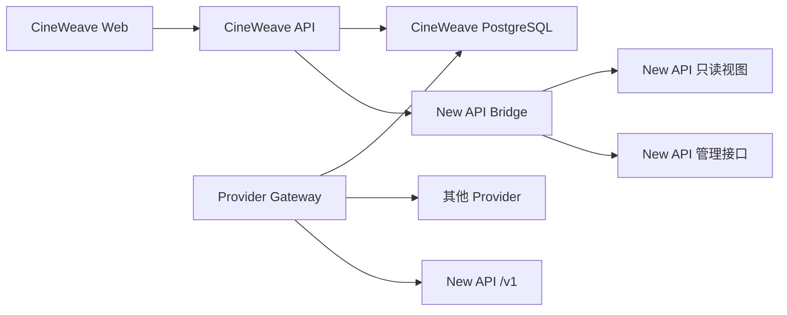

# CineWeave 与 New API 深度适配目标

- 状态：实现中
- 更新时间：2026-07-30
- Core：`D:\Code\CineWeave`
- Commercial：`D:\Code\CineWeave-Commercial`

## 1. 产品边界

New API 是 CineWeave 支持的一类深度适配渠道，不是 CineWeave 的唯一
Provider，也不是所有项目的强制依赖。

CineWeave 本阶段提供：

- 为用户或组织创建 New API 影子账户；
- 影子账户默认使用 `op` 分组；
- 为一个额度账户管理多个 Token/API Key；
- 让不同 Token 拥有不同分组、模型范围、用途、限额和轮换状态；
- 从 New API 读取权威余额；
- 从 New API 同步消费日志；
- 将消费关联到 CineWeave 项目、Workflow、Provider Request、Provider Call
  和异步任务；
- 让使用 New API 托管 Token 的 Provider 调用显式绑定额度账户。

CineWeave 本阶段不提供：

- 用户充值；
- 订阅购买或变更；
- 退款；
- 支付订单；
- 发票；
- 直接修改 New API quota、订单、订阅或消费日志原始表。

充值、订阅和退款如果由运营人员直接在 New API 完成，CineWeave 只把之后
读取到的余额和消费结果当作上游事实，不提供对应操作入口。

## 2. Provider 独立性

Provider 路由必须保留两条相互独立的路径。

### 2.1 租户自管 Provider

组织在 Provider Center 配置自己的 OpenAI、Gemini、New API、OpenRouter、
Ollama 或其他 Provider API Key 时：

- 不要求创建 New API 影子账户；
- 不要求 Billing Context；
- 不读取 New API 余额；
- 只在当前组织的 `tenant_managed` Credential 中选择；
- 继续由 Provider Gateway 负责凭据解密、模型路由、调用、日志和异步任务。

### 2.2 New API 托管 Provider

使用 Commercial 影子账户及托管 Token 时：

- Provider Credential 为 `system_managed`；
- 项目显式绑定一个额度账户；
- Provider create 携带不可变 Billing Context；
- 每次尚未发送给上游的 create 都重新校验账户、Token、分组和模型范围；
- 不允许跨组织、跨账户或跨 Billing Authority fallback；
- poll、cancel 和 finalize 继续使用 create 时固定的 Credential。

New API 或 Commercial Bridge 不健康时，只阻止依赖 New API 托管 Token 的
新 create；租户自管 Provider 不受影响。

## 3. 版本结构

### 3.1 Community Core

公共 Core 必须可以独立部署并完成核心内容生产。Core 包含：

- Provider Gateway；
- OpenAI-compatible Provider 连接；
- Provider 账户、Credential、模型和能力管理；
- Workflow、Worker、项目、媒体和对象存储；
- Edition、Entitlement、Commercial Module 与 Billing Routing 的稳定接口；
- Community 默认实现。

Core 不包含 New API 影子账户、额度账户、托管 Token、余额或消费同步实现。

### 3.2 Internal Commercial

Commercial 是私有兄弟仓库，只供 CineWeave 自己装配和运行。它通过固定的
Overlay 与模块接口提供：

- New API Billing Bridge；
- 影子账户 provisioning；
- 额度账户与项目绑定；
- 多 Credential 映射与轮换；
- 余额读取和缓存；
- 用量同步与归因；
- Commercial API、Web 页面、迁移和种子。

Commercial 不使用客户 License Key，也不向客户交付商业源码或商业镜像。

## 4. 服务边界

强制规则：

- API Server 和 Worker 不直接调用上游 AI；
- API Server 和 Worker 不解密 Provider Credential；
- Provider Gateway 是 AI 上游唯一出口；
- Billing Bridge 只处理 New API 账户、余额、用量和托管 Credential 预检；
- New API 数据库连接必须为只读；
- 写操作只使用固定版本的 New API 管理 API；
- Bridge 不提供充值、订阅购买、订单或退款路由。

## 5. 额度账户与多 Credential

一个 BillingAccount 永久绑定一个 BillingAuthority 和一个 New API 外部用户。
一个 BillingAccount 可以有多个 BillingCredential。

BillingCredential 至少保存：

- `billing_account_id`
- `billing_authority_id`
- `credential_key`
- `purpose`
- `external_token_id`
- `external_token_group`
- `external_model_scope_hash`
- `provider_credential_id`
- `status`
- `credential_revision`
- `attempt_generation`

约束：

- 外部用户 ID、Token ID 和日志 ID 只在 BillingAuthority 范围内唯一；
- 一个 Provider Credential 只能映射一个活动 BillingCredential；
- Token secret 只在 provisioning/轮换过程中短暂存在；
- Secret 只能交给 Provider Gateway 的凭据导入接口；
- 数据库、日志、事件和 API 不保存或返回明文 secret；
- 轮换采用先创建并验证新 generation，再 draining 旧 generation；
- 新 create 只选择 `active` Credential；
- 旧任务继续使用已固定的 Credential。

## 6. 余额和用量

### 6.1 余额

用户看到的 New API 额度账户余额来自 New API，不从 CineWeave
`cost_records` 推算。

余额响应必须包含：

- BillingAccount 与 BillingAuthority；
- 账户状态；
- 规范化显示金额；
- `source=new_api`；
- `balanceSemanticsVersion`；
- `freshness`；
- `asOf`。

上游不可用时可以返回最后一次成功缓存并标记 `stale`，但不能显示为实时余额。

### 6.2 用量

Bridge 从 `cineweave_billing_transactions_v1` 或固定的 New API 消费日志 API
读取数据，写入 Commercial 交易投影，然后关联：

- `project_id`
- `workflow_run_id`
- `provider_request_id`
- `provider_call_id`
- `provider_async_task_id`

同步必须幂等。同一外部日志重复出现时不产生重复交易。

New API 侧只读视图仅包括：

- `cineweave_billing_schema_version_v1`
- `cineweave_billing_accounts_v1`
- `cineweave_billing_transactions_v1`

## 7. API 与前端

公开 Commercial API 只提供：

- 个人影子账户 ensure；
- 账户列表、详情和余额；
- 组织额度账户创建与列表；
- 项目额度账户绑定与可用性；
- 个人额度账户项目授权及撤销；
- 消费明细；
- 管理员 provisioning attestation。

不得注册以下路由：

- `/plans`
- `/subscription`
- `/orders`
- `/top-up-orders`
- `/subscription-orders`
- `/refund-orders`

计费中心只展示：

- New API 额度账户；
- 权威余额；
- 消费明细；
- 项目额度账户绑定；
- 影子账户/Token provisioning 状态。

前端不得出现充值、订阅购买或退款控件。

## 8. 权限与 Feature

Commercial Feature：

- `billing.shadow_account`
- `billing.balance`
- `billing.organization_wallet`
- `billing.usage`

权限：

- `billing.read`
- `billing.spend`
- `billing.sponsor`
- `billing.manage`
- `billing.reconcile`
- `billing.audit`

不定义 `billing.topup`、`billing.subscription.manage` 或 `billing.refund`。

`billing.spend` 只允许项目使用已绑定的 New API 托管额度账户，不改变租户自管
Provider 的现有 RBAC 行为。

## 9. 验收标准

- Community Core 在没有 Commercial 模块、Bridge 和 New API 账户时可以启动、
  配置 Provider 并执行任务；
- 租户自管 Provider 的路由测试证明 Billing Context 为空时不访问 New API；
- New API 影子用户与生成 Token 默认属于 `op` 分组；
- 同一额度账户支持多个不同分组/模型范围的 Credential；
- 余额只来自 New API；
- 用量可以关联到 Provider Request/Call/Async Task；
- 公网 API、内部 Bridge、OpenAPI、Web 客户端和页面均不存在充值、订阅购买、
  订单或退款入口；
- New API 只读视图只暴露账户和消费所需字段；
- Secret 不进入数据库、日志、事件或证据文件；
- Core、Commercial、OpenAPI、Web 和 migration 测试全部通过。

生产部署、数据库迁移和真实 Provider 计费 smoke 仍是单独任务；本文档和本轮
源码修改本身不代表已经部署。
