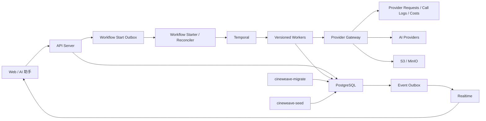

# CineWeave 运行时基础设施重构目标文档

状态：目标规格
更新时间：2026-07-14
适用范围：Provider Gateway、数据库迁移、Temporal Worker、持久任务、任务活动前端

本文档定义 CineWeave 下一阶段运行时基础设施重构的目标状态、强制约束、实施顺序和验收门槛。它不是当前完成情况说明。任务执行状态维护在 `docs/runtime-foundation-hardening-progress.md`，部署与故障处置维护在 `docs/runtime-foundation-hardening-runbook.md`，总体执行入口仍为 `docs/codex-execution-plan.md`，详细通用开发任务仍维护在 `docs/follow-up-development-plan.md`。

## 1. 目标

本轮重构完成后，系统必须满足以下结果：

- Provider Gateway 对上游调用、流式完整性、媒体下载、幂等、调用日志和成本记录形成单一可信边界。
- 上游流被截断时不得把部分文本当作成功结果写入剧本、分镜、提示词或 Agent 输出。
- 图片、视频和音频媒体转存不得通过 DNS rebinding、重定向或代理配置访问未授权内网地址。
- API 创建的生产任务即使在 API、Worker 或浏览器退出后也能继续运行、恢复、取消和查询。
- 资产批量生成不再由浏览器内存承载，页面刷新、切换设备和重新登录不会丢失任务状态。
- 数据库 schema 只由一个迁移引擎维护；业务 SQL 不再自行写入迁移账本。
- Worker 版本使用不可变 Build ID，发布、导流、回滚和旧版本排空由独立发布流程控制。
- 70 分钟及更长的生产 Workflow 可以跨应用发布继续运行，且不会因同一 Build ID 对应不同代码而重放失败。

## 2. 强制决策

- 项目仍处于开发阶段，不保留旧 demo、旧数据或旧迁移账本兼容逻辑；应用开发数据库允许重建。
- 不兼容旧业务数据不代表可以破坏正在运行的 Workflow。启用长任务后，数据库和内部服务协议必须支持至少 N-1 运行时版本。
- API Server 和 Worker 仍不得直接调用上游供应商或解密供应商凭据。
- Provider Gateway 继续拥有 credential 解密、模型路由、上游调用、错误归一化、日志、成本、租约、额度和熔断。
- Docker Compose 仍是当前服务器部署入口；本轮不要求迁移到 Kubernetes。
- 不新增常驻媒体下载服务。安全媒体下载作为 Provider Gateway 内部基础组件实现。
- 引入一个统一数据库迁移依赖 `github.com/pressly/goose/v3`，使用固定版本，不使用 `@latest`。
- 生产数据库回滚采用前向修复和 expand/contract migration，不自动执行破坏性 down migration。

## 3. 当前问题与目标决策

| 当前问题 | 主要风险 | 目标决策 |
| --- | --- | --- |
| URL 校验和实际下载分别解析 DNS | DNS rebinding SSRF | 解析后固定已验证 IP，由统一 MediaFetcher 下载 |
| `unexpected EOF` 被视为正常流结束 | 部分输出被提交为成功 | 明确流终态协议，截断统一失败 |
| Provider idempotency key 只写日志 | Worker 重试导致重复调用和重复计费 | 新增逻辑请求层 `provider_requests` |
| Provider 调用结束后才写完整日志 | 进程崩溃后调用结果和费用不可判定 | 调用前持久化 running，结束后原子完成 |
| API 插入 `workflow_runs` 后直接启动 Temporal | API 崩溃后任务永久 queued | 新增 Workflow start outbox 与 reconciler |
| 资产批任务保存在 Zustand 内存 | 刷新后队列和进度丢失 | Temporal 承载批次，前端只查询和订阅 |
| SQL 文件自行维护 `schema_migrations` | 重复迁移、错误跳过、回滚账本失真 | Goose 独占版本账本 |
| 所有构建默认使用 `cineweave-dev` | 不同代码被视为同一 Worker 版本 | Build ID 使用不可变发布 ID |
| Worker 启动时自动晋级版本 | 旧容器重启可能回切版本 | 注册与 promotion 分离 |

## 4. 目标架构



## 5. Provider Gateway 目标设计

### 5.1 安全媒体下载

新增 `internal/provider/outbound`，统一提供 `MediaFetcher`、`NetworkPolicy`、`Resolver` 和可测试的 pinned dialer。

必须满足：

- 供应商账号中由管理员配置的 API base URL 与供应商响应中的媒体 URL 使用不同信任策略。
- 媒体 URL 默认只允许 HTTP/HTTPS，不允许 userinfo、非规范主机名和未授权私有地址。
- 域名解析后检查全部 A/AAAA 地址；任何地址命中拒绝网段时整个请求失败。
- 连接只能在预先验证的地址集合中故障切换，不得在 Dial 阶段重新解析 DNS。
- TLS 连接保留原始 hostname 作为证书校验和 SNI，不能因为固定 IP 而关闭证书验证。
- 每次重定向重新执行 URL、DNS 和端口策略；限制重定向次数，禁止 HTTPS 降级到 HTTP。
- 拒绝 loopback、RFC1918、IPv6 ULA、link-local、CGNAT、benchmark、multicast、unspecified 和云元数据地址段。
- 默认不继承通用 `HTTP_PROXY`、`HTTPS_PROXY` 或 `ALL_PROXY`。需要代理时使用专用受控 egress proxy 配置。
- 私有媒体地址只允许供应商账号级精确 host/CIDR 白名单，并要求组织管理员权限。
- 响应体按媒体类型设置最大字节数、总超时、首字节超时和 MIME 约束。
- 数据必须边下载边计算 hash 并流式写入对象存储，禁止将大型视频整体缓存在进程内存中。
- 图片、视频、音频和未来文件输出都必须复用同一下载组件。

Provider API base URL 仍允许管理员配置的内网地址，以支持 Ollama 和私有 OpenAI-compatible 服务；该能力不得被媒体 URL 的 public-only 默认策略误伤。

### 5.2 流式完整性协议

将流式实现拆为三层：

1. 有界行读取器：分块读取，在扩容前执行 line/event 大小限制。
2. SSE 解码器：只负责 SSE 字段、注释、多行 data 和事件边界。
3. Provider 协议适配器：判断 OpenAI-compatible 等协议是否真正完成。

供应商模型能力新增：

```text
streamTerminalMode:
- done_marker
- finish_reason
- done_or_finish_reason
```

规则：

- `io.ErrUnexpectedEOF`、连接重置和 HTTP/2 stream error 一律归一化为 `UPSTREAM_STREAM_TRUNCATED`。
- 不支持 `clean_eof` 作为默认成功条件，因为它无法证明响应完整。
- 每个 delta 包含 `providerRequestId`、`providerCallId`、`attempt` 和单调递增 `sequence`。
- `text.generate` 在结果未暴露给调用方时可以对整个逻辑请求重试。
- `text.stream` 一旦向下游发送 delta 就不能透明拼接重试；失败时发送 `provider.failed`，并持久化失败状态。
- 重试创建新的 attempt；前端和 Agent 只把当前 attempt 作为有效输出，避免重复文本。
- Workflow 只有在收到明确完成终态后才能提交剧本、分镜、资产提示词或视频提示词。

### 5.3 Provider 逻辑请求与幂等

新增 `provider_requests`，表示一次用户或 Workflow 发起的逻辑调用；`provider_call_logs` 表示该逻辑调用下的真实供应商尝试，包括模型 fallback。

`provider_requests` 至少包含：

```text
id
organization_id
project_id
workflow_run_id
node_run_id
task_type
idempotency_key
request_hash
status
attempt_generation
result_snapshot
artifact_ids
media_file_ids
error_code
error_message
expires_at
created_at
started_at
completed_at
```

状态至少包含：

```text
pending / running / succeeded / failed / cancelled / unknown_outcome
```

约束和行为：

- 唯一键为 `(organization_id, task_type, idempotency_key)`，非空 idempotency key 才参与去重。
- 相同 key、相同 request hash 且已成功时直接重放规范化结果，不再次调用供应商。
- 相同 key、不同 request hash 返回 idempotency conflict。
- 相同 key 仍在运行时返回当前请求状态，不创建第二个上游调用。
- Provider Gateway 必须在上游调用前创建 `provider_requests` 和 running `provider_call_logs`。
- fallback 尝试共享同一个 provider request，但拥有不同 provider call log。
- 如果同步供应商调用成功后进程在结果落库前崩溃，且上游不支持查询或幂等恢复，则标记 `unknown_outcome`。
- `unknown_outcome` 不自动重发；用户明确重试后增加 `attempt_generation`，避免静默重复计费。
- 异步视频任务必须先持久化 external task ID，再进入轮询；重试优先恢复轮询，不重新创建任务。
- 成本记录只在结果可确认时写确定费用；`unknown_outcome` 可记录潜在费用告警，但不得伪装为零成本。

## 6. 数据库迁移与内置数据

### 6.1 新迁移基线

不把现有迁移机械转换为 67 个新文件。开发库重建时生成新的目标基线：

```text
db/migrations/
  000001_current_schema.sql
  000002_runtime_hardening.sql
```

- `000001_current_schema.sql` 表示当前业务 schema 的干净基线。
- `000002_runtime_hardening.sql` 增加 provider request、workflow outbox、任务进度、revision 和本轮目标约束。
- 后续迁移只能追加，不得修改已发布编号。
- 每个 Goose 文件使用 `-- +goose Up` 和 `-- +goose Down`；PL/pgSQL 使用 `StatementBegin/StatementEnd`。
- schema migration 中不得包含 Prompt、模型榜单、视觉手册正文或大量业务 seed。

### 6.2 迁移执行器

新增：

```text
cmd/cineweave-migrate
db/migrations/embed.go
```

要求：

- 使用 `go:embed` 将迁移编入与应用同一版本的镜像。
- Goose 独占 `cineweave_schema_versions`，业务迁移不得直接插入或删除版本行。
- 迁移启动使用数据库 advisory lock，禁止两个部署实例同时执行。
- 记录迁移版本、内容 SHA-256、执行时间和镜像 release ID；已应用版本 hash 不一致时拒绝启动。
- Compose 的 API、Gateway 和 Worker 依赖 migrate service 成功完成。
- PowerShell 本地入口调用同一个 Go 二进制，不再通过管道逐文件发送 SQL。
- `down`、`down-to` 和 `reset` 只允许开发/CI 环境；生产环境命令显式拒绝。

### 6.3 内置数据 Seed

新增：

```text
cmd/cineweave-seed
db/seeds/provider-catalog/
db/seeds/model-capabilities/
db/seeds/prompt-registry/
db/seeds/project-manuals/
db/seeds/rbac/
```

要求：

- Seed 使用稳定 key 和内容 hash 幂等写入。
- 系统内置记录标记 `managed_by=system`；用户覆盖和系统默认内容分层保存。
- Seed 更新不得复活用户已禁用的供应商模型。
- Toonflow 大型手册和 Prompt 内容作为版本化资源加载，不再形成数万行 schema migration。
- Compose 顺序固定为 `migrate -> seed -> app services`。

## 7. Workflow 启动一致性

新增 `workflow_start_outbox`，解决数据库任务记录和 Temporal 启动之间的双写问题。

API 创建 Workflow 时必须在同一数据库事务内：

1. 创建 `workflow_runs`，状态为 `queued`。
2. 创建 `workflow_start_outbox`，保存 workflow type、Temporal workflow ID、task queue 和输入 hash。
3. 提交事务并返回 `202 Accepted`。

Workflow Starter/Reconciler 负责：

- 使用确定性的 Temporal workflow ID 启动任务。
- 对启动失败执行有界退避重试。
- 利用 Temporal workflow ID 去重处理重复消息。
- 启动成功后更新 outbox 和 `workflow_runs.started_at/status`。
- 定期扫描超时 queued 任务，修复 API 崩溃或消息遗漏。
- 超过最大重试次数后写明确失败码，不允许永久 queued。

启动 dispatcher 可以复用现有 Event Publisher 进程或实现为 API 内受控后台组件，但数据库 outbox 必须是事实来源。

## 8. 持久化批处理任务

### 8.1 数据模型

扩展 `workflow_runs`：

```text
workflow_type
total_items
completed_items
failed_items
revision
root_workflow_run_id
retry_of_workflow_run_id
```

Workflow 状态统一为：

```text
pending / queued / running / waiting_review / cancelling
partial_succeeded / succeeded / failed / cancelled / skipped
```

`partial_succeeded` 是终态，不能继续计入主导航活动任务数字。

### 8.2 Temporal 执行模型

新增父 Workflow：

- `BatchGenerateAssetCardsWorkflow`
- `BatchGenerateCanonicalAssetImagesWorkflow`

执行规则：

- 每个资产是一个独立 child Workflow，并映射为一个 `workflow_node_runs` 节点。
- 父 Workflow 负责并发窗口、聚合状态、取消传播和 Continue-As-New。
- 默认并发 5，同时受 Provider Gateway lease、quota 和 circuit breaker 限制。
- child Workflow ID 由父 workflow run、资产 ID、操作类型和 attempt generation 确定性生成。
- 单项失败不使父 Workflow 直接失败；父 Workflow 最终返回 succeeded、partial_succeeded 或 failed。
- 重试失败项创建新的关联 Workflow Run，不修改原任务的历史结果。
- 达到历史事件或项目数量阈值时 Continue-As-New，进度以数据库投影恢复。
- Provider idempotency key 至少包含 workflow run、node key 和 attempt generation。

### 8.3 编辑冲突与结果版本

`canonical_assets` 增加 `revision` 和 `prompt_revision`：

- 批任务开始时快照资产 revision、视觉手册版本、Prompt version、模型 profile 和项目比例。
- 用户在任务执行期间手工修改资产后，旧任务不得覆盖新 revision。
- 冲突结果保存为历史版本并标记 `upstream_changed` 或 `conflict_skipped`。
- 图片结果记录生成时使用的 prompt revision；如果当前 prompt 已变化，图片不能自动成为主参考图。
- 所有写操作使用 expected revision 或 `If-Match` 实现乐观并发。

### 8.4 API

新增或收敛：

```text
POST /api/projects/{projectId}/asset-batches
GET  /api/workflow-runs/{workflowRunId}
GET  /api/workflow-runs/{workflowRunId}/nodes
POST /api/workflow-runs/{workflowRunId}/retry-failed
POST /api/workflow-runs/{workflowRunId}/cancel
```

创建批次请求至少包含：

```text
operation: generate_prompts | generate_images
assetIds
maxConcurrency
force
expectedProjectRevision
```

所有公开变更必须同步更新 OpenAPI、Go handler、前端 API client/types 和路由一致性检查。

## 9. 前端任务活动

- 删除浏览器侧 `runAssetBatch` 并发调度。
- Zustand 只保存抽屉开关、过滤条件和连接状态，不保存权威任务记录。
- React Query 从 Workflow API 加载 active/recent runs 和 node runs。
- Realtime 事件只更新或失效 Query cache；断线重连后必须重新查询服务端。
- Workflow 和节点更新携带 `revision`；前端忽略 revision 较旧的乱序事件。
- 页面刷新、换路由、重新登录和另一设备打开项目后均能恢复任务。
- 顶部任务数字只统计 queued、running、waiting_review 和 cancelling。
- partial_succeeded、succeeded、failed 和 cancelled 均为已结束状态。
- 失败项展示真实归一化错误，支持按失败项创建重试任务。

## 10. Temporal Worker 发布

### 10.1 版本策略

- 将 Temporal Server 独立升级到经过验证并固定 digest 的 `1.31.x` patch 版本。
- 生产环境不再依赖 `temporalio/auto-setup` 隐式升级 schema；增加显式 Temporal schema one-shot service。
- Temporal Build ID 直接使用不可变 `CINEWEAVE_RELEASE_ID`，例如 Git SHA 加构建编号；生产环境缺失或使用 `local-dev`、`latest` 等可变值时拒绝启动。
- Worker 启动只注册 Deployment Version，不自动设置 Current Version。
- 新增 `cmd/temporal-release`，提供 check、ramp、promote、drain 和 rollback。

### 10.2 Task Queue 与版本行为

- Project Agent Workflow 使用独立 Agent task queue，可采用 AutoUpgrade，但所有不兼容 Workflow 代码修改必须使用 Temporal patch/version API。
- 长生产 Workflow 使用 production task queue 和 Pinned 行为。
- Script、Media、Audio Worker 使用同一 release ID，并保持跨 task queue 的发布关联。
- 旧 Pinned Workflow 未排空前必须保留对应旧 Worker 镜像和容器。

Pinned 与 AutoUpgrade 的行为必须以当前固定 Temporal SDK/Server 版本的官方定义为准，不在业务代码中自行模拟。

### 10.3 Compose 蓝绿发布

- 基础设施和应用服务使用稳定 Compose project。
- Worker release 使用独立 Compose 文件和带 release ID 的 Compose project name。
- PostgreSQL、Temporal、Provider Gateway 和 Workers 接入显式 external internal network，避免不同 Compose project 网络隔离。
- 新 Worker 启动后先等待全部 Deployment Version 注册，再进行小比例 ramp 和 current promotion。
- 旧 Worker 只在对应版本无活跃/可达 Workflow 后停止。
- 回滚优先把新任务导流回上一 Build ID；已运行的 Pinned Workflow 按其版本继续处理。

### 10.4 运行时 N-1 兼容

为了允许旧 Worker 排空，发布期间必须满足：

- Provider Gateway 内部请求/响应结构至少兼容上一 release，字段变更优先新增而不是原地改义。
- 数据库变更使用 expand、双读/双写、切换、contract 顺序；contract 只能在旧 Worker 排空后执行。
- 删除枚举、列、Prompt key、内部 endpoint 或 task queue 前必须确认旧版本不可达。
- Workflow 代码使用 Temporal version/patch API，关键 Workflow 维护历史重放 fixture。

此处的 N-1 是运行中任务兼容，不是旧 demo 或旧业务数据兼容。

## 11. 可观测性

必须增加以下指标或结构化日志字段：

- Provider：request status、attempt、terminal mode、stream truncation、media policy rejection、download bytes、redirect count。
- 幂等：dedupe hit、hash conflict、unknown outcome、explicit retry。
- Workflow：queued age、start outbox attempts、node progress、partial completion、cancellation age。
- Temporal：deployment name、Build ID、current/ramping version、旧版本 backlog。
- Migration：version、hash、duration、release ID、失败语句摘要。
- 统一关联字段：requestId、workflowRunId、nodeRunId、providerRequestId、providerCallId、artifactId。

需要告警的状态：

- Workflow queued 超过启动阈值。
- Provider request 长时间 running 或进入 unknown_outcome。
- SSE truncation 短时间集中出现。
- Pinned 旧 Worker backlog 长时间不下降。
- 迁移 hash 与数据库记录不一致。

## 12. 实施阶段

### T0：基线与决策锁定

- 保存当前 dirty worktree 的可回退基线。
- 增加 Provider、迁移、Workflow outbox、Temporal 发布 ADR。
- 固定当前测试结果、OpenAPI 路由清单和 Compose 配置。

完成门槛：当前改动有明确边界，后续每个阶段可以独立审查和回滚。

### T1：Provider 安全和流完整性

- 实现 MediaFetcher 并替换图片、视频、音频媒体下载。
- 重写有界 SSE decoder 和协议终态状态机。
- 增加截断、重定向和 DNS rebinding 测试。

完成门槛：部分流不再成功落库，媒体 URL 无法访问未授权内网。

### T2：新数据库基线与 Seed

- 引入 Goose 和 `cineweave-migrate`。
- 生成 `000001/000002` 新基线。
- 拆分 Prompt、模型目录、Toonflow 手册和 RBAC seed。
- 删除旧迁移账本逻辑和 shell runner。
- 重建开发数据库。

完成门槛：空库 migrate、seed、down-to-zero、再次 migrate/seed 均通过；生产命令拒绝 down。

### T3：Provider 请求幂等与 Workflow Start Outbox

- 新增 `provider_requests` 和 unknown outcome 处理。
- Provider call 在上游请求前持久化 running。
- 新增 Workflow start outbox、starter 和 queued reconciler。

完成门槛：重复 API/Activity 请求不产生第二次已知上游调用；API 在任意启动阶段崩溃后任务可恢复或明确失败。

### T4：Temporal 发布体系

- 升级 Temporal Server 并显式管理 Temporal schema。
- 引入不可变 Build ID、独立 promotion 命令和蓝绿 Worker Compose。
- 拆分 Agent 与长生产 Workflow 的版本行为。
- 增加 Workflow history replay 和 determinism 检查。

完成门槛：模拟长 Workflow 在新版本发布期间继续完成，上一 Build ID 可回滚和排空。

### T5：持久化资产批处理与前端切换

- 实现资产 Prompt/图片父子 Workflow。
- 增加进度、partial_succeeded、失败重试、revision 和编辑冲突处理。
- 前端改为服务端 Workflow 查询和 Realtime 同步。
- 删除 Zustand 权威批任务状态和客户端并发执行器。

完成门槛：刷新浏览器后任务继续执行并恢复进度；单项失败不终止整个批次；失败项可单独重试。

### T6：清理与运行验收

- 删除旧迁移 runner、旧批处理 store、重复媒体下载器和旧自动 promotion 逻辑。
- 完成结构化日志、指标和运行手册。
- 重建 Compose 并执行真实供应商 smoke test。

完成门槛：本文件第 14 节全部通过。

## 13. 破坏性切换规则

- 应用开发数据库在 T2 允许删除并重建，不编写旧 schema 兼容迁移。
- 执行删除前必须明确停止 API、Gateway 和 Workers，避免产生新的写入。
- 可保留一次数据库快照用于工程回滚，但不把快照转换成产品兼容逻辑。
- Provider credential 如需保留，只能通过受控导出/重新录入处理，不得把明文密钥写进仓库或日志。
- Temporal 开发数据库可在没有需要保留的任务时重建；存在需要保留的长任务时必须先完成或取消。
- 完成 T4 后，任何运行中 Pinned Workflow 都不得通过删除 Temporal 数据库处理发布问题。

## 14. 验收计划

### 14.1 自动化测试

```powershell
pnpm run test
go vet ./...
go run ./cmd/cineweave-migrate validate
go run ./cmd/cineweave-seed verify
docker compose -f compose.yml config --quiet
```

数据库 CI 必须额外执行：

```text
empty database -> migrate up -> seed -> schema snapshot
down-to-zero in test environment -> migrate up -> seed -> schema snapshot
compare normalized schema snapshots
```

### 14.2 Provider 故障测试

- DNS 首次返回公网地址、后续返回私网地址时仍只能连接已固定公网地址。
- 重定向到 localhost、Docker service name、MinIO、PostgreSQL 或 metadata endpoint 时被拒绝。
- 上游在任意 delta 字节位置中断时不得产生成功输出。
- 超长单行和超长事件返回受控错误，进程内存不随输入无限增长。
- 相同 idempotency key 并发请求只产生一个逻辑 Provider Request。
- 上游结果未知时进入 unknown_outcome，不自动重复调用。

### 14.3 Workflow 与前端测试

- API 在 workflow run 落库后、Temporal 启动前退出，任务由 reconciler 恢复。
- Worker 在单项资产运行中退出，恢复后不重复提交已知供应商请求。
- 100 个资产、并发 5、部分失败时最终状态为 partial_succeeded。
- 浏览器刷新、退出登录和另一浏览器打开后能恢复同一任务进度。
- 用户在批任务运行期间编辑资产时，旧任务结果不覆盖新 revision。
- 取消父 Workflow 后 child Workflow 和可取消的 Provider async task 被同步取消。

### 14.4 发布测试

- 启动旧 Build ID 的长 Workflow。
- 部署新 Build ID，但不自动 promotion。
- 验证新版本注册、ramp、promote 和回滚。
- 验证旧 Pinned Workflow 仍由旧 Worker 完成。
- 验证旧版本排空前数据库和 Provider Gateway N-1 contract 可用。
- 排空后停止旧 Worker，并确认无不可达 Workflow。

### 14.5 运行验证

```powershell
docker compose -f compose.yml --profile app up -d --build
docker compose -f compose.yml --profile app ps
```

Smoke 必须覆盖：文本流、图片生成与媒体转存、异步视频创建/轮询、资产批量 Prompt、资产批量图片、部分失败重试、取消和页面刷新恢复。

## 15. 完成定义

只有同时满足以下条件，本轮运行时基础设施重构才算完成：

- 五个原始评审问题均由统一架构解决，而不是保留局部补丁和重复实现。
- Provider 请求具备真实逻辑幂等和 unknown outcome 语义。
- Workflow 创建不存在数据库与 Temporal 的永久双写悬挂状态。
- 浏览器不再拥有生产批任务的执行权和权威状态。
- Worker Build ID 对每个发布唯一，启动过程不再自动修改 current version。
- 新迁移系统只有一个账本所有者，内置业务数据与 schema migration 分离。
- 长 Workflow 已通过跨 Build ID 的真实或受控集成测试。
- `pnpm run test`、迁移往返、Compose 配置和运行 smoke 全部通过。
- OpenAPI、前端类型、运行文档和部署命令与最终实现一致。

## 16. 明确不在本轮范围

- Kubernetes、服务网格或多区域 Temporal 集群。
- 完整财务预算预测和生成前成本报价。
- 对旧 demo、旧数据库或旧迁移账本提供产品级兼容迁移。
- 将 Provider Gateway 拆成多个独立微服务。
- 把用户可编辑 Prompt、视觉手册或模型目录重新固化进 schema migration。

## 17. 参考资料

- [Goose 官方仓库](https://github.com/pressly/goose)
- [Goose Go API](https://pkg.go.dev/github.com/pressly/goose/v3)
- [Temporal 1.31 Worker Deployment GA 发布说明](https://github.com/temporalio/temporal/releases/tag/v1.31.0)
- [Temporal Go SDK VersioningBehavior](https://github.com/temporalio/sdk-go/blob/master/workflow/workflow.go)
- `docs/provider-gateway.md`
- `docs/workflow-engine.md`
- `docs/codex-execution-plan.md`
- `docs/follow-up-development-plan.md`
