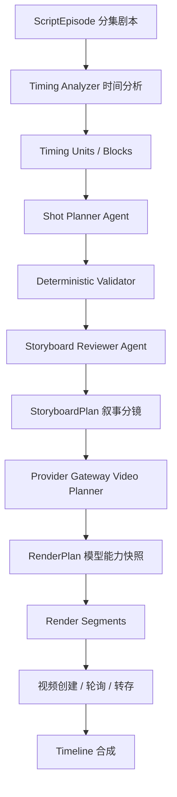

# CineWeave 剧本到分镜时长与视频模型适配重构方案

本文档定义 CineWeave 从分集剧本生成分镜时，关于镜头数量估算、对白与动作时长计算、长镜头拆分、视频模型时长适配、原生音视频生成和未来角色 TTS 接入的长期实现方案。

- 文档状态：P0-P5 已实施，P6 延后
- 适用仓库：`D:\Code\CineWeave`
- 调研日期：2026-07-12

## 1. 结论先行

当前实现把以下三个不同概念混在了一个 `duration_seconds` 字段里：

1. 剧本内容真实需要的叙事时长。
2. 导演层面一个分镜镜头应持续多久。
3. 某个视频模型单次请求能生成多少秒。

重构后必须拆成三层：

```text
剧本时间单元 Script Timing Unit
        ↓
叙事分镜镜头 Storyboard Shot
        ↓
供应商执行片段 Provider Render Segment
```

核心决策：

1. 不再使用“每 400 字一个镜头”估算镜头数。
2. 不再设置每集 24 个镜头的全局上限。
3. 不再把所有分镜时长强制截断为 15 秒。
4. 分镜镜头是叙事和摄影概念；视频模型片段是供应商执行概念。一个分镜镜头可以映射到多个视频生成片段。
5. Agent 负责理解语义、动作节拍和摄影意图；确定性代码负责时长计算、完整覆盖、合法切点和模型约束校验。
6. 当前优先支持视频模型原生生成画面、对白、环境声和音效；角色 TTS 已作为可替换音频轨道接入，并通过实际音频时长创建独立 timing revision。
7. 所有模型选择、能力解析、时长量化和上游调用继续由 Provider Gateway 负责。
8. 项目仍在开发阶段，不做旧分镜数据兼容。新模型上线后直接重新生成开发数据。
9. 项目默认帧率统一为 24 FPS，内部时间轴使用每秒 90,000 ticks 的整数时间基准；秒和毫秒只用于接口展示和供应商请求。

## 2. 当前问题与已验证证据

### 2.1 代码层问题

| 位置 | 当前行为 | 后果 |
| --- | --- | --- |
| `internal/workflows/script_driven.go` | `ceil(字符数 / 400)`，最少 8、最多 24 个镜头 | 长剧本被压进少量超长镜头 |
| `internal/workflows/script_driven.go` | Prompt 明确要求到达 `maxShots` 后不得继续拆镜 | Agent 被迫把多个对白和动作塞入同一镜头 |
| `internal/workflows/storyboard_shots.go` | 所有镜头超过 15 秒即截断为 15 秒 | 原始时长信息被静默破坏 |
| `internal/workflows/video.go`、`video_activities.go` | 视频阶段继续使用全局 `maxShotDuration=15` | 叙事镜头与模型单次请求时长耦合 |
| `internal/provider/model_constraints.go` | 运行时只解析 Prompt 长度限制 | 视频时长、原生音频和请求模式没有进入执行规划 |
| `generateScriptStoryboardEpisodes` | 每集由一次大型文本调用生成整集分镜 | 长分集易超上下文、超输出、失败后只能整集重试 |

### 2.2 当前样本

已检查的一集剧本正文约 6,355 个字符：

```text
ceil(6355 / 400) = 16 个镜头
```

Agent 原始返回 16 个镜头，时长分别为：

```text
28, 22, 20, 35, 25, 22, 15, 22,
42, 45, 35, 18, 20, 26, 20, 15 秒
```

原始总时长是 410 秒，平均每镜 25.625 秒。入库时全部被截到 15 秒，总时长变成 240 秒，静默丢失 170 秒，误差约 41.5%。因此“当前所有镜头都是 15 秒”不是正确的创作结果，而是全局截断造成的数据损坏。

## 3. 外部调研结论

没有成熟的行业库可以直接把任意中文剧本可靠地换算为镜头数。可复用的是一组成熟方法：时间对齐、音素时长预测、约束式分段、分层长视频规划和持久工作流。

### 3.1 对白时长

- 普通话研究中的清晰朗读、普通朗读和自然口语速率约为 5.20、5.97、5.49 音节/秒；另一自然普通话语料统计为 5.16 音节/秒。这些值主要描述排除静音后的发音速率，只作为背景校准，不作为 CineWeave 的生产计算标准。[Syllabic reduction in Mandarin and English speech](https://pmc.ncbi.nlm.nih.gov/articles/PMC4032433/)、[Functional timing or rhythmical timing, or both?](https://discovery.ucl.ac.uk/id/eprint/10164914/1/fpsyg-13-869049.pdf)
- CineWeave 统一采用每秒 3–4 个汉字的工程标准：慢台词按 3 字/秒，普通台词按 3.5 字/秒，快节奏对白按 4 字/秒。标点、表演停顿和说话人切换在此基础上额外计时。
- Netflix 简体中文字幕规范给出的成人节目上限是 9 字/秒。该值适合做屏幕可读性下限校验，不应直接当作演员说话速度。[Netflix 简体中文 Timed Text 指南](https://partnerhelp.netflixstudios.com/hc/en-us/articles/215986007-Chinese-Simplified-Timed-Text-Style-Guide)
- FastSpeech 使用音素时长预测和 length regulator 控制语音长度，说明未来接入 TTS 后应以音素或实际音频时长替换字符估算。[FastSpeech](https://arxiv.org/abs/1905.09263)
- 总时长感知的 TTS 研究表明，目标总时长与语速、可懂度和说话人特征存在权衡，不能为适配视频片段而无限压缩对白。[Total-Duration-Aware Duration Modeling](https://arxiv.org/abs/2406.04281)

### 3.2 剧本、对白与镜头对齐

- StoryMovie 通过 LCS 将剧本对白与字幕时间戳对齐，说明对白必须拥有稳定标识和时间位置，不能只靠文本标题或模糊匹配。[StoryMovie](https://arxiv.org/abs/2602.21829)
- 叙事改编研究使用 Smith-Waterman 与语义向量对小说单元、剧本场景做有序对齐，支持 CineWeave 继续保留 source、episode、scene、dialogue 的显式来源关系。[Analyzing Film Adaptation through Narrative Alignment](https://arxiv.org/abs/2311.04020)
- Netflix 的时间规范要求字幕与音频、画面同步，并把镜头切换和场景切换视为明确的时间边界。这可作为对白切点和镜头边界校验的参考，而不是直接照搬成剪辑规则。[Netflix Subtitle Timing Guidelines](https://partnerhelp.netflixstudios.com/hc/en-us/articles/360051554394-Timed-Text-Style-Guide-Subtitle-Timing-Guidelines)

### 3.3 长视频分层规划

- 近期长叙事视频研究普遍采用“全局剧本/多镜头规划 + 局部单镜头生成”，而不是把整集交给一个长 Prompt 一次生成。[The Script is All You Need](https://arxiv.org/abs/2601.17737)、[DrawVideo](https://arxiv.org/abs/2605.23508)
- 这些研究是可参考的技术方向，不是可直接用于生产的通用标准。CineWeave 仍需用确定性约束保证时长守恒、对白完整和可重试性。

### 3.4 视频模型时长差异

主流模型不存在统一时长：

| 模型 | 官方时长约束 | 原生音频 |
| --- | --- | --- |
| xAI Grok Imagine Video | 连续 1–15 秒 | 官方页面未明确保证，能力应记录为 `unknown`，以实际探测为准 |
| OpenAI Sora 2 | 离散 4、8、12 秒 | 官方模型页说明生成同步音频 |
| Google Veo 3 | 离散 4、6、8 秒 | 支持 sound generation，API 提供 `generateAudio` |

来源：[xAI Video Generation](https://docs.x.ai/developers/model-capabilities/video/generation)、[OpenAI Videos API](https://developers.openai.com/api/reference/resources/videos)、[OpenAI Sora 2](https://developers.openai.com/api/docs/models/sora-2)、[Google Veo 3](https://docs.cloud.google.com/vertex-ai/generative-ai/docs/models/veo/3-0-generate-001)

这证明供应商时长只能在 Provider Gateway 选定模型后进行量化，不能在分镜生成阶段写死 15 秒。

## 4. 目标领域模型

### 4.1 术语

| 概念 | 定义 |
| --- | --- |
| `ScriptEpisode` | 一集剧本，是分镜生产的顶层业务单元 |
| `ScriptScene` | 地点、时间或叙事场景单元 |
| `TimingUnit` | 可独立计时的对白、旁白、动作、反应、停顿、环境保持或转场 |
| `TimingBlock` | 可同时发生的一组音频和视觉 TimingUnit，块时长取各轨最大值 |
| `StoryboardPlan` | 某个剧本分集的一版完整分镜计划 |
| `StoryboardShot` | 一个连续摄影意图，包含景别、机位、运动、动作节拍和叙事时长 |
| `RenderPlan` | Provider Gateway 针对某镜头和选中模型生成的执行计划 |
| `RenderSegment` | 一次真实视频模型请求；多个片段可以组成一个分镜镜头 |
| `ContinuityGroup` | 需要保持人物、场景、构图、光线和动作连续的一组镜头或片段 |
| `TimelineTick` | 内部时间轴最小整数单位，固定每秒 90,000 ticks |

### 4.2 分层架构



`StoryboardPlan` 必须与供应商无关。更换视频模型只能重建 `RenderPlan`，不应改写剧本时长和分镜语义。

## 5. 剧本时间分析

### 5.1 稳定来源标识

目前 `StoryboardDialogueLine` 只有 `speaker/text`，重构后每个剧本时间单元必须有持久 ID，并保留：

- `script_episode_id`
- `script_scene_id`
- `source_chapter_id`
- `source_start_offset`、`source_end_offset`
- `episode_ordinal`、`scene_ordinal`、`unit_ordinal`
- 原始中文文本
- 说话人、对白类型、表演指令
- 来源 Prompt、模型和分析版本

不得再使用显示标题推断来源顺序，也不得只用 `speaker + text` 作为长期唯一键。重复台词必须仍然能区分。

### 5.2 TimingUnit 类型

第一版支持：

```text
dialogue          画面内对白
voiceover         画外音 / 内心独白
narration         旁白
system            系统播报
action            人物或物体动作
reaction          反应镜头
establishing      环境建立
pause             戏剧停顿
ambient_hold      环境保持
transition        转场
```

### 5.3 对白时长公式

在角色 TTS 尚未实装时，使用可解释的确定性估算：

```text
speechSeconds = cjkCharacterCount / dialogueCharactersPerSecond
pauseSeconds  = punctuationPause + deliveryPause
readabilityFloor = subtitleCharacterCount / 9

dialogueSeconds = max(
  minimumUtteranceSeconds,
  speechSeconds + pauseSeconds,
  readabilityFloor
)
```

`cjkCharacterCount` 只统计标准化后的实际发音汉字，标点不计入字数。数字、日期、金额和单位先转换为预期中文读法再计数；外语对白交给对应语言估算器，不能套用中文 3–4 字/秒规则。

统一产品参数如下。除非用户手动锁定实际音频时长，所有中文对白估算都必须使用该标准。

| 参数 | 初始值 |
| --- | --- |
| 慢台词 | 3.0 字/秒 |
| 普通台词 | 3.5 字/秒 |
| 快节奏对白 | 4.0 字/秒 |
| 最短有效话语 | 0.8 秒 |
| 逗号、顿号停顿 | 0.15 秒 |
| 句号、问号、感叹号停顿 | 0.35 秒 |
| 省略号、明显迟疑 | 0.70 秒 |
| 段落或说话人切换 | 0.25 秒 |

表演指令映射到固定语速档位，并可增加停顿：

| 表演方式 | 计算语速 | 附加停顿 |
| --- | --- | --- |
| 正常 | 3.5 字/秒 | 0 |
| 低语 | 3.0 字/秒 | 0.10 秒 |
| 哭泣/哽咽 | 3.0 字/秒 | 0.30 秒 |
| 庄重/缓慢 | 3.0 字/秒 | 0.15 秒 |
| 高喊 | 3.5 字/秒 | 0.10 秒 |
| 急促/快节奏 | 4.0 字/秒 | 0 |
| 旁白 | 3.5 字/秒 | 0.10 秒 |

任何自动映射都不得低于 3 字/秒或高于 4 字/秒；标点和表演停顿只增加总时长。不能通过翻译、删减或把语速提高到 4 字/秒以上来满足视频片段时长。

该 3–4 字/秒标准只约束当前没有角色 TTS 时的规则估算。未来 TTS 模块直接采用生成音频的实际时长创建新的 timing revision，暂不对 TTS 结果执行 3–4 字/秒校验或自动调速。

### 5.4 动作时长

动作时长不能简单按字数计算。Agent 应把动作拆成可观察、可结束的 action beat，并返回动作类型、起止状态、是否与对白并行及建议时长。确定性代码再按配置范围校验。

初始范围：

| 动作节拍 | 建议范围 |
| --- | --- |
| 视线、眨眼、微表情、短反应 | 0.8–2.0 秒 |
| 拿起、放下、转身、简单手势 | 1.2–3.0 秒 |
| 起身、短距离移动、开门、揭示物体 | 2.0–5.0 秒 |
| 环境建立、情绪保持 | 2.5–6.0 秒 |
| 单个打斗/追逐动作节拍 | 1.5–4.0 秒 |
| 普通转场 | 0.3–1.5 秒 |

超出范围时 Agent 必须给出原因，例如慢动作、长停顿、复杂群体调度或明确的一镜到底要求。

### 5.5 并行与顺序

对白和动作可能同时发生，不能全部相加。停顿、尾部保持和转场全部建成显式 TimingUnit，不允许再通过隐藏常量重复追加。时间分析输出 `TimingBlock`：

```text
blockDuration = max(audioTrackDuration, visualTrackDuration)
sceneDuration = sum(blockDuration)
episodeDuration = sum(sceneDuration)
```

示例：角色说 4.8 秒对白，同时走到窗边需要 3.0 秒，则该块不是 7.8 秒，而是 `max(4.8, 3.0)`。如需尾部停顿，紧随其后增加独立 `pause` 或 `ambient_hold` TimingUnit。

### 5.6 目标总时长

必须区分目标时长、叙事时长来源和供应商执行观测，三者不能写入同一个优先级列表。

目标时长约束：

1. 用户锁定的分集目标时长。
2. `adaptation_plan.target_duration_seconds` 分配到分集的目标。

`narrativeDurationSource` 优先级：

1. 用户锁定的镜头或时间单元时长。
2. 角色 TTS 实际音频时长，未来在 TTS 模式启用。
3. 字符、动作和停顿规则估算时长。

Provider 返回的实际媒体时长只写入 `renderActualDurationTicks`，用于偏差校验、裁剪和重新规划，不得反向覆盖叙事时长。

若用户目标时长短于“完整对白 + 最短动作”的硬下限，系统必须返回 `DURATION_CONSTRAINT_CONFLICT`，展示至少需要多少秒，不得静默删台词或强制加速。

若目标时长更长，剩余时间按导演节奏分配给环境建立、反应、动作保持和转场，并受各类型最大值约束。

### 5.7 统一时间基准

项目默认：

```text
timelineTimebase = 90000 ticks/second
fpsNumerator = 24
fpsDenominator = 1
ticksPerFrame = 3750
```

规则：

- TimingUnit、TimingBlock、StoryboardShot、RenderSegment 和 TimelineClip 的内部起止位置全部使用整数 ticks。
- StoryboardShot、RenderSegment 的有效视觉边界和 TimelineClip 边界必须落在项目帧边界上，24 FPS 下按 3,750 ticks 对齐。
- 当前规则估算的对白、旁白和硬停顿时长向上取整到下一帧，不能因帧量化缩短；未来 TTS 实际音频可保留子帧级 tick 位置，并额外保存 sample rate/sample count。
- 动作建议时长可取最近帧，但不得低于动作最小值。
- `plannedDurationMs`、`targetDurationSeconds` 只作为 API 派生字段，不作为数据库真值。
- 供应商离散秒数从 ticks 量化得到，供应商实际媒体时长再转换为 ticks 保存。
- 后续支持 25、30、30000/1001 FPS 时，只修改项目的有理数帧率，不修改既有时间轴算法。

## 6. 镜头数量估算

### 6.1 估算依据

镜头数应从时间单元和合法切点推导，不从总字符数推导。

每个场景先计算：

```text
semanticMinimum = 强制边界数量 + 1
timeTarget = round(sceneDuration / pacingProfile.targetShotSeconds)
sceneTargetShots = max(semanticMinimum, timeTarget)
```

强制边界包括：

- 场景、地点、时间变化。
- 主要说话人或观察主体改变。
- 关键动作完成并进入新动作。
- 信息揭示与角色反应之间的切换。
- 导演手册明确要求的景别或机位变化。
- 连续性无法在同一构图中合理表达。

软边界包括：

- 句末、分句、说话人轮次。
- 视线方向变化。
- 动作节拍结束。
- 情绪转折。
- 可插入反应、环境或细节镜头的位置。

### 6.2 节奏配置

节奏是导演层配置，与供应商时长无关：

| 配置 | 目标镜头时长 | 常见用途 |
| --- | --- | --- |
| `fast` | 3–5 秒 | 动作、追逐、强节奏短视频 |
| `standard` | 6–8 秒 | 常规叙事、对白与动作混合 |
| `slow` | 8–12 秒 | 情绪、悬疑、环境和长表演 |

单个镜头允许偏离区间；区间用于估算和异常检测，不用于直接截断。

### 6.3 当前样本的合理量级

已验证样本的原始语义总时长约 410 秒。按 `standard` 的 6–8 秒目标估算，仅从时间维度就约需要 52–69 个镜头，再由场景、动作和导演意图调整。当前 16 个镜头平均 25.6 秒，明显是镜头上限挤压导致的结果。

### 6.4 上限策略

移除每集 24 个镜头的业务上限，改为两类技术限制：

1. `plannerBatchMaxShots`：单次 Agent 输出建议 8–16 个镜头，用于控制上下文和输出大小。
2. `episodeSafetyMaxShots`：仅防止异常失控，根据目标时长动态计算，例如 `ceil(targetDuration / 1.5)`，触发时返回错误并要求审阅，不能截断结果。

`maxShots` 不再作为默认用户输入。只有用户明确锁定镜头预算时才作为创作约束，并在低于语义硬下限时返回冲突。

## 7. 长镜头拆分

### 7.1 两类拆分

必须区分：

1. **叙事拆镜**：一个镜头包含多个独立视觉节拍、说话人轮次或摄影意图，应拆成多个 `StoryboardShot`。
2. **执行分段**：导演要求一镜到底，但模型单次时长不足，保留一个 `StoryboardShot`，拆成多个 `RenderSegment` 并放入同一 `ContinuityGroup`。

不能因为模型只支持 8 秒，就把 12 秒叙事镜头的数据改成 8 秒。正确表示是：

```text
StoryboardShot plannedDuration = 12 秒
RenderSegment 1 requestedDuration = 8 秒
RenderSegment 2 requestedDuration = 4 秒
```

### 7.2 合法切点

按优先级选择：

1. 场景或摄影意图边界。
2. 完整动作节拍结束。
3. 说话人切换。
4. 完整句子结束。
5. 分句标点。
6. 可合理插入的反应、环境或细节镜头。

禁止：

- 在不可分割专有名词或短语中间切。
- 丢失、翻译、改写中文台词。
- 为满足模型时长凭空增加剧情。
- 让多个镜头重复覆盖同一个 TimingUnit 的同一时间区间。

### 7.3 约束式拆分算法

使用动态规划或最短路径求解，而不是让 LLM 自由决定最终切点。

目标函数：

```text
cost =
  durationDeviationWeight * abs(segmentDuration - targetDuration)
  + illegalCutPenalty
  + splitDialoguePenalty
  + continuityBreakPenalty
  + providerPaddingPenalty
  + excessiveShotPenalty
```

硬约束：

- 每个顺序 TimingBlock 的时间区间必须完整覆盖且没有空洞。
- 同一个对白或旁白 TimingUnit 可以跨越多个镜头，但其区间切片必须连续、无重叠且总和等于原 TimingUnit 区间。
- 原始顺序不可改变。
- 场景总时长守恒。
- 未锁定的一般镜头不得超过节奏配置的异常上限。
- 供应商执行片段必须满足所选模型能力。
- 对白跨镜头时必须保存同一 dialogue unit 的 tick offset，不能复制整句或重复计时。

伪代码：

```go
func PlanShotBoundaries(units []TimingUnit, profile PacingProfile) ([]ShotDraft, error) {
    cuts := BuildLegalCutPoints(units)
    graph := BuildDurationGraph(units, cuts, profile)
    path := ShortestValidPath(graph)
    shots := MaterializeShots(path, units)
    return ValidateExactCoverage(shots, units)
}
```

### 7.4 一镜到底

导演手册或用户可以设置 `oneTake=true`。此时：

- 不做叙事拆镜。
- 仍按动作节拍建立 TimingUnit。
- Provider Gateway 优先选择支持视频延长、首尾帧或视频参考的模型。
- 若只能生成离散短片，使用首尾帧、上一片尾帧或视频延长维持连续性。
- 前端明确显示“1 个叙事镜头 / N 个生成片段”。

## 8. 视频模型时长适配

### 8.1 结构化能力

视频能力不能继续由彼此独立的时长、清晰度、参考模式和音频字段自由组合。应在现有 `xCapabilities` 基础上改为条件化 variant；普通用户通过可视化能力矩阵编辑，不直接编辑 JSON：

```json
{
  "videoGenerationVariants": [
    {
      "variantKey": "image_to_video_native_audio_720p",
      "when": {
        "taskTypes": ["video.image_to_video"],
        "referenceModes": ["first_frame"],
        "nativeAudioRequested": true
      },
      "duration": {
        "mode": "continuous_range",
        "minSeconds": 1,
        "maxSeconds": 15,
        "values": [],
        "stepSeconds": 1
      },
      "resolutions": ["720p"],
      "aspectRatios": ["16:9", "9:16"],
      "frameRate": {
        "mode": "fixed",
        "values": [24]
      },
      "supportedPromptLanguages": ["zh-CN", "en"],
      "nativeAudio": {
        "support": "unknown",
        "canDisable": null,
        "supportsDialogue": null,
        "supportsVoiceover": null,
        "supportsAmbientSound": null,
        "supportsMusic": null,
        "supportsLipSync": null,
        "supportedDialogueLanguages": [],
        "audioTrackSeparable": false
      },
      "continuation": {
        "supportsExtension": false,
        "supportsFirstFrame": true,
        "supportsLastFrame": false,
        "supportsVideoReference": false
      }
    }
  ]
}
```

`videoGenerationVariants[].duration.mode` 支持：

```text
continuous_range  连续范围，如 1–15 秒
discrete          离散值，如 4/8/12 秒
fixed             固定值
source_duration   由输入视频决定，常用于编辑任务
```

能力记录还要包含：

- `source`：官方、发现、用户、自定义预设。
- `sourceUrl`。
- `verifiedAt`。
- `capabilityVersion` 和内容 hash。
- `unknown` 与 `false` 必须区分，不能把未知能力当作不支持。
- `variantKey` 必须稳定；Gateway 按完整请求匹配一个 variant，不能从多个 variant 拼接能力。
- Prompt 支持语言与生成对白支持语言必须分开记录。
- `frameRate.mode` 支持 `fixed/selectable/unknown`。供应商不能直接输出项目帧率时，Media Worker 必须转码到项目默认 24 FPS，并用 FFprobe 记录输入和输出实际帧率。

### 8.2 Provider Gateway 执行计划

新增内部接口：

```text
POST /internal/provider/video/plan
```

输入：

```json
{
  "organizationId": "...",
  "projectId": "...",
  "modelProfileKey": "shot_video_generation",
  "taskType": "video.image_to_video",
  "targetDurationTicks": 1080000,
  "audioStrategy": "native_av",
  "audioRequirement": "preferred",
  "dialogueLanguage": "zh-CN",
  "referenceMode": "first_frame",
  "aspectRatio": "16:9",
  "resolution": "720p"
}
```

Gateway 负责：

1. 解析模型配置和路由候选。
2. 选择当前可用模型及一个完整匹配的 `variantKey`。
3. 在同一 variant 内验证参考图、比例、清晰度、Prompt 语言、对白语言、原生音频和时长能力。
4. 对目标时长做量化或分段。
5. 返回不可变能力快照、有效期和 `executionPlanId`。
6. 后续创建任务时重新校验账号/模型 active 状态和能力 hash，再校验 `executionPlanId + segmentId`，防止 Workflow 绕过模型限制。
7. `executionPlanId` 不是并发 lease，也不预占额度；lease、quota 和预算硬限制只在真实创建任务时获取和检查。

输出示例：

```json
{
  "executionPlanId": "...",
  "providerModelId": "...",
  "variantKey": "image_to_video_native_audio_720p",
  "capabilitySnapshotHash": "...",
  "expiresAt": "...",
  "audioStrategy": "native_av",
  "segments": [
    {
      "segmentIndex": 0,
      "plannedDurationTicks": 720000,
      "requestedDurationSeconds": 8,
      "continuityMode": "first_frame"
    },
    {
      "segmentIndex": 1,
      "plannedDurationTicks": 360000,
      "requestedDurationSeconds": 4,
      "continuityMode": "previous_last_frame"
    }
  ]
}
```

上述 `8 + 4` 分段只有在该 variant 支持首帧、尾帧、视频参考或 extension 中至少一种连续性机制时才合法。若模型不能维持片段连续性，Gateway 返回 `STORYBOARD_REPLAN_REQUIRED`，由分镜规划器在合法切点拆成多个 StoryboardShot，不能伪装成一个连续长镜头。

### 8.3 离散时长量化

对离散模型使用动态规划选择请求组合，不能简单向下取整。

目标：

```text
最小化：请求次数成本 + 超出时长 + 不足时长 + 连续性风险
约束：生成总时长不得短于硬对白时长
```

如果单片向上量化后的空余不超过项目配置，例如 `min(1.5 秒, 20%)`，可选择单片并在时间线安全裁尾。否则拆成多个片段。

有原生对白音频时，只有确认对白已结束才允许裁尾；无法确认时优先保留完整片段或重新规划，不得切断对白。

### 8.4 路由 fallback

不同候选模型的离散时长可能完全不同。Fallback 规则：

1. 同一模型家族且 variant 能力签名一致的候选可直接切换，已成功片段可以保留。
2. 时长集合、原生音频或参考模式不同但无需改变叙事镜头时，Gateway 返回 `RENDER_PLAN_REPLAN_REQUIRED`。
3. Workflow 请求新的 `RenderPlan`，保留原 `StoryboardShot.planned_duration_ticks`。
4. 切换到不同模型家族时，以整个 StoryboardShot 为最小原子单元重生成全部 RenderSegment，保证人物、运动、声音和画面连续性优先。
5. 旧的成功片段保留为历史版本并退出 active plan，不物理删除，也不参与最终时间线。

## 9. 原生音视频优先与未来 TTS

### 9.1 项目音频策略

新增项目级 `audioStrategy`：

| 模式 | 当前定位 | 行为 |
| --- | --- | --- |
| `native_av` | 默认 | 优先选择能同时生成视频、中文对白、环境声和音效的模型 |
| `hybrid` | 后续 | 视频模型生成画面与环境声，角色对白由 TTS 替换或混音 |
| `tts_postdub` | TTS 模块完成后 | 视频模型不承担对白，角色 TTS 是主对白轨 |

当前默认必须是 `native_av`，但时间轴和数据结构从第一版就要支持另外两种模式。

同时增加 `audioRequirement`，避免“优先”被实现成不可解释的硬失败：

```text
preferred  默认；优先路由到已验证支持原生音频的模型，没有时明确降级并提示
required   没有满足能力的模型就返回 MODEL_CAPABILITY_UNAVAILABLE
disabled   不请求模型原生音频
```

`preferred` 找不到满足原生音频能力的候选时，可以使用最佳视频候选生成无音频预览，但镜头 `production_readiness` 为 `preview_only`，音频状态为 `native_audio_unavailable`，同样阻止最终成片激活和正式导出。批量任务聚合为 `partial_succeeded`。系统不得把这种降级隐藏成完整成功。

能力为 `unknown` 的模型不能宣称支持原生音频。它可以在 `preferred` 模式下试运行，转存后必须通过音频流探测；探测结果应反写为账号模型级验证记录，但不能覆盖全局模型目录的官方能力来源。

### 9.2 原生音视频 Prompt 合约

原生音视频片段必须包含：

- 该片段唯一负责的中文原句。
- 说话人和表演方式。
- 对白发生的时间窗口。
- 口型、动作和对白的同步要求。
- 环境声和必要音效。
- 明确要求中文台词保持中文，不翻译、不扩写。

为提高遵循率，一个 RenderSegment 默认只承载一个说话人轮次或一个很短的连续对话交换。长对白必须先按完整分句拆分，再分配到片段。

### 9.3 原生音频质量门

视频转存后由 Media Worker 执行 FFprobe，并写入：

- 是否存在音频流。
- 音频 codec、声道、采样率和实际时长。
- 音视频时长差。
- 是否静音或异常短音轨。

FFprobe 通过后只能进入 `audio_unverified`，表示“检测到可播放音轨”，不能表示中文台词、说话人或口型正确。

后续补充经 Provider Gateway 的 ASR/强制对齐审核：

- 中文语言是否正确。
- 台词覆盖率。
- 说话人轮次是否正确。
- 台词起止时间是否落在分配窗口。

音频验证状态统一为：

```text
not_requested      未请求原生音频
native_audio_unavailable  preferred 模式下没有可用原生音频候选
audio_unverified   存在音轨，但尚未审核台词
audio_verified     人工或 ASR/强制对齐审核通过
needs_audio_retry  缺失音轨、台词错误或同步失败
```

`audio_unverified` 允许生成和播放预览时间线，但不得激活最终成片或执行正式导出。P5 的自动 ASR 上线前，由人工审阅将其升级为 `audio_verified`。只有画面、缺失音轨或错误对白必须进入 `needs_audio_retry`。

Media Worker 从第一版原生 AV 支持开始就保存三种独立产物：供应商原始 AV、移除音轨的视频 mezzanine、提取出的原生音频。这样未来加入角色 TTS 时无需重新下载或破坏原始视频。

### 9.4 TTS 接入点

未来角色 TTS 的最佳链路是：

```text
TimingUnit 初步估算
→ 每句角色 TTS 生成
→ 读取实际音频时长
→ 生成新的 timing revision
→ 锁定对白时间
→ 重算分镜与视频 RenderPlan
```

未来 TTS 直接使用生成音频实际时长，不检查或自动调整到当前 3–4 字/秒规则；实际时长变化通过新的 timing revision 和 stale 传导处理。

时长来源记录为：

```text
manual_locked
tts_actual
rule_estimated
agent_estimated
```

原生音频审核只记录 `audio_verification_status` 和实际媒体/对白对齐区间，不作为 `duration_source`。

若 TTS 实际时长与估算差异小于阈值，可只调整时间线；超过阈值则使相关分镜和视频进入 `needs_regeneration`。

需要明确的限制：大多数原生音视频模型输出的是混合音轨，无法可靠单独移除对白并保留环境声。`audioTrackSeparable=false` 时，后期 TTS 有三种选择：

1. 移除全部原生音轨，重新混入 TTS、音效和音乐。
2. 使用音源分离，结果进入人工审核。
3. 重新生成无对白或仅环境声版本。

不能假设未来可以无损替换混合音轨中的角色对白。

## 10. 数据库重构

建议按三个迁移实施。

### 10.1 `000057_storyboard_timing_model`

扩展 `projects`：

```text
timeline_timebase BIGINT NOT NULL DEFAULT 90000
fps_numerator INTEGER NOT NULL DEFAULT 24
fps_denominator INTEGER NOT NULL DEFAULT 1
```

所有项目创建、项目设置、Timeline 和 Media Worker 合成都读取这组字段。当前开发数据直接写入默认 24/1，不保留另一个隐式 FPS 来源。

开发阶段执行一次性切换：删除 `storyboard_shots.duration_seconds` 以及作为创作真值的 `timeline_clips.target_duration_seconds`，对应 API 秒数字段全部由 ticks 派生。`media_files.duration_seconds`、Provider 日志和成本记录中的秒数可以继续作为上游/媒体观测值，但不得参与叙事计划真值计算。迁移、Go 查询、OpenAPI 和前端类型必须在同一提交完成，禁止长期双写。

同时扩展：

```text
project_timelines.timeline_timebase / fps_numerator / fps_denominator
timeline_clips.start_tick / end_tick
timeline_clips.source_duration_ticks
timeline_clips.trim_start_tick / trim_end_tick
final_video_versions.duration_ticks
```

Timeline 保存创建时的项目时间基准快照。项目帧率改变后，旧 Timeline 和 FinalVideo 进入 stale，重新规划时创建新版本，不能直接解释旧 ticks 为新帧率。

新增 `script_timing_analyses`：

```text
id
organization_id
project_id
script_id
script_version_id
script_episode_id
revision
status
estimated_duration_ticks
minimum_duration_ticks
target_duration_ticks
timeline_timebase
fps_numerator / fps_denominator
method_version
prompt_version_id / prompt_hash / provider_call_id / model_id
metadata
created_by / created_at
```

新增 `script_timing_units`：

```text
id
timing_analysis_id
script_scene_id
source_chapter_id
unit_ordinal
unit_type
track
parallel_group
speaker
source_text
delivery
source_start_offset / source_end_offset
start_tick / end_tick
duration_ticks GENERATED ALWAYS AS (end_tick - start_tick)
min_duration_ticks / max_duration_ticks
duration_source
confidence
metadata
```

新增 `storyboard_plans`：

```text
id
script_id / script_version_id / script_episode_id
timing_analysis_id
revision
status: planning / reviewing / ready / failed / archived
pacing_profile
target_duration_ticks
estimated_shot_count
actual_shot_count
active
stale_state
metadata
created_by / created_at / activated_at
```

扩展 `storyboard_shots`：

```text
storyboard_plan_id
start_tick / end_tick
planned_duration_ticks GENERATED ALWAYS AS (end_tick - start_tick)
duration_min_ticks / duration_max_ticks
duration_source
timing_confidence
duration_locked
shot_group_id
continuity_group_id
one_take
timing_revision
```

新增 `storyboard_shot_timing_spans`：

```text
storyboard_plan_id
storyboard_shot_id
timing_unit_id
span_start_tick
span_end_tick
ordinal
```

关键约束：

```text
CHECK(span_start_tick < span_end_tick)
UNIQUE(storyboard_plan_id, storyboard_shot_id, timing_unit_id, span_start_tick, span_end_tick)
UNIQUE(storyboard_plan_id, storyboard_shot_id, ordinal)
```

同一 TimingUnit 可以通过多个 span 跨越多个镜头。迁移应启用 `btree_gist` 并增加区间排斥约束，禁止同一 plan、同一 timing unit 的 span 发生重叠。`StoryboardPlan` 只有通过“所有顺序区间完整、跨镜头切片连续、无重复计时”的激活校验后才能进入 `ready`。

每个分集只能存在一个 active ready plan：

```sql
CREATE UNIQUE INDEX storyboard_plans_one_active_per_episode
ON storyboard_plans(script_episode_id)
WHERE active = true AND status = 'ready';
```

新增统一事务 `ActivateStoryboardPlanTx`：锁定分集，停用旧计划，激活新计划，并把旧计划对应的 RenderPlan、镜头媒体、Timeline 和 FinalVideo 标记为 `upstream_changed/needs_regeneration`。剧本分集正文、TimingUnit、镜头边界或锁定时长发生变化时都必须沿同一 stale 链传导。

### 10.2 `000058_video_render_plans`

新增 `shot_render_plans`：

```text
id
storyboard_shot_id
storyboard_plan_id
execution_plan_id
model_profile_key
provider_model_id
capability_snapshot
capability_snapshot_hash
audio_strategy
planned_duration_ticks
status
revision
metadata
```

新增 `shot_render_segments`：

```text
id
shot_render_plan_id
segment_index
planned_start_tick / planned_end_tick
planned_duration_ticks GENERATED ALWAYS AS (planned_end_tick - planned_start_tick)
requested_duration_seconds
actual_duration_ticks
effective_timeline_duration_ticks
continuity_mode
dialogue_timing_unit_ids
prompt / prompt_hash / prompt_version_id
reference_keys
parent_segment_id
first_frame_artifact_id / last_frame_artifact_id
provider_async_task_id
artifact_id / media_file_id / storage_key
video_only_artifact_id / extracted_audio_artifact_id
status / error_code / error_message
retry_of_segment_id
metadata
```

一个镜头的 `render_status` 由片段聚合：

```text
全部成功     succeeded
部分成功     partial_succeeded
存在运行中   running
全部失败     failed
取消中       cancelling
```

不要把视频生成状态、音频验证状态和最终生产就绪状态压成一个字段：

```text
render_status              片段生成是否完成
audio_verification_status  原生音频是否可用并已验证
production_readiness       ready / preview_only / partial / blocked
```

只有 `render_status=succeeded` 且项目要求的音频门满足时，`production_readiness` 才能进入 `ready`。

### 10.3 `000058_native_audio_capabilities`

扩展模型能力与媒体元数据：

- 条件化 `videoGenerationVariants[]`，每个 variant 内保存 duration、nativeAudio、continuation、reference、resolution 和语言能力。
- `media_files.metadata.audioProbe/videoProbe`，包含实际时长、帧率、帧数、sample rate、sample count 和音视频流信息。
- RenderSegment 的 `native_audio_requested/detected/verification_status`，支持 `native_audio_unavailable/audio_unverified/audio_verified/needs_audio_retry`。
- 原生 AV 原件、无音轨 mezzanine、提取音轨分别保存，预留 `dialogue_track_id`。

开发阶段不回填旧镜头。迁移完成后清理并重新生成现有开发项目的分镜和视频数据。

## 11. API 与 OpenAPI

### 11.1 时间分析

新增：

```text
POST /api/projects/{projectId}/script-episodes/{episodeId}/timing/analyze
GET  /api/projects/{projectId}/script-episodes/{episodeId}/timing
```

返回：总时长、硬下限、对白时长、动作时长、场景时长、置信度和冲突。

公共响应同时返回 `timelineTimebase/fpsNumerator/fpsDenominator/startTick/endTick/durationFrames/durationSeconds`。前端使用秒和帧展示；镜头和视频片段修改请求提交 ticks 或帧数，服务端拒绝未对齐视觉帧边界的值。音频 cue/TTS 时间允许提交子帧 ticks。项目设置新增帧率选择，默认 24 FPS；后续可开放 25、30 和 30000/1001。

### 11.2 分镜计划

保留现有：

```text
POST /api/projects/{projectId}/scripts/{scriptId}/generate-storyboard
```

请求改为：

```json
{
  "scriptEpisodeIds": ["..."],
  "pacingProfile": "standard",
  "targetDurationSeconds": null,
  "audioStrategy": "native_av",
  "audioRequirement": "preferred",
  "plannerBatchMaxShots": 12,
  "maxSceneConcurrency": 3,
  "force": false
}
```

移除默认 `maxShots` 业务语义。若需要用户锁定镜头预算，使用明确字段 `shotBudget`，并执行可行性校验。

新增：

```text
GET  /api/projects/{projectId}/script-episodes/{episodeId}/storyboard-plans
GET  /api/projects/{projectId}/storyboard-plans/{planId}
POST /api/projects/{projectId}/storyboard-plans/{planId}/activate
POST /api/projects/{projectId}/storyboard-shots/{shotId}/split
POST /api/projects/{projectId}/storyboard-shots/merge
PATCH /api/projects/{projectId}/storyboard-shots/{shotId}/timing
GET  /api/projects/{projectId}/storyboard-shots/{shotId}/render-plan
POST /api/projects/{projectId}/storyboard-shots/{shotId}/render-plan
```

`split`、`merge`、`timing` 和其他影响时长区间的编辑不得直接修改 active plan。服务端先从 active plan 派生新的 draft revision，在 draft 中完成校验，最后通过 `ActivateStoryboardPlanTx` 原子激活并传导下游 stale。`merge` 只允许同一 plan 内相邻、同场景且区间连续的镜头。

所有公共接口同步更新：

- `packages/openapi/openapi.yaml`
- `apps/web/src/lib/types.ts`
- `apps/web/src/lib/api-client.ts`
- 路由一致性检查。

### 11.3 Provider Gateway 内部契约

`GatewayModelConstraintCandidate` 扩展为同时返回：

```text
prompt
videoGenerationVariants[]
variantKey
capabilitySnapshotHash
expiresAt
```

每个 variant 内完整包含 duration、nativeAudio、continuation、aspectRatios、resolutions、frameRate、referenceModes、requestModes、Prompt 语言和对白语言，调用方不能跨 variant 合并字段。

内部 OpenAPI 和 `docs/provider-gateway.md` 必须与运行时一致。

## 12. Agent 合约

### 12.1 Timing Analyzer Agent

Agent 只输出语义分析，不决定最终秒数：

```json
{
  "scenes": [
    {
      "scriptSceneId": "...",
      "units": [
        {
          "sourceStartOffset": 120,
          "sourceEndOffset": 146,
          "type": "dialogue",
          "speaker": "方源",
          "text": "原始中文台词",
          "delivery": "低声",
          "parallelGroup": "block-3"
        }
      ]
    }
  ]
}
```

确定性分析器根据文本、表演方式和配置计算时长。

### 12.2 Episode Continuity Blueprint Agent

输入仅包含场景摘要、TimingBlock 时长、角色/场景状态、导演手册和项目画幅，不发送整集完整正文。输出：

- 场景顺序和每场目标节奏。
- 每个场景的入口/出口角色位置、视线、动作和环境状态。
- 场景间强依赖关系与可并行组。
- 跨场景对白、连续动作和一镜到底标记。
- 建议镜头数量范围，不输出详细镜头。

确定性校验器验证所有 scene ID、顺序、依赖图无环以及总时长范围。Blueprint 是 Scene Child 的稳定输入，并保存独立 revision。

### 12.3 Shot Planner Agent

输入是单个场景或有限 TimingBlock，不是整集原始长文本。输出必须包含：

- `timingUnitIds`
- 建议镜头边界与切点原因
- 景别、机位、运动、构图和动作节拍
- `oneTake`
- 连续性信息
- 对白归属，不得把对白写入图片提示词

Agent 可以建议时长，但最终值由确定性规划器计算。

### 12.4 Reviewer Agent

Reviewer 检查：

- 剧本顺序和完整覆盖。
- 中文对白逐字一致。
- 是否存在无来源剧情。
- 镜头切换是否符合动作和情绪。
- 长镜头是否有合理理由。
- 原生音视频片段能否在可用时长内完成对白和动作。

Reviewer 不能直接修改数据库，只返回结构化问题和修正建议。确定性代码应用修正并再次校验。

## 13. Temporal 工作流重构

### 13.1 分镜工作流

新工作流：

```text
ScriptEpisodeToStoryboardWorkflow
  1. AnalyzeEpisodeTiming Activity
  2. BuildEpisodeContinuityBlueprint Activity
  3. BuildScenePlanningBatches Activity
  4. StoryboardScenePlanWorkflow × N，限制并发
  5. StitchScenePlans Activity
  6. ValidateEpisodeCoverage Activity
  7. ReviewEpisodeStoryboard Activity
  8. ActivateStoryboardPlan Activity
```

`BuildEpisodeContinuityBlueprint` 只读取场景摘要、角色状态、TimingBlock 和导演手册，先生成整集节奏骨架、场景衔接、视线方向、角色位置、主要景别变化和连续性状态。它不生成每个详细镜头，避免 70 分钟剧本再次退化成一个超长输出。

`StoryboardScenePlanWorkflow` 是独立可重试单元：

```text
PlanSceneShots
→ ValidateSceneShots
→ ReviewSceneShots
→ StoreScenePlan
```

每个 Scene Child 接收全局 blueprint 中约定的入口/出口状态和相邻场景摘要，返回本场景镜头及实际出口状态。连续动作、同一空间或对白跨场景等强依赖场景放入同一串行组；只有 blueprint 判定相互独立的场景才能并行。每个场景完成后立即写入 `storyboard_plan` 的草稿版本并发出进度事件。失败只重试该场景，不重跑整集。单个场景超过 16 个镜头预算时继续按 TimingBlock 递归分块，并携带块间 continuity state。

### 13.2 长任务分片

Temporal 官方建议在有明确规模需求时用 Child Workflow 分割事件历史，并在事件历史变大时使用 Continue-As-New。[Temporal Child Workflows](https://docs.temporal.io/child-workflows)、[Temporal Continue-As-New](https://docs.temporal.io/workflow-execution/continue-as-new)

CineWeave 采用：

- 顶层每个分集一个 Parent Workflow。
- 每个场景或 8–16 个镜头预算一个 Child Workflow。
- 同时运行的场景 Child Workflow 默认 3 个。
- 只有前一批 Child 全部进入终态后才 checkpoint。
- Temporal 建议 Continue-As-New 时，在没有未完成 Child 的安全点传递 `planId/nextSceneIndex/completedSceneIds`。
- 不在顶层一次性启动数百个镜头 Child Workflow。
- Parent 和 Child 使用 `PARENT_CLOSE_POLICY_REQUEST_CANCEL`；父任务取消后向所有 Child 发取消请求并等待其完成 Provider Async Task cancel/reconcile，不遗留后台生成任务。
- 启用 Temporal Worker Deployment Versioning。每类 worker 使用独立 deployment，poller 注册后原子晋升 current；Compose 默认 `auto_upgrade`，影响 Workflow 决定逻辑的发布仍必须使用 `workflow.GetVersion`，不能让 70 分钟任务在部署后因非确定性 replay 失败。

### 13.3 视频工作流

```text
EpisodeVideoProductionWorkflow
  1. Load active StoryboardPlan
  2. Partition shots by scene/chunk
  3. Create RenderPlan per chunk through Provider Gateway
  4. ShotRenderBatchWorkflow × N，限制并发
  5. Aggregate partial results
  6. Compose preview timeline
  7. Verify audio gate before final activation/export
```

`ShotRenderBatchWorkflow` 中每个 `RenderSegment` 是独立可重试、可取消、可转存的单元。一个失败片段只把批次标记为 `partial_succeeded`，支持“重试失败项”。

### 13.4 幂等与状态

幂等键建议：

```text
timing:{scriptVersionId}:{episodeId}:{timingRevision}
storyboard:{planId}:{blueprintRevision}:{sceneId}:{plannerRevision}
render-plan:{shotId}:{shotTimingRevision}:{capabilityHash}
render-segment:{renderPlanId}:{segmentIndex}:{retryGeneration}
```

父工作流只有在所有必需子工作流真实终态后才能完成。`workflow.start succeeded` 仍只表示启动成功，不表示产物完成。

### 13.5 实时事件

新增标准事件：

```text
storyboard.timing.started/progress/completed
storyboard.scene.planning.started/completed/failed
storyboard.plan.reviewing/ready/failed
storyboard.shot.render_plan.created
storyboard.segment.queued/running/succeeded/failed
storyboard.audio.verification.completed/failed
```

活动任务、AI 助手和分镜页订阅同一事件源，刷新页面后根据数据库状态恢复，不依赖页面内存进度条。

## 14. 前端改造

### 14.1 分集级时间摘要

分镜页每次只展示一集，并显示：

- 预计总时长、硬下限和目标时长。
- 预计镜头数范围与当前镜头数。
- 对白、动作、停顿占比。
- 当前节奏配置和音频策略。
- 项目帧率，默认 24 FPS。
- 时长冲突、未覆盖对白和异常长镜头。

### 14.2 镜头卡片

卡片显示：

```text
镜头 12
叙事时长 12.0 秒 / 288 帧
生成片段 8 秒 + 4 秒
原生音频：已请求 / 音轨已检测 / 未验证
对白：1 条
```

详情弹窗支持：

- 查看 TimingUnit 和原始剧本定位。
- 修改并锁定镜头时长。
- 拆分、合并镜头。
- 设置一镜到底。
- 查看 Provider 能力快照和 RenderSegment。
- 查看原生音轨探测和对白审核结果。

### 14.3 状态展示

新增中文映射：

```text
timing_analyzing      正在计算时长
planning              正在规划分镜
reviewing              正在审核分镜
duration_conflict      时长约束冲突
render_planning        正在适配视频模型
partial_succeeded      部分完成
preview_only           仅可预览
native_audio_unavailable  暂无可用原生音频模型
audio_unverified       音轨待审核
needs_audio_retry      音频需要重试
needs_regeneration     需要重新生成
```

## 15. 纯算法包

新增 `internal/storyboard`，不依赖数据库、Temporal 或 Provider Client，承载：

```text
ParseTimingUnits
EstimateDialogueDuration
EstimateActionDuration
BuildTimingBlocks
EstimateShotCountRange
PlanShotBoundaries
ValidateIntervalCoverage
QuantizeDiscreteDurations
SplitForContinuousRange
ValidateRenderPlan
```

Workflow 只负责编排，API 只负责鉴权和传输，Provider Gateway 只负责模型路由和供应商约束。算法不应继续散落在 `internal/workflows`。

量化伪代码：

```go
func QuantizeDuration(targetTicks int64, capability DurationCapability, policy Policy) Plan {
    // Dynamic programming over supported values.
    // Reject plans shorter than required dialogue duration.
    // Minimize request count, padding, trim risk, and continuity breaks.
}
```

## 16. 实施顺序

P0–P5 属于本重构实施范围；P6 成本预估已确认延后，只作为未来开发计划，不阻塞当前重构验收。

### P0：锁定当前错误并加观测

1. 为 6,355 字样本和原始 16 镜头时长建立固定测试 fixture。
2. 测试证明旧逻辑把 410 秒截成 240 秒。
3. 为分镜生成记录 `rawDuration/plannedDuration/storedDuration` 指标。
4. 增加模型请求时长、实际媒体时长、音频流存在性指标。

### P1：时间模型与确定性算法

1. 实现 `000057_storyboard_timing_model`。
2. 新建 `internal/storyboard`。
3. 实现对白、动作、并行块和总时长计算。
4. 实现 90k ticks、24 FPS 帧对齐、合法切点、动态规划拆镜和区间覆盖校验。
5. 实现 active plan 唯一约束、`ActivateStoryboardPlanTx` 和完整 stale 传导。
6. 删除 `ceil(chars/400)`、24 镜头上限、15 秒静默截断和数据库中并存的旧时长真值。

### P2：分场景 Agent 与计划版本

1. 拆分 Timing Analyzer、Episode Continuity Blueprint、Shot Planner、Reviewer 合约。
2. 整集调用改为“全局轻量 blueprint + 有依赖串行/无依赖并行”的分场景调用。
3. 新增 `StoryboardPlan` 草稿、审核、激活和归档。
4. 每个场景完成即写库，支持独立失败重试。
5. 分镜页面接入时间分析和计划版本。

### P3：Provider Gateway 视频执行计划

1. 实现条件化 `videoGenerationVariants[]`，在 variant 内组合 duration/nativeAudio/continuation/reference/resolution/language 能力。
2. 实现 `/internal/provider/video/plan`。
3. 实现连续范围和离散时长量化。
4. 实现能力不兼容 fallback 的 `RENDER_PLAN_REPLAN_REQUIRED` 与 `STORYBOARD_REPLAN_REQUIRED`。
5. 实现 `000058_video_render_plans`。
6. 视频创建、轮询、取消和转存改为按 RenderSegment 执行。

### P4：原生音视频与长任务工作流

1. 默认启用 `native_av`。
2. 视频 Prompt 逐片段携带准确中文对白、表演和音效要求。
3. Media Worker 用 FFprobe 探测音视频流、实际时长、帧率和帧数；必要时转码到项目 24 FPS，并保存原始 AV、无音轨 mezzanine 和提取音轨。
4. 实现 `audio_unverified/audio_verified/needs_audio_retry`，未验证音频只能进入预览，阻止最终激活和正式导出。
5. 实现分场景 Child Workflow、受控并发、安全 Continue-As-New 和 Temporal Worker Deployment Versioning。
6. 实现同模型家族失败项重试，以及跨模型家族时以整个镜头为单位重生成。
7. 活动任务、助手和页面接入实时持久事件。

### P5：角色 TTS 与质量校准（已完成）

1. 实现角色声音库和 TTS Provider Gateway runtime。
2. 以实际 TTS 时长创建新 timing revision。
3. 实现对白轨、环境声轨、音效轨和音乐轨混音。
4. 接入 ASR/强制对齐审核原生音视频对白。
5. 用实际生成结果校准标点停顿、动作时长和镜头节奏参数；当前 3/3.5/4 字每秒标准保持不变，除非产品决策再次修改。
6. 使用项目级 `audio_configuration_revision` 绑定 TTS、混音、原生音轨审核和校准样本；声音或音频策略变化时完整传导 stale，晚到的旧 revision 结果只保留溯源，不得重新成为 active 产物。

### P6：未来成本预估与执行审批

本阶段明确不纳入当前重构交付，记录为后续开发计划：

1. Provider Gateway 的 RenderPlan 返回预计请求数、成本范围、预计排队/生成时间和 quota 可行性。
2. 项目页面和 Agent 在批量视频生成前展示成本预演。
3. `require_approval` 必须人工批准；`auto_approve/full_access` 仍受项目预算、组织额度和 Provider Gateway 硬限制。
4. 价格或候选模型变化导致预估失效时，在真实执行前重新计算并根据阈值重新审批。

## 17. 测试计划

### 17.1 单元测试

- 中文汉字计数、标点排除以及数字转中文读法后的计数。
- 中英文混合对白按语言片段分别估算后合并。
- 慢台词严格按 3 字/秒、普通台词按 3.5 字/秒、快节奏对白严格按 4 字/秒计算。
- 低语、哭泣、庄重、高喊、急促和旁白的档位映射与附加停顿。
- 对白与动作并行时取最大值而不是求和。
- 顺序 TimingBlock 区间完整覆盖且无空洞。
- 跨镜头对白 span 连续、无重叠且总时长等于原 TimingUnit。
- 不在非法位置切分对白。
- 一镜到底只拆 RenderSegment，不拆 StoryboardShot。
- xAI 1–15 连续范围。
- Sora 4/8/12 离散组合。
- Veo 4/6/8 离散组合。
- 有原生对白时禁止不安全裁尾。
- 每个镜头边界都对齐 24 FPS 帧边界，ticks 可无损换算。
- 上游非 24 FPS 视频转码后帧数和有效时间轴 ticks 一致。
- 只允许从一个匹配的 videoGenerationVariant 读取组合能力。

### 17.2 属性与模糊测试

对随机 TimingUnit 序列验证：

```text
顺序不变
无遗漏
无重复
总时长守恒
所有镜头边界对齐项目帧边界
每个 RenderSegment 都满足能力快照
重试不会创建重复业务片段
```

### 17.3 集成测试

1. 410 秒 fixture 重构后总时长误差不超过 2%，且不会全部变成 15 秒。
2. 完整中文对白覆盖率 100%。
3. 同一分集在 `fast/standard/slow` 下得到不同但合法的镜头计划。
4. 切换 Sora、Veo、xAI 只重建 RenderPlan，不改 StoryboardPlan。
5. 原生音视频模型请求带中文台词和 `native_av` 能力要求。
6. 输出缺少音频流时进入 `needs_audio_retry`；仅通过 FFprobe 时进入 `audio_unverified`，可以预览但不能激活最终成片。
7. `preferred` 模式没有原生音频候选时生成无音频预览并进入 `native_audio_unavailable/preview_only`，批量任务为 `partial_succeeded`，不得显示完整成功。
8. 场景 3 失败后只重试场景 3，已完成场景不重复写入。
9. 单个视频片段失败后批次为 `partial_succeeded`；同模型家族只重试失败项，切换模型家族时重做该镜头全部片段。
10. 70 分钟剧本 fixture 可分批完成、取消、恢复，并且 Temporal 事件历史保持受控。
11. 在 TTS/ASR/混音执行期间修改声音或项目音频配置后，旧 revision 的晚到结果保持 stale，不进入 timing、校准、分镜、成片或导出链路。

### 17.4 验收指标

| 指标 | 目标 |
| --- | --- |
| 对白 TimingUnit 覆盖率 | 100% |
| 场景时长守恒误差 | `<= max(2 秒, 2%)` |
| 向供应商发送不支持的时长 | 0 |
| 未标记的一般异常长镜头 | 0 |
| 重试产生重复镜头/片段 | 0 |
| 原生音频请求的音频流探测率 | 100% |
| `audio_unverified` 进入正式成片/导出 | 0 |
| active ready StoryboardPlan 数量 | 每个分集恰好 1 个 |
| 页面刷新后的任务恢复 | 100% 依赖持久状态恢复 |

## 18. 验收命令

```powershell
go test ./...
pnpm --filter @cineweave/web typecheck
pnpm --filter @cineweave/web lint
python -c "import pathlib, yaml; yaml.safe_load(pathlib.Path('packages/openapi/openapi.yaml').read_text(encoding='utf-8'))"
python scripts/check-openapi-routes.py
docker compose -f compose.yml config --quiet
docker compose -f compose.yml --profile app up -d --build
docker compose -f compose.yml --profile app ps
```

运行态 smoke：

1. 对同一分集先查看时间分析，再生成分镜。
2. 确认镜头数不是字符公式固定值，也不全部为 15 秒。
3. 确认每句中文对白可定位到 TimingUnit、镜头和视频片段。
4. 切换三个不同时长集合的视频模型并重建 RenderPlan。
5. 确认原生音视频模型生成结果包含音轨，失败原因和重试状态真实可见。
6. 中断 Worker 后恢复，确认只继续未完成场景和片段。

## 19. 明确拒绝的实现

以下方案不得重新引入：

- 直接按字符数计算最终镜头数。
- 用一个全局 `maxShots` 压缩整集。
- 让 LLM 返回任意时长后不校验。
- 把所有超过模型上限的镜头直接截断。
- 把字幕 9 字/秒当成演员语速。
- 为适配时长删减、翻译或改写中文台词。
- 在 Workflow 或 API Server 中自行选择供应商模型。
- 顶层工作流一次启动整集所有镜头任务。
- 失败一项就重做无关镜头；跨模型家族 fallback 只允许重做当前镜头全部片段。
- 假设原生混合音轨未来一定可以无损替换角色对白。
- 把 FFprobe 检测到音轨等同于中文台词验证通过。
- 跨多个能力 variant 拼接出供应商并不支持的参数组合。
- 同时维护毫秒、秒和帧三个互相独立的时间轴真值。

## 20. 最终验收定义

该重构只有同时满足以下条件才算完成：

1. 分镜总时长来自剧本对白、动作和停顿，而不是供应商上限。
2. 镜头数量由时间和语义边界推导，长分集可以自然生成数十或数百镜头。
3. 每句对白、每个动作单元都能追溯到剧本位置；跨镜头 span 连续、无重叠、无遗漏且总时长守恒。
4. 长镜头可按叙事需要拆镜，也可保留一镜到底并拆成多个执行片段。
5. 内部时间轴统一使用 90k ticks，默认 24 FPS，所有镜头边界都能无损落到帧边界。
6. xAI、Sora、Veo 等不同时长模型都通过 Provider Gateway 的单一匹配 variant 合法执行。
7. 当前默认优先使用原生音视频能力，中文对白保持原文；未验证音频只能预览，不能激活或正式导出成片。
8. 每个分集恰好一个 active ready StoryboardPlan，任何上游修改都能完整传导 stale。
9. 未来接入角色 TTS 时只新增或替换时间来源和音轨，不重写分镜领域模型，也不强制执行当前 3–4 字/秒估算规则。
10. 70 分钟级生产任务可以分片、实时展示、部分完成、独立重试、取消、跨部署 replay 和恢复。
11. 音频配置的每次生产语义变更都形成新 revision；任何旧 revision 的 TTS、ASR 或混音结果都不能覆盖当前生产状态。
